# 注解和反射

## 注解

### 注解入门

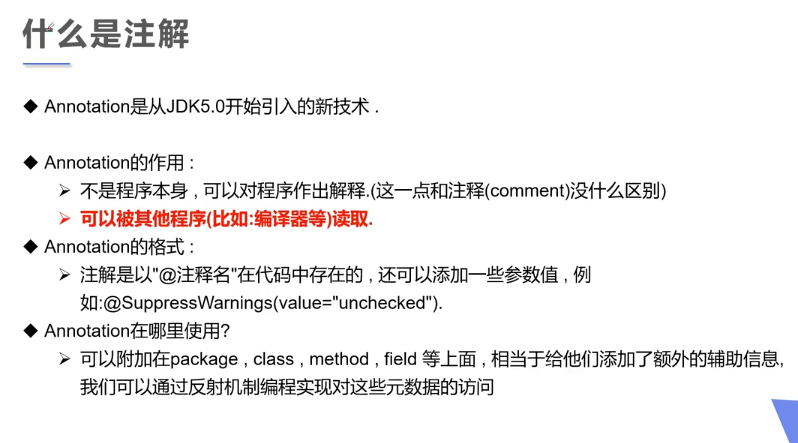

- 注解有检查和规范的作用

  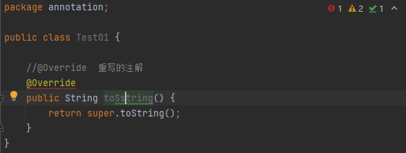

### 内置注解

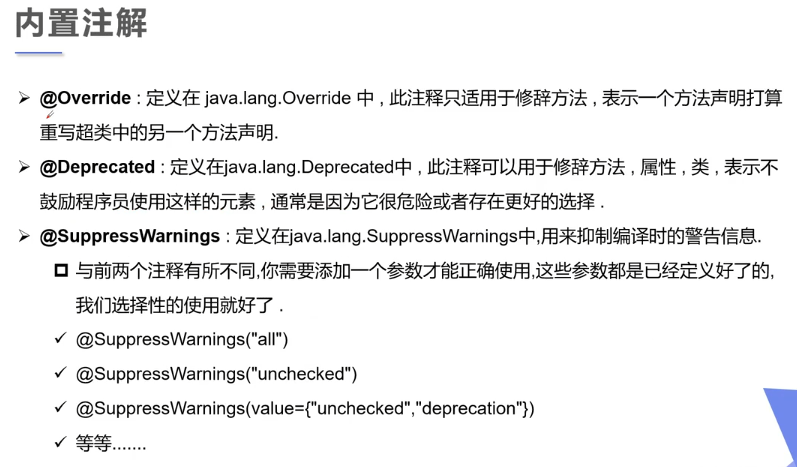

JDK文档里面对于Override的描述，同样地也可以在JDK文档中查看其他内置注解

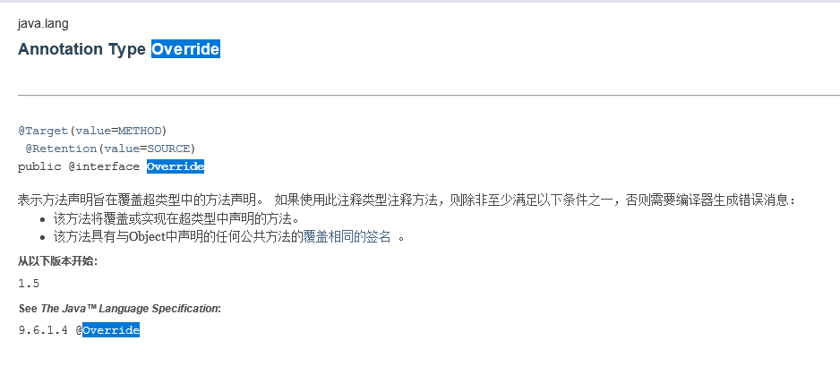

下面看程序实例：

### 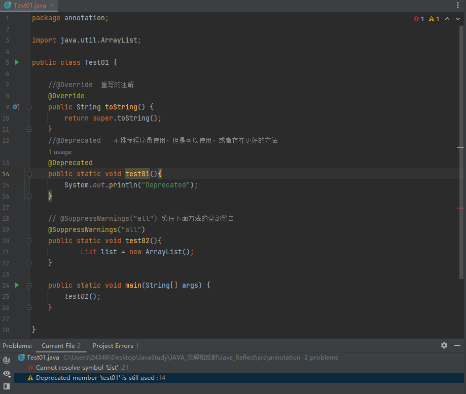

### 元注解

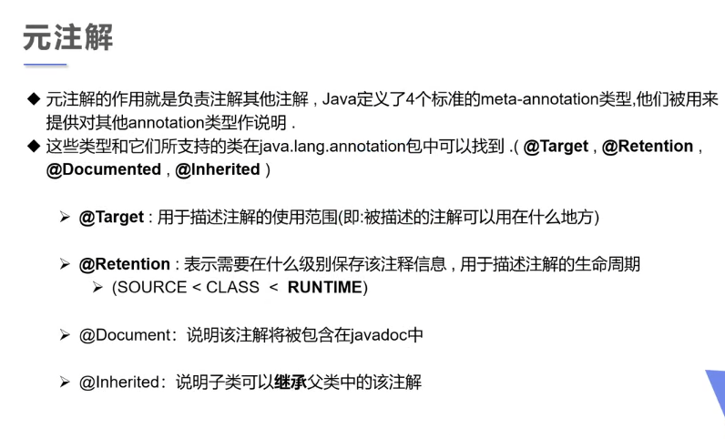

- 元注解，可以理解为可以帮助定义注解的元素注解
- 元注解分为四大类：
  1.   @Target         描述注解的使用范围
  2.   @Retention   描述注解的生命周期
  3.   @Document  该注解包含在Javadoc中
  4.   @Inherited    子类可以继承父类中的该注解

### 自定义注解

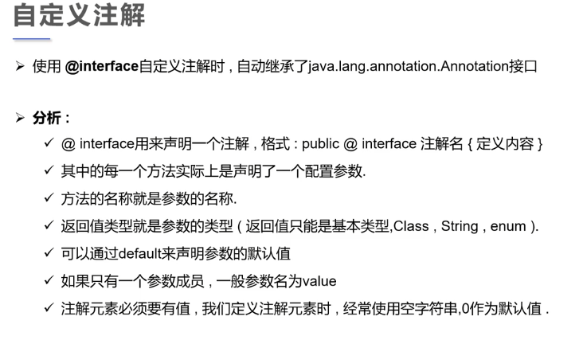

- 注解@interface不是接口是注解类，在jdk1.5之后加入的功能，使用@interface自定义注解时，自动继承了java.lang.annotation.Annotation接口。
- 在public类里面声明注解，要把public去掉（Java文件里面只能有一个public类 ）

- 如果自定义注解里面只有一个参数，最好把这个参数名写为value，写为value，在自定义注解的时候，参数名可以不写，直接写参数值就行

- 如果在自定义注解里面某个参数声明了默认值，则这个注解实现的时候，这个参数可以不写

```java
package annotation;

import java.lang.annotation.ElementType;
import java.lang.annotation.Retention;
import java.lang.annotation.RetentionPolicy;
import java.lang.annotation.Target;

//自定义注解
@Target({ElementType.METHOD,ElementType.TYPE})      //表示该注解可以修饰方法和类
@Retention(RetentionPolicy.RUNTIME)         //该注解的生命周期可以到达运行时
@interface MyAnnotation{
    //注解的参数 ： 参数类型 + 参数名 ();
    //有默认的参数，在使用的注解的时候可以不写
    String name() default  "";
    int age() default 0;
    int id() default  -1;
    String[] school();
}

//这个注解因为只定义了一个参数且参数名为value，所以在使用的时候可以不写参数名value
@Target({ElementType.METHOD,ElementType.TYPE})
@Retention(RetentionPolicy.RUNTIME)
@interface MyAnnotation2{
    String value();
}

//这个时是和MyAnnotation做对比，注解使用的时候必须声明变量名name
@Target({ElementType.METHOD,ElementType.TYPE})
@Retention(RetentionPolicy.RUNTIME)
@interface MyAnnotation3{
    String name();
}

public class Test03 {

    @MyAnnotation(name = "秦疆",school = {"西北大学,西工大"})
    public void test(){}

    @MyAnnotation2("秦疆")
    public void test2(){}

    @MyAnnotation3(name = "秦疆")
    public void test3(){}
}

```

## 反射

### Java反射机制概述

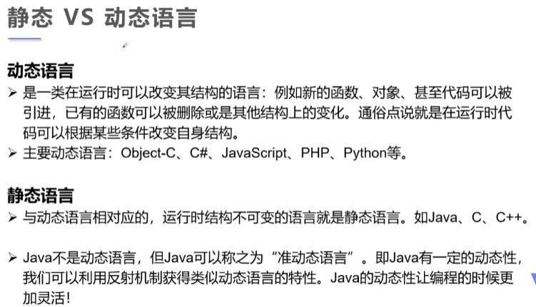

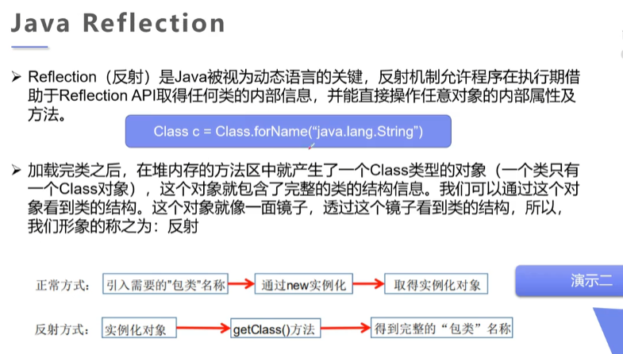

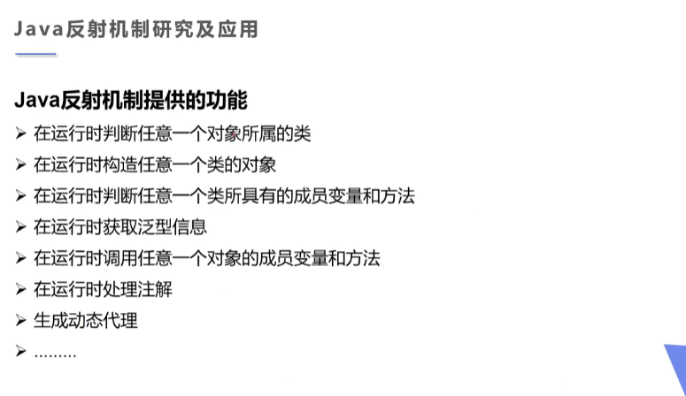

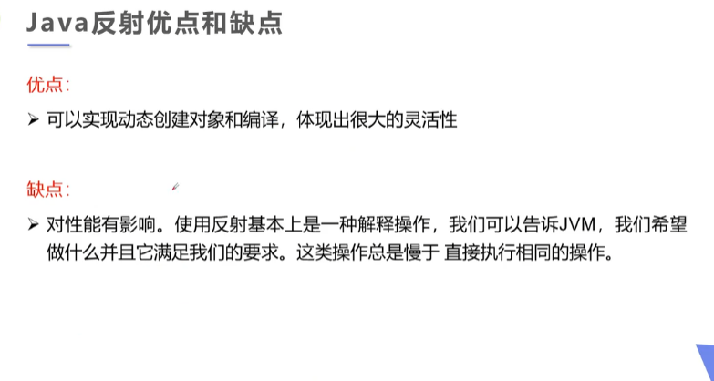

### 理解Class类并获取Class实例

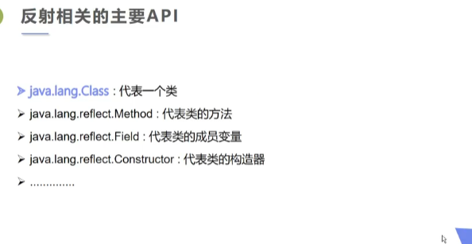

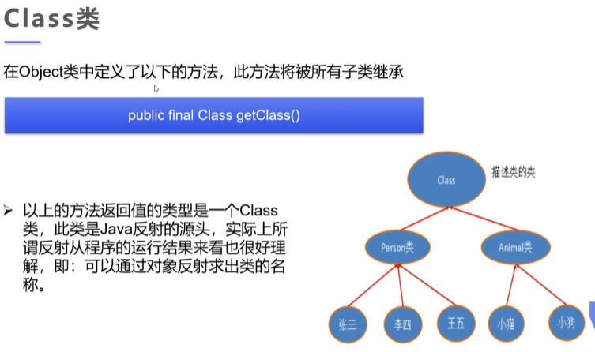

为了理解下面的代码，我们需要补充关于 实体类 的一点知识

在日常的Java项目开发中，entity（实体类）是必不可少的，它们一般都有很多的属性，并有相应的setter和getter方法。entity（实体类）的作用一般是和数据表做映射。


```java
package reflection;

//什么叫反射

//先定义一个实体类
class User{
    private String name;
    private int id;
    private int age;

    public User() {}

    public User(String name, int id, int age) {
        this.name = name;
        this.id = id;
        this.age = age;
    }

    public String getName() {
        return name;
    }

    public void setName(String name) {
        this.name = name;
    }

    public int getId() {
        return id;
    }

    public void setId(int id) {
        this.id = id;
    }

    public int getAge() {
        return age;
    }

    public void setAge(int age) {
        this.age = age;
    }

    @Override
    public String toString() {
        return "User{" +
                "name='" + name + '\'' +
                ", id=" + id +
                ", age=" + age +
                '}';
    }
}

public class Test02 {
    public static void main(String[] args) throws ClassNotFoundException {
        //  通过反射获取类的class对象
        Class c1 = Class.forName("reflection.User");
        System.out.println(c1);

        Class c2 = Class.forName("reflection.User");
        Class c3 = Class.forName("reflection.User");
        Class c4 = Class.forName("reflection.User");

        //一个类在内存中只有一个class对象
        //一个类被加载后，类的这个结构都会被封装在Class对象中.
        System.out.println(c2.hashCode());
        System.out.println(c3.hashCode());
        System.out.println(c4.hashCode());

    }
}
```

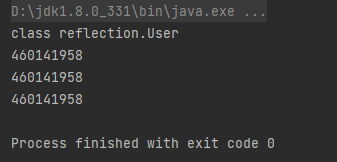

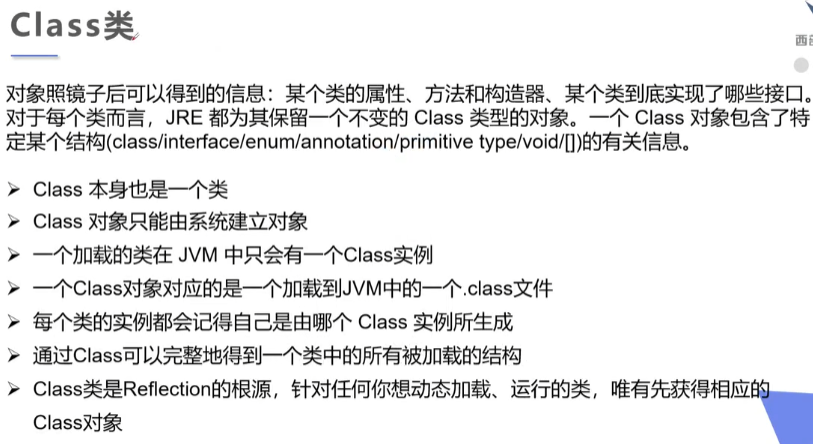

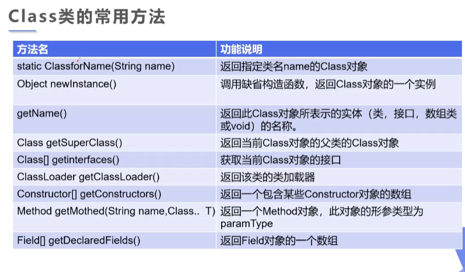

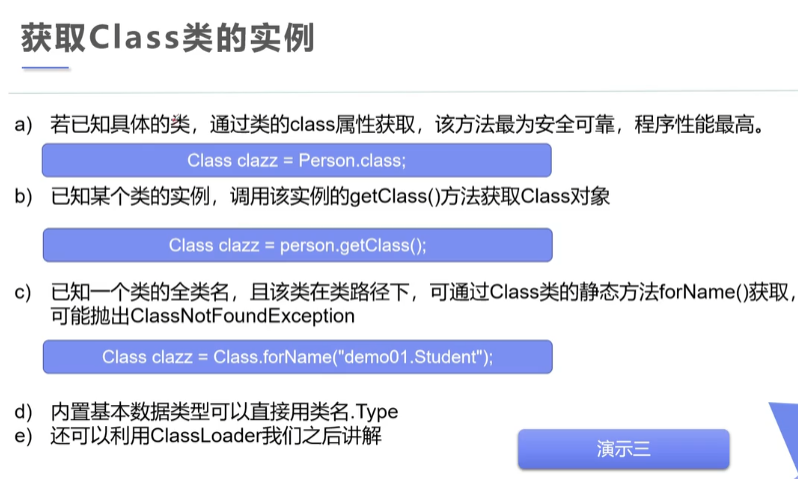

```java
package reflection;

//测试class类的创建方式有哪些

class Person{
    public String name;

    public Person() {
    }

    public Person(String name) {
        this.name = name;
    }

    @Override
    public String toString() {
        return "Person{" +
                "name='" + name + '\'' +
                '}';
    }
}

class Student extends Person{
    public Student(){
        this.name="学生";
    }
}

class Teacher extends Person{
    public Teacher(){
        this.name="老师";
    }
}


public class Test03 {
    public static void main(String[] args) throws ClassNotFoundException {
        Person person = new Student();
        System.out.println("这个人是:"+person.name);

        //方式一： 通过对象.getClass获得
        Class c1 = person.getClass();
        System.out.println(c1.hashCode());

        //方式二： forName获得
        Class c2 = Class.forName("reflection.Student");
        System.out.println(c2.hashCode());

        //方式三：通过类名.class获得
        Class c3 = Student.class;
        System.out.println(c3.hashCode());

        //方式四：基本内置类型的包装类都有一个Type属性
        Class c4 = Integer.TYPE;
        System.out.println(c4);

        //方式五: 通过子类获取父类的Class对象
        Class c5 = c1.getSuperclass();
        System.out.println(c5);


    }
}
```

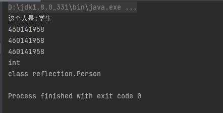


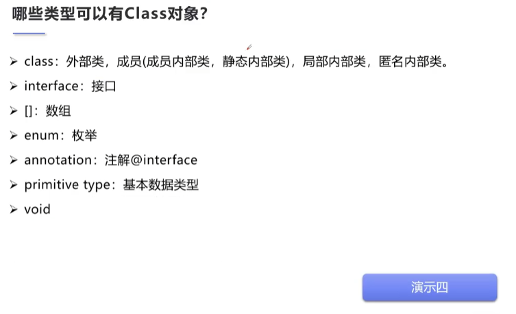

```java
package reflection;

import java.lang.annotation.ElementType;

//所有类型的Class对象
public class Test04 {
    public static void main(String[] args) {

        Class c1 = Object.class;        //类
        Class c2 = Comparable.class;    //接口
        Class c3 = String[].class;      //一维数组
        Class c4 = int[][].class;       //二维数组
        Class c5 = Override.class;      //注解
        Class c6 = ElementType.class;   //枚举
        Class c7 = Integer.class;       //基本数据类型
        Class c8 = Class.class;         //Class类
        Class c9 = void.class;          //void

        System.out.println(c1);
        System.out.println(c2);
        System.out.println(c3);
        System.out.println(c4);
        System.out.println(c5);
        System.out.println(c6);
        System.out.println(c7);
        System.out.println(c8);
        System.out.println(c9);

        //只要元素类型与维度一样，就是有同一个Class对象
        int [] a=new int[10];
        int [] b=new int[100];
        System.out.println(a.getClass().hashCode());
        System.out.println(b.getClass().hashCode());

    }
}
```

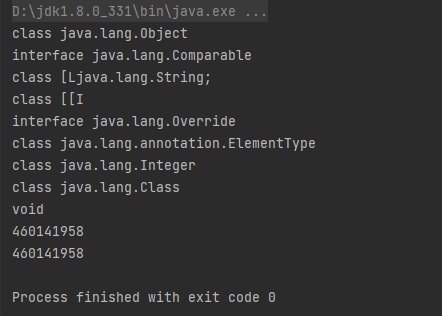

### 类的加载与ClassLoader

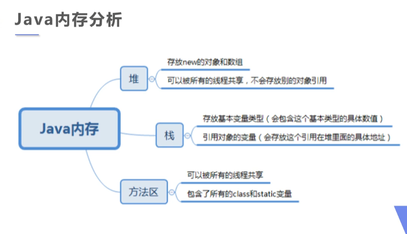

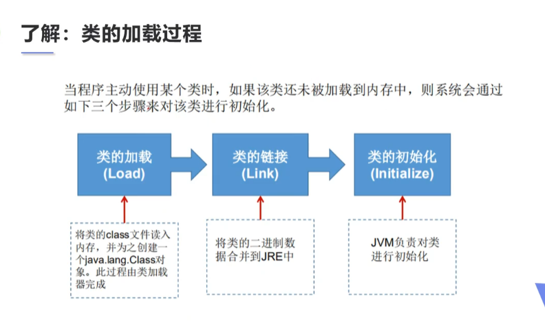

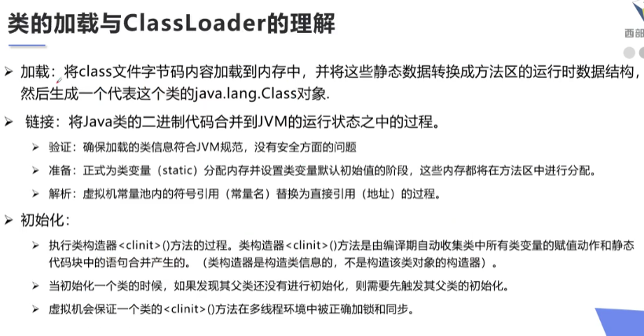

```java
package reflection;

class A{

    static {
        System.out.println("A类静态代码块初始化");
        m =300;
    }
    static  int m =100;

    public A() {
        System.out.println("A类的无参构造初始化");
    }
    /*
    m = 300
    m = 100
     */
}


public class Test5 {
    public static void main(String[] args) {
        A a = new A();
        System.out.println(A.m);
        /*
        1.加载到内存，会产生类对应的Class对象
        2.链接，链接结束后 m=0
        3.初始化,合并静态代码块和静态变量
            <clinit>(){
                System.out.println("A类静态代码块初始化");
                m =300;
                m=100;
            }
         */

    }
}

```

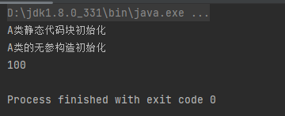

### 详解类的装载

我们都知道，Java代码有三个阶段，分别是源代码阶段，[类加载](https://so.csdn.net/so/search?q=类加载&spm=1001.2101.3001.7020)阶段，运行阶段。

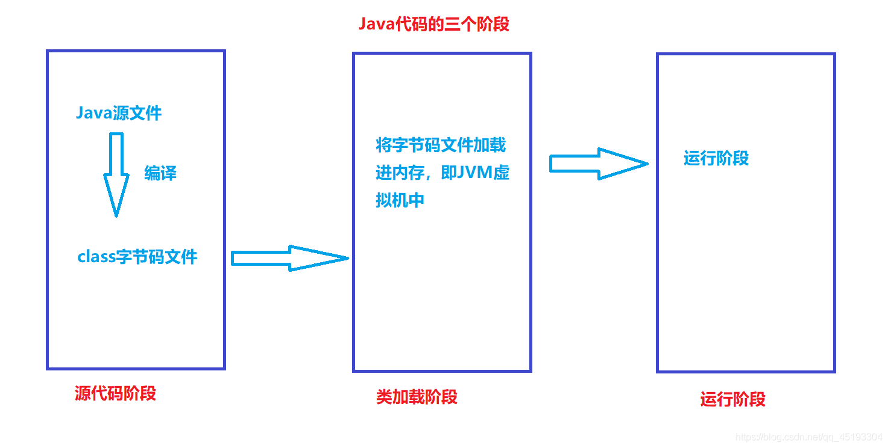

我们所说的类装载其实就指的就是类加载阶段的Java代码在JVM中的加载过程。
类装载大致可以分为三个阶段，分别是加载，连接，初始化。
其中连接阶段最为复杂，又可以分为验证，准备，解析三个小阶段。

- 加载
  根据查找路径找到相应的 class 文件然后导入内存中。

- 验证
  检查加载的 class 文件的正确性。

- 准备（重要）
  给类中的静态变量分配内存空间，并赋予默认初始值，给常量赋值。

准备阶段是类装载的一个重要阶段，在这个阶段中，JVM会给静态变量赋给默认值，而常量则会直接赋值。

比如：

```java
private static int i = 10;			//准备阶段静态变量赋予默认值i=0;
private final static int I = 10;	//准备阶段常量赋值I=10;

```

- 解析
虚拟机将常量池中的符号引用替换成直接引用的过程。符号引用就理解为一个标示，而在直接引用直接指向内存中的地址。

- 初始化（重要）
  对静态变量和静态代码块执行初始化工作。类变量（static变量）的赋值语句、静态代码块，最终组成类初始化方法。

  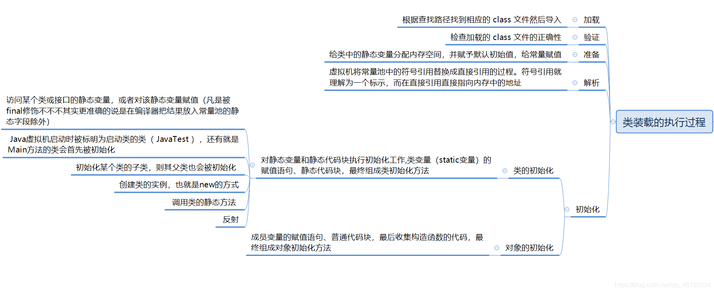


### 创建运行时类的对象

### 获取运行时类的完整结构

### 调用运行时类的指定结构

