# 注解和反射

## 注解

### 注解入门


- 注解有检查和规范的作用

  

### 内置注解


JDK文档里面对于Override的描述，同样地也可以在JDK文档中查看其他内置注解


下面看程序实例：

### 

### 元注解


- 元注解，可以理解为可以帮助定义注解的元素注解
- 元注解分为四大类：
  1.   @Target         描述注解的使用范围
  2.   @Retention   描述注解的生命周期
  3.   @Document  该注解包含在Javadoc中
  4.   @Inherited    子类可以继承父类中的该注解

### 自定义注解


- 注解@interface不是接口是注解类，在jdk1.5之后加入的功能，使用@interface自定义注解时，自动继承了java.lang.annotation.Annotation接口。
- 在public类里面声明注解，要把public去掉（Java文件里面只能有一个public类 ）

- 如果自定义注解里面只有一个参数，最好把这个参数名写为value，写为value，在自定义注解的时候，参数名可以不写，直接写参数值就行

- 如果在自定义注解里面某个参数声明了默认值，则这个注解实现的时候，这个参数可以不写

```java
package annotation;

import java.lang.annotation.ElementType;
import java.lang.annotation.Retention;
import java.lang.annotation.RetentionPolicy;
import java.lang.annotation.Target;

//自定义注解
@Target({ElementType.METHOD,ElementType.TYPE})      //表示该注解可以修饰方法和类
@Retention(RetentionPolicy.RUNTIME)         //该注解的生命周期可以到达运行时
@interface MyAnnotation{
    //注解的参数 ： 参数类型 + 参数名 ();
    //有默认的参数，在使用的注解的时候可以不写
    String name() default  "";
    int age() default 0;
    int id() default  -1;
    String[] school();
}

//这个注解因为只定义了一个参数且参数名为value，所以在使用的时候可以不写参数名value
@Target({ElementType.METHOD,ElementType.TYPE})
@Retention(RetentionPolicy.RUNTIME)
@interface MyAnnotation2{
    String value();
}

//这个时是和MyAnnotation做对比，注解使用的时候必须声明变量名name
@Target({ElementType.METHOD,ElementType.TYPE})
@Retention(RetentionPolicy.RUNTIME)
@interface MyAnnotation3{
    String name();
}

public class Test03 {

    @MyAnnotation(name = "秦疆",school = {"西北大学,西工大"})
    public void test(){}

    @MyAnnotation2("秦疆")
    public void test2(){}

    @MyAnnotation3(name = "秦疆")
    public void test3(){}
}

```

## 反射

### Java反射机制概述


### 理解Class类并获取Class实例


为了理解下面的代码，我们需要补充关于 实体类 的一点知识

在日常的Java项目开发中，entity（实体类）是必不可少的，它们一般都有很多的属性，并有相应的setter和getter方法。entity（实体类）的作用一般是和数据表做映射。


```java
package reflection;

//什么叫反射

//先定义一个实体类
class User{
    private String name;
    private int id;
    private int age;

    public User() {}

    public User(String name, int id, int age) {
        this.name = name;
        this.id = id;
        this.age = age;
    }

    public String getName() {
        return name;
    }

    public void setName(String name) {
        this.name = name;
    }

    public int getId() {
        return id;
    }

    public void setId(int id) {
        this.id = id;
    }

    public int getAge() {
        return age;
    }

    public void setAge(int age) {
        this.age = age;
    }

    @Override
    public String toString() {
        return "User{" +
                "name='" + name + '\'' +
                ", id=" + id +
                ", age=" + age +
                '}';
    }
}

public class Test02 {
    public static void main(String[] args) throws ClassNotFoundException {
        //  通过反射获取类的class对象
        Class c1 = Class.forName("reflection.User");
        System.out.println(c1);

        Class c2 = Class.forName("reflection.User");
        Class c3 = Class.forName("reflection.User");
        Class c4 = Class.forName("reflection.User");

        //一个类在内存中只有一个class对象
        //一个类被加载后，类的这个结构都会被封装在Class对象中.
        System.out.println(c2.hashCode());
        System.out.println(c3.hashCode());
        System.out.println(c4.hashCode());

    }
}
```


```java
package reflection;

//测试class类的创建方式有哪些

class Person{
    public String name;

    public Person() {
    }

    public Person(String name) {
        this.name = name;
    }

    @Override
    public String toString() {
        return "Person{" +
                "name='" + name + '\'' +
                '}';
    }
}

class Student extends Person{
    public Student(){
        this.name="学生";
    }
}

class Teacher extends Person{
    public Teacher(){
        this.name="老师";
    }
}


public class Test03 {
    public static void main(String[] args) throws ClassNotFoundException {
        Person person = new Student();
        System.out.println("这个人是:"+person.name);

        //方式一： 通过对象.getClass获得
        Class c1 = person.getClass();
        System.out.println(c1.hashCode());

        //方式二： forName获得
        Class c2 = Class.forName("reflection.Student");
        System.out.println(c2.hashCode());

        //方式三：通过类名.class获得
        Class c3 = Student.class;
        System.out.println(c3.hashCode());

        //方式四：基本内置类型的包装类都有一个Type属性
        Class c4 = Integer.TYPE;
        System.out.println(c4);

        //方式五: 通过子类获取父类的Class对象
        Class c5 = c1.getSuperclass();
        System.out.println(c5);


    }
}
```


```java
package reflection;

import java.lang.annotation.ElementType;

//所有类型的Class对象
public class Test04 {
    public static void main(String[] args) {

        Class c1 = Object.class;        //类
        Class c2 = Comparable.class;    //接口
        Class c3 = String[].class;      //一维数组
        Class c4 = int[][].class;       //二维数组
        Class c5 = Override.class;      //注解
        Class c6 = ElementType.class;   //枚举
        Class c7 = Integer.class;       //基本数据类型
        Class c8 = Class.class;         //Class类
        Class c9 = void.class;          //void

        System.out.println(c1);
        System.out.println(c2);
        System.out.println(c3);
        System.out.println(c4);
        System.out.println(c5);
        System.out.println(c6);
        System.out.println(c7);
        System.out.println(c8);
        System.out.println(c9);

        //只要元素类型与维度一样，就是有同一个Class对象
        int [] a=new int[10];
        int [] b=new int[100];
        System.out.println(a.getClass().hashCode());
        System.out.println(b.getClass().hashCode());

    }
}
```


### 类的加载与ClassLoader


```java
package reflection;

class A{

    static {
        System.out.println("A类静态代码块初始化");
        m =300;
    }
    static  int m =100;

    public A() {
        System.out.println("A类的无参构造初始化");
    }
    /*
    m = 300
    m = 100
     */
}


public class Test5 {
    public static void main(String[] args) {
        A a = new A();
        System.out.println(A.m);
        /*
        1.加载到内存，会产生类对应的Class对象
        2.链接，链接结束后 m=0
        3.初始化,合并静态代码块和静态变量
            <clinit>(){
                System.out.println("A类静态代码块初始化");
                m =300;
                m=100;
            }
         */

    }
}

```


### 详解类的装载

我们都知道，Java代码有三个阶段，分别是源代码阶段，[类加载](https://so.csdn.net/so/search?q=类加载&spm=1001.2101.3001.7020)阶段，运行阶段。


我们所说的类装载其实就指的就是类加载阶段的Java代码在JVM中的加载过程。
类装载大致可以分为三个阶段，分别是加载，连接，初始化。
其中连接阶段最为复杂，又可以分为验证，准备，解析三个小阶段。

- 加载
  根据查找路径找到相应的 class 文件然后导入内存中。

- 连接
  
  1. 验证
     - 检查加载的 class 文件的正确性。
  2. 准备（重要）
     - 给类中的静态变量分配内存空间，并赋予默认初始值，给常量赋值。
  

​				准备阶段是类装载的一个重要阶段，在这个阶段中，JVM会给静态变量赋给默认值，而常量则会直接赋值。

​				比如：

```java
private static int i = 10;			//准备阶段静态变量赋予默认值i=0;
private final static int I = 10;	//准备阶段常量赋值I=10;

```
      3. 解析
         - ​	虚拟机将常量池中的符号引用替换成直接引用的过程。符号引用就理解为一个标示，而在直接引用直接指向内存中的地址。


- 初始化（重要）
  对静态变量和静态代码块执行初始化工作。类变量（static变量）的赋值语句、静态代码块，最终组成类初始化方法。

  
  
  

### 分析类初始化

  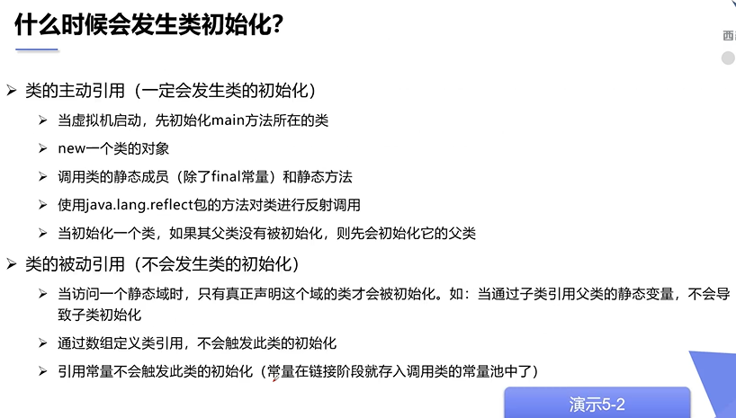

```java
package reflection;

class Farther {
    static int b=2;
    static{
        System.out.println("父类被加载");
    }

}

class Son extends Farther{
    static{
        System.out.println("子类被加载");
        m = 300;
    }
    static int m =100;
    static final int M =1;
}

//测试类什么时候会初始化
public class Test06 {
    static{
        System.out.println("Main方法所在类被加载");
    }
    public static void main(String[] args) throws Exception {
        //使用new，观察类的初始化
        Son son = new Son();

    }
    
}
```

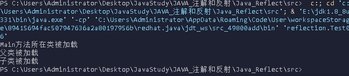

```java
public static void main(String[] args) throws Exception {

    //反射也会产生主动引用
    Class.forName("reflection.Son");

}
```

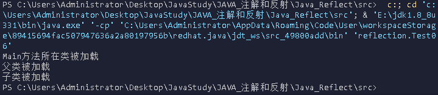

```java
public static void main(String[] args) throws Exception {

    //不会产生类的引用方法
    System.out.println(Son.b);
}
```

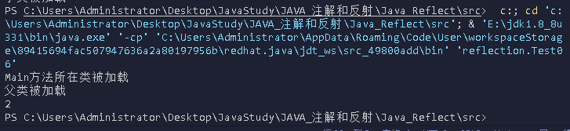

```java
public static void main(String[] args) throws Exception {

    //不会产生类的引用方法

    Son[] aSons = new Son[5];

    System.out.println(Son.M);

}
```

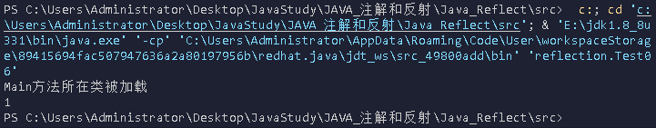

### 类加载器

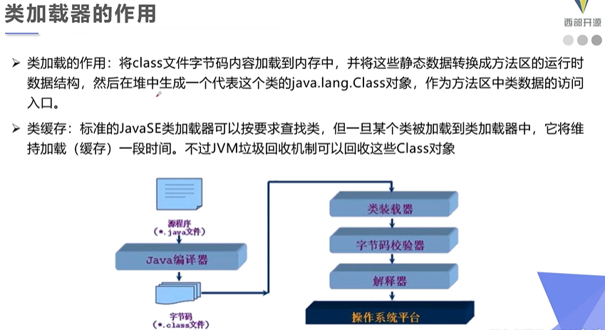

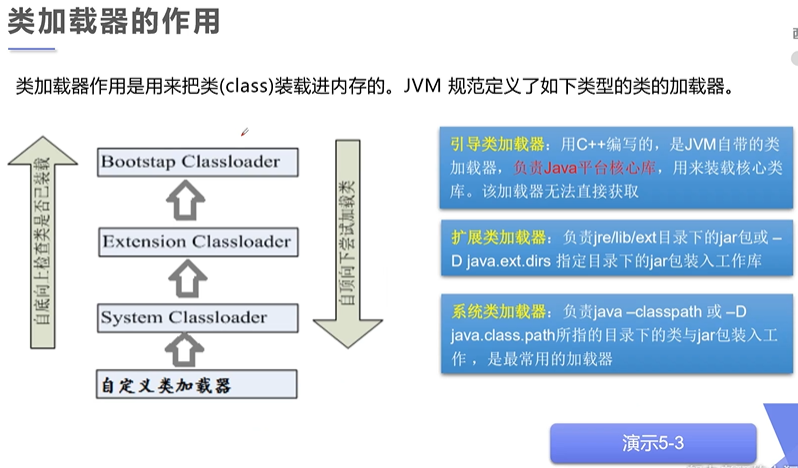

```java
package reflection;
public class Test07 {
    public static void main(String[] args) throws Exception {
        
        //获取系统类的加载器
        ClassLoader systemClassLoader =ClassLoader.getSystemClassLoader();
        System.out.println(systemClassLoader);
        //获取系统类加载器的父类加载器-->扩展类加载器
        ClassLoader parent = systemClassLoader.getParent();
        System.out.println(parent);
        //获取扩展类加载器的父类加载器-->根加载器（c/c++编写的）
        ClassLoader parent1 = parent.getParent();
        System.out.println(parent1);

        //测试当前类是哪个类加载器加载的
        ClassLoader classLoader = Class.forName("reflection.Test07").getClassLoader();
        System.out.println(classLoader);

        //测试jdk内部类是谁加载的
        classLoader = Class.forName("java.lang.Object").getClassLoader();
        System.out.println(classLoader);

        //如何获得系统类加载器可以加载的路径
        System.out.println(System.getProperty("java.class.path"));
 
    }
}

```

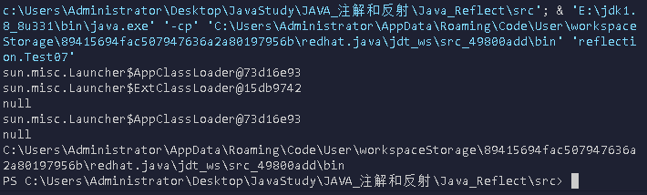


类加载器的类别

BootstrapClassLoader（启动类加载器）
c++编写，加载`java`核心库 `java.*`,构造`ExtClassLoader`和`AppClassLoader`。由于引导类加载器涉及到虚拟机本地实现细节，开发者无法直接获取到启动类加载器的引用，所以不允许直接通过引用进行操作

ExtClassLoader （标准扩展类加载器）
`java`编写，加载扩展库，如`classpath`中的`jre` ，`javax.*`或者`java.ext.dir` 指定位置中的类，开发者可以直接使用标准扩展类加载器。

AppClassLoader（系统类加载器）
java`编写，加载程序所在的目录，如`user.dir`所在的位置的`class


双亲委派机制

- 什么是双亲委派机制？


当某个类加载器需要加载某个`.class`文件时，它首先把这个任务委托给他的上级类加载器，递归这个操作，如果上级的类加载器没有加载，自己才会去加载这个类。


- 双亲委派机制的作用

这种设计有个好处是，如果有人想替换系统级别的类：String.java。篡改它的实现，在这种机制下这些系统的类已经被Bootstrap classLoader加载过了（为什么？因为当一个类需要加载的时候，最先去尝试加载的就是BootstrapClassLoader），所以其他类加载器并没有机会再去加载，从一定程度上防止了危险代码的植入。

### 获取class对象的信息

#### 获取类的运行时结构

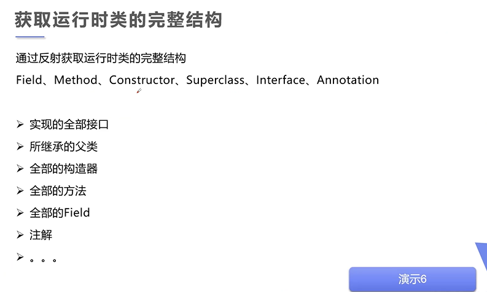

```java
package reflection;

import java.lang.reflect.Constructor;
import java.lang.reflect.Field;
import java.lang.reflect.Method;

//获得类的信息
public class Test08 {
    public static void main(String[] args) throws Exception{
        
        Class c1=Class.forName("reflection.User");

        //获得类的名字
        System.out.println(c1.getName());//获得包名+类名
        System.out.println(c1.getSimpleName());//获得类名

        System.out.println("____________________");

        //获得类的全部属性(包括私有属性)
        Field[] fields =c1.getDeclaredFields();
        for(Field field:fields){
            System.out.println(field);
        }

        System.out.println("____________________");

        //获得指定属性
        Field name = c1.getDeclaredField("name");
        System.out.println(name);

        System.out.println("____________________");

        //获得类的方法
        Method[] methods = c1.getMethods();//获得本类及其父类的全部public方法
        for(Method m :methods){
            System.out.println(m);
        }
        System.out.println("____________________");
        methods = c1.getDeclaredMethods();//获得本类的全部方法(包括私有方法)
        for(Method m :methods){
            System.out.println(m);
        }
        System.out.println("____________________");
        //获得指定方法
        //因为方法可能存在重载，所以getMethod需要第二参数标识指定方法的参数从而指定方法
        Method getName = c1.getMethod("getName", null);
        Method setName = c1.getMethod("setName", String.class);
        System.out.println(getName);
        System.out.println(setName);
        System.out.println("____________________");

        //获得类的构造器
        Constructor[] constructor = c1.getConstructors();
        for(Constructor c: constructor){
            System.out.println(c);
        }
        constructor = c1.getDeclaredConstructors();
        for(Constructor c: constructor){
            System.out.println("#"+c);
        }
        System.out.println("____________________");
        //获得指定的构造器
        Constructor constructor2=c1.getConstructor(String.class,int.class,int.class);
        System.out.println(constructor2);


    }
}

```

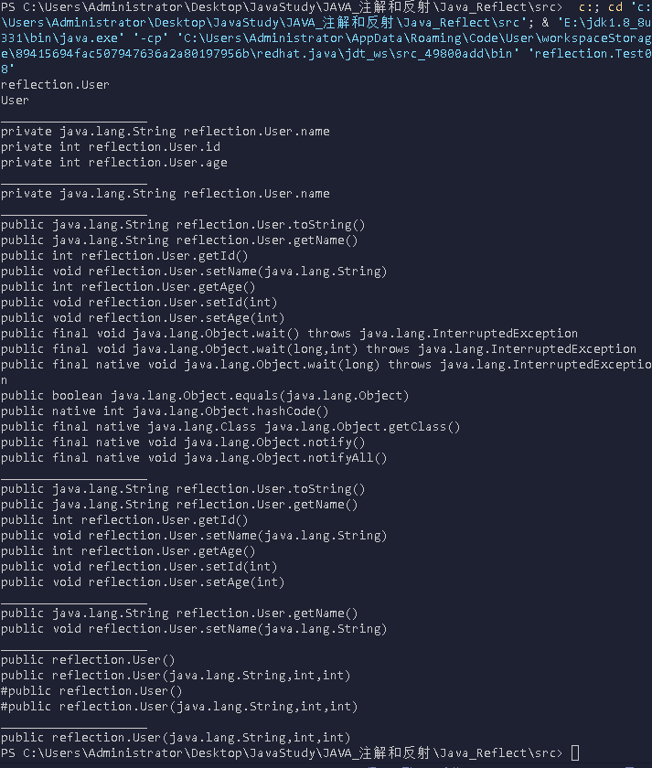

#### 动态创建对象执行方法

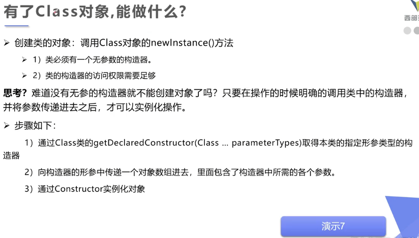

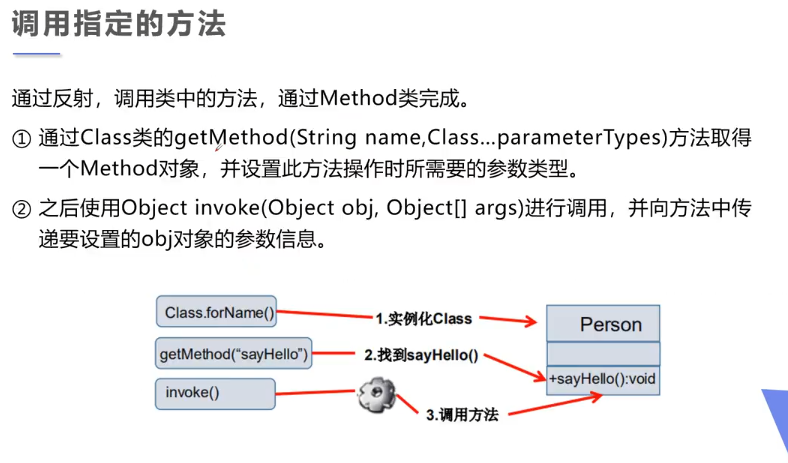

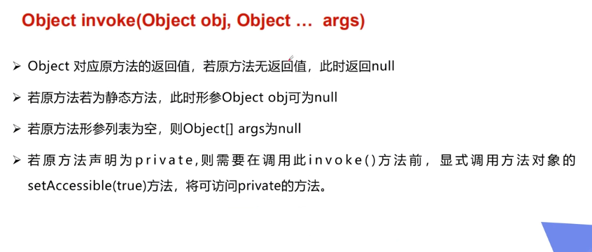

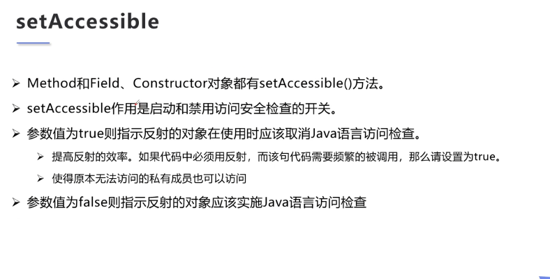

```java
package reflection;

import java.lang.reflect.Constructor;
import java.lang.reflect.Field;
import java.lang.reflect.Method;

//动态的创建对象，通过反射
public class Test09 {
    public static void main(String[] args) throws  Exception{

        //1.1.通过Class对象的方法newInstance来实例化一个对象（相当于调用了无参构造器实例化）
        //获得class对象
        Class c1 = Class.forName("reflection.User");
        
        //构造一个对象(将这个对象向下强转为User类对象)
        User user = (User) c1.newInstance();
        System.out.println(user);

        //1.2.通过Class对象获得指定形参类型的构造器，再通过这个构造器来实例化对象
        Constructor constructor = c1.getDeclaredConstructor(String.class, int.class, int.class);
        User user2 = (User)constructor.newInstance("秦疆", 001, 18);
        System.out.println(user2);

        //2.1.通过反射调用普通方法
        User user3= (User) c1.newInstance();
        Method setName = c1.getDeclaredMethod("setName", String.class);
        //invoke:激活的意思（对象，“方法的参数”）
        setName.invoke(user3,"狂神");
        System.out.println(user3);

        //2.2.通过反射操作属性
        User user4= (User) c1.newInstance();
        Field name = c1.getDeclaredField("name");
        name.setAccessible(true);      //关闭安全检测，可以使我们直接操作私有属性
        name.set(user4,"狂神2");      //一个类似上面invoke的方法，只不过这个是针对属性的
        System.out.println(user4);


    }
}
```

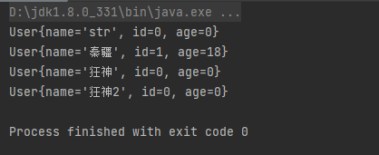


#### 性能对比分析

```java
package reflection;

import java.lang.reflect.Method;

//分析性能问题
public class Test10 {

    public  static void  test01() {
        User user = new User();
        long startTime = System.currentTimeMillis();
        for (int i = 0; i < 1000000000; i++) {
            user.getName();
        }
        long endTime = System.currentTimeMillis();
        System.out.println("普通方式执行10亿次:"+(endTime-startTime)+"ms");
    }

    public  static  void test02() throws  Exception{
        User user = new User();
        Class c1 = user.getClass();
        Method getName = c1.getDeclaredMethod("getName", null);
        long startTime = System.currentTimeMillis();
        for (int i = 0; i < 1000000000; i++) {
         getName.invoke(user,null);
        }
        long endTime = System.currentTimeMillis();
        System.out.println("反射方式执行10亿次:"+(endTime-startTime)+"ms");
    }

    public  static  void test03() throws  Exception{
        User user = new User();
        Class c1 = user.getClass();
        Method getName = c1.getDeclaredMethod("getName", null);
        getName.setAccessible(true);
        long startTime = System.currentTimeMillis();
        for (int i = 0; i < 1000000000; i++) {
            getName.invoke(user,null);
        }
        long endTime = System.currentTimeMillis();
        System.out.println("关闭检测执行10亿次:"+(endTime-startTime)+"ms");
    }


    public static void main(String[] args) throws Exception {

        test01();//普通方式执行
        test02(); //反射方式调用
        test03(); //反射方式调用，关闭检测
    }
}
```

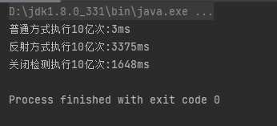

#### 获取泛型信息

 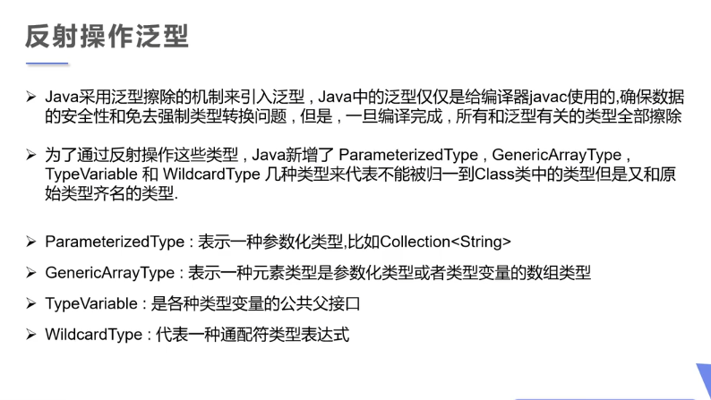

```java
package reflection;

import java.lang.reflect.Method;
import java.lang.reflect.ParameterizedType;
import java.lang.reflect.Type;
import java.util.List;
import java.util.Map;

//通过反射获取泛型
public class Test11 {

    public void test01(Map<String,User> map, List<User> list){
        System.out.println("test01");
    }

    public Map<String,User> test02(){
        System.out.println("test02");
        return null;
    }

    public static void main(String[] args) throws Exception{

        Method method = Test11.class.getMethod("test01", Map.class, List.class);
        Type[] genericParameterTypes = method.getGenericParameterTypes();       //获得方法参数的泛型
        for (Type genericParameterType : genericParameterTypes) {
            System.out.println("#" + genericParameterType);
            if(genericParameterType instanceof ParameterizedType){  //如果这个泛型的参数类型属于参数化类型
                Type[] actualTypeArguments = ((ParameterizedType) genericParameterType).getActualTypeArguments();//获得真实的参数信息
                for (Type actualTypeArgument : actualTypeArguments) {
                    System.out.println(actualTypeArgument);
                }
            }
        }

        System.out.println("______________________________________");

        method = Test11.class.getMethod("test02",null);
        Type genericReturnType = method.getGenericReturnType();     //获得方法返回值的泛型
        if(genericReturnType instanceof ParameterizedType){  //如果这个泛型的参数类型属于参数化类型
            Type[] actualTypeArguments = ((ParameterizedType) genericReturnType).getActualTypeArguments();//获得真实的参数信息
            for (Type actualTypeArgument : actualTypeArguments) {
                System.out.println(actualTypeArgument);
            }
        }
    }
}
```

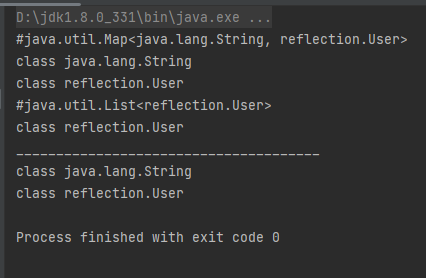


#### 获取注解信息

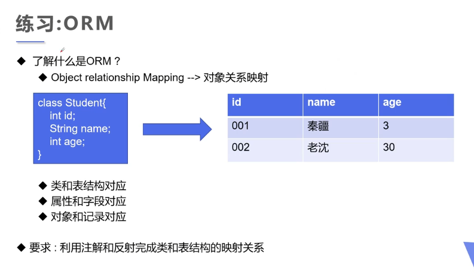

```java
package reflection;

import java.lang.annotation.*;
import java.lang.reflect.Field;

//练习反射操作注解

//类名的注解
@Target(ElementType.TYPE)
@Retention(RetentionPolicy.RUNTIME)
@interface Tablekuang{
    String value();
}


//属性的注解
@Target(ElementType.FIELD)
@Retention(RetentionPolicy.RUNTIME)
@interface Fieldkuang{
    String columnName();
    String type();
    int length();
}


@Tablekuang("db_student")
class Student2{
    @Fieldkuang(columnName = "db_id",type = "int",length = 10)
    private int id;
    @Fieldkuang(columnName = "db_age",type = "int",length = 10)
    private int age;
    @Fieldkuang(columnName = "db_name",type = "varchar",length = 3)
    private  String name;

    public Student2() {
    }

    public Student2(int id, int age, String name) {
        this.id = id;
        this.age = age;
        this.name = name;
    }

    public int getId() {
        return id;
    }

    public void setId(int id) {
        this.id = id;
    }

    public int getAge() {
        return age;
    }

    public void setAge(int age) {
        this.age = age;
    }

    public String getName() {
        return name;
    }

    public void setName(String name) {
        this.name = name;
    }

    @Override
    public String toString() {
        return "Student2{" +
                "id=" + id +
                ", age=" + age +
                ", name='" + name + '\'' +
                '}';
    }
}

public class Test12 {
    public static void main(String[] args) throws Exception{
        Class c1 = Class.forName("reflection.Student2");

        //通过反射获得类的注解
        Annotation[] annotations = c1.getAnnotations();
        for (Annotation annotation : annotations) {
            System.out.println(annotation);
        }
        System.out.println("________________________");
        //获得指定的类的注解
        Tablekuang tablekaung = (Tablekuang)c1.getAnnotation(Tablekuang.class);
        String value = tablekaung.value();
        System.out.println(value);
        System.out.println("________________________");
        //获得指定属性的的注解
        Field f = c1.getDeclaredField("name");
        Fieldkuang annotation = f.getAnnotation(Fieldkuang.class);
        System.out.println(annotation.columnName());
        System.out.println(annotation.type());
        System.out.println(annotation.length());
    }
}
```

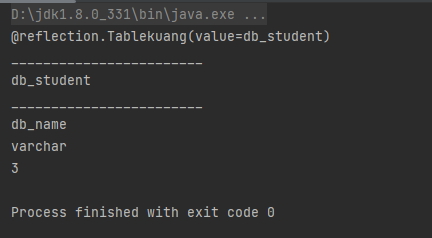

- 我们可以在设计实体类的时候标上数据库相关的注解，到时候建表的时候，直接通过反射获取注解自动化建表
