- [**GUI编程**](#gui编程)
  - [组件](#组件)
  - [简介](#简介)
  - [AWT](#awt)
    - [AWT简介](#awt简介)
    - [组件与容器](#组件与容器)
      - [1.Frame](#1frame)
      - [2.Panel](#2panel)
      - [3.布局](#3布局)
      - [4.事件监听](#4事件监听)
      - [5.文本框事件监听](#5文本框事件监听)
      - [6.简易计算器实现](#6简易计算器实现)
      - [7.画笔](#7画笔)
      - [8.鼠标监听](#8鼠标监听)
      - [9.窗口监听](#9窗口监听)
      - [10.键盘监听](#10键盘监听)
  - [Swing](#swing)
    - [Swing简介](#swing简介)
    - [组件与容器](#组件与容器-1)
      - [1.JFrame](#1jframe)
      - [2.JDialog](#2jdialog)
      - [3.Icon、ImageIcon标签](#3iconimageicon标签)
      - [4.文本域JScroll面板](#4文本域jscroll面板)
      - [5.图片按钮、单选框、多选框](#5图片按钮单选框多选框)
      - [6.下拉框、列表框](#6下拉框列表框)
      - [7.文本框、密码框、文本域](#7文本框密码框文本域)


# **GUI编程**

GUI（图形用户接口）

## 组件

- 窗口

- 弹窗

- 面板

- 文本框

- 列表框

- 按钮

- 图片

- 监听事

## 简介 

GUI的核心技术：Swing AWT

1. 界面不美观

2. 需要jre环境

3. 了解mvc架构，了解监听器

## AWT

###   AWT简介

Awt（抽象窗口工具）其中包含了许多类和接口

包含许多元素：窗口、按钮、文本框

其中有两大类 组件类Component（包括按钮，文本、标签...）、容器类Container（包括窗口Window（包括窗体Frame、弹窗Dialog）、面板Panel（包括小程序Applet（一种可以嵌入网页的小应用程序）））   

### 组件与容器

#### 1.Frame

```java
package lesson01;

import java.awt.*;
//GUI 的第一个界面
public class TestFrame {
    public static void main(String[] args) {

        //ctrl+鼠标左键 看源码，展开结构图看构造器的重载方法
        Frame frame= new Frame("我的第一个Java图形界面窗口");//此时看不见，在内存中
        //设置可见性
        frame.setVisible(true);
        //设置窗口大小
        frame.setSize(400,400);
        //设置背景颜色
        frame.setBackground(new Color(167, 57, 57));
        //弹出初始位置
        frame.setLocation(200,200);
        //设置大小固定
        frame.setResizable(false);

    }
}
```

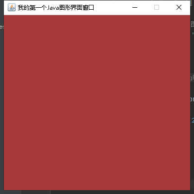

问题：发现窗口无法关闭，需要后续的学习来解决完善

利用封装的思想实现多个窗口

```java
package lesson01;

import java.awt.*;

public class TestFrame2 {
    public static void main(String[] args) {
        //展示多个窗口
        MyFrame myFrame1 = new MyFrame(100,100,200,200,Color.BLACK);
        MyFrame myFrame2 = new MyFrame(300,100,200,200,Color.RED);
        MyFrame myFrame3 = new MyFrame(100,300,200,200,Color.GREEN);
        MyFrame myFrame4 = new MyFrame(300,300,200,200,Color.BLUE);
    }
}

class MyFrame extends Frame{
    static  int id =0;//设置一个类变量做记数器
    public MyFrame(int x,int y,int w,int h,Color color){
        super("Myframe"+(++id));
        setBounds(x,y,w,h);
        setBackground(color);
        setVisible(true);
    }
}

```

#### 2.Panel

利用监听事件，实现了窗口关闭功能

```java
package lesson01;

import java.awt.*;
import java.awt.event.WindowAdapter;
import java.awt.event.WindowEvent;
import java.awt.event.WindowListener;

//Panel可以看成一个不能单独存在的空间
public class TestPanel {
    public static void main(String[] args) {
        //在idea中ctrl+alt+v快捷键实现快速实例化
        Frame frame = new Frame();
        //在面板中有布局的概念
        Panel panel = new Panel();
        //设置布局,不设置的话panel会完全覆盖frame的内部窗口
        frame.setLayout(null);
        frame.setBounds(300,300,500,500);
        frame.setBackground(Color.GREEN);

        //面板位置相对于frame
        panel.setBounds(50,50,400,400);
        panel.setBackground(Color.ORANGE);

        frame.add(panel);
        frame.setVisible(true);

        //设置监听事件，监听窗口关闭事件 System.exit(0)
        //适配器模式：使用接口要实现该接口的所有方法（匿名内部类），但我们只想使用接口中的一个方法
        //我们可以写一个抽象类来继承这个接口，然后将其他方法默认实现，留下一个我们想要实现的抽象方法，给我们特异化实现
        frame.addWindowListener(new WindowAdapter() {
            //点击窗口关闭时的事件
            @Override
            public void windowClosing(WindowEvent e) {
                System.exit(0);
            }
        });
    }
}

```

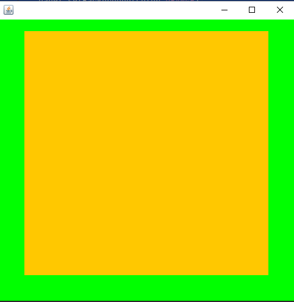

#### 3.布局

- 流式布局

  ```java
  package lesson01;
  
  import java.awt.*;
  
  public class TestFlowLayout {
      public static void main(String[] args) {
          Frame frame = new Frame();
  
          //组件-按钮
          Button button1 = new Button("button1");
          Button button2 = new Button("button2");
          Button button3 = new Button("button3");
  
          //设置为流式布局
          frame.setLayout(new FlowLayout());
          //默认流式布局为居中，当然也可以设置为靠左或者靠右
          //frame.setLayout(new FlowLayout(FlowLayout.LEFT));
          //frame.setLayout(new FlowLayout(FlowLayout.RIGHT));
          frame.setSize(200,200);
  
          frame.add(button1);
          frame.add(button2);
          frame.add(button3);
  
          frame.setVisible(true);
      }
  }
  
  ```

  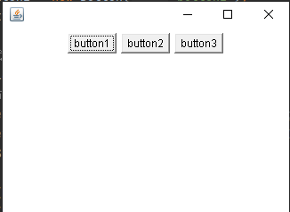

- 东西南北中

  ```java
  package lesson01;
  
  import java.awt.*;
  
  public class TestBorderLayout {
      public static void main(String[] args) {
          Frame frame = new Frame();
          frame.setSize(400,400);
          Button east = new Button("East");
          Button west = new Button("West");
          Button north = new Button("North");
          Button south = new Button("South");
          Button center = new Button("Center");
  
          frame.add(east,BorderLayout.EAST);
          frame.add(west,BorderLayout.WEST);
          frame.add(north,BorderLayout.NORTH);
          frame.add(south,BorderLayout.SOUTH);
          frame.add(center,BorderLayout.CENTER);
  
          frame.setVisible(true);
  
      }
  }
  
  ```

  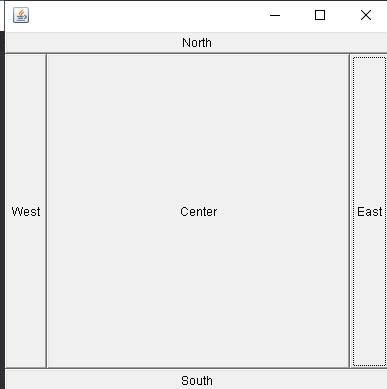

- 网格布局

  ```java
  package lesson01;
  
  import java.awt.*;
  
  public class TestGridLayout {
      public static void main(String[] args) {
          Frame frame = new Frame("TestGridLayout");
  
          Button btn1 = new Button("btn1");
          Button btn2 = new Button("btn2");
          Button btn3 = new Button("btn3");
          Button btn4 = new Button("btn4");
          Button btn5 = new Button("btn5");
          Button btn6 = new Button("btn6");
  
          frame.setLayout(new GridLayout(3,2));
  
          frame.add(btn1);
          frame.add(btn2);
          frame.add(btn3);
          frame.add(btn4);
          frame.add(btn5);
          frame.add(btn6);
  
          //frame根据组件排布自适应大小
          frame.pack();
          frame.setVisible(true);
      }
  }
  
  ```

  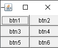

  - 绝对布局

    在绝对布局下，可以将窗体里面的面板位置固定，方便组件的排布

    ```java
    Frame.setLayout(null);
    ```
  
    
  
  课堂练习（练习布局的嵌套），实现下列图片中的布局
  
  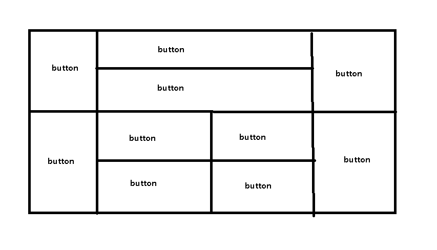
  
  思路：使用Panel作为填充单元，创建2*3的6个panel,再在其中两个Panel中使用网格布局
  
  我是主要用网格布局实现的，同样用Border布局也可以实现，且实现的效果更贴近题干给出的图

```java
package lesson01;

import java.awt.*;
import java.awt.event.WindowAdapter;
import java.awt.event.WindowEvent;

public class Practice1 {
    public static void main(String[] args) {
        Frame frame = new Frame();
        Panel panel1 = new Panel();
        Panel panel2 = new Panel();
        Panel panel3 = new Panel();
        Panel panel4 = new Panel();
        Panel panel5 = new Panel();
        Panel panel6 = new Panel();

        Button button1 = new Button("1");
        Button button2 = new Button("2");
        Button button3 = new Button("3");
        Button button4 = new Button("4");
        Button button5 = new Button("5");
        Button button6 = new Button("6");
        Button button7 = new Button("7");
        Button button8 = new Button("8");
        Button button9 = new Button("9");
        Button button10 = new Button("10");

        frame.setLayout(new GridLayout(2,3));
        frame.add(panel1);
        frame.add(panel2);
        frame.add(panel3);
        frame.add(panel4);
        frame.add(panel5);
        frame.add(panel6);

        panel1.add(button1);

        panel2.setLayout(new GridLayout(2,1));
        panel2.add(button2);
        panel2.add(button3);

        panel3.add(button4);

        panel4.add(button5);

        panel5.setLayout(new GridLayout(2,2));
        panel5.add(button6);
        panel5.add(button7);
        panel5.add(button8);
        panel5.add(button9);

        panel6.add(button10);
        frame.setSize(400,400);
        frame.setVisible(true);

        frame.addWindowListener(new WindowAdapter() {
            @Override
            public void windowClosing(WindowEvent e) {
                System.exit(0);
            }
        });
    }
}
```

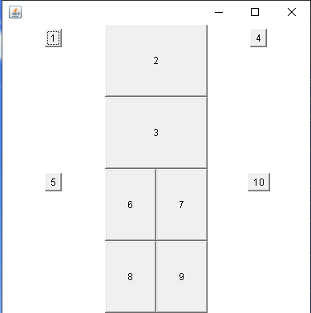

#### 4.事件监听

```java
package lesson01;

import java.awt.*;
import java.awt.event.ActionEvent;
import java.awt.event.ActionListener;
import java.awt.event.WindowAdapter;
import java.awt.event.WindowEvent;

public class TestActionEvent {
    public static void main(String[] args) {
        //按下按钮，触发一些事件
        Frame frame = new Frame();
        Button button = new Button();
        button.addActionListener(new MyActionListener());
        windowClose(frame);
        frame.add(button,BorderLayout.CENTER);
        frame.pack();
        frame.setVisible(true);
    }

    //封装后的关闭窗体的函数，该函数必须使用static修饰符修饰
    private static void windowClose(Frame frame){
        frame.addWindowListener(new WindowAdapter() {
            @Override
            public void windowClosing(WindowEvent e) {
                System.exit(0);
            }
        });
    }
}

//这里使用继承实现了接口，我们也可以使用匿名内部类或者lambda表达式实现接口
class MyActionListener implements ActionListener{
    @Override
    public void actionPerformed(ActionEvent e) {
        System.out.println("aaa");
    }
}
```

实现多个按钮，被同一个事件监听

```java
package lesson01;

import java.awt.*;
import java.awt.event.ActionEvent;
import java.awt.event.ActionListener;

public class TestActionTwo {
    public static void main(String[] args) {
        //两个按钮，使用同一个事件监听
        Frame frame = new Frame();
        Button button1 = new Button("start");
        Button button2 = new Button("stop");
        //设置按钮信息，如果不自行设置的化使用按钮的默认值（按钮的label）
        button1.setActionCommand("start——111");

        button1.addActionListener(new MyMonitor());
        button2.addActionListener(new MyMonitor());

        frame.add(button1,BorderLayout.NORTH);
        frame.add(button2,BorderLayout.SOUTH);
        frame.pack();
        frame.setVisible(true);
    }
}

class MyMonitor implements ActionListener{
    @Override
    public void actionPerformed(ActionEvent e) {
        //获得的按钮信息，根据按钮信息可以达到特异性识别按钮的效果
        System.out.println("按钮被点击"+e.getActionCommand());
        if(e.getActionCommand().equals("stop")){
            System.out.println("结束");
        }else{
            System.out.println("开始");
        }
    }
}

```

#### 5.文本框事件监听

```java
package lesson01;

import java.awt.*;
import java.awt.event.ActionEvent;
import java.awt.event.ActionListener;

public class TestText01 {
    public static void main(String[] args) {
        //main方法一般只有启动
        new MyFrame2();
    }
}

class MyFrame2 extends Frame{
    public MyFrame2(){
        TextField textField = new TextField();
        add(textField);
        //监听文本框输入的文字,按下回车键会触发这个输入框的事件
        textField.addActionListener(new MyActionListener2());
        //设置替换编码
        textField.setEchoChar('*');
        pack();
        setVisible(true);
    }
}


class MyActionListener2 implements ActionListener{
    @Override
    public void actionPerformed(ActionEvent e) {
        //通过向下转型与强转将object 转换为TextField
        TextField textField =(TextField) e.getSource();//getSource返回一个object对象
        System.out.println(textField.getText());
        textField.setText("");//获得信息后清空文本
    }
}
```

#### 6.简易计算器实现

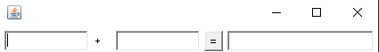

```java
package lesson01;

import java.awt.*;
import java.awt.event.ActionEvent;
import java.awt.event.ActionListener;
import java.awt.event.WindowAdapter;
import java.awt.event.WindowEvent;

public class TestCalc {
    public static void main(String[] args) {
        new Calculator();
    }
}

class Calculator extends Frame{
    public Calculator(){
        TextField num1 = new TextField(10);//设置文本框的字符数
        TextField num2 = new TextField(10);
        TextField num3 = new TextField(20);

        Label plus = new Label("+");

        Button button = new Button("=");
        button.addActionListener(new MyCalculatorListener(num1,num2,num3));
        setLayout(new FlowLayout());

        add(num1);
        add(plus);
        add(num2);
        add(button);
        add(num3);

        pack();
        setVisible(true);
        addWindowListener(new WindowAdapter() {
            @Override
            public void windowClosing(WindowEvent e) {
                System.exit(0);
            }
        });

    }
}

class MyCalculatorListener implements ActionListener{
    TextField num1,num2,num3;

    public MyCalculatorListener(TextField num1,TextField num2,TextField num3) {
        this.num1 = num1;
        this.num2 = num2;
        this.num3 = num3;
    }

    @Override
    public void actionPerformed(ActionEvent e) {
        //获取变量
        int n1 = Integer.parseInt(num1.getText());
        int n2 = Integer.parseInt(num2.getText());
        //实现计算
        num3.setText(""+(n1+n2));
        //清空文本域
        num1.setText("");
        num2.setText("");
    }
}
```

使用组合（传递的参数为对象而非对象的变量）进行优化

```java
package lesson01;

import java.awt.*;
import java.awt.event.ActionEvent;
import java.awt.event.ActionListener;
import java.awt.event.WindowAdapter;
import java.awt.event.WindowEvent;

public class TestCalc {
    public static void main(String[] args) {
        new Calculator();
    }
}

class Calculator extends Frame{
    TextField num1,num2,num3;
    public Calculator(){
        num1 = new TextField(10);//设置文本框的字符数
        num2 = new TextField(10);
        num3 = new TextField(20);

        Label plus = new Label("+");

        Button button = new Button("=");
        button.addActionListener(new MyCalculatorListener(this));
        setLayout(new FlowLayout());

        add(num1);
        add(plus);
        add(num2);
        add(button);
        add(num3);

        pack();
        setVisible(true);
        addWindowListener(new WindowAdapter() {
            @Override
            public void windowClosing(WindowEvent e) {
                System.exit(0);
            }
        });

    }
}

class MyCalculatorListener implements ActionListener{
    //这里使用时要注意指针问题
    Calculator calculator = null;


    public MyCalculatorListener(Calculator calculator) {
        this.calculator = calculator;
    }

    @Override
    public void actionPerformed(ActionEvent e) {
        //获取变量
        int n1 = Integer.parseInt(calculator.num1.getText());
        int n2 = Integer.parseInt(calculator.num2.getText());
        //实现计算
        calculator.num3.setText(""+(n1+n2));
        //清空文本域
        calculator.num1.setText("");
        calculator.num2.setText("");
    }
}
```

使用内部类进行优化

```java
package lesson01;

import java.awt.*;
import java.awt.event.ActionEvent;
import java.awt.event.ActionListener;
import java.awt.event.WindowAdapter;
import java.awt.event.WindowEvent;

public class TestCalc {
    public static void main(String[] args) {
        new Calculator();
    }
}

class Calculator extends Frame{
    TextField num1,num2,num3;
    public Calculator(){
        num1 = new TextField(10);//设置文本框的字符数
        num2 = new TextField(10);
        num3 = new TextField(20);

        Label plus = new Label("+");

        Button button = new Button("=");
        button.addActionListener(new MyCalculatorListener());
        setLayout(new FlowLayout());

        add(num1);
        add(plus);
        add(num2);
        add(button);
        add(num3);

        pack();
        setVisible(true);
        addWindowListener(new WindowAdapter() {
            @Override
            public void windowClosing(WindowEvent e) {
                System.exit(0);
            }
        });

    }

    private class MyCalculatorListener implements ActionListener{


        @Override
        public void actionPerformed(ActionEvent e) {
            //获取变量
            int n1 = Integer.parseInt(num1.getText());
            int n2 = Integer.parseInt(num2.getText());
            //实现计算
            num3.setText(""+(n1+n2));
            //清空文本域
            num1.setText("");
            num2.setText("");
        }
    }
}
```

#### 7.画笔

```java
package lesson01;

import java.awt.*;

public class TestPaint {
    public static void main(String[] args) {
        new MyPaint();
    }
}

class MyPaint extends Frame{
    public MyPaint() {
        setBounds(400,400,400,400);
        setVisible(true);
    }
    //画笔，该函数会自发进行调用
    @Override
    public void paint(Graphics g) {
        //设置画笔颜色
        g.setColor(Color.red);
        //画一个空心矩形
        g.drawRect(50,50,100,100);
        //重新设置画笔颜色
        g.setColor(Color.ORANGE);
        //画一个实心圆形
        g.fillOval(150,150,100,100);
        //养成习惯，画笔用完，将他还原到最初的颜色，防止下次画笔使用上次画笔的颜色
    }
}
```

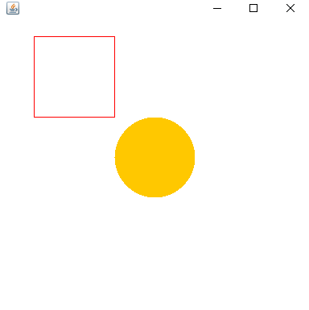

#### 8.鼠标监听

使用鼠标监听实现一个小程序，使用鼠标在面板上画点

思路：通过监听鼠标，获取鼠标在面板上的坐标，如果单击鼠标，在面板上画点

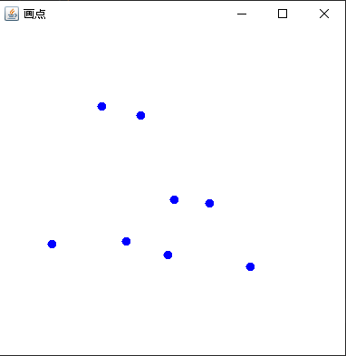

```java
package lesson02;

import java.awt.*;
import java.awt.event.MouseAdapter;
import java.awt.event.MouseEvent;
import java.util.ArrayList;

public class TestMouseListener {
    public static void main(String[] args) {
        new MyFrame("画点");
    }
}
class MyFrame extends Frame{
    //存储点
    ArrayList<Point> points;
    public  MyFrame(String title){
        super(title);
        setBounds(400,400,400,400);
        points = new ArrayList<>();
        addMouseListener(new MyMouseListener());
        setVisible(true);
    }

    //显示点
    @Override
    public void paint(Graphics g) {
        g.setColor(Color.blue);
        for (Point point : points) {
            g.fillOval(point.x,point.y,10,10);
        }
    }

    //鼠标事件，用于收集点
    private  class MyMouseListener extends MouseAdapter {
        @Override
        public void mouseClicked(MouseEvent e) {
            points.add(new Point(e.getX(),e.getY()));
            repaint();
        }
    }

}
```

#### 9.窗口监听

```java
package lesson02;

import java.awt.*;
import java.awt.event.WindowAdapter;
import java.awt.event.WindowEvent;

public class TestWindowListener {
    public static void main(String[] args) {
        new MyWindow();
    }
}
class MyWindow extends Frame{
    public  MyWindow(){
        setBackground(Color.blue);
        setBounds(400,400,400,400);
        addWindowListener(new MyWinodwListener());
        setVisible(true);
    }
    //自建的窗口监听类，继承了一个窗口监听的抽象类（适配器），实现了监听窗口关闭与窗口激活的方法
    //使用了内部类
    private class MyWinodwListener extends WindowAdapter{
        @Override
        public void windowClosing(WindowEvent e) {
            System.out.println("windowClosing");
        }

        @Override
        public void windowActivated(WindowEvent e) {
            System.out.println("windowActivated");
        }
    }

}
```

#### 10.键盘监听

```java
package lesson02;

import java.awt.*;
import java.awt.event.KeyAdapter;
import java.awt.event.KeyEvent;

public class TestKeyListener {
    public static void main(String[] args) {
        new MyKeyWindow();
    }
}
class MyKeyWindow extends Frame {
    public MyKeyWindow() {
        setBounds(400, 400, 400, 400);
        //使用了匿名内部类
        addKeyListener(new KeyAdapter(){
            @Override
            public void keyPressed(KeyEvent e) {
                if(e.getKeyCode() == KeyEvent.VK_UP){
                    System.out.println("按下了上键");
                }
            }
        });
        setVisible(true);
    }

}
```

## Swing

### Swing简介

AWT（Abstract Window Toolkit，抽象窗口工具）是一套早期的 Java GUI 开发工具，Swing 也是在 AWT 的基础上发展起来的。


AWT 的初衷是用来开发小型的图形界面程序，提供的功能较少，诸如剪切板、打印支持、键盘导航、弹出式菜单、滚动窗格等很多重要的功能在 AWT 中都不具备；此外，AWT 发生错误的几率也很高。

Java 官方看到了 AWT 的不足，就开始着手开发新的 GUI 类库，以继续占领 Java GUI 开发的市场，这就是后来的 Swing。

Swing 弥补了 AWT 的不足，并对 AWT 进行了扩充，几乎支持了所有的常用控件和功能，它们不但更加漂亮，而且更加易用，真正实现了“一次编译，到处运行”的承诺。

目前，Swing 已经代替 AWT 成为 Java 图形界面设计的首选，相对于 AWT 来说，Swing 有过之而无不及。

### 组件与容器

#### 1.JFrame

```java
package lesson03;

import javax.swing.*;
import java.awt.*;

public class JFrameDemo {
    void init(){
        JFrame jFrame = new JFrame("这是一个JFrame窗口");
        //必须在JFrame的默认内嵌容器里面设置背景颜色，直接在JFrame上设置颜色不会有效果
        jFrame.getContentPane().setBackground(Color.ORANGE);
        jFrame.setBounds(400,400,400,400);
        jFrame.setVisible(true);
        //使用Swing写好的关闭事件
        jFrame.setDefaultCloseOperation(WindowConstants.EXIT_ON_CLOSE);
        //要使JLabel的内容居中Swing有特有的方式实现
        JLabel jLabel = new JLabel("狂神说Java",SwingConstants.CENTER);
        jFrame.add(jLabel);
    }
    public static void main(String[] args) {
            new JFrameDemo().init();

    }
}
```

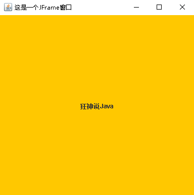

#### 2.JDialog 

```java
package lesson03;

import javax.swing.*;
import java.awt.*;
import java.awt.event.ActionEvent;
import java.awt.event.ActionListener;


public class TestJDialog {
    public static void main(String[] args) {
        new MyJDialog();
    }
}

class MyJDialog extends JFrame {
    public MyJDialog() {
        super("测试对话框");
        setBounds(400,400,400,400);
        getContentPane().setBackground(Color.ORANGE);
        JButton jButton = new JButton("点我弹出对话框");
        //设置JButton的点击事件
        jButton.addActionListener(new ActionListener() {
            @Override
            public void actionPerformed(ActionEvent e) {
                ShowJDialog();
            }
        });
        //绝对布局
        setLayout(null);
        jButton.setBounds(50,50,300,300);
        add(jButton);
        setDefaultCloseOperation(WindowConstants.EXIT_ON_CLOSE);
        setVisible(true);


    }
    void ShowJDialog (){
        JDialog jDialog = new JDialog();
        jDialog.setBounds(600,600,100,100);
        jDialog.add(new JLabel("对话框",SwingConstants.CENTER));
        jDialog.setVisible(true);
    }
}
```

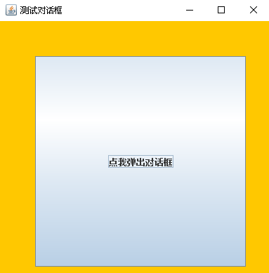

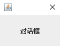

#### 3.Icon、ImageIcon标签

```java
package lesson03;

import javax.swing.*;
import java.awt.*;

public class TestIcon {
    public static void main(String[] args) {
        new MyIcon().init();
    }
}

class MyIcon extends JFrame implements Icon{
    int height,width;
    //在Java中如果自定义了构造方法则默认构造方法会被覆盖，所以这里为了方便main方法调用，又重载了一个无参的构造方法
    public MyIcon(){}
    public MyIcon(int height ,int width){
        this.height = height;
        this.width = width;
    }
    void init(){
        //通过构造器设置图标的大小
        MyIcon myIcon = new MyIcon(15,15);
        //将图标嵌入到jLabel中
        JLabel jLabel = new JLabel("icontest",myIcon,SwingConstants.CENTER);
        Container container = getContentPane();
        container.add(jLabel);
        container.setBackground(Color.ORANGE);

        this.setBounds(400,400,100,100);
        this.setVisible(true);
        this.setDefaultCloseOperation(WindowConstants.EXIT_ON_CLOSE);


    }
    //实现Icon接口中的内容
    @Override
    public void paintIcon(Component c, Graphics g, int x, int y) {
        g.fillOval(x,y,width,height);
    }

    @Override
    public int getIconWidth() {
        return width;
    }

    @Override
    public int getIconHeight() {
        return height;
    }
}
```

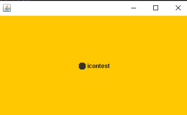

```java
package lesson03;

import javax.swing.*;
import java.awt.*;
import java.net.URL;

public class TestImageIcon {
    public static void main(String[] args) {
        new MyImageIcon().init();
    }
}

class MyImageIcon extends JFrame {
    void init() {
        //通过MyImageIcon这个类的路径来获得同同路径下其他资源的路径
        URL url = MyImageIcon.class.getResource("tx.jpeg");
        ImageIcon imageIcon = new ImageIcon(url);


        JLabel jLabel = new JLabel("ImageIcon",SwingConstants.CENTER);
        jLabel.setIcon(imageIcon);

        Container container = this.getContentPane();
        container.add(jLabel);

        setVisible(true);
        setBounds(400,400,500,500);
        setDefaultCloseOperation(WindowConstants.EXIT_ON_CLOSE);


    }

}

```

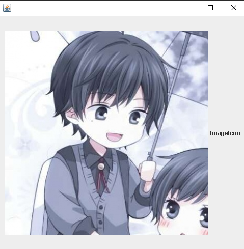

#### 4.文本域JScroll面板

```java
package lesson03;

import javax.swing.*;
import java.awt.*;

public class JScrollDemo extends JFrame {
    public JScrollDemo(){
        Container container = getContentPane();
        //文本域
        JTextArea  jTextArea = new JTextArea(20,50);
        jTextArea.setText("狂神说Java");
        //创建带滚动条的面板将文本域插入面板中
        JScrollPane jScrollPane = new JScrollPane(jTextArea);
        container.add(jScrollPane);
        //设置JFrame的属性
        this.setBounds(400,400,400,400);
        this.setVisible(true);
        this.setDefaultCloseOperation(WindowConstants.EXIT_ON_CLOSE);


    }
    public static void main(String[] args) {
        new JScrollDemo();
    }
}
```

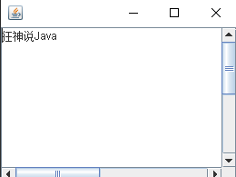

#### 5.图片按钮、单选框、多选框

```java
package lesson03;

import javax.swing.*;
import java.awt.*;
import java.net.URL;

public class TestImageButton extends JFrame {
    public TestImageButton(){
        Container container = this.getContentPane();

        URL resource = TestImageButton.class.getResource("tx.jpeg");
        Icon icon = new ImageIcon(resource);

        //注意按钮上放图标用特有的方法setIcon而非add
        JButton jButton = new JButton();
        jButton.setIcon(icon);

        container.add(jButton);

        this.setBounds(400,400,500,500);
        this.setVisible(true);

        this.setDefaultCloseOperation(WindowConstants.EXIT_ON_CLOSE);

    }
    public static void main(String[] args) {
        new TestImageButton();
    }
}
```

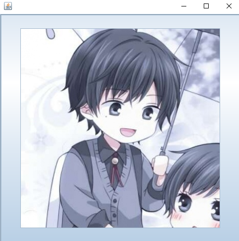

```java
package lesson03;

import javax.swing.*;
import java.awt.*;

public class TestJRadioButton extends JFrame {

    public TestJRadioButton() {
        Container container= this.getContentPane();

        JRadioButton radioButton1 = new JRadioButton("单选框1");
        JRadioButton radioButton2 = new JRadioButton("单选框2");
        JRadioButton radioButton3 = new JRadioButton("单选框3");
		//指定组，否则起不到单选的作用
        ButtonGroup buttonGroup = new ButtonGroup();
        buttonGroup.add(radioButton1);
        buttonGroup.add(radioButton2);
        buttonGroup.add(radioButton3);
		//需设置布局，不然会出错
        container.add(radioButton1,BorderLayout.NORTH);
        container.add(radioButton2,BorderLayout.CENTER);
        container.add(radioButton3,BorderLayout.SOUTH);

        this.setBounds(400,400,200,200);
        this.setVisible(true);
        this.setDefaultCloseOperation(WindowConstants.EXIT_ON_CLOSE);

    }

    public static void main(String[] args) {
        new TestJRadioButton();
    }
}
```

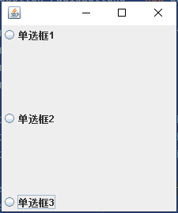

```java
package lesson03;

import javax.swing.*;
import java.awt.*;

public class TestJCheckBox extends JFrame{

    public TestJCheckBox() {
        Container container= this.getContentPane();

        JCheckBox jCheckBox1 = new JCheckBox("多选框1");
        JCheckBox jCheckBox2 = new JCheckBox("多选框2");
        JCheckBox jCheckBox3 = new JCheckBox("多选框3");
		//需设置布局，不然会出错
        container.add(jCheckBox1,BorderLayout.NORTH);
        container.add(jCheckBox2,BorderLayout.CENTER);
        container.add(jCheckBox3,BorderLayout.SOUTH);


        this.setBounds(400,400,200,200);
        this.setVisible(true);
        this.setDefaultCloseOperation(WindowConstants.EXIT_ON_CLOSE);
    }

    public static void main(String[] args) {
        new TestJCheckBox();
    }
}
```

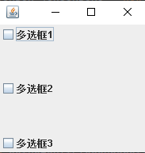

#### 6.下拉框、列表框

```java
package lesson03;

import javax.swing.*;
import java.awt.*;

public class TestJComboBox extends JFrame {
    public TestJComboBox() {
        Container container= this.getContentPane();

        JComboBox<String> jComboBox = new JComboBox<>();
        jComboBox.addItem("正在上映");
        jComboBox.addItem("已下架");
        jComboBox.addItem("即将上映");

        container.add(jComboBox);


        this.setBounds(400,400,200,200);
        this.setVisible(true);
        this.setDefaultCloseOperation(WindowConstants.EXIT_ON_CLOSE);
    }

    public static void main(String[] args) {
        new TestJComboBox();
    }
}
```

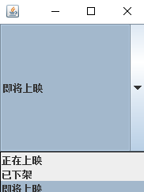

使用列表框可以实现动态地显示数据的功能

```java
package lesson03;

import javax.swing.*;
import java.awt.*;
import java.util.Vector;

public class TestJList extends JFrame {
    public TestJList() {
        Container container= this.getContentPane();

        Vector<String> vector = new Vector<String>();
        JList<String> jList = new JList<String>(vector);
        vector.add("1");
        vector.add("2");
        vector.add("3");

        container.add(jList);

        this.setBounds(400,400,200,200);
        this.setVisible(true);
        this.setDefaultCloseOperation(WindowConstants.EXIT_ON_CLOSE);
    }

    public static void main(String[] args) {
        new TestJList();
    }
}
```

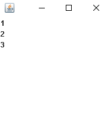

#### 7.文本框、密码框、文本域

文本框与密码框显示只有一行，无法换行，但是文本域则可以换行

```java
package lesson03;

import javax.swing.*;
import java.awt.*;

public class TestJTextField extends JFrame {

    public TestJTextField()  {
        Container container= this.getContentPane();

        JTextField jTextField = new JTextField();
        jTextField.setText("Hello,World!");

        container.add(jTextField,BorderLayout.NORTH);


        this.setBounds(400,400,200,200);
        this.setVisible(true);
        this.setDefaultCloseOperation(WindowConstants.EXIT_ON_CLOSE);
    }

    public static void main(String[] args) {
        new TestJTextField();
    }
}
```

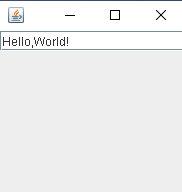


```java
package lesson03;

import javax.swing.*;
import java.awt.*;

public class TestJPasswordField extends JFrame {

    public TestJPasswordField() {
        Container container= this.getContentPane();

        JPasswordField jPasswordField = new JPasswordField();
        jPasswordField.setEchoChar('*');
        jPasswordField.setText("Hello,World!");

        container.add(jPasswordField,BorderLayout.NORTH);


        this.setBounds(400,400,200,200);
        this.setVisible(true);
        this.setDefaultCloseOperation(WindowConstants.EXIT_ON_CLOSE);
    }

    public static void main(String[] args) {
        new TestJPasswordField();
    }
}
```

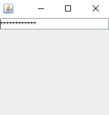

```java
package lesson03;

import javax.swing.*;
import java.awt.*;

public class TestJTextArea extends JFrame {
    public TestJTextArea()  {
        Container container= this.getContentPane();

        JTextArea jTextArea = new JTextArea();
        jTextArea.setText("Hello,World!");

        container.add(jTextArea,BorderLayout.NORTH);


        this.setBounds(400,400,200,200);
        this.setVisible(true);
        this.setDefaultCloseOperation(WindowConstants.EXIT_ON_CLOSE);
    }

    public static void main(String[] args) {
        new TestJTextArea();
    }
}
```

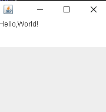
