- [IO流](#io流)
  - [初始Java IO流](#初始java-io流)
  - [IO流基类](#io流基类)
  - [文件流](#文件流)
    - [文件字节流](#文件字节流)
      - [FileInputStream](#fileinputstream)
      - [FileOutputStream](#fileoutputstream)
    - [文件字符流](#文件字符流)
      - [FileReader](#filereader)
      - [FileWriter](#filewriter)
    - [File](#file)
  - [缓冲流](#缓冲流)
    - [缓冲字节流](#缓冲字节流)
      - [BufferedInputStream](#bufferedinputstream)
      - [BufferedOutputStream](#bufferedoutputstream)
    - [缓冲字符流](#缓冲字符流)
      - [BufferedReader](#bufferedreader)
      - [BufferedWriter](#bufferedwriter)
  - [转换流](#转换流)
      - [OutputStreamWriter](#outputstreamwriter)
      - [InputStreamReader](#inputstreamreader)
  - [打印流](#打印流)
      - [PrintStream](#printstream)
      - [PrintWriter](#printwriter)
  - [数据流](#数据流)
      - [DataOutputStream](#dataoutputstream)
      - [DataInputStream](#datainputstream)
  - [对象流](#对象流)
      - [ObjectOutputStream](#objectoutputstream)
      - [ObjectInputStream](#objectinputstream)
  
# IO流

## 初始Java IO流

输入流、输出流是针对内存而言的

输入流是将流中的数据写到内存中（相当于代码中的变量中）

输出流根据流的特性写到指定的地方，例如FileOutputStream（new File("1.txt") ），将流中的数据写到文件1.txt中

一般编程的时候，是将输入流的数据存到一个缓存区中再将缓冲区中的数据显示出来（以便一次性得到部分数据，便于用String中的方法解码和显示），而输出的话，没有那么多的缓存需求，所以要从输入流中读取一个字符串比向输出流中输出一个字符串要麻烦一点。


## IO流基类


## 文件流

### 文件字节流

#### FileInputStream

尝试读出text01.txt中的数据

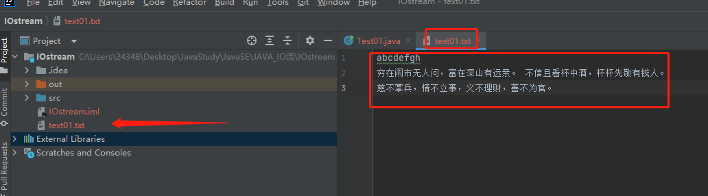

```java
import java.io.FileInputStream;
import java.io.IOException;


public class Test01 {
    public static void main(String[] args) {

        try (FileInputStream is = new FileInputStream("text01.txt")){
            System.out.println((char) is.read());//尝试读取一个字节的数据，若没有数据（到达文件末尾）则返回-1
            System.out.println((char) is.read());//尝试读取第二个字节的数据
            System.out.println(is.available()); //查看当前可读的剩余字节数量(并不一定真实的数据量就那么多,这个方法只能做个预估)
            byte[] buffer = new byte[1024];     //设立一个缓存区，用于接受数据
            int len;                            //等下与read(bytes[])方法配合使用,该方法返回读取数据的长度
            while((len=is.read(buffer))!=-1){
                System.out.println(new String(buffer,0,len));
            }
        } catch (IOException e) {
            e.printStackTrace();
        }
    }
}
```

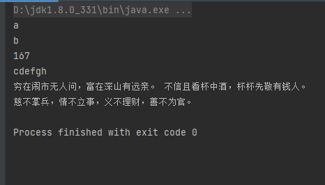

#### FileOutputStream

将“Hello，World”写入到text02.txt中

```java
import java.io.FileOutputStream;
import java.io.IOException;

public class Test02 {
    public static void main(String[] args) {
        try (FileOutputStream fos = new FileOutputStream("text02.txt")) {
            fos.write("Hello,World".getBytes());
        }catch (IOException e){
            e.printStackTrace();
        }
    }
}
```

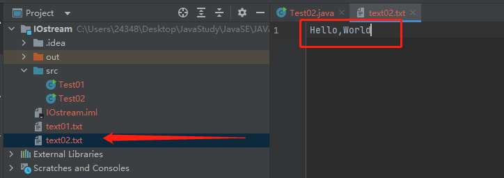

试着将text01.txt中的数据追加到text02.txt中

```java
import java.io.FileInputStream;
import java.io.FileOutputStream;
import java.io.IOException;

public class Test03 {
    public static void main(String[] args) {
        try (FileOutputStream fos = new FileOutputStream("text02.txt", true);//设第二个参数为true，表示为追加
             FileInputStream fis=new FileInputStream("text01.txt")) {

            //将text01.txt中的数据读到buffer中，再将buffer中的数据写到test02.txt中
            byte[] buffer = new byte[1024];
            int len;
            while ((len=fis.read(buffer))!=-1){
                fos.write(buffer,0,len);
            }

        }catch (IOException e){
            e.printStackTrace();
        }
    }
}
```

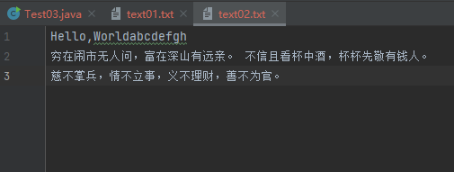

### 文件字符流 

#### FileReader

将text02.txt文件以字符流的方式读到内存中，并显示出来

```java
import java.io.FileReader;
import java.io.IOException;

public class Test04 {
    public static void main(String[] args) {
        try (FileReader reader = new FileReader("text02.txt")) {
            char[] buffer = new char[1024];
            int len;
            while ((len=reader.read(buffer))!=-1){
                System.out.println(String.valueOf(buffer,0,len));
            }
        }catch (IOException e){
            e.printStackTrace();
        }
    }
}
```

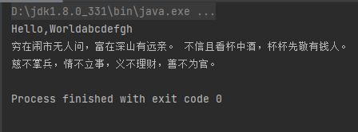

#### FileWriter

创建一个内容与text02.txt一样的，文件名为text03.txt的文件

```java
import java.io.FileReader;
import java.io.FileWriter;
import java.io.IOException;

public class Test05 {
    public static void main(String[] args) {
        try (FileReader fileReader=new FileReader("text02.txt"); FileWriter fileWriter = new FileWriter("text03.txt")){

            char[] buffer = new char[1024];
            int len;
            while ((len=fileReader.read(buffer))!=-1){
                fileWriter.write(buffer,0,len);
            }

        }catch (IOException e){
            e.printStackTrace();
        }
    }
}
```

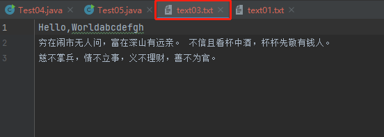

### File

File类专门用于表示一个文件或文件夹，只不过它只是代表这个文件，但并不是这个文件本身，通过File对象，可以更好地管理和操作硬盘上的文件，File对象可以直接作为FileInputStream等类参数

```java
import java.io.File;

public class Test06 {
    public static void main(String[] args) {
        File file = new File("text01.txt");//创建文件对象，这个路径可以是相对路径也可以是绝对路径
        System.out.println("文件是否存在："+file.exists());
        System.out.println("文件大小："+file.length());
        System.out.println("文件是否为一个文件夹："+file.isDirectory());
        System.out.println("文件是否可读："+file.canRead());
        System.out.println("文件是否可写："+file.canWrite());
        System.out.println("文件是否可执行："+file.canExecute());
    }
}
```

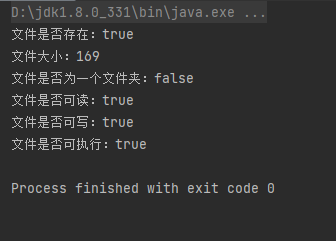

如果这个文件是目录文件（文件夹），还可以获取文件夹内部的文件列表的内容

```java
import java.io.File;
import java.util.Arrays;

public class Test07 {
    public static void main(String[] args) {
        File file = new File("C:\\Users\\24348\\Desktop\\JavaStudy\\JavaSE");
        System.out.println(Arrays.toString(file.listFiles()));
        for(File f:file.listFiles()){
            System.out.println(f.getAbsolutePath());
        }
    }
}
```

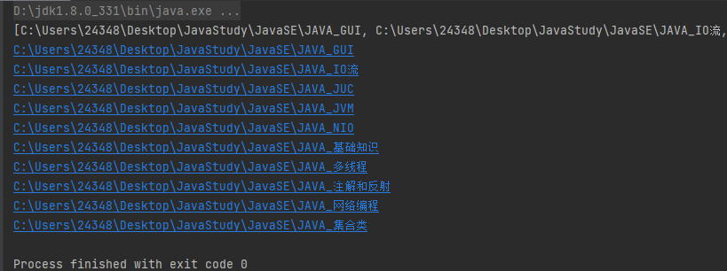

尝试拷贝文件夹下的所有文件到另一个文件夹（下面的代码实现了没有目录文件的文件夹之间的复制，并没有完全实现理想化的实现文件夹的完全复制）

```java
import java.io.File;
import java.io.FileInputStream;
import java.io.FileOutputStream;
import java.io.IOException;

public class Test08 {
    public static void main(String[] args) {
        File file1 = new File("src/");
        System.out.println(file1.getAbsolutePath());
        File file2 = new File("src2/");
        file2.mkdir();		//创建文件夹
        for(File f:file1.listFiles()){
            try (FileInputStream fis = new FileInputStream(f);
                 FileOutputStream fos = new FileOutputStream(file2.getPath()+"/"+f.getName())){

                byte buffer[] = new byte[1024];
                int len;
                while((len=fis.read(buffer))!=-1){
                    fos.write(buffer,0,len);
                }
                fos.flush();
            }catch (IOException e){
                e.printStackTrace();
            }
        }

    }
}

```

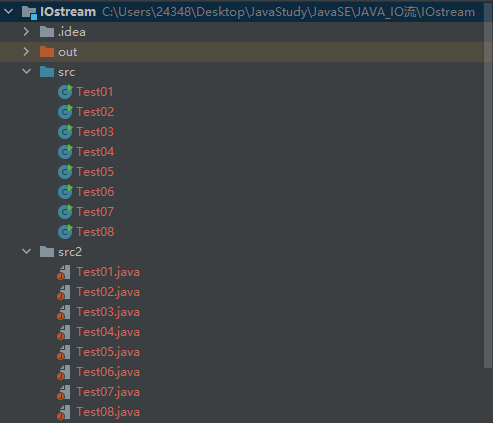

## 缓冲流

缓冲流的基本原理，是在创建流对象时，会创建一个内置的默认大小的缓冲区数组，通过缓冲区读写，减少系统IO次数，从而提高读写的效率。

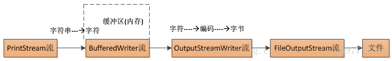

### 缓冲字节流

#### BufferedInputStream

要创建一个缓冲字节流，只需要将原本的流作为构造参数传入BufferedInputStream即可。

实际上进行I/O操作的并不是BufferedInputStream，而是我们传入的FileInputStream，而BufferedInputStream虽然有着同样的方法，但是进行了一些额外的处理然后再调用FileInputStream的同名方法，这样的写法称为**装饰者模式**

```java
import java.io.BufferedInputStream;
import java.io.FileInputStream;
import java.io.IOException;

public class Test09 {
    public static void main(String[] args) {
        try(BufferedInputStream bufferedInputStream = new BufferedInputStream(new FileInputStream("text01.txt"))){
            System.out.println((char) bufferedInputStream.read());
        }catch (IOException e){
            e.printStackTrace();
        }
    }
}
```

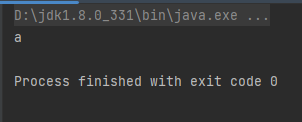

I/O操作一般不能重复读取内容（比如键盘发送的信号，主机接收了就没了），而缓冲流提供了缓冲机制，一部分内容可以被暂时保存，BufferedInputStream支持`reset()`和`mark()`操作

当调用`mark()`之后，输入流会以某种方式保留之后读取的`readlimit`数量的内容，当读取的内容数量超过`readlimit`则之后的内容不会被保留

当调用`reset()`之后，会使得当前的读取位置回到`mark()`调用时的位置。

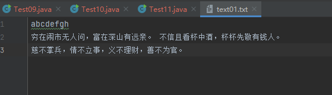

```java
import java.io.BufferedInputStream;
import java.io.FileInputStream;
import java.io.IOException;

public class Test11 {
    public static void main(String[] args) {
        try(BufferedInputStream fis = new BufferedInputStream(new FileInputStream("text01.txt"))){
            fis.mark(1);
            System.out.println((char) fis.read());
            System.out.println((char) fis.read());
            fis.reset();
            System.out.println((char) fis.read());
            System.out.println((char) fis.read());

        }catch (IOException e){
            e.printStackTrace();
        }
    }
}
```

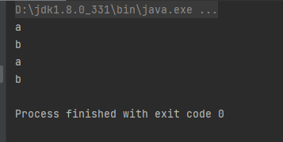

我们发现虽然后面的部分没有保存，但是依然能够正常读取，其实`mark()`后保存的读取内容是取`readlimit`和BufferedInputStream类的缓冲区大小两者中的最大值，而并非完全由`readlimit`确定。因此我们限制一下缓冲区大小，再来观察一下结果：

```java
import java.io.BufferedInputStream;
import java.io.FileInputStream;
import java.io.IOException;

public class Test11 {
    public static void main(String[] args) {
        try(BufferedInputStream fis = new BufferedInputStream(new FileInputStream("text01.txt"),1)){//将缓存区大小限制为一个字节

            fis.mark(1);
            System.out.println((char) fis.read());
            System.out.println((char) fis.read());
            fis.reset();
            System.out.println((char) fis.read());
            System.out.println((char) fis.read());

        }catch (IOException e){
            e.printStackTrace();
        }
    }
}
```

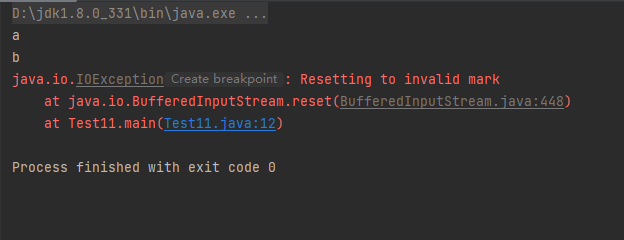

#### BufferedOutputStream

BufferedOutputStream同理，现在试着将text01.txt的数据用BufferedOutputStream输出

```java
import java.io.BufferedOutputStream;
import java.io.FileInputStream;
import java.io.FileOutputStream;
import java.io.IOException;

public class Test10 {
    public static void main(String[] args) {
        try(FileInputStream fis = new FileInputStream("text01.txt");
            BufferedOutputStream bos = new BufferedOutputStream(new FileOutputStream("text04.txt"))){

            byte[] buffer = new byte[1024];
            int len;
            while((len=fis.read(buffer))!=-1){
                bos.write(buffer,0,len);
            }

        }catch (IOException e){
            e.printStackTrace();
        }
    }
}
```

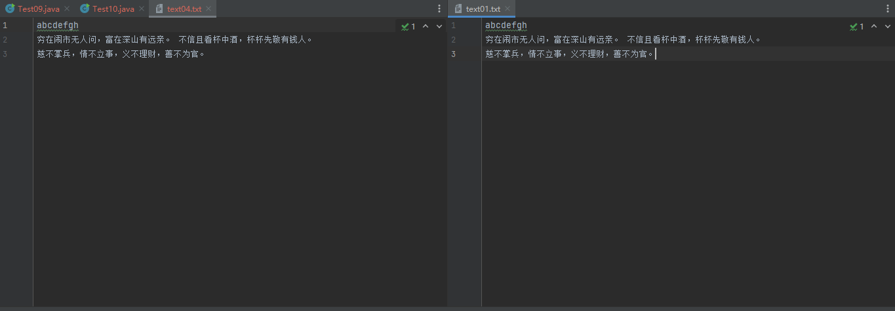


### 缓冲字符流

#### BufferedReader

缓存字符流和缓冲字节流一样，也有一个专门的缓冲区，BufferedReader构造时需要传入一个Reader对象，**相比Reader更方便的是，它支持按行读取**，它同样也支持`mark()`和`reset()`操作

```java
import java.io.BufferedReader;
import java.io.FileReader;
import java.io.IOException;

public class Test12 {
    public static void main(String[] args) {
        try (BufferedReader br = new BufferedReader(new FileReader("text01.txt"))){
            br.mark(1024);
            System.out.println(br.readLine());
            System.out.println(br.readLine());
            System.out.println(br.readLine());
            br.reset();
            System.out.println(br.readLine());
        }catch (IOException e){
            e.printStackTrace();
        }
    }
}
```

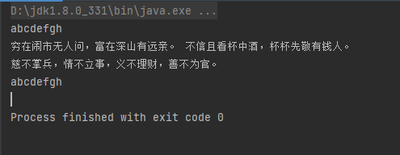

#### BufferedWriter

BufferedReader处理纯文本文件时就更加方便了，BufferedWriter在处理时也同样方便

```java
import java.io.BufferedWriter;
import java.io.FileWriter;
import java.io.IOException;

public class Test13 {
    public static void main(String[] args) {
        try(BufferedWriter bw = new BufferedWriter(new FileWriter("test05.txt"))){

            bw.write("Hello,World!!!");//这个方法还可以用字符串当参数
            bw.newLine();			//换行
            bw.write("Java is best.");
            bw.flush();
            
        }catch (IOException e){
            e.printStackTrace();
        }
    }
}
```

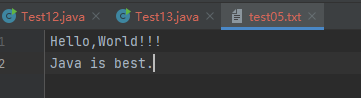

## 转换流

#### OutputStreamWriter

有时会遇到这样一个很麻烦的问题：我这里读取的是一个字符串或是一个个字符，但是我只能往一个OutputStream里输出，但是OutputStream又只支持byte类型，如果要往里面写入内容，进行数据转换就会很麻烦，这时，我们可以将字节流转换为字符流，使用字符流的方法

```java
import java.io.FileOutputStream;
import java.io.IOException;
import java.io.OutputStreamWriter;

public class Test14 {
    public static void main(String[] args) {
        try (OutputStreamWriter osw = new OutputStreamWriter(new FileOutputStream("text06.txt"))){

            osw.write("你好，世界！！！");
            osw.write("\n");
            osw.write("Java 牛逼！");

        }catch (IOException e){
            e.printStackTrace();
        }
    }
}
```

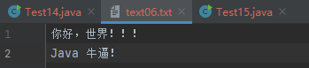

#### InputStreamReader

同样的，我们现在只拿到了一个InputStream，但是我们希望能够按字符的方式读取，我们就可以使用InputStreamReader来帮助我们实现，InputStreamReader和OutputStreamWriter本质也是Reader和Writer，因此可以直接放入BufferedReader来实现更加方便的操作。

```java
import java.io.BufferedReader;
import java.io.FileInputStream;
import java.io.IOException;
import java.io.InputStreamReader;

public class Test15 {
    public static void main(String[] args) {
        try (BufferedReader bf =new BufferedReader(new InputStreamReader(new FileInputStream("text06.txt")))){
            System.out.println(bf.readLine());
            System.out.println(bf.readLine());
        }catch (IOException e){
            e.printStackTrace();
        }
    }
}
```

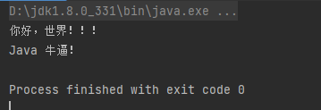

## 打印流

#### PrintStream

我们平时使用的`println`方法就是PrintStream中的方法，它会直接打印基本数据类型或是调用对象的`toString()`方法得到一个字符串，并将字符串转换为字符，放入缓冲区再经过转换流输出到给定的输出流上。`System.out`也是PrintStream，不过默认是向控制台打印，我们也可以用PrintStream向文件中打印


```java
import java.io.FileOutputStream;
import java.io.IOException;
import java.io.PrintStream;

public class Test16 {
    public static void main(String[] args) {
        try( PrintStream ps= new PrintStream(new FileOutputStream("text07.txt"))){
            
            ps.println("测试PrintStream");
            ps.println("测试PrintStream");
            
        }catch (IOException e){
            e.printStackTrace();
        }
    }
}
```

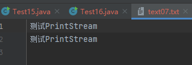


因此实际上内部还包含这两个内容：

```java
/**
 * Track both the text- and character-output streams, so that their buffers
 * can be flushed without flushing the entire stream.
 */
private BufferedWriter textOut;
private OutputStreamWriter charOut;
```

#### PrintWriter

与此相同的还有一个PrintWriter，不过他们的功能基本一致，PrintWriter的构造方法可以接受一个Writer作为参数，这里就不再做过多阐述了。

## 数据流

数据流DataInputStream和DataOutputStream也是FilterInputStream的子类，同样采用装饰者模式，最大的不同是它们支持基本数据类型的直接存取

#### DataOutputStream

```java
import java.io.DataOutputStream;
import java.io.FileOutputStream;
import java.io.IOException;

public class Test17 {
    public static void main(String[] args) {
        try (DataOutputStream dos = new DataOutputStream(new FileOutputStream("text08.txt"))){

            //向文件里面输入数据
            dos.writeDouble(1.5);
            dos.writeInt(222);

        }catch (IOException e){
            e.printStackTrace();
        }
    }
}
```

#### DataInputStream

```java
import java.io.DataInputStream;
import java.io.FileInputStream;
import java.io.IOException;

public class Test18 {
    public static void main(String[] args) {
        try (DataInputStream dis = new DataInputStream(new FileInputStream("text08.txt"))){

            //读取文件数据的顺序要与写入文件数据的顺序一致，否则会数据会出错
            System.out.println(dis.readDouble());
            System.out.println(dis.readInt());

        }catch (IOException e){
            e.printStackTrace();
        }
    }
}
```

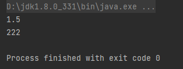

## 对象流

#### ObjectOutputStream

既然基本数据类型能够读取和写入基本数据类型，那么能否将对象也支持呢？ObjectOutputStream不仅支持基本数据类型，通过对对象的序列化操作，以某种格式保存对象，来支持对象类型的IO，注意：它不是继承自FilterInputStream的。在我们后续的操作中，有可能会使得这个类的一些结构发生变化，而原来保存的数据只适用于之前版本的这个类，版本通过serialVersionUID这个类变量进行保存，当发生版本不匹配时，会无法反序列化为对象

如果我们不希望某些属性参与到序列化中进行保存，我们可以添加`transient`关键字，其实，在一些JDK内部的源码中，也存在大量的transient关键字，使得某些属性不参与序列化，取消这些不必要保存的属性，可以节省数据空间占用以及减少序列化时间。

```java
import java.io.FileOutputStream;
import java.io.IOException;
import java.io.ObjectOutputStream;
import java.io.Serializable;
class People implements Serializable{		//要被序列化，必须实现这个接口
    String name;
    transient String value = "value";       //被transient修饰，无法序列化
    public People(String name){
        this.name = name;
    }
}

public class Test19 {
    public static void main(String[] args) {

        try(ObjectOutputStream oos = new ObjectOutputStream(new FileOutputStream("text09.txt"))){
            
            oos.writeObject(new People("niubility"));
            
        }catch (IOException e){
            e.printStackTrace();
        }
    }
}
```

#### ObjectInputStream

```java
import java.io.FileInputStream;
import java.io.IOException;
import java.io.ObjectInputStream;

public class Test20 {
    public static void main(String[] args) {
        try (ObjectInputStream ois = new ObjectInputStream(new FileInputStream("text09.txt"))){

            People people = (People) ois.readObject();
            System.out.println(people.name);
            System.out.println(people.value);

        }catch (ClassNotFoundException | IOException e){
            e.printStackTrace();
        }
    }
}
```

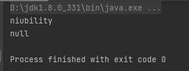

