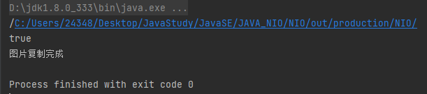
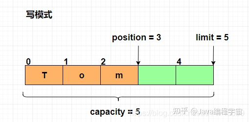
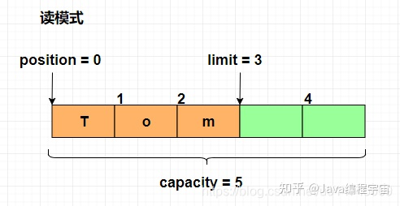
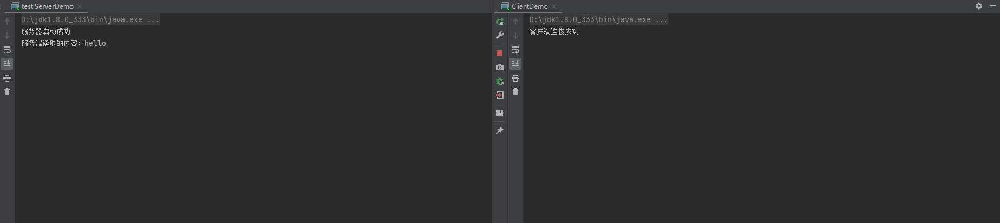

## NIO

NIO分为三个组件Buffer、Channels、Selector，Bufffer代替之前BIO中的byte数组，Channels代替之前BIO中的流，Selector实现服务器接收客户端消息的多路复用

```java
package test;

import java.io.File;
import java.io.FileInputStream;
import java.io.FileOutputStream;
import java.nio.ByteBuffer;
import java.nio.channels.FileChannel;

public class FileCopyDemo {

    public static void main(String[] args) {
        String classpath = FileCopyDemo.class.getClassLoader().getResource(".").getPath();
        System.out.println(classpath);
        File file = new File(classpath+"demo.jpg");
        System.out.println(file.exists());

        try {
            //1.读取文件的Channel对象
            FileChannel ipsChannel = new FileInputStream(file).getChannel();
            //2.输出文件的Channel对象
            FileChannel opsChannel = new FileOutputStream(classpath+"copy_demo.jpg").getChannel();
            //3.创建一个Buffer缓冲区
            ByteBuffer buffer = ByteBuffer.allocate(1024);

            while (ipsChannel.read(buffer)!=-1){

                buffer.flip();      //转成可读模式
                opsChannel.write(buffer);
                buffer.clear();     //清空缓冲区
            }
            System.out.println("图片复制完成");
            //资源关闭
            ipsChannel.close();
            opsChannel.close();
        } catch (Exception e) {
            e.printStackTrace();
        }

    }
}
```




传统BIO是通过对流的操作控制数据传输，而NIO通过对buffer的操作控制数据传输，buffer中有四个属性可以直接标识数据读写过程

- **position** 表示位置，表示当前程序正在操作的数据的下一个索引值。
- **mark** 表示标记，通过 `mark()` 方法，记录当前数据的索引。可以通过 reset() 重新找到 mark 所指向的数据。
- **limit** 界限，表示缓冲区中可以操作数据的大小，limit 后的数据不能进行读写。
- **capacity** 缓冲区容量，因为缓冲区本身就是数组，因此一旦声明不能改变该值。





### Buffer

### Channels

### Selector


## NIO实现通讯

服务端

```java
package test;

import java.io.IOException;
import java.net.InetSocketAddress;
import java.nio.ByteBuffer;
import java.nio.channels.ServerSocketChannel;
import java.nio.channels.SocketChannel;

public class ServerTest {
    public static void main(String[] args) {


        try {
            //1.创建ServerSocket
            ServerSocketChannel serverSocketChannel = ServerSocketChannel.open();
            //2配置端口
            serverSocketChannel.bind( new InetSocketAddress(8080));
            //serverSocketChannel.configureBlocking(false); //设置非阻塞
            System.out.println("服务器启动。。。");

            //3.接收客户端的连接
            SocketChannel socketChannel = serverSocketChannel.accept();

            System.out.println("新客户端连接");
            //4.读取发送过来的消息

            ByteBuffer buffer = ByteBuffer.allocate(1024 * 10);
            socketChannel.read(buffer);
            System.out.println("服务端读取的内容:"+new String(buffer.array(),0,buffer.position(),"utf-8"));

            //5.返回数据给客户端
            buffer.clear();     //清空缓冲区
            buffer.put("客户端接收成功".getBytes("utf-8"));
            buffer.flip();
            socketChannel.write(buffer);

        } catch (IOException e) {
            e.printStackTrace();
        }

    }
}
```

客户端

```java
package test;

import java.io.IOException;
import java.net.InetSocketAddress;
import java.nio.ByteBuffer;
import java.nio.channels.SocketChannel;

public class CilentTest {
    public static void main(String[] args) {

        try {
            //1.创建SocketChannel
            SocketChannel socketChannel = SocketChannel.open();
            //2.连接服务器
            socketChannel.connect(new InetSocketAddress(8080));
            System.out.println("客户端连接服务器成功。。。");

            //3.写入数据
            ByteBuffer buffer = ByteBuffer.allocate(1024 * 10);

            buffer.put("hello,世界".getBytes("utf-8"));
            buffer.flip(); //改为可读模式
            socketChannel.write(buffer);
            System.out.println("客户端数据写入完成...");

            //4.接收服务端的消息
            buffer.clear();         //清空缓冲区
            socketChannel.read(buffer);
            System.out.println(new String(buffer.array(),0,buffer.position(),"utf-8"));

        } catch (IOException e) {
            e.printStackTrace();
        }
    }
}
```

## 多路复用器

服务端

```java
package selector;

import java.net.InetSocketAddress;
import java.nio.ByteBuffer;
import java.nio.channels.*;
import java.util.HashSet;
import java.util.Set;

public class ServerDemo {


    public static void main(String[] args) {

        try {

            //创建服务端
            ServerSocketChannel serverSocketChannel = ServerSocketChannel.open();
            //绑定端口
            serverSocketChannel.bind(new InetSocketAddress(8080));
            //设置非阻塞
            serverSocketChannel.configureBlocking(false);
            //创建多路复用器
            Selector selector = Selector.open();
            //把ServerSocketChannel绑定到多路复用器上面,监听客户端的连接
            serverSocketChannel.register(selector, SelectionKey.OP_ACCEPT);
            //如果selector大于0说明有处理的请求
            while(selector.select()>0){
                //获取多路复用器中的待处理的请求
                Set<SelectionKey> selectionKeys = selector.selectedKeys();
                for(SelectionKey sk:new HashSet<>(selectionKeys)){      //创建一个hashset便于删除
                    //处理完请求后要删除
                    selectionKeys.remove(sk);
                    if(sk.isAcceptable()){ //代表是新的连接
                        ServerSocketChannel ssc =(ServerSocketChannel) sk.channel();
                        SocketChannel socketChannel = ssc.accept();
                        //设置非阻塞
                        socketChannel.configureBlocking(false);
                        //注册到多路复用器
                        socketChannel.register(selector,SelectionKey.OP_READ);
                    } else if (sk.isReadable()) { //代表是读取的消息类型
                        SocketChannel socketChannel=(SocketChannel)sk.channel();

                        ByteBuffer buffer = ByteBuffer.allocate(1024 * 10);
                        socketChannel.read(buffer);

                        System.out.println("服务端读取到的内容："+new String(buffer.array(),0,buffer.position(),"utf-8"));

                    }
                }
            }

        }catch (Exception e){
            e.printStackTrace();
        }

    }
}
```

客户端

```java
package selector;

import java.io.IOException;
import java.net.InetSocketAddress;
import java.nio.ByteBuffer;
import java.nio.channels.SocketChannel;
import java.util.Scanner;

public class CilentDemo {

    public static void main(String[] args) {

        SocketChannel socketChannel= null;
        Scanner scanner =null;
        try{
            socketChannel = SocketChannel.open();
            socketChannel.connect(new InetSocketAddress(8080));
            ByteBuffer buffer = ByteBuffer.allocate(1024 * 10);
            scanner = new Scanner(System.in);

            while(true){
                buffer.clear();
                buffer.put(scanner.nextLine().getBytes("utf-8"));
                buffer.flip();
                socketChannel.write(buffer);
            }

        }catch (Exception e){
            e.printStackTrace();
        }finally {
            scanner.close();
            try {
                socketChannel.close();
            } catch (IOException e) {
                e.printStackTrace();
            }
        }

    }
}
```


## Netty

服务端

```java
package test;

import io.netty.bootstrap.ServerBootstrap;
import io.netty.channel.ChannelFuture;
import io.netty.channel.EventLoopGroup;
import io.netty.channel.ServerChannel;
import io.netty.channel.nio.NioEventLoopGroup;
import io.netty.channel.socket.nio.NioServerSocketChannel;

public class ServerDemo {

    public static void main(String[] args) {

        //创建两个线程池（主，从）
        EventLoopGroup master = new NioEventLoopGroup(); //线程池
        EventLoopGroup slave = new NioEventLoopGroup(); //线程池

        //创建引导类
        ServerBootstrap serverBootstrap = new ServerBootstrap();
        //主从线程模型
        serverBootstrap.group(master,slave);
        //设置通道类型
        serverBootstrap.channel( NioServerSocketChannel.class);
        //处理客户端的handle
        serverBootstrap.childHandler(new ServerSocketHandler());
        //绑定端口号(通过异步完成)
        ChannelFuture channelFuture = serverBootstrap.bind(8080);
        try {
            channelFuture.sync(); //阻塞
        } catch (InterruptedException e) {
            e.printStackTrace();
        }
        System.out.println("服务器启动成功");

    }
}
```

服务端ChannelHandle

```java
package test;

import io.netty.buffer.ByteBuf;
import io.netty.channel.ChannelHandlerContext;
import io.netty.channel.SimpleChannelInboundHandler;

import java.nio.charset.Charset;

public class ServerSocketHandler extends SimpleChannelInboundHandler<ByteBuf> {


    @Override
    protected void channelRead0(ChannelHandlerContext ctx, ByteBuf msg) throws Exception {
        System.out.println("服务端读取的内容："+msg.toString(Charset.defaultCharset()));
    }
}
```

客户端

```java
package test;

import io.netty.bootstrap.Bootstrap;
import io.netty.buffer.ByteBuf;
import io.netty.buffer.Unpooled;
import io.netty.channel.ChannelFuture;
import io.netty.channel.ChannelHandlerContext;
import io.netty.channel.EventLoopGroup;
import io.netty.channel.SimpleChannelInboundHandler;
import io.netty.channel.nio.NioEventLoopGroup;
import io.netty.channel.socket.nio.NioSocketChannel;

import java.io.UnsupportedEncodingException;
import java.nio.charset.Charset;

public class ClientDemo {

    public static void main(String[] args) {

        EventLoopGroup eventLoopGroup =new NioEventLoopGroup();

        //创建一个引导类
        Bootstrap bootstrap = new Bootstrap();
        //客户端这里用多线程模型进行处理
        bootstrap.group(eventLoopGroup);
        bootstrap.channel(NioSocketChannel.class);
        bootstrap.handler(new SimpleChannelInboundHandler<ByteBuf>() {
            @Override
            protected void channelRead0(ChannelHandlerContext ctx, ByteBuf msg) throws Exception {
                System.out.println("客户端读取的内容："+msg.toString(Charset.defaultCharset()));
            }
        });
        ChannelFuture channelFuture = bootstrap.connect("localhost", 8080);
        try {
            channelFuture.sync();
        } catch (InterruptedException e) {
            e.printStackTrace();
        }
        System.out.println("客户端连接成功");

        ByteBuf byteBuf = Unpooled.buffer(1024*10);

        try {
            byteBuf.writeBytes("hello".getBytes("utf-8"));
        } catch (UnsupportedEncodingException e) {
            e.printStackTrace();
        }
        //给服务端发送数据
        channelFuture.channel().writeAndFlush(byteBuf);
    }
}
```

