# Java基础知识

## 初识Java

### Java历史背景

Java 是由 Sun Microsystems 公司于 1995 年 5 月推出的 Java 面向对象程序设计语言和 Java 平台的总称。由 James Gosling和同事们共同研发，并在 1995 年正式推出。

后来 Sun 公司被 Oracle （甲骨文）公司收购，Java 也随之成为 Oracle 公司的产品。

Java分为三个体系：

- JavaSE（J2SE）（Java2 Platform Standard Edition，java平台标准版）
- JavaEE(J2EE)(Java 2 Platform,Enterprise Edition，java平台企业版)
- JavaME(J2ME)(Java 2 Platform Micro Edition，java平台微型版)。

2005 年 6 月，JavaOne 大会召开，SUN 公司公开 Java SE 6。此时，Java 的各种版本已经更名，以取消其中的数字 "2"：J2EE 更名为 Java EE，J2SE 更名为Java SE，J2ME 更名为 Java ME。

2006年，Hadoop项目启动，标志着Java语言开始在大数据方向应用

Java 可运行于多个平台，如 Windows, Mac OS 及其他多种 UNIX 版本的系统。

这里可以看B站up主冬至饮雪的Java科普视频

[谷歌和甲骨文旷日持久的版权战争因何而起?你不了解的java帝国史,负门槛科普_哔哩哔哩_bilibili](https://www.bilibili.com/video/BV1pJ411L7fm?spm_id_from=333.337.search-card.all.click&vd_source=bfb00a87e263d9f19c059316c798b2e1)

### 常用开发环境

- Eclipse
  - Eclipse 是一个开放[源代码](https://baike.baidu.com/item/源代码/3969)的、基于[Java](https://baike.baidu.com/item/Java/85979)的可扩展开发平台。就其本身而言，它只是一个[框架](https://baike.baidu.com/item/框架/56219922)和一组服务，用于通过[插件](https://baike.baidu.com/item/插件/369160)[组件](https://baike.baidu.com/item/组件/6902128)构建[开发环境](https://baike.baidu.com/item/开发环境/10119007)。幸运的是，Eclipse 附带了一个标准的插件集，包括Java[开发工具](https://baike.baidu.com/item/开发工具)（Java Development Kit，[JDK](https://baike.baidu.com/item/JDK/1011)）。
- IDEA
  - IDEA 全称 IntelliJ IDEA，是[java](https://baike.baidu.com/item/java/85979)[编程语言](https://baike.baidu.com/item/编程语言/9845131)的[集成开发环境](https://baike.baidu.com/item/集成开发环境/298524)。IntelliJ在[业界](https://baike.baidu.com/item/业界/2870119)被公认为最好的Java开发工具，尤其在智能代码助手、代码自动提示、[重构](https://baike.baidu.com/item/重构/2182519)、[JavaEE](https://baike.baidu.com/item/JavaEE/3066623)支持、各类版本工具([git](https://baike.baidu.com/item/git/12647237)、[svn](https://baike.baidu.com/item/svn/3311103)等)、[JUnit](https://baike.baidu.com/item/JUnit/1211849)、[CVS](https://baike.baidu.com/item/CVS/405463)整合、代码分析、 创新的[GUI](https://baike.baidu.com/item/GUI/479966)设计等方面的功能可以说是超常的。IDEA是[JetBrains](https://baike.baidu.com/item/JetBrains/7502758)公司的产品，这家公司[总部](https://baike.baidu.com/item/总部/5289033)位于[捷克共和国](https://baike.baidu.com/item/捷克共和国/418555)的首都[布拉格](https://baike.baidu.com/item/布拉格/632)，开发人员以严谨著称的[东欧](https://baike.baidu.com/item/东欧/7149362)[程序员](https://baike.baidu.com/item/程序员/62748)为主。它的[旗舰版](https://baike.baidu.com/item/旗舰版/1412903)还支持[HTML](https://baike.baidu.com/item/HTML/97049)，[CSS](https://baike.baidu.com/item/CSS/5457)，[PHP](https://baike.baidu.com/item/PHP/9337)，[MySQL](https://baike.baidu.com/item/MySQL/471251)，[Python](https://baike.baidu.com/item/Python/407313)等。[免费版](https://baike.baidu.com/item/免费版/1817376)只支持Java,[Kotlin](https://baike.baidu.com/item/Kotlin/1133714)等少数语言。

### 搭建Java开发环境

1. 下载JDK
2. 配置java环境变量
3. 安装一个开发环境，例如notepad++，vscode，Eclipse，IDEA等

### 基础语法

#### HelloWorld

- 使用编辑器或者开发工具编写一个hello.java文件

  ```java
  public class hello{
      public static void main(String[] args) {
          System.out.println("Hello,World");
      }
  }
  ```

- 编译

  - 编译hello.java文件为hello.class(字节码文件)

    ```powershell
    javac hello.java
    ```

- 运行

  - 解释运行hello.class文件

    ```powershell
    java hello
    ```

​	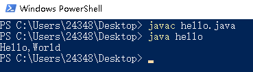

当然也可以不用shell，用开发环境里面自带的编译运行选项

### 数据类型

基本数据类型(八种)：


| 整型  | 占用字节空间大小 | 取值范围             | 默认值 |
| ----- | ---------------- | -------------------- | ------ |
| byte  | 1字节            | -128 ~ 127           | 0      |
| short | 2字节            | -32768 ~ 32767       | 0      |
| int   | 4字节            | -2^31 ~ （2^31） - 1 | 0      |
| long  | 8字节            | -2^63 ~ （2^63） - 1 | 0L     |

| 浮点型 | 占用字节空间大小 | 取值范围         | 默认值 |
| ------ | ---------------- | ---------------- | ------ |
| float  | 4字节            | 2^ -127 ~ 2^ 128 | 0.0F   |
| double | 8字节            | 10^308           | 0.0    |

| 字符型 | 占用字节空间大小 | 取值范围  | 默认值 |
| ------ | ---------------- | --------- | ------ |
| char   | 2字节            | 0 ~ 65535 | ‘\u0’  |

| 布尔型  | 占用字节空间大小 | 取值范围    | 默认值 |
| ------- | ---------------- | ----------- | ------ |
| boolean | 视情况而定       | true、false | false  |


引用数据类型（三种）：
引用数据类型是建立在八大基本数据类型基础之上，包括数组、接口、类。引用数据类型是由用户自定义，用来限制其他数据类型。简单的说，除八大基本类型之外的所有数据类型，都为引用数据类型,所有引用类型的默认值都为 null 。

```java
package value;

public class TestValue {
    public static void main(String[] args) {
        System.out.println("byte型数据的最小值和最大值");
        System.out.println(Byte.MIN_VALUE+" \t"+Byte.MAX_VALUE);

        System.out.println("short型数据的最小值和最大值");
        System.out.println(Short.MIN_VALUE+" \t"+Short.MAX_VALUE);

        System.out.println("int型数据的最小值和最大值");
        System.out.println(Integer.MIN_VALUE+" \t"+Integer.MAX_VALUE);

        System.out.println("long型数据的最小值和最大值");
        System.out.println(Long.MIN_VALUE+" \t"+Long.MAX_VALUE);

        //注意这里浮点型float和double的最小值是最小精度正值，数学意义上的最小值应该是-Float.MAX_VALUE和-Double.MAX_VALUE
        System.out.println("float型数据的最小精度值和最大值");
        System.out.println(Float.MIN_VALUE+" \t"+Float.MAX_VALUE);

        System.out.println("double型数据的最小精度值和最大值");
        System.out.println(Double.MIN_VALUE+" \t"+Double.MAX_VALUE);

        //这里直接输出看不出效果，只能转成int型数据，看它们的Unicode码范围
        System.out.println("char型数据的最小值和最大值");
        System.out.println("\\u"+(int) Character.MIN_VALUE +" \t"+"\\u"+(int)Character.MAX_VALUE);


    }
}
```

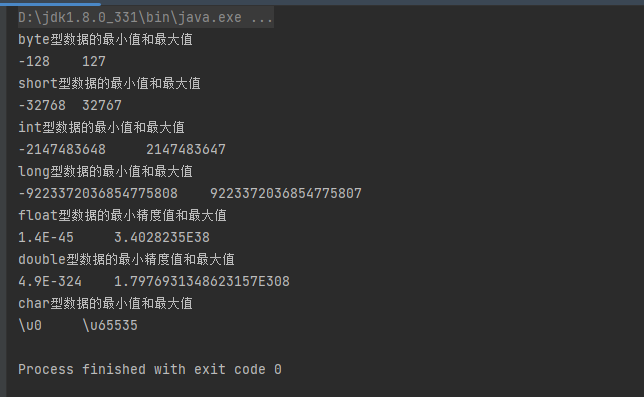

### 类型转换

转化从低级到高级：byte,short,char（三者同级）—> int —> long—> float —> double

- 自动类型转换（隐式类型转换）

  - 从低到高转换，不用显式声明，不用担心数据失真

- 强制类型转换（显式类型转换）

  - 从高到低转换，要进行显式声明，可能会数据失真


```java
    package value;
    
    public class TestValueExchange {
        public static void main(String[] args) {
            byte a0=22;
            System.out.println("byte:"+a0+" 的自动类型转换");
            int a1=a0;
            long a2=a1;
            float a3=a2;
            double a4=a3;
            System.out.printf("int:%d\n",a1);
            System.out.printf("long:%d\n",a2);
            System.out.printf("float:%f\n",a3);
            System.out.printf("double:%f\n",a4);
    
    
            double b0 = 1234567890.0987654321;
            System.out.println("double:"+b0+" 的强制类型转换");
            float b1 = (float) b0;
            long b2 = (long)b0;
            int b3 = (int)b0;
            System.out.println("float:"+b1);
            System.out.println("long:"+b2);
            System.out.println("int:"+b3);
        }
    }
```

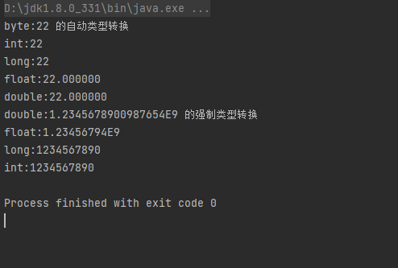

### 运算符

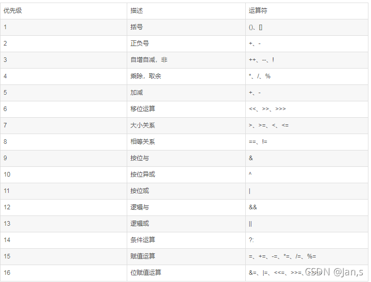

### 代码注释与规范

#### 注释

```java
// 单行注释

/*
	多行注释
*/

/**
	文档注释
*/
```

#### 标识符

Java对各种变量、方法和类等要素命名时使用的字符序列称为标识符

凡是自己可以起名字的地方都叫标识符

定义合法标识符的规则：

**1.由26个英文字母大小写，0-9，_或$组成**

**2.数字不可以开头**

**3.不可以使用关键字和保留字，但是能包括关键字和保留字**

**4.Java中严格区分大小写，长度无限制**

**5.标识符不能包括空格**

**6.取名尽量做到“见名知意”**

一般习惯：

 包名：xxxyyyzzz

 类名、接口名：XxxYyyZzz(**大驼峰**)

变量名、方法名：xxxYyyZzz（**小驼峰**）

常量名：XXX_YYY_ZZZ

### 流程控制

#### 语句

在Java中，一个语句是指一个过程的完整描述，就如流程图的一个环节。

总的来说，java中语句的分类有六类：

①方法调用语句

②表达式语句

③复合语句

④空语句

⑤控制语句

⑥package语句和import语句

#### 流程控制语句

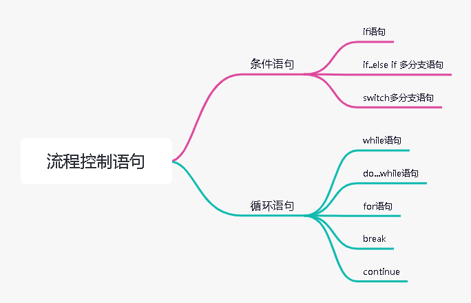

### 技术点

#### 环境变量的配置

- 创建JAVA_HOME系统变量

  值：D:\jdk1.8.0_331

  作用：定义一个变量，供其他地方使用  

- 创建CLASSPATH系统变量

  值：.;%JAVA_HOME%\lib\dt.jar;%JAVA_HOME%\lib\tools.jar;
  用途：告诉jvm要使用或执行的class放在什么路径上，便于JVM加载class文件，.;表示当前路径，tools.jar和dt.jar为类库路径  

- 添加PATH记录

  添加的记录：D:\jdk1.8.0_331\bin；D:\jdk1.8.0_331\jre\bin

  用途：让系统在任何路径下都可以识别java、javac、javap等命令 

- CLASSPATH详解

  - tools.jar  

    ​		工具类库(编译和运行等)，它跟我们程序中用到的基础类库没有关系。我们注意到在Path中变量值bin目录下的各个exe工具的大小都很小，一般都在27KB左右，这是因为它们实际上仅仅相当于是一层代码的包装，这些工具的实现所要用到的类库都在tools.jar中，用压缩软件打开tools.jar,你会发现有很多文件是和bin目录下的exe工具相对性的，查看图一。当然，如果tools.jar的功能只有这些的话，那么我们根本不用把它加入到CLASSPATH变量中，因为bin目录下的工具自己可以完成对这些类库的调用，因此tools.jar应该还有其他的功能。在里面还可以看到有Applet和RMI等相关的文件，因此tools.jar应该还是远程调用等必须的jar包。tools.jar的其他作用可以查看其他资料。        

  - dt.jar  

    ​		运行环境类库，主要是Swing包，这一点通过用压缩软件打开dt.jar也可以看到。如果在开发时候没有用到Swing包，那么可以不用将dt.jar添加到CLASSPATH变量中。  

    ​      CLASSPATH中的类库是由Application ClassLoader或者我们自定义的类加载器来加载的，这里当然不能包括基础类库，如果包括基础类库的话，并用两个不同的自定义类加载器去加载该基础类，那它得到的该基础类就不是唯一的了，这样便不能保证Java类的安全性。        

  - 基本类库和扩展类库rt.jar  

    ​		基本类库是所有的 import java.* 开头的类，在 %JAVA_HOME%\jre\lib 目录下（如其中的 rt.jar、resource.jar ），类加载机制提到，该目录下的类会由 Bootstrap ClassLoader 自动加载，并通过亲委派模型保证了基础类库只会被Bootstrap ClassLoader加载，这也就保证了基础类的唯一性。  

    ​		扩展类库是所有的 import javax.* 开头的类，在 %JAVA_HOME%\jre\lib\ext 目录下，该目录下的类是由Extension ClassLoader 自动加载，不需要我们指定。  
    
    ​		rt.jar 默认就在根classloader的加载路径里面,放在claspath也是多此一举  
    
    
    
    参考文章：[JDK环境变量中dt.jar、tools.jar变量值的作用_kernel的技术博客_51CTO博客](https://blog.51cto.com/u_12843522/2084171)

#### JVM，JDK，JRE的区别

- JVM(Java Virtual Machine Java虚拟机)

  用于运行字节码文件，是Java跨平台的关键，它屏蔽了不同操作系统间的差异，可以让相同的Java程序（相同的字节码文件）在不同的操作系统平台上运行出相同的结果

  
  
- JRE（Java Runtime Environment  Java运行时环境)

  是运行Java已编译程序所必须的软件环境，包含了JVM、Java标准类库，JRE提供给只想运行Java程序的用户使用，不能用于创建新的程序，即不能将Java源代码编译成字节码文件

  

- JDK（Java Development Kit Java开发工具包)

  包含了JRE、编译器以及许多调试、分析等工具软件，它能够创建和编译Java程序
  

如果只想运行Java程序只需安装JRE即可，如果要编写Java程序则需要安装JDK

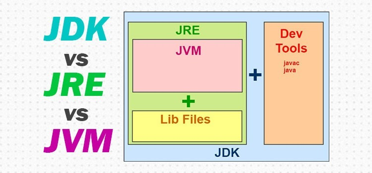

#### JIT（just in time ,即时编译技术）

JIT编译器（just in time 即时编译器），当虚拟机发现某个方法或代码块运行特别频繁时，就会把这些代码认定为(Hot Spot Code 热点代码，为了提高热点代码的执行效率，在运行时，虚拟机将会把这些代码编译成与本地平台相关的机器码，并进行各层次的优化，完成这项任务的正是JIT编译器。

Java的执行过程整体可以分为两个部分，第一步由javac将源码编译成字节码，在这个过程中会进行词法分析、语法分析、语义分析，编译原理中这部分的编译称为前端编译。接下来无需编译直接逐条将字节码解释执行，在解释执行的过程中，虚拟机同时对程序运行的信息进行收集，在这些信息的基础上，编译器会逐渐发挥作用，它会进行后端编译——把字节码编译成机器码，但不是所有的代码都会被编译，只有被JVM认定为的热点代码，才可能被编译。

怎么样才会被认为是热点代码呢？JVM中会设置一个阈值，当方法或者代码块的在一定时间内的调用次数超过这个阈值时就会被编译，存入codeCache中。当下次执行时，再遇到这段代码，就会从codeCache中读取机器码，直接执行，以此来提升程序运行的性能。整体的执行过程大致如下图所示：


#### 逻辑运算符的短路和非短路

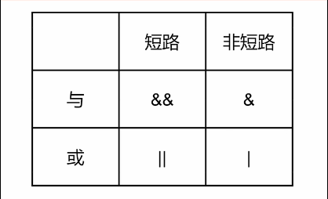

多个表达式结合在一起运算时，若前面的表达式已能得出最终结果，短路运算就不会计算后面的表达式，而非短路运算则无论如何都会执行所有表达式

```java
package operator;

public class Test01 {
    public static void main(String[] args) {
        int a=0;
        int b=0;
        System.out.println("短路");
        if(++a>0||++b>0){
            System.out.println("a:"+a);
            System.out.println("b:"+b);
        }
        System.out.println("非短路");
        a=0;
        b=0;
        if(++a>0|++b>0){
            System.out.println("a:"+a);
            System.out.println("b:"+b);
        }

    }
}
```

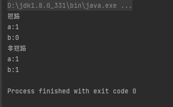

#### 循环标签

给外层循环起个标签，然后可以在内层循环运用标签名直接跳出或继续执行外层循环，换句话说，可以直接在内层循环操作外层循环

```java
package control;

public class Test01 {
    public static void main(String[] args) {
        int i=0;
        int j=0;

        for1:for(i=0;i<100;i++){
            for(j=0;j<100;j++){
               if(i==88&&j==88){
                   break for1;
               }
            }
        }
        System.out.println("i:"+i);
        System.out.println("j:"+j);
    }
}
```

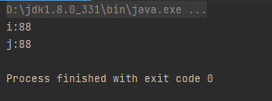

#### 注释后的代码可能会执行

```java
package annotation;

public class Test01 {
    public static void main(String[] args) {
        int a=1;
        int b=1;
        // \u000a a=2;
        // \u000d b=2;
        System.out.println(a);
        System.out.println(b);

        /*
        上面的代码等价于
            int a=1;
            int b=1;
            //
            a=2;
            //
            b=2;
            System.out.println(a);
            System.out.println(b);
         */
    }
}
```

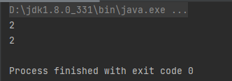

出现这种情况的的关键点就出在注释后面的那两个特殊字符上，那两个字符其实是Unicode字符，分别代表着换行和回车。

Java源代码允许包含Unicode字符，并且在任何词汇翻译前，就会对Unicode进行解码

#### Java中的char为啥要用两个字节

- 字符集

  字符与码点的映射关系，例如ASCII中的（A<--->65）

  | 字符集                                                       | 码点范围 | 涵盖字符                            |
  | ------------------------------------------------------------ | -------- | ----------------------------------- |
  | ASCII（American Standard Code for Information Interchange，美国信息交换标准代码） | 0~127    | 英文大小写，阿拉伯数字，控制字符... |
  | ISO 8859-1（Latin-1）                                        | 0~255    | ASCII，西欧字符                     |
  | GB2312(国标)                                                 |          | 简繁中文，英文...                   |
  | BIG5(五大码)                                                 |          | 繁体中文...                         |
  | GBK(国标扩)                                                  |          | 简繁中文，英文...                   |
  | Unicode（统一码，万国码）                                    | 约14万   | 希望统一全部地区的编码              |

- 字符编码

  码点与计算机二进制字节的映射关系（是字符集在计算机上的二进制存储形式），字符编码中的基础单位叫做代码单元，例如Unicode字符集有UTF-32,UTF-16,UTF-8等几种字符编码

  - UTF-32（直接用四个字节处理，数据与码点一致，缺位补0，代码单元为4字节，缺点浪费空间）	

  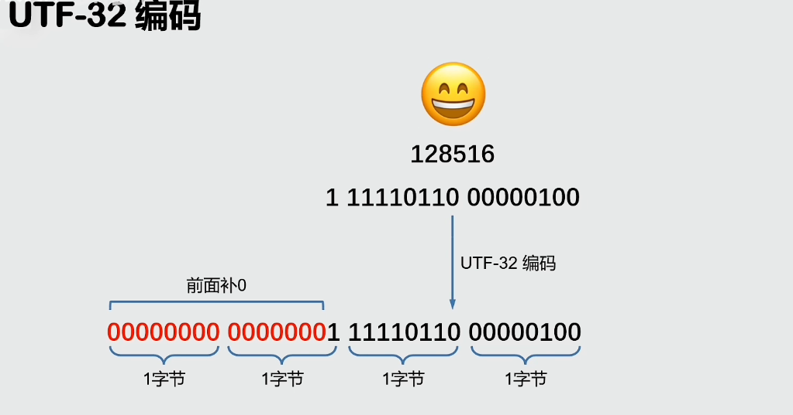

  - UTF-8（将数据按照码点大小分段处理，代码单元为1字节，优点节省资源）

  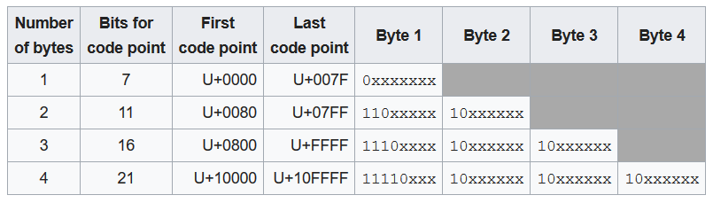

  - UTF-16（）

    码点<65536,直接转为2字节存储

    码点>=65535,要经过运算用4个字节存储，例如

    

- Java中的编码

  Java8中的String，使用UTF-16字符编码，并且使用char数组存储数据

  Java9及以上版本，使用UTF-16和Latin-1混合编码，并且使用byte数组存储数据，但混合编码只是内部实现，并未体现到api上，所以我们依然可以照常使用API（甚至假象内部像Java8一样，只有UTF-16编码）

- char存储的值的含义

  由上可知，char存储的并非一个字符，而是UTF-16下的一个代码单元，对于常用字符（这些字符的码点一般都小于65536），可以只用一个char来表示字符，而对于码点大于65536的字符，则需要用两个连续的char来表示字符，所以咱们用的String.length()和String.chatAt()都是分别计算字符串的代码单元的个数和找到指定位置的代码单元。
  
  ```java
  package string;
  
  public class Test01 {
      public static void main(String[] args) {
          String str="a😊安";
          System.out.println("str字符串代码单元的数量："+str.length());
          System.out.println("str字符串的第二个代码单元："+str.charAt(1));
  
          System.out.println("str字符串中字符的数量："+str.codePointCount(0,str.length()));
          //System.out.println(str.codePointAt(1)); 只能输出码点，无法显示码点对应的字符，若要显示字符，需按下面的操作处理
          int codepoint[]=str.codePoints().toArray();         //字符串转码点数组
          String str2=new String(codepoint,1,1);  //码点数组转字符串
          System.out.println("str字符串的第二个字符："+str2);
      }
  }
  ```
  
  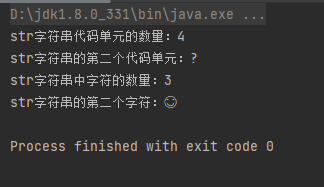

## 数组

### 一维数组

- 创建数组
  - 通过new关键字创建
  - 通过花括号{ }创建
- 遍历数组（for语句的两种使用方式）

```java
public class Test01 {
    public static void main(String[] args) {
        //创建一维数组
        //1.使用new创建数组，整数数组里的元素值为默认值0
        int a[] = new int[5];
        //2.使用{}创建数组，值可以自定义
        int b[] = {1,2,3,4,5};

        //遍历一维数组
        System.out.println("遍历数组a");
        for (int i = 0; i <a.length ; i++) {
            System.out.print(a[i]+" ");
        }
        System.out.println();

        System.out.println("遍历数组b");
        for (int i = 0; i <b.length ; i++) {
            System.out.print(b[i]+" ");
        }
        System.out.println();

        //另一种遍历方式
        System.out.println("使用另一种遍历方式");
        System.out.println("遍历数组a");
        for(int i:a) {
            System.out.print(i + " ");
        }
        System.out.println();
        System.out.println("遍历数组b");
        for(int i:b) {
            System.out.print(i + " ");
        }

    }
}
```
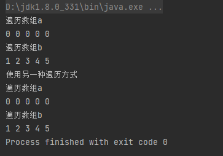
### 二维数组

```java
package JavaArray;

public class Test02 {
    public static void main(String[] args) {
        //创建二维数组
        int a[][] = new int[5][4];
        int b[][] ={{1,2,3},{4,5},{6,7,8,9}};

        //向a数组存值
        for (int i = 0; i < a.length; i++) {
            for(int j=0;j<a[i].length;j++){
                a[i][j]=i;
            }
        }

        //遍历两个数组
        System.out.println("数组a");
        for (int i = 0; i < a.length; i++) {
            for(int j=0;j<a[i].length;j++){
                System.out.print(a[i][j]+"\t");
            }
            System.out.println();
        }
        System.out.println();
        
        System.out.println("数组b");
        for (int i = 0; i < b.length; i++) {
            for(int j=0;j<b[i].length;j++){
                System.out.print(b[i][j]+"\t");
            }
            System.out.println();
        }
        
    }
}
```

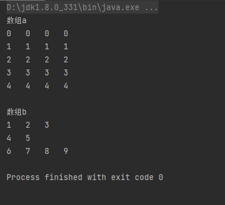

### 数组的基本排序算法

```java
package JavaArray;

import java.util.Arrays;

public class ArraySort {

    //冒泡排序
    public static void BubbSort(int a[]) {
        for (int i = 0; i < a.length; i++) {
            for (int j = i + 1; j < a.length; j++) {
                if (a[j] < a[i]) {
                    int x;
                    x = a[i];
                    a[i] = a[j];
                    a[j] = x;
                }
            }
        }
    }
    //选择排序
    public static void ChoiceSort(int a[]) {
        for (int i = 0; i < a.length; i++) {
            int min=i;
            for(int j=i;j< a.length;j++){
                if(a[j]<a[min]){
                    min=j;
                }
            }
            int x;x=a[i];a[i]=a[min];a[min]=x;
        }
    }

    //插入排序
    public static void InsertSort(int a[]){
        for (int i = 1; i < a.length-1; i++) {
            //遍历后面的数据，将数据插入到序号为0~i的队列中
            int copy=a[i+1];
            int min=0;
            int max=i;
            int mid=(min+max)/2;
            //使用二分查找，查找a[i+1]的合适位置

            //剔除插入值为最大值的情况
            if(a[i+1]>=a[i]){
                continue;
            }

            //在顺序队列中寻找合适的（mid,mid+1）空隙，并且保证（mid，mid+1）这个空隙存在在顺序队列中，为了保证这个空隙存在，我们必须要保证插入的数据不是有序队列的最大值和最小值（即这两种情况要进行其他处理）
            //bug1:插入值为最小值，会出现min==0，max==-1,mid==（0+(-1))/2==0的死循环
            //bug2:插入值为最大值，mid溢出队列范围，会出现重复数据破坏原有数据
            //所以无论从逻辑上还是结果上，我们都应编写另外的代码剔除插入值为顺序队列最大值和最小值的情况
            while(!(a[i+1]>=a[mid]&&a[i+1]<=a[mid+1])){

                //剔除插入值为最小值的情况
                if(a[i+1]<=a[0]){
                    mid=-1;
                    break;
                }
                mid=(min+max)/2;
                if(a[i+1]>a[mid]){
                    min=mid+1;
                }
                if (a[i+1]<a[mid]) {
                    max=mid-1;
                }
            }
            //找到合适位置后，为这个位置留下插入空隙，通过从后往前赋值实现
            for(int j=i;j>=mid+1;j--){
                a[j+1]=a[j];
            }
            //插入原a[i+1]的数据
            a[mid+1]=copy;
        }
    }

    public static void main(String[] args) {
        int a[] = {7, 9, 8, 3, 1, 4, 2, 5, 0, 6};
        int b[] = Arrays.copyOf(a, a.length);
        int c[] = Arrays.copyOf(a, a.length);

        System.out.println("冒泡排序");
        System.out.println(Arrays.toString(a));
        BubbSort(a);
        System.out.println(Arrays.toString(a));

        System.out.println("选择排序");
        System.out.println(Arrays.toString(b));
        ChoiceSort(b);
        System.out.println(Arrays.toString(b));

        System.out.println("插入排序");
        System.out.println(Arrays.toString(c));
        InsertSort(c);
        System.out.println(Arrays.toString(c));

    }
}
```

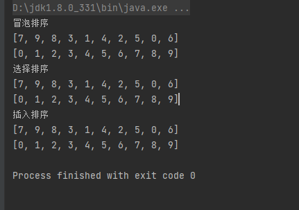

### 技术点

#### 数组是不是对象

在 Java 中，只要是能够使用 new 关键字创建的结构，其实都是类。而 Java 中得数据就可以通过 new 关键字进行创建。从这个来看，其实数组就是一个类。而且在存储角度来说，Java 的基本数据类型的值都是直接存储在虚拟机栈中的，而 Java 数组则是存储在堆内存的。因此 Java 数组虽然我们经常使用，但是其本质上就是一个类，而且只有类的对象才能够被赋予 null 这个值。

```java
package JavaArray;

public class Test03 {
    public static void main(String[] args) {
        int a[]=new int[3];
        System.out.println(a instanceof Object);
        Object o = a;
    }
}
```

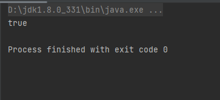

#### 可变长参数

可变长参数又叫不定长参数，当我们不确定参数的个数时，就可以用三个点 *"..."*来声明可变参数，它可以接收零个或者多个实参，在方法内部，可变长参数的使用方法和数组完全一致，**注意必须要保证可变参数是方法参数列表中的最后一个参数**，当函数重载时，会优先匹配固定参数的方法。

```java
package JavaArray;

import java.util.Arrays;

public class Test04 {
    public static void test(int a,int ...b){
        System.out.println("参数1："+a);
        System.out.println("参数2："+Arrays.toString(b));
    }
    public static void main(String[] args) {

        test(1,2,3,4,5,6,7,8,9,0);
    }
}
```

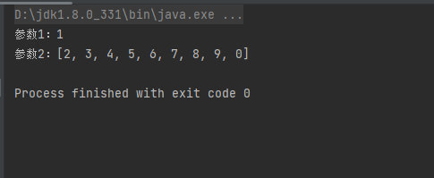

## 字符串

### String

**String类型的创建**

```java
package string;

public class Test02 {
    public static void main(String[] args) {
        //创建字符串
        String a = "abcd";
        String b = new String("efgh");
        System.out.println(a);
        System.out.println(b);
        
    }
}
```

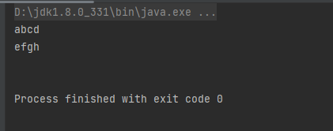

**String的常用方法**

```java
package string;

public class Test03 {
    public static void main(String[] args) {
        String str =" A安aBCa1234😀 ";

        System.out.println("\t\t显示字符串的字符数量");
        System.out.println("\t\t显示特定位置的字符");
        System.out.println(str.codePointCount(0,str.length()));
        int []codequeue= str.codePoints().toArray();
        System.out.println(new String(codequeue,11,1));

        System.out.println("\t\t显示字符串的代码单元数量");
        System.out.println("\t\t显示特定位置的代码单元");
        System.out.println(str.length());
        System.out.println(str.charAt(11));
        //字符串拼接(返回拼接后的字符串，而不是改变原有字符串)
        System.out.println("\t\t拼接字符串");
        System.out.println(str.concat("X"));
        System.out.println(str);

        //字符串查找
        System.out.println("\t\t字符串查找");
        System.out.println(str.contains("😀"));
        System.out.println(str.indexOf("a"));
        System.out.println(str.lastIndexOf("a"));

        //字符串比较
        System.out.println("\t\t字符串比较");
        System.out.println(str.compareTo("B"));
        //字符串变形
        System.out.println("\t\t字符串变形");
        System.out.println(str.toLowerCase());
        System.out.println(str.toUpperCase());
        System.out.println(str.trim());

        //字符串截取
        System.out.println("\t\t字符串截取");
        System.out.println(str.substring(2,6));
        //字符串转换
        System.out.println("\t\t字符串转换");
        System.out.println(String.valueOf(123456));
        //...
    }
}
```

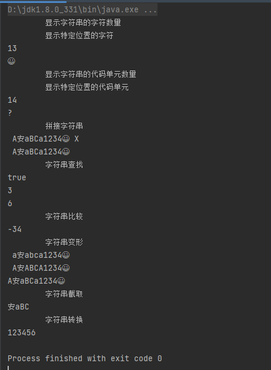

字符串类时一个比较特殊的类，他是Java中唯一重载运算符的类！（Java不支持运算符重载，String是特例）

String的对象直接支持使用+或+=运算符来进行拼接，并形成新的String对象！（String的字符串是不可变的）

```java
package string;

public class Test04 {
    public static void main(String[] args) {
        String a="aaaa4";
        String b="bbbb4";
        System.out.println(a+=b);
        System.out.println(a+b);
    }
}
```

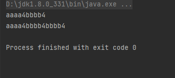

### StringBuilder

大量进行字符串的拼接似乎不太好，编译器是很聪明的，String的拼接有可能会被编译器优化为StringBuilder来减少对象创建（对象频繁创建时很费时间同时很占内存的）

StringBuilder也是一个类，但是它能够存储可变长度的字符串！

```java
package string;

public class Test05 {
    public static void main(String[] args) {
        StringBuilder builder = new StringBuilder();
        builder                     //因为append返回StringBuilder对象本身所以支持链式调用
                .append("1")
                .append("2")
                .append("3")
                .append("4");
        String str =builder.toString();
        System.out.println(str);
    }
}
```

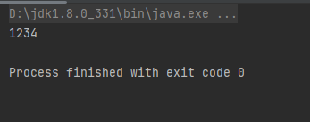

### 技术点

#### String类型编码转换

| 相关方法                                |                                                              |
| --------------------------------------- | ------------------------------------------------------------ |
| String.getBytes()                       | 获取当前string表示的字符，在使用系统默认的字符集(关于系统默认的字符集后面详细讨论)时，所映射的[二进制](https://so.csdn.net/so/search?q=二进制&spm=1001.2101.3001.7020)数据。不同的默认字符集生成的二进制数据是不同的，解码时只有使用与该默认字符集相同的字符集才能获得正确的字符。 |
| String.getBytes(String charset)         | 获取当前string表示的字符，在使用指定字符集时，所映射的二进制数据。传入不同的字符集生成的二进制数据是不同，解码时只有使用相同的字符集才能获得正确的字符。 |
| new String(byte[] data)                 | 使用系统默认的字符集，将给定的二进制数据映射为相应的字符，并构造成一个string。如果系统默认的字符集不变那么可以通过String.getBytes()或String.getBytes(Charset.defaultCharset().displayName())来还原原来的二进制数据。 |
| new String(byte[] data, String charset) | 使用给定的字符集，将给定的二进制数据映射为相应的字符，并构造成一个string。只有通过传入相同的字符集才能还原原来的二进制数据，String.getBytes("charset")。 |

[一个编码Bug的例子](#System类)

#### 引用拷贝、浅拷贝、深拷贝

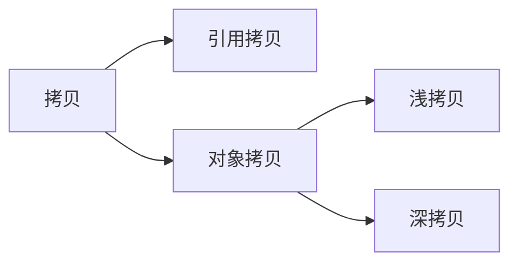

- 引用拷贝

  引用拷贝会生成一个新的对象引用地址，但是两个最终指向依然是同一个对象

  引用类型之间直接使用**=**赋值，即可实现引用拷贝

  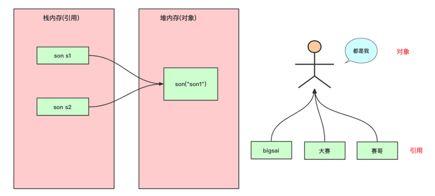

- 浅拷贝

  浅拷贝会创建一个新对象，新对象和原对象本身没有任何关系，**新对象和原对象不等，但是新对象的属性和老对象相同**。

  如何实现浅拷贝呢？也很简单，**就是在需要拷贝的类上实现Cloneable接口并重写其clone()方法**。

  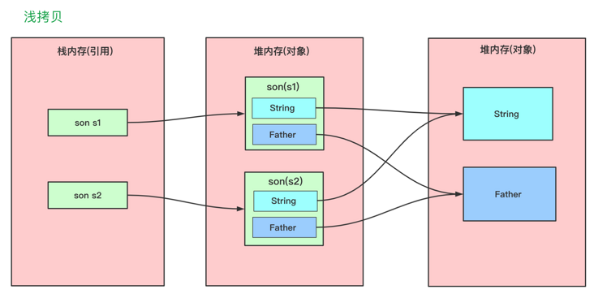

- 深拷贝

  深拷贝：**在对引用数据类型进行拷贝的时候，创建了一个新的对象，并且复制其内的成员变量。**

  在具体实现深拷贝上，这里提供两个方式，重写clone()方法和序列法。

  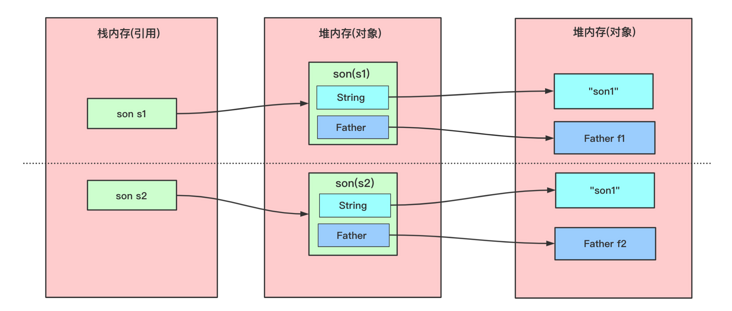

  参考文章：[5张图搞懂Java引用拷贝、深拷贝、浅拷贝 - SegmentFault 思否](https://segmentfault.com/a/1190000038523408)

#### 字符串常量池

```java
        String a = "abcd";
        String b = new String("efgh");
```

使用第一种创建方式（使用双引号直接创建String对象的方式）称为字面量，这并不是语法糖，两种创建方式是有区别的。

如果我们用new关键字创建String对象时，即使属性一样，也会创建多个对象，Java为了提高使用字符串的效率，引入了字符串常量池，字符串常量池位于堆中。

当我们使用字面量创建字符串时，字符串常量池会将其对象引用进行保存，后面如果创建重复的字面量，就会直接将字符串中的引用进行返回。

#### String不可变

不可变指的是，一个对象创建后，如果不能修改这个对象的属性，则这个对象是不可变的

String源码片段

```java
public final class String
    implements java.io.Serializable, Comparable<String>, CharSequence {
    /** The value is used for character storage. */
    private final char value[];
```

String内部是基于char数组实现的，value数组被final修饰，表示该数组不能改变指向，并不能保证value数组中的内容不能被改变，真正让String不可变的原因是被private关键字修饰，不能从String方法以外的方式访问value，并且String没提供给修改value的方法。同时String这个类被final修饰，表示该类不能被继承，从而避免子类覆盖父类行为的可能。

String不可变是字符串常量池存在的前置条件，同时String不可变还会保证哈希码也不会变，可以保证其他使用String哈希码的方法的安全性。

#### String、StringBuilder和StringBuffer

**StringBuilder**

String是不可变的，如果我们需要对字符串进行大量操作，就必然会产生许多新对象从而导致性能低下，为了解决这一问题，Java推出StringBuilder这个可变字符串类型

StringBuilder源码片段

```java
public final class StringBuilder
    extends AbstractStringBuilder
    implements Serializable, CharSequence
{

    /** use serialVersionUID for interoperability */
    static final long serialVersionUID = 4383685877147921099L;

    /**
     * Constructs a string builder with no characters in it and an
     * initial capacity of 16 characters.
     */
    public StringBuilder() {
        super(16);
    }
    //....
     @Override
    public StringBuilder append(String str) {
        super.append(str);
        return this;
    }

    //....
```

抽象类AbstractStringBuilder源码片段

```java
abstract class AbstractStringBuilder implements Appendable, CharSequence {
    /**
     * The value is used for character storage.
     */
    char[] value;

    /**
     * The count is the number of characters used.
     */
    int count;
```

但是StringBuilder是线程不安全的

```java
package string;

public class Test06 {

    public static void main(String[] args) throws InterruptedException {
        StringBuilder sb = new StringBuilder();
        for (int i = 0; i < 10; i++) {
            new Thread(() -> {
                for (int j = 0; j < 1000; j++) {
                    sb.append("a");
                }
            }).start();
        }
        // 睡眠确保所有线程都执行完
        Thread.sleep(2000);
        System.out.println(sb.length());
    }

}

```

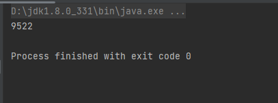

**StingBuffer**

相关文章：[为什么StringBuilder是线程不安全的？ - 腾讯云开发者社区-腾讯云 (tencent.com)](https://cloud.tencent.com/developer/article/1700344)

StringBuffer 在StringBuilder的基础上在相关方法上加上了锁以保证线程安全（正因为加了锁所以性能不如StringBuilder，所以在不考虑线程安全的基础上，最好用StringBuilder）

StringBuffer源码片段

```java
public final class StringBuffer
    extends AbstractStringBuilder
    implements Serializable, CharSequence
{

    /**
     * A cache of the last value returned by toString. Cleared
     * whenever the StringBuffer is modified.
     */
    private transient char[] toStringCache;

    /** use serialVersionUID from JDK 1.0.2 for interoperability */
    static final long serialVersionUID = 3388685877147921107L;

    /**
     * Constructs a string buffer with no characters in it and an
     * initial capacity of 16 characters.
     */
    public StringBuffer() {
        super(16);
    }
//....    
@Override
public synchronized StringBuffer append(String str) {
    toStringCache = null;
    super.append(str);
    return this;
}
//....
```

```java
package string;

public class Test06 {

    public static void main(String[] args) throws InterruptedException {
        StringBuffer sb = new StringBuffer();
        for (int i = 0; i < 10; i++) {
            new Thread(() -> {
                for (int j = 0; j < 1000; j++) {
                    sb.append("a");
                }
            }).start();
        }
        // 睡眠确保所有线程都执行完
        Thread.sleep(2000);
        System.out.println(sb.length());
    }

}
```

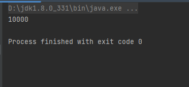

#### StringJoiner

为了方便日常使用过程中字符串集合的拼接，出现了StringJoiner，Java标准库中的拼接操作（String.join()方法，Stream流中常用的joining操作等）其实就用到了StringJoiner。

```java
package string;

import java.util.Arrays;
import java.util.StringJoiner;
import java.util.stream.Collectors;

public class Test07 {
    public static void main(String[] args) {
        String []stings = {"Hello","World","!!!"};
        StringJoiner sj = new StringJoiner(",","[","]");//设置分割符，开头和结尾的字符
        for(String s:stings){
            sj.add(s);
        }
        System.out.println(sj);

        //String中的join方法
        System.out.println(String.join(",",stings));

        //Stream流中的joining操作
        System.out.println(Arrays.stream(stings).collect(Collectors.joining(",")));
    }
}
```

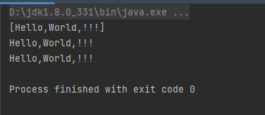


## 常用类

### 基本类型包装类

**Java中的非对象**

八大基本数据类型都不是对象，这与Java的核心理念，**一切即对象**相冲，所以引入基本数据类型的**包装类**来使这个体系完整。基本数据类型转为包装类的过程，称为**装箱**，反之，称为**拆箱**，装箱和拆箱无需我们手动进行，Java会自动帮忙做好。

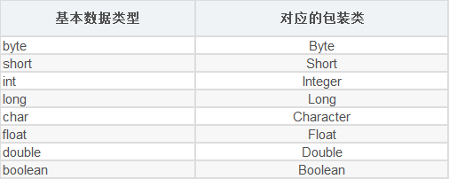

```java
Integer a =8; //装箱
int b =a ;//拆箱
```

**装箱拆箱原理&包装类型缓存池**

**缓存池**（又叫常量池）是事先存储一些常用数据用以提高性能节省空间的一种技术，大部分的包装类型都实现了缓存池，**当我们在自动装箱过程中，如果基本类型的值处在缓存的范围内，则不会重新创建对象，而是复用缓冲池中已事先创建好的对象**。

每个包装类都默认缓存了点常用的对象，如下表

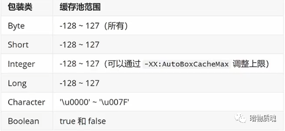

```java
package pack;

public class Test01 {
    public static void main(String[] args) {
        Integer a=8;
        Integer b=8;
        System.out.println(a==b);//利用默认缓存

        Integer c = new Integer(8);//没有利用缓存，直接new对象
        System.out.println(a==c);

        a=128;
        b=128;
        System.out.println(a==b);//超出默认缓存范围
        
    }
}
```

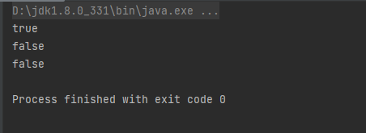

使用**==**和**valueOf**方法都会进行默认缓存的判断，使用**new**关键字不会创建包装类则不会使用缓存

使用自动装箱实际上是用了valueOf方法，使用自动拆箱实际上是使用了xxxValue方法 

以下是包装类Integer常用的方法，其他包装类类似

```java
package pack;

public class Test02 {
    public static void main(String[] args) {

        //包装类的赋值
        System.out.println("包装类赋值");
        Integer a = new Integer(200);
        System.out.println(a);
        a =8;                   //自动装箱（内部调用了valueOf）
        System.out.println(a);
        a=Integer.valueOf(9); //使用了变量池
        System.out.println(a);

        //包装类的拆箱
        System.out.println("包装类拆箱");
        System.out.println(a.intValue());
        System.out.println(a.floatValue());
        System.out.println(a.byteValue());
        System.out.println(a.shortValue());
        System.out.println(a.longValue());
        System.out.println(a.doubleValue());

        System.out.println("解析字符串");
        a=Integer.parseInt("123456");//解析字符串
        System.out.println(a);

        //封装了的方法
        System.out.println("测试常用方法");
        System.out.println(Integer.min(100, 200));
        System.out.println(Integer.max(100, 200));
        System.out.println(Integer.sum(100, 200));
        System.out.println(Integer.compare(100, 200));
    }
}
```

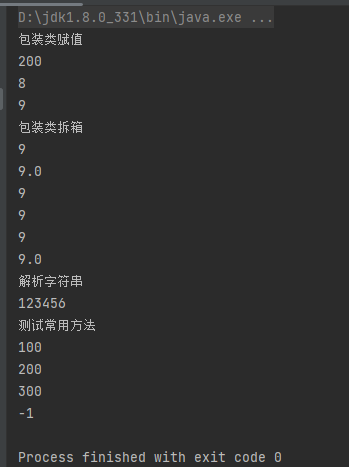

### 数字类

**Math类**

```java
package math;

public class Test01 {
    public static void main(String[] args) {
        //指数函数方法
        System.out.println("指数函数方法");
        System.out.println(Math.sqrt(25));
        System.out.println(Math.pow(5,2));
        //取整方法
        System.out.println("去整方法");
        System.out.println(Math.ceil(4.5));//向上取整
        System.out.println(Math.floor(4.5));//向下取整
        System.out.println(Math.round(4.6111111));//四舍五入为整数
        //最大值、最小值、绝对值方法
        System.out.println("最大值、最小值、绝对值");
        System.out.println(Math.max(4,5));
        System.out.println(Math.min(4,5));
        System.out.println(Math.abs(-5));
        //三角函数方法
        System.out.println("三角函数方法");
        System.out.println(Math.sin(Math.PI/2));
        System.out.println(Math.cos(0));
        System.out.println(Math.tan(Math.PI/4));
    }
}
```

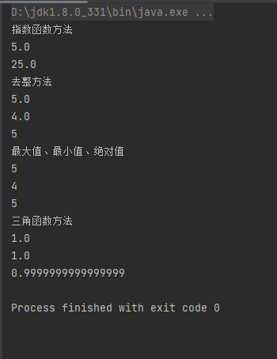

**Random类**

Java存在两个random函数，一个是Math类下的，一个是Random类下的

- java.lang.Math下的随机方法

调用这个Math.random()函数能够返回带正号的double值，该值大于等于0.0且小于1.0，即取值范围是[0.0,1.0)的左闭右开区间，返回值是一个伪随机选择的数，在该范围内（近似）均匀分布。

下面是Java.util.Random()方法摘要：

| java.util.Random中的随机方法 |                                                              |
| ---------------------------- | ------------------------------------------------------------ |
| protected int next(int bits) | 生成下一个伪随机数。                                         |
| boolean nextBoolean()        | 返回下一个伪随机数，它是取自此随机数生成器序列的均匀分布的boolean值 |
| void nextBytes(byte[] bytes) | 生成随机字节并将其置于用户提供的 byte 数组中                 |
| double nextDouble()          | 返回下一个伪随机数，它是取自此随机数生成器序列的、在0.0和1.0之间均匀分布的 double值。 |
| float nextFloat()            | 返回下一个伪随机数，它是取自此随机数生成器序列的、在0.0和1.0之间均匀分布float值 |
| double nextGaussian()        | 返回下一个伪随机数，它是取自此随机数生成器序列的、呈高斯（“正态”）分布的double值，其平均值是0.0标准差是1.0 |
| int nextInt()                | 返回一个伪随机数，它是取自此随机数生成器序列的、在（包括和指定值（不包括）之间均匀分布的int值 |
| long nextLong()              | 返回下一个伪随机数，它是取自此随机数生成器序列的均匀分布的 long 值。 |
| void setSeed(long seed)      | 使用单个 long 种子设置此随机数生成器的种子。                 |

```java
package random;

import java.util.Random;

public class Test01 {
    public static void main(String[] args) {
        System.out.println("Math类下的随机数范围默认（0~1）");
        System.out.println(Math.random());

        System.out.println("Random类下的方法");
        Random r1 = new Random(10);//Random需要填入种子参数，系统会根据种子生成伪随机数,不填参数默认种子为当前的时间戳
        Random r2 = new Random(10);//对于相同的Random对象，生成的随机数序列是一致的
        for (int i = 0; i < 5; i++) {
            System.out.print(r1.nextInt(10)+"\t");//
        }
        System.out.println();for (int i = 0; i < 5; i++) {
            System.out.print(r2.nextInt(10)+"\t");
        }
        System.out.println();
        System.out.println("几个例子");
        //生成[0,1.0)区间的小数：
        System.out.println(r1.nextDouble());
        //生成[0,5.0)区间的小数：
        System.out.println(r1.nextDouble()*5);
        //生成[1,2.5)区间的小数：
        System.out.println(r1.nextDouble()*1.5+1);
        //生成-2^31到2^31-1之间的整数：
        System.out.println(r1.nextInt());

        //生成[0,10)区间的整数：
        System.out.println(r1.nextInt(10));//方法一
        System.out.println(Math.abs(r1.nextInt()%10));//方法二


    }
}
```

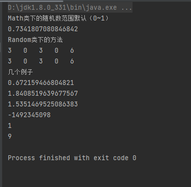

**DecimalFormat类**

DecimalFormat用于格式化十进制数字

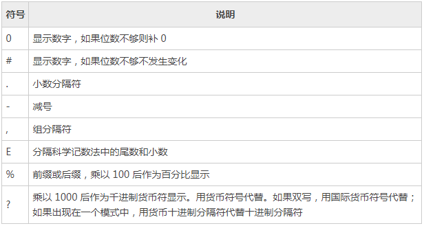

```java
import java.text.DecimalFormat;

public class decimalformat {
    public static void main(String[] args) {
        String str ="00000.####";
        DecimalFormat decimalFormat = new DecimalFormat(str);
        double value =12.1500;
        System.out.println(value+"\t"+str+"\t"+decimalFormat.format(value));

        str = "00000.0##kg";
        decimalFormat.applyPattern(str);
        value = 123456.789;
        System.out.println(value+"\t"+str+"\t"+decimalFormat.format(value));

        str = "0.0kg";
        decimalFormat.applyPattern(str);
        value = 123456.789;
        System.out.println(value+"\t"+str+"\t"+decimalFormat.format(value));

        str = "0.00%";
        decimalFormat.applyPattern(str);
        value = 0.789666;
        System.out.println(value+"\t"+str+"\t"+decimalFormat.format(value));

        System.out.println("分组");
        decimalFormat.setGroupingUsed(true);    //启用分组
        decimalFormat.setGroupingSize(4);       //设置分组
        str = "";
        decimalFormat.applyPattern(str);
        value = 123456789;
        System.out.println(value+"\t"+str+"\t"+decimalFormat.format(value));

    }
}
```

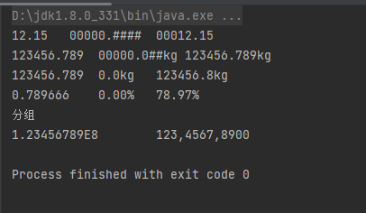

0和#对于小数点前的数字会保证显示完全部数字再与模板进行对比修改，而对于小数点后的数字和严格匹配位数（即如果小数点后的#和0的数量低于原数据的数量，那么原数据小数点后的位数会丢失）

```java
package decimalformat;
import java.text.DecimalFormat;

public class Test02 {
    public static void main(String[] args) {
        String str ="0.0";
        DecimalFormat decimalFormat = new DecimalFormat(str);
        double value =123.123;
        System.out.println(value+"\t"+str+"\t"+decimalFormat.format(value));

        str = "00.00";
        decimalFormat.applyPattern(str);
        value =123.123;
        System.out.println(value+"\t"+str+"\t"+decimalFormat.format(value));

        str = "000.000";
        decimalFormat.applyPattern(str);
        value =123.123;
        System.out.println(value+"\t"+str+"\t"+decimalFormat.format(value));

        str = "0000.0000";
        decimalFormat.applyPattern(str);
        value =123.123;
        System.out.println(value+"\t"+str+"\t"+decimalFormat.format(value));

        str = "#.#";
        decimalFormat.applyPattern(str);
        value =123.123;
        System.out.println(value+"\t"+str+"\t"+decimalFormat.format(value));

        str = "##.##";
        decimalFormat.applyPattern(str);
        value =123.123;
        System.out.println(value+"\t"+str+"\t"+decimalFormat.format(value));

        str = "###.###";
        decimalFormat.applyPattern(str);
        value =123.123;
        System.out.println(value+"\t"+str+"\t"+decimalFormat.format(value));

        str = "####.####";
        decimalFormat.applyPattern(str);
        value =123.123;
        System.out.println(value+"\t"+str+"\t"+decimalFormat.format(value));


    }
}
```

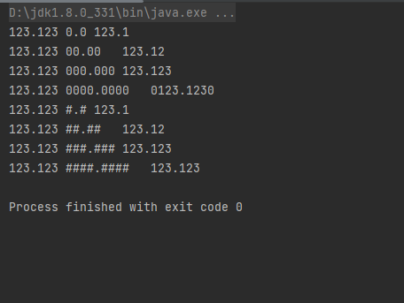

**BigInteger类**

BigInteger类的数字范围较Integer类的数字范围要大的多，BigInteger支持任意精度的整数，也就是说BigInteger可以准确地表示任何大小的整数值而不会丢失信息。

```java
package bigdecimal;

import java.math.BigInteger;

public class Test01 {
    public static void main(String[] args) {
        BigInteger a = new BigInteger("4444444444445");
        BigInteger b = new BigInteger("2222222222222");
        System.out.println("a+b:"+a.add(b));
        System.out.println("a-b:"+a.subtract(b));
        System.out.println("a*b:"+a.multiply(b));
        System.out.println("a/b:"+a.divide(b));
        System.out.println("a//b:"+a.divideAndRemainder(b)[1]);
        System.out.println("a^2:"+a.pow(2));
        System.out.println("-a:"+a.negate());

    }
}
```

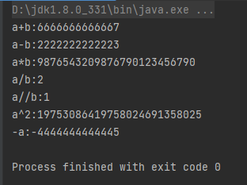

**BigDecimal类**

BigInteger和BigDecimal类都可以实现大数字的运算，不同的是BigDecimal类加入了小数概念，这个类型适合要求数字精度较高的商业计算中，可以用它来精确计算货币值。

```java
package bigdecimal;

import java.math.BigDecimal;

public class Test02 {
    public static void main(String[] args) {
        //BigDecimal的两种构造方法
        BigDecimal a = new BigDecimal("10");
        BigDecimal b = new BigDecimal(3);

        System.out.println("a+b:"+a.add(b));
        System.out.println("a-b:"+a.subtract(b));
        System.out.println("a*b:"+a.multiply(b));

        //BigDecimal的除法是最复杂的，因为在除不尽的情况下，商小数点后的末位的处理是需要考虑的
        /*
            除法有三个参数：除数，商的小数点后精确的位数，近似处理模式

         */
        //设小数点后要保留的最后一位为p
        //设小数点后要保留的最后一位的下一位为p+
        System.out.println("ROUND_Up模式 \t\ta/b:"+a.divide(b,2,BigDecimal.ROUND_UP));            //p+ 不为0，p=p+1
        System.out.println("ROUND_DOWN模式\t\ta/b:"+a.divide(b,2,BigDecimal.ROUND_DOWN));         //无视p+的影响     ，相当于截取
        System.out.println("ROUND_CEILING模式\ta/b:"+a.divide(b,2,BigDecimal.ROUND_CEILING));     //商为正数，按UP模式处理；商为负数，按DOWN模式处理，这样处理近似值会大于等于实际值
        System.out.println("ROUND_FLOOR模式  \ta/b:"+a.divide(b,2,BigDecimal.ROUND_FLOOR));       //商为正数，按DOWN模式处理；商为负数，按UP模式处理，这样处理近似值会小于等于实际值
        System.out.println("ROUND_HALF_UP模式 \t\ta/b:"+a.divide(b,2,BigDecimal.ROUND_HALF_UP));      //相当于四舍五入
        System.out.println("ROUND_HALF_DOWN模式 \t\ta/b:"+a.divide(b,2,BigDecimal.ROUND_HALF_DOWN));  //相当于五舍六入
        System.out.println("ROUND_HALF_EVEN模式 \t\ta/b:"+a.divide(b,2,BigDecimal.ROUND_HALF_EVEN));  //p为奇数，四舍五入;p为偶数，五舍六入


    }
}
```

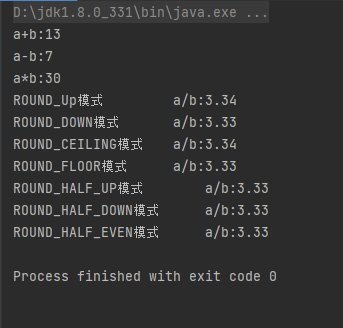

### 日期类

**Date类**  


**Calendar类**

**java.time下 的日期类**

### Scanner类

与C语言不同，Java从控制台中读出用户输入的值，用到的不是一行就可以直接实现的代码，而是由一个叫Scanner的类来实现的

```java
package commonclass;

import java.util.Scanner;

public class Test02 {
    public static void main(String[] args) {
        Scanner sc = new Scanner(System.in);

        System.out.print("输入一个字符串：");
        sc.next();

        System.out.print("输入一个int：");
        sc.nextInt();

        System.out.print("输入一个long：");
        sc.nextLong();

        System.out.print("输入一个float：");
        sc.nextFloat();

        System.out.print("输入一个字符串: ");  //最后一个字符串无法输入，程序直接就结束了
        sc.nextLine();
        
        sc.close();
    }
}

```

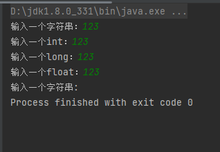

为了了解上面出现最后一个字符串无法输入的原因，我们需要了解下next()和nextLine()的区别

​	next()方法在读取内容时，会过滤掉有效字符前面的无效字符，对输入有效字符之前遇到的空格键、Tab键或Enter键等结束符，next()方法会自动将其过滤掉；只有在读取到有效字符之后，next()方法才将其后的空格键、Tab键或Enter键等视为结束符，同时也不会吸收结束符；所以next()方法不能得到带空格的字符串。

​	nextLine()方法字面上有扫描一整行的意思，它的结束符只能是Enter键，同时还会吸收这个Enter键，nextLine()方法返回的是Enter键之前没有被读取的所有字符，它是可以得到带空格的字符串的。

像next()方法一样，nextFloat()方法也不会吸收结束符，而代码中的结束符恰好是enter，enter也是nextLine() 方法的结束符，该方法检测到结束符后直接识别输入完毕，所以导致最后一个字符串无法输入。

处理方法：

```java
sc.nextFloat();

sc.nextLine();//吸收前面的enter
System.out.print("输入一个字符串: ");  //最后一个字符串无法输入，程序直接就结束了
sc.nextLine();

sc.close();
```

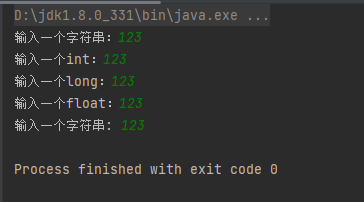

### System类

System类是JDK中提供的系统类，该类用final修饰不允许被继承，System类提供了很多系统层面的操作方法，我们重点了解常用的输出和计时操作

```java
package commonclass;

import java.util.Date;

public class Test01 {
    public static void main(String[] args) {
        long start = System.currentTimeMillis();

        System.out.print("测试输出1");
        System.out.println("测试输出2");
        System.out.printf("测试输出%d%s",3,new String("字符串"));
        System.out.println();//换行

        Date date = new Date();
        System.out.print(date+"与1970-1-01 00:00:00.000相比已过去"+System.currentTimeMillis()+"ms");

        long end = System.currentTimeMillis();

        System.out.println();//换行
        System.out.println("这个程序运行消耗的时间大概为"+(end-start)+"ms");

    }
}
```

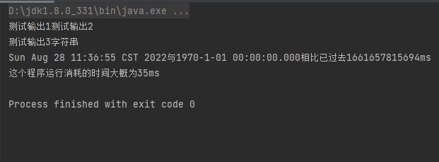

### Runtime类

Runtime是JDK提供的运行时类，该类为Java程序提供了与当前运行环境相连接的一个通道，Java程序可以利用该类对当前的运行环境进行一些简单的操作

- 执行本地命令

  ```java
  package commonclass;
  
  import java.io.BufferedReader;
  import java.io.IOException;
  import java.io.InputStream;
  import java.io.InputStreamReader;
  import java.nio.charset.StandardCharsets;
  
  public class Test04 {
      public static void main(String[] args) {
          try {
              Runtime run = Runtime.getRuntime();
              Process process = run.exec("ipconfig");
  //            BufferedReader br = new BufferedReader(new InputStreamReader(process.getInputStream()));
  //            String str = null;
  //            while((str=new String(br.readLine().getBytes(),"GBK"))!=null){
  //                System.out.println(str);
  //            }
              /*
      当我们从文件中读数据时，最好使用InputStream方式，然后采用String(byte[] bytes, String encoding)指明文件的编码方式。
  不要使用Reader方式，因为Reader方式会自动根据jdk指明的编码方式把文件内容转换成unicode 编码。
      上面注释掉的内容出现bug的原因是 将cmd中的用GBK编码的二进制数据用UTF-16解码（经BufferReader包装，变成了一堆乱码字符串），这样的乱码字符串的二进制数据又被GBk编码，结果肯定是乱码
      GBK二进制-->UTF-16的乱码字符串-->乱码字符串对应的UTF-16二进制-->GBK字符串
               */
              InputStream is = process.getInputStream();
              byte[] buffer = new byte[1024];
              int len=0;
              while((len=is.read(buffer))!=-1){
                  System.out.println(new String(buffer,0,len,"gbk"));
              }
          } catch (IOException e) {
              e.printStackTrace();
          }
      }
  }
  ```

  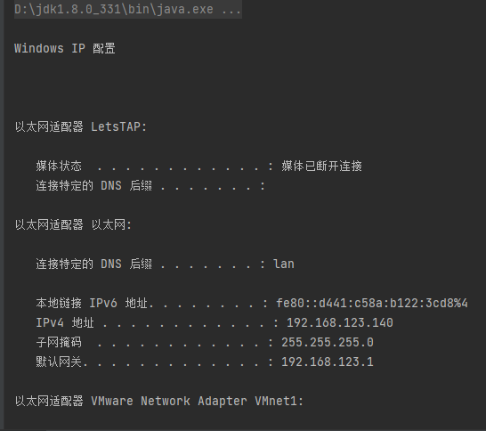

- 查看内存情况

  ```java
  package commonclass;
  
  public class Test05 {
      public static void main(String[] args) {
          Runtime runtime = Runtime.getRuntime();
          Integer ints[] =  new Integer[1000];
          long before = runtime.freeMemory();
          for(Integer i:ints){
              i=10000;//i赋的值不能-128~127的数，否则因为常量池机制监测不到变化
          }
          long after = runtime.freeMemory();
          System.out.println("赋值前的空闲内存字节数："+before);
          System.out.println("赋值后的空闲内存字节数："+after);
          System.out.println("赋值消耗内存字节数："+(before-after));
      }
  }
  ```


### 技术点

#### Date烂设计

## 类和对象

### 包和导入

为了更好地组织类，Java提供了包机制，用于区别类名的命名空间，从而允许不同包下的同名类的存在

- 一般用公司域名倒置作为包名，用于保证包名的不可重复性（为了避免同包名同类名的情况），例如com.baidu.www
- 一般用**package**关键字声明该类所在的包
- 如果这个类想使用其他包下的类，需用**import**关键字导入那个类

### 修饰符

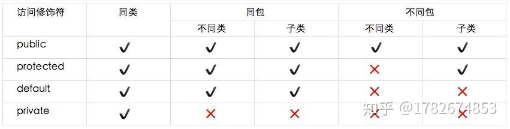

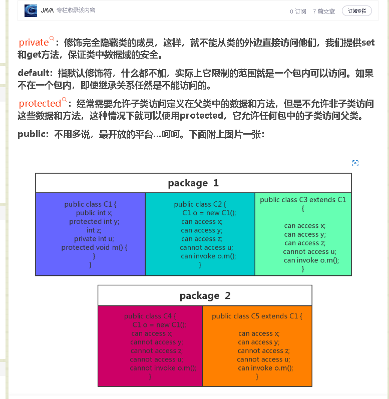

### 成员变量

### 成员方法

### 方法重载

### 构造方法

### 静态变量和静态方法

### 技术点

#### 代码块和静态代码块

#### 函数和方法的区别

#### 方法冲突

#### Java的值传递

#### ==和equals()的区别

#### hashCode()与equals()重写

## 封装、继承、多态

**Object类**

### 封装

### 继承

### 多态

### 抽象类

### 接口

### 内部类

#### 局部内部类

#### 成员内部类

#### 静态内部类

#### 匿名内部类

### lambda表达式

### 技术点

#### 对象的向上转型和向下转型

#### final关键字的用法

#### 重载和重写的区别

## 异常处理
