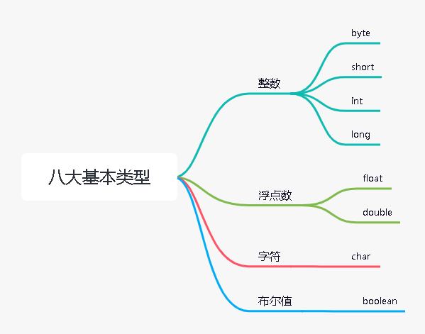

# Java基础知识

## Java历史背景

Java 是由 Sun Microsystems 公司于 1995 年 5 月推出的 Java 面向对象程序设计语言和 Java 平台的总称。由 James Gosling和同事们共同研发，并在 1995 年正式推出。

后来 Sun 公司被 Oracle （甲骨文）公司收购，Java 也随之成为 Oracle 公司的产品。

Java分为三个体系：

- JavaSE（J2SE）（Java2 Platform Standard Edition，java平台标准版）
- JavaEE(J2EE)(Java 2 Platform,Enterprise Edition，java平台企业版)
- JavaME(J2ME)(Java 2 Platform Micro Edition，java平台微型版)。

2005 年 6 月，JavaOne 大会召开，SUN 公司公开 Java SE 6。此时，Java 的各种版本已经更名，以取消其中的数字 "2"：J2EE 更名为 Java EE，J2SE 更名为Java SE，J2ME 更名为 Java ME。

2006年，Hadoop项目启动，标志着Java语言开始在大数据方向应用

Java 可运行于多个平台，如 Windows, Mac OS 及其他多种 UNIX 版本的系统。

这里可以看B站up主冬至饮雪的Java科普视频

[谷歌和甲骨文旷日持久的版权战争因何而起?你不了解的java帝国史,负门槛科普_哔哩哔哩_bilibili](https://www.bilibili.com/video/BV1pJ411L7fm?spm_id_from=333.337.search-card.all.click&vd_source=bfb00a87e263d9f19c059316c798b2e1)

## 常用开发环境

- Eclipse
  - Eclipse 是一个开放[源代码](https://baike.baidu.com/item/源代码/3969)的、基于[Java](https://baike.baidu.com/item/Java/85979)的可扩展开发平台。就其本身而言，它只是一个[框架](https://baike.baidu.com/item/框架/56219922)和一组服务，用于通过[插件](https://baike.baidu.com/item/插件/369160)[组件](https://baike.baidu.com/item/组件/6902128)构建[开发环境](https://baike.baidu.com/item/开发环境/10119007)。幸运的是，Eclipse 附带了一个标准的插件集，包括Java[开发工具](https://baike.baidu.com/item/开发工具)（Java Development Kit，[JDK](https://baike.baidu.com/item/JDK/1011)）。
- IDEA
  - IDEA 全称 IntelliJ IDEA，是[java](https://baike.baidu.com/item/java/85979)[编程语言](https://baike.baidu.com/item/编程语言/9845131)的[集成开发环境](https://baike.baidu.com/item/集成开发环境/298524)。IntelliJ在[业界](https://baike.baidu.com/item/业界/2870119)被公认为最好的Java开发工具，尤其在智能代码助手、代码自动提示、[重构](https://baike.baidu.com/item/重构/2182519)、[JavaEE](https://baike.baidu.com/item/JavaEE/3066623)支持、各类版本工具([git](https://baike.baidu.com/item/git/12647237)、[svn](https://baike.baidu.com/item/svn/3311103)等)、[JUnit](https://baike.baidu.com/item/JUnit/1211849)、[CVS](https://baike.baidu.com/item/CVS/405463)整合、代码分析、 创新的[GUI](https://baike.baidu.com/item/GUI/479966)设计等方面的功能可以说是超常的。IDEA是[JetBrains](https://baike.baidu.com/item/JetBrains/7502758)公司的产品，这家公司[总部](https://baike.baidu.com/item/总部/5289033)位于[捷克共和国](https://baike.baidu.com/item/捷克共和国/418555)的首都[布拉格](https://baike.baidu.com/item/布拉格/632)，开发人员以严谨著称的[东欧](https://baike.baidu.com/item/东欧/7149362)[程序员](https://baike.baidu.com/item/程序员/62748)为主。它的[旗舰版](https://baike.baidu.com/item/旗舰版/1412903)还支持[HTML](https://baike.baidu.com/item/HTML/97049)，[CSS](https://baike.baidu.com/item/CSS/5457)，[PHP](https://baike.baidu.com/item/PHP/9337)，[MySQL](https://baike.baidu.com/item/MySQL/471251)，[Python](https://baike.baidu.com/item/Python/407313)等。[免费版](https://baike.baidu.com/item/免费版/1817376)只支持Java,[Kotlin](https://baike.baidu.com/item/Kotlin/1133714)等少数语言。

## 搭建Java开发环境

1. 下载JDK
2. 配置java环境变量
3. 安装一个开发环境，例如notepad++，vscode，Eclipse，IDEA等

## 基础语法

### HelloWorld

- 使用编辑器或者开发工具编写一个hello.java文件

  ```java
  public class hello{
      public static void main(String[] args) {
          System.out.println("Hello,World");
      }
  }
  ```

- 编译

  - 编译hello.java文件为hello.class(字节码文件)

    ```powershell
    javac hello.java
    ```

- 运行

  - 解释运行hello.class文件

    ```powershell
    java hello
    ```

​	

当然也可以不用shell，用开发环境里面自带的编译运行选项

### 基本类型

- 八大基本类型

  

### 运算符


### 类型转换

- 自动类型转换（隐式类型转换）
- 强制类型转换（显式类型转换）

### 代码注释与规范

#### 注释

```java
// 单行注释

/*
	多行注释
*/

/**
	文档注释
*/
```

#### 标识符

[Java](https://www.h5w3.com/tag/Java)对各种变量、方法和类等要素命名时使用的字符序列称为标识符

凡是自己可以起名字的地方都叫标识符

定义合法标识符的规则：

**1.由26个英文字母大小写，0-9，_或$组成**

**2.数字不可以开头**

**3.不可以使用关键字和保留字，但是能包括关键字和保留字**

**4.Java中严格区分大小写，长度无限制**

**5.标识符不能包括空格**

**6.取名尽量做到“见名知意”**

一般习惯：

 包名：xxxyyyzzz

 类名、接口名：XxxYyyZzz(**大驼峰**)

变量名、方法名：xxxYyyZzz（**小驼峰**）

常量名：XXX_YYY_ZZZ

### 流程控制

#### 语句

在Java中，一个语句是指一个过程的完整描述，就如流程图的一个环节。

总的来说，java中语句的分类有六类：

①方法调用语句

②表达式语句

③复合语句

④空语句

⑤控制语句

⑥package语句和import语句

#### 流程控制语句

### 

## 数组

### 一维数组

- 创建数组
  - 通过new关键字创建
  - 通过花括号{ }创建
- 遍历数组（for语句的两种使用方式）

```java
public class Test01 {
    public static void main(String[] args) {
        //创建一维数组
        //1.使用new创建数组，整数数组里的元素值为默认值0
        int a[] = new int[5];
        //2.使用{}创建数组，值可以自定义
        int b[] = {1,2,3,4,5};

        //遍历一维数组
        System.out.println("遍历数组a");
        for (int i = 0; i <a.length ; i++) {
            System.out.print(a[i]+" ");
        }
        System.out.println();

        System.out.println("遍历数组b");
        for (int i = 0; i <b.length ; i++) {
            System.out.print(b[i]+" ");
        }
        System.out.println();

        //另一种遍历方式
        System.out.println("使用另一种遍历方式");
        System.out.println("遍历数组a");
        for(int i:a) {
            System.out.print(i + " ");
        }
        System.out.println();
        System.out.println("遍历数组b");
        for(int i:b) {
            System.out.print(i + " ");
        }

    }
}
```


### 二维数组


### 数组的基本操作

### 数组的排序算法

## 字符串

## 面向对象

## 常用类

### 基本类型包装类

### 枚举类

## 异常处理

## 泛型