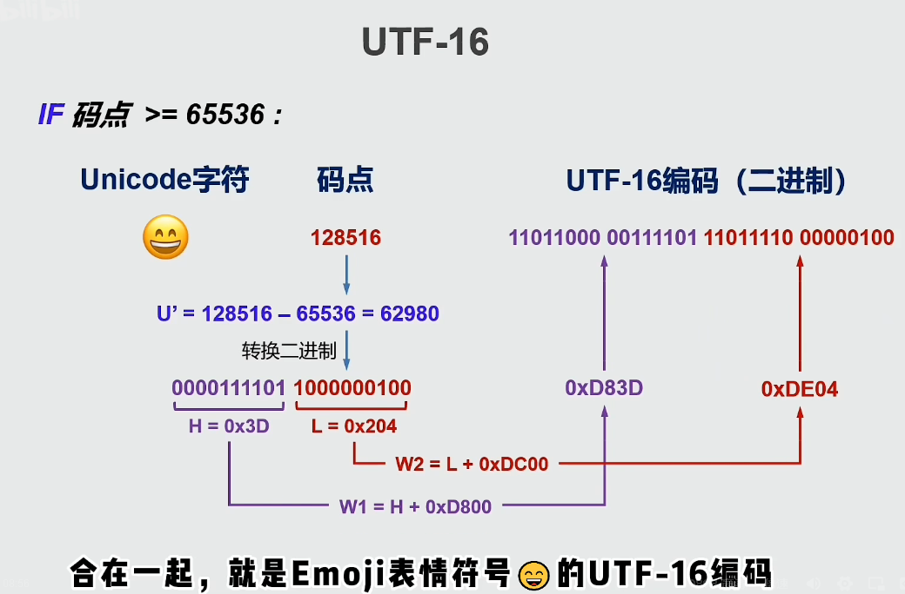

# Java基础知识

## 初识Java

### Java历史背景

Java 是由 Sun Microsystems 公司于 1995 年 5 月推出的 Java 面向对象程序设计语言和 Java 平台的总称。由 James Gosling和同事们共同研发，并在 1995 年正式推出。

后来 Sun 公司被 Oracle （甲骨文）公司收购，Java 也随之成为 Oracle 公司的产品。

Java分为三个体系：

- JavaSE（J2SE）（Java2 Platform Standard Edition，java平台标准版）
- JavaEE(J2EE)(Java 2 Platform,Enterprise Edition，java平台企业版)
- JavaME(J2ME)(Java 2 Platform Micro Edition，java平台微型版)。

2005 年 6 月，JavaOne 大会召开，SUN 公司公开 Java SE 6。此时，Java 的各种版本已经更名，以取消其中的数字 "2"：J2EE 更名为 Java EE，J2SE 更名为Java SE，J2ME 更名为 Java ME。

2006年，Hadoop项目启动，标志着Java语言开始在大数据方向应用

Java 可运行于多个平台，如 Windows, Mac OS 及其他多种 UNIX 版本的系统。

这里可以看B站up主冬至饮雪的Java科普视频

[谷歌和甲骨文旷日持久的版权战争因何而起?你不了解的java帝国史,负门槛科普_哔哩哔哩_bilibili](https://www.bilibili.com/video/BV1pJ411L7fm?spm_id_from=333.337.search-card.all.click&vd_source=bfb00a87e263d9f19c059316c798b2e1)

### 常用开发环境

- Eclipse
  - Eclipse 是一个开放[源代码](https://baike.baidu.com/item/源代码/3969)的、基于[Java](https://baike.baidu.com/item/Java/85979)的可扩展开发平台。就其本身而言，它只是一个[框架](https://baike.baidu.com/item/框架/56219922)和一组服务，用于通过[插件](https://baike.baidu.com/item/插件/369160)[组件](https://baike.baidu.com/item/组件/6902128)构建[开发环境](https://baike.baidu.com/item/开发环境/10119007)。幸运的是，Eclipse 附带了一个标准的插件集，包括Java[开发工具](https://baike.baidu.com/item/开发工具)（Java Development Kit，[JDK](https://baike.baidu.com/item/JDK/1011)）。
- IDEA
  - IDEA 全称 IntelliJ IDEA，是[java](https://baike.baidu.com/item/java/85979)[编程语言](https://baike.baidu.com/item/编程语言/9845131)的[集成开发环境](https://baike.baidu.com/item/集成开发环境/298524)。IntelliJ在[业界](https://baike.baidu.com/item/业界/2870119)被公认为最好的Java开发工具，尤其在智能代码助手、代码自动提示、[重构](https://baike.baidu.com/item/重构/2182519)、[JavaEE](https://baike.baidu.com/item/JavaEE/3066623)支持、各类版本工具([git](https://baike.baidu.com/item/git/12647237)、[svn](https://baike.baidu.com/item/svn/3311103)等)、[JUnit](https://baike.baidu.com/item/JUnit/1211849)、[CVS](https://baike.baidu.com/item/CVS/405463)整合、代码分析、 创新的[GUI](https://baike.baidu.com/item/GUI/479966)设计等方面的功能可以说是超常的。IDEA是[JetBrains](https://baike.baidu.com/item/JetBrains/7502758)公司的产品，这家公司[总部](https://baike.baidu.com/item/总部/5289033)位于[捷克共和国](https://baike.baidu.com/item/捷克共和国/418555)的首都[布拉格](https://baike.baidu.com/item/布拉格/632)，开发人员以严谨著称的[东欧](https://baike.baidu.com/item/东欧/7149362)[程序员](https://baike.baidu.com/item/程序员/62748)为主。它的[旗舰版](https://baike.baidu.com/item/旗舰版/1412903)还支持[HTML](https://baike.baidu.com/item/HTML/97049)，[CSS](https://baike.baidu.com/item/CSS/5457)，[PHP](https://baike.baidu.com/item/PHP/9337)，[MySQL](https://baike.baidu.com/item/MySQL/471251)，[Python](https://baike.baidu.com/item/Python/407313)等。[免费版](https://baike.baidu.com/item/免费版/1817376)只支持Java,[Kotlin](https://baike.baidu.com/item/Kotlin/1133714)等少数语言。

### 搭建Java开发环境

1. 下载JDK
2. 配置java环境变量
3. 安装一个开发环境，例如notepad++，vscode，Eclipse，IDEA等

### 基础语法

#### HelloWorld

- 使用编辑器或者开发工具编写一个hello.java文件

  ```java
  public class hello{
      public static void main(String[] args) {
          System.out.println("Hello,World");
      }
  }
  ```

- 编译

  - 编译hello.java文件为hello.class(字节码文件)

    ```powershell
    javac hello.java
    ```

- 运行

  - 解释运行hello.class文件

    ```powershell
    java hello
    ```

​	

当然也可以不用shell，用开发环境里面自带的编译运行选项

### 数据类型

基本数据类型(八种)：


| 整型  | 占用字节空间大小 | 取值范围             | 默认值 |
| ----- | ---------------- | -------------------- | ------ |
| byte  | 1字节            | -128 ~ 127           | 0      |
| short | 2字节            | -32768 ~ 32767       | 0      |
| int   | 4字节            | -2^31 ~ （2^31） - 1 | 0      |
| long  | 8字节            | -2^63 ~ （2^63） - 1 | 0L     |

| 浮点型 | 占用字节空间大小 | 取值范围         | 默认值 |
| ------ | ---------------- | ---------------- | ------ |
| float  | 4字节            | 2^ -127 ~ 2^ 128 | 0.0F   |
| double | 8字节            | 10^308           | 0.0    |

| 字符型 | 占用字节空间大小 | 取值范围  | 默认值 |
| ------ | ---------------- | --------- | ------ |
| char   | 2字节            | 0 ~ 65535 | ‘\u0’  |

| 布尔型  | 占用字节空间大小 | 取值范围    | 默认值 |
| ------- | ---------------- | ----------- | ------ |
| boolean | 视情况而定       | true、false | false  |


引用数据类型（三种）：
引用数据类型是建立在八大基本数据类型基础之上，包括数组、接口、类。引用数据类型是由用户自定义，用来限制其他数据类型。简单的说，除八大基本类型之外的所有数据类型，都为引用数据类型,所有引用类型的默认值都为 null 。

```java
package value;

public class TestValue {
    public static void main(String[] args) {
        System.out.println("byte型数据的最小值和最大值");
        System.out.println(Byte.MIN_VALUE+" \t"+Byte.MAX_VALUE);

        System.out.println("short型数据的最小值和最大值");
        System.out.println(Short.MIN_VALUE+" \t"+Short.MAX_VALUE);

        System.out.println("int型数据的最小值和最大值");
        System.out.println(Integer.MIN_VALUE+" \t"+Integer.MAX_VALUE);

        System.out.println("long型数据的最小值和最大值");
        System.out.println(Long.MIN_VALUE+" \t"+Long.MAX_VALUE);

        //注意这里浮点型float和double的最小值是最小精度正值，数学意义上的最小值应该是-Float.MAX_VALUE和-Double.MAX_VALUE
        System.out.println("float型数据的最小精度值和最大值");
        System.out.println(Float.MIN_VALUE+" \t"+Float.MAX_VALUE);

        System.out.println("double型数据的最小精度值和最大值");
        System.out.println(Double.MIN_VALUE+" \t"+Double.MAX_VALUE);

        //这里直接输出看不出效果，只能转成int型数据，看它们的Unicode码范围
        System.out.println("char型数据的最小值和最大值");
        System.out.println("\\u"+(int) Character.MIN_VALUE +" \t"+"\\u"+(int)Character.MAX_VALUE);


    }
}
```


### 类型转换

转化从低级到高级：byte,short,char（三者同级）—> int —> long—> float —> double

- 自动类型转换（隐式类型转换）

  - 从低到高转换，不用显式声明，不用担心数据失真

- 强制类型转换（显式类型转换）

  - 从高到低转换，要进行显式声明，可能会数据失真


```java
    package value;
    
    public class TestValueExchange {
        public static void main(String[] args) {
            byte a0=22;
            System.out.println("byte:"+a0+" 的自动类型转换");
            int a1=a0;
            long a2=a1;
            float a3=a2;
            double a4=a3;
            System.out.printf("int:%d\n",a1);
            System.out.printf("long:%d\n",a2);
            System.out.printf("float:%f\n",a3);
            System.out.printf("double:%f\n",a4);
    
    
            double b0 = 1234567890.0987654321;
            System.out.println("double:"+b0+" 的强制类型转换");
            float b1 = (float) b0;
            long b2 = (long)b0;
            int b3 = (int)b0;
            System.out.println("float:"+b1);
            System.out.println("long:"+b2);
            System.out.println("int:"+b3);
        }
    }
```


### 运算符


### 代码注释与规范

#### 注释

```java
// 单行注释

/*
	多行注释
*/

/**
	文档注释
*/
```

#### 标识符

[Java](https://www.h5w3.com/tag/Java)对各种变量、方法和类等要素命名时使用的字符序列称为标识符

凡是自己可以起名字的地方都叫标识符

定义合法标识符的规则：

**1.由26个英文字母大小写，0-9，_或$组成**

**2.数字不可以开头**

**3.不可以使用关键字和保留字，但是能包括关键字和保留字**

**4.Java中严格区分大小写，长度无限制**

**5.标识符不能包括空格**

**6.取名尽量做到“见名知意”**

一般习惯：

 包名：xxxyyyzzz

 类名、接口名：XxxYyyZzz(**大驼峰**)

变量名、方法名：xxxYyyZzz（**小驼峰**）

常量名：XXX_YYY_ZZZ

### 流程控制

#### 语句

在Java中，一个语句是指一个过程的完整描述，就如流程图的一个环节。

总的来说，java中语句的分类有六类：

①方法调用语句

②表达式语句

③复合语句

④空语句

⑤控制语句

⑥package语句和import语句

#### 流程控制语句


### 技术点

#### JVM，JDK，JRE的区别

- JVM(Java Virtual Machine Java虚拟机)

  用于运行字节码文件，是Java跨平台的关键，它屏蔽了不同操作系统间的差异，可以让相同的Java程序（相同的字节码文件）在不同的操作系统平台上运行出相同的结果

  
  
- JRE（Java Runtime Environment  Java运行时环境)

  是运行Java已编译程序所必须的软件环境，包含了JVM、Java标准类库，JRE提供给只想运行Java程序的用户使用，不能用于创建新的程序，即不能将Java源代码编译成字节码文件

  

- JDK（Java Development Kit Java开发工具包)

  包含了JRE、编译器以及许多调试、分析等工具软件，它能够创建和编译Java程序
  

如果只想运行Java程序只需安装JRE即可，如果要编写Java程序则需要安装JDK


#### JIT（just in time ,即时编译技术）

JIT编译器（just in time 即时编译器），当虚拟机发现某个方法或代码块运行特别频繁时，就会把这些代码认定为(Hot Spot Code 热点代码，为了提高热点代码的执行效率，在运行时，虚拟机将会把这些代码编译成与本地平台相关的机器码，并进行各层次的优化，完成这项任务的正是JIT编译器。

Java的执行过程整体可以分为两个部分，第一步由javac将源码编译成字节码，在这个过程中会进行词法分析、语法分析、语义分析，编译原理中这部分的编译称为前端编译。接下来无需编译直接逐条将字节码解释执行，在解释执行的过程中，虚拟机同时对程序运行的信息进行收集，在这些信息的基础上，编译器会逐渐发挥作用，它会进行后端编译——把字节码编译成机器码，但不是所有的代码都会被编译，只有被JVM认定为的热点代码，才可能被编译。

怎么样才会被认为是热点代码呢？JVM中会设置一个阈值，当方法或者代码块的在一定时间内的调用次数超过这个阈值时就会被编译，存入codeCache中。当下次执行时，再遇到这段代码，就会从codeCache中读取机器码，直接执行，以此来提升程序运行的性能。整体的执行过程大致如下图所示：


#### 逻辑运算符的短路和非短路


多个表达式结合在一起运算时，若前面的表达式已能得出最终结果，短路运算就不会计算后面的表达式，而非短路运算则无论如何都会执行所有表达式

```java
package operator;

public class Test01 {
    public static void main(String[] args) {
        int a=0;
        int b=0;
        System.out.println("短路");
        if(++a>0||++b>0){
            System.out.println("a:"+a);
            System.out.println("b:"+b);
        }
        System.out.println("非短路");
        a=0;
        b=0;
        if(++a>0|++b>0){
            System.out.println("a:"+a);
            System.out.println("b:"+b);
        }

    }
}
```


#### 循环标签

给外层循环起个标签，然后可以在内层循环运用标签名直接跳出或继续执行外层循环，换句话说，可以直接在内层循环操作外层循环

```java
package control;

public class Test01 {
    public static void main(String[] args) {
        int i=0;
        int j=0;

        for1:for(i=0;i<100;i++){
            for(j=0;j<100;j++){
               if(i==88&&j==88){
                   break for1;
               }
            }
        }
        System.out.println("i:"+i);
        System.out.println("j:"+j);
    }
}
```


#### 注释后的代码可能会执行

```java
package annotation;

public class Test01 {
    public static void main(String[] args) {
        int a=1;
        int b=1;
        // \u000a a=2;
        // \u000d b=2;
        System.out.println(a);
        System.out.println(b);

        /*
        上面的代码等价于
            int a=1;
            int b=1;
            //
            a=2;
            //
            b=2;
            System.out.println(a);
            System.out.println(b);
         */
    }
}
```


出现这种情况的的关键点就出在注释后面的那两个特殊字符上，那两个字符其实是Unicode字符，分别代表着换行和回车。

Java源代码允许包含Unicode字符，并且在任何词汇翻译前，就会对Unicode进行解码

#### Java中的char为啥要用两个字节

- 字符集

  字符与码点的映射关系，例如ASCII中的（A<--->65）

  | 字符集                                                       | 码点范围 | 涵盖字符                            |
  | ------------------------------------------------------------ | -------- | ----------------------------------- |
  | ASCII（American Standard Code for Information Interchange，美国信息交换标准代码） | 0~127    | 英文大小写，阿拉伯数字，控制字符... |
  | ISO 8859-1（Latin-1）                                        | 0~255    | ASCII，西欧字符                     |
  | GB2312(国标)                                                 |          | 简繁中文，英文...                   |
  | BIG5(五大码)                                                 |          | 繁体中文...                         |
  | GBK(国标扩)                                                  |          | 简繁中文，英文...                   |
  | Unicode（统一码，万国码）                                    | 约14万   | 希望统一全部地区的编码              |

- 字符编码

  码点与计算机二进制字节的映射关系（是字符集在计算机上的二进制存储形式），字符编码中的基础单位叫做代码单元，例如Unicode字符集有UTF-32,UTF-16,UTF-8等几种字符编码

  - UTF-32（直接用四个字节处理，数据与码点一致，缺位补0，代码单元为4字节，缺点浪费空间）	

  

  - UTF-8（将数据按照码点大小分段处理，代码单元为1字节，优点节省资源）

  

  - UTF-16（）

    码点<65536,直接转为2字节存储

    码点>=65535,要经过运算用4个字节存储，例如

    

- Java中的编码

  Java8中的String，使用UTF-16字符编码，并且使用char数组存储数据

  Java9及以上版本，使用UTF-16和Latin-1混合编码，并且使用byte数组存储数据，但混合编码只是内部实现，并未体现到api上，所以我们依然可以照常使用API（甚至假象内部像Java8一样，只有UTF-16编码）

- char存储的值的含义

  由上可知，char存储的并非一个字符，而是UTF-16下的一个代码单元，对于常用字符（这些字符的码点一般都小于65536），可以只用一个char来表示字符，而对于码点大于65536的字符，则需要用两个连续的char来表示字符，所以咱们用的String.length()和String.chatAt()都是分别计算字符串的代码单元的个数和找到指定位置的代码单元。
  
  ```java
  package string;
  
  public class Test01 {
      public static void main(String[] args) {
          String str="a😊安";
          System.out.println("str字符串代码单元的数量："+str.length());
          System.out.println("str字符串的第二个代码单元："+str.charAt(1));
  
          System.out.println("str字符串中字符的数量："+str.codePointCount(0,str.length()));
          //System.out.println(str.codePointAt(1)); 只能输出码点，无法显示码点对应的字符，若要显示字符，需按下面的操作处理
          int codepoint[]=str.codePoints().toArray();         //字符串转码点数组
          String str2=new String(codepoint,1,1);  //码点数组转字符串
          System.out.println("str字符串的第二个字符："+str2);
      }
  }
  ```
  
  

## 数组

### 一维数组

- 创建数组
  - 通过new关键字创建
  - 通过花括号{ }创建
- 遍历数组（for语句的两种使用方式）

```java
public class Test01 {
    public static void main(String[] args) {
        //创建一维数组
        //1.使用new创建数组，整数数组里的元素值为默认值0
        int a[] = new int[5];
        //2.使用{}创建数组，值可以自定义
        int b[] = {1,2,3,4,5};

        //遍历一维数组
        System.out.println("遍历数组a");
        for (int i = 0; i <a.length ; i++) {
            System.out.print(a[i]+" ");
        }
        System.out.println();

        System.out.println("遍历数组b");
        for (int i = 0; i <b.length ; i++) {
            System.out.print(b[i]+" ");
        }
        System.out.println();

        //另一种遍历方式
        System.out.println("使用另一种遍历方式");
        System.out.println("遍历数组a");
        for(int i:a) {
            System.out.print(i + " ");
        }
        System.out.println();
        System.out.println("遍历数组b");
        for(int i:b) {
            System.out.print(i + " ");
        }

    }
}
```

### 二维数组

```java
package JavaArray;

public class Test02 {
    public static void main(String[] args) {
        //创建二维数组
        int a[][] = new int[5][4];
        int b[][] ={{1,2,3},{4,5},{6,7,8,9}};

        //向a数组存值
        for (int i = 0; i < a.length; i++) {
            for(int j=0;j<a[i].length;j++){
                a[i][j]=i;
            }
        }

        //遍历两个数组
        System.out.println("数组a");
        for (int i = 0; i < a.length; i++) {
            for(int j=0;j<a[i].length;j++){
                System.out.print(a[i][j]+"\t");
            }
            System.out.println();
        }
        System.out.println();
        
        System.out.println("数组b");
        for (int i = 0; i < b.length; i++) {
            for(int j=0;j<b[i].length;j++){
                System.out.print(b[i][j]+"\t");
            }
            System.out.println();
        }
        
    }
}
```


### 数组的基本排序算法

```java
package JavaArray;

import java.util.Arrays;

public class ArraySort {

    //冒泡排序
    public static void BubbSort(int a[]) {
        for (int i = 0; i < a.length; i++) {
            for (int j = i + 1; j < a.length; j++) {
                if (a[j] < a[i]) {
                    int x;
                    x = a[i];
                    a[i] = a[j];
                    a[j] = x;
                }
            }
        }
    }
    //选择排序
    public static void ChoiceSort(int a[]) {
        for (int i = 0; i < a.length; i++) {
            int min=i;
            for(int j=i;j< a.length;j++){
                if(a[j]<a[min]){
                    min=j;
                }
            }
            int x;x=a[i];a[i]=a[min];a[min]=x;
        }
    }

    //插入排序
    public static void InsertSort(int a[]){
        for (int i = 1; i < a.length-1; i++) {
            //遍历后面的数据，将数据插入到序号为0~i的队列中
            int copy=a[i+1];
            int min=0;
            int max=i;
            int mid=(min+max)/2;
            //使用二分查找，查找a[i+1]的合适位置

            //剔除插入值为最大值的情况
            if(a[i+1]>=a[i]){
                continue;
            }

            //在顺序队列中寻找合适的（mid,mid+1）空隙，并且保证（mid，mid+1）这个空隙存在在顺序队列中，为了保证这个空隙存在，我们必须要保证插入的数据不是有序队列的最大值和最小值（即这两种情况要进行其他处理）
            //bug1:插入值为最小值，会出现min==0，max==-1,mid==（0+(-1))/2==0的死循环
            //bug2:插入值为最大值，mid溢出队列范围，会出现重复数据破坏原有数据
            //所以无论从逻辑上还是结果上，我们都应编写另外的代码剔除插入值为顺序队列最大值和最小值的情况
            while(!(a[i+1]>=a[mid]&&a[i+1]<=a[mid+1])){

                //剔除插入值为最小值的情况
                if(a[i+1]<=a[0]){
                    mid=-1;
                    break;
                }
                mid=(min+max)/2;
                if(a[i+1]>a[mid]){
                    min=mid+1;
                }
                if (a[i+1]<a[mid]) {
                    max=mid-1;
                }
            }
            //找到合适位置后，为这个位置留下插入空隙，通过从后往前赋值实现
            for(int j=i;j>=mid+1;j--){
                a[j+1]=a[j];
            }
            //插入原a[i+1]的数据
            a[mid+1]=copy;
        }
    }

    public static void main(String[] args) {
        int a[] = {7, 9, 8, 3, 1, 4, 2, 5, 0, 6};
        int b[] = Arrays.copyOf(a, a.length);
        int c[] = Arrays.copyOf(a, a.length);

        System.out.println("冒泡排序");
        System.out.println(Arrays.toString(a));
        BubbSort(a);
        System.out.println(Arrays.toString(a));

        System.out.println("选择排序");
        System.out.println(Arrays.toString(b));
        ChoiceSort(b);
        System.out.println(Arrays.toString(b));

        System.out.println("插入排序");
        System.out.println(Arrays.toString(c));
        InsertSort(c);
        System.out.println(Arrays.toString(c));

    }
}
```


### 技术点

#### 数组是不是对象

在 Java 中，只要是能够使用 new 关键字创建的结构，其实都是类。而 Java 中得数据就可以通过 new 关键字进行创建。从这个来看，其实数组就是一个类。而且在存储角度来说，Java 的基本数据类型的值都是直接存储在虚拟机栈中的，而 Java 数组则是存储在堆内存的。因此 Java 数组虽然我们经常使用，但是其本质上就是一个类，而且只有类的对象才能够被赋予 null 这个值。

```java
package JavaArray;

public class Test03 {
    public static void main(String[] args) {
        int a[]=new int[3];
        System.out.println(a instanceof Object);
        Object o = a;
    }
}
```


#### 可变长参数

可变长参数又叫不定长参数，当我们不确定参数的个数时，就可以用三个点 *"..."*来声明可变参数，它可以接收零个或者多个实参，在方法内部，可变长参数的使用方法和数组完全一致，**注意必须要保证可变参数是方法参数列表中的最后一个参数**，当函数重载时，会优先匹配固定参数的方法。

```java
package JavaArray;

import java.util.Arrays;

public class Test04 {
    public static void test(int a,int ...b){
        System.out.println("参数1："+a);
        System.out.println("参数2："+Arrays.toString(b));
    }
    public static void main(String[] args) {

        test(1,2,3,4,5,6,7,8,9,0);
    }
}
```


## 字符串

### String

String类型的创建

```java
package string;

public class Test02 {
    public static void main(String[] args) {
        //创建字符串
        String a = "abcd";
        String b = new String("efgh");
        System.out.println(a);
        System.out.println(b);
        
    }
}
```


String的常用方法

```java
package string;

public class Test03 {
    public static void main(String[] args) {
        String str =" A安aBCa1234😀 ";

        System.out.println("\t\t显示字符串的字符数量");
        System.out.println("\t\t显示特定位置的字符");
        System.out.println(str.codePointCount(0,str.length()));
        int []codequeue= str.codePoints().toArray();
        System.out.println(new String(codequeue,11,1));

        System.out.println("\t\t显示字符串的代码单元数量");
        System.out.println("\t\t显示特定位置的代码单元");
        System.out.println(str.length());
        System.out.println(str.charAt(11));
        //字符串拼接(返回拼接后的字符串，而不是改变原有字符串)
        System.out.println("\t\t拼接字符串");
        System.out.println(str.concat("X"));
        System.out.println(str);

        //字符串查找
        System.out.println("\t\t字符串查找");
        System.out.println(str.contains("😀"));
        System.out.println(str.indexOf("a"));
        System.out.println(str.lastIndexOf("a"));

        //字符串比较
        System.out.println("\t\t字符串比较");
        System.out.println(str.compareTo("B"));
        //字符串变形
        System.out.println("\t\t字符串变形");
        System.out.println(str.toLowerCase());
        System.out.println(str.toUpperCase());
        System.out.println(str.trim());

        //字符串截取
        System.out.println("\t\t字符串截取");
        System.out.println(str.substring(2,6));
        //字符串转换
        System.out.println("\t\t字符串转换");
        System.out.println(String.valueOf(123456));
        //...
    }
}
```


字符串类时一个比较特殊的类，他是Java中唯一重载运算符的类！（Java不支持运算符重载，String是特例）

String的对象直接支持使用+或+=运算符来进行拼接，并形成新的String对象！（String的字符串是不可变的）

```java
package string;

public class Test04 {
    public static void main(String[] args) {
        String a="aaaa4";
        String b="bbbb4";
        System.out.println(a+=b);
        System.out.println(a+b);
    }
}
```


### StringBuilder

大量进行字符串的拼接似乎不太好，编译器是很聪明的，String的拼接有可能会被编译器优化为StringBuilder来减少对象创建（对象频繁创建时很费时间同时很占内存的）

StringBuilder也是一个类，但是它能够存储可变长度的字符串！

```java
package string;

public class Test05 {
    public static void main(String[] args) {
        StringBuilder builder = new StringBuilder();
        builder                     //因为append返回StringBuilder对象本身所以支持链式调用
                .append("1")
                .append("2")
                .append("3")
                .append("4");
        String str =builder.toString();
        System.out.println(str);
    }
}
```


### 技术点

#### 引用拷贝、浅拷贝、深拷贝


- 引用拷贝

  引用拷贝会生成一个新的对象引用地址，但是两个最终指向依然是同一个对象

  引用类型之间直接使用**=**赋值，即可实现引用拷贝

  

- 浅拷贝

  浅拷贝会创建一个新对象，新对象和原对象本身没有任何关系，**新对象和原对象不等，但是新对象的属性和老对象相同**。

  如何实现浅拷贝呢？也很简单，**就是在需要拷贝的类上实现Cloneable接口并重写其clone()方法**。

  

- 深拷贝

  深拷贝：**在对引用数据类型进行拷贝的时候，创建了一个新的对象，并且复制其内的成员变量。**

  在具体实现深拷贝上，这里提供两个方式，重写clone()方法和序列法。

  

  参考文章：[5张图搞懂Java引用拷贝、深拷贝、浅拷贝 - SegmentFault 思否](https://segmentfault.com/a/1190000038523408)

#### 字符串常量池

```java
        String a = "abcd";
        String b = new String("efgh");
```

使用第一种创建方式（使用双引号直接创建String对象的方式）称为字面量，这并不是语法糖，两种创建方式是有区别的。

如果我们用new关键字创建String对象时，即使属性一样，也会创建多个对象，Java为了提高使用字符串的效率，引入了字符串常量池，字符串常量池位于堆中。

当我们使用字面量创建字符串时，字符串常量池会将其对象引用进行保存，后面如果创建重复的字面量，就会直接将字符串中的引用进行返回。

#### String不可变

不可变指的是，一个对象创建后，如果不能修改这个对象的属性，则这个对象是不可变的

String源码片段

```java
public final class String
    implements java.io.Serializable, Comparable<String>, CharSequence {
    /** The value is used for character storage. */
    private final char value[];
```

String内部是基于char数组实现的，value数组被final修饰，表示该数组不能改变指向，并不能保证value数组中的内容不能被改变，真正让String不可变的原因是被private关键字修饰，不能从String方法以外的方式访问value，并且String没提供给修改value的方法。同时String这个类被final修饰，表示该类不能被继承，从而避免子类覆盖父类行为的可能。

String不可变是字符串常量池存在的前置条件，同时String不可变还会保证哈希码也不会变，可以保证其他使用String哈希码的方法的安全性。

#### String、StringBuilder和StringBuffer

#### StringJoiner

## 常用类

### 基本类型包装类

#### Java中的非对象

#### 装箱拆箱原理&包装类型缓存池

### 数字处理

### 日期类

#### java.time下 的日期类

### Scanner类

#### System类

### Runtime类

### 技术点

#### Date烂设计

#### BigDecimal的使用场景

## 类和对象

### 修饰符

### 成员变量

### 成员方法

### 方法重载

### 构造方法

### 静态变量和静态方法

### 技术点

#### 代码块和静态代码块

#### 函数和方法的区别

#### 方法冲突

#### Java的值传递

#### ==和equals()的区别

#### hashCode()与equals()重写

## 封装、继承、多态

### 封装

### 继承

### 多态

### 抽象类

### 接口

### 内部类

#### 局部内部类

#### 成员内部类

#### 静态内部类

#### 匿名内部类

### lambda表达式

### 技术点

#### 对象的向上转型和向下转型

#### final关键字的用法

#### 重载和重写的区别

## 异常处理
