# 多线程

## 前景知识

### 进程与线程

-  进程

  进程：顾名思义，进行中的程序，是处理机上的一次执行过程，是系统进行资源分配和调度的一个独立单位

- 线程

  线程：为了进一步提高并发，在进程下又设有线程，一个进程至少有一个线程，线程是CPU运行调度的最小单位。线程与同属一个进程的其他线程共享进程所拥有的全部资源，但拥有自己的栈空间，拥有独立的执行序列

- 区别

  1.   地址空间，同一进程下的线程共享本进程的地址空间，进程之间是独立的地址空间
  2. 线程共享本进程的资源，进程间的资源是独立的
  3. 一个进程崩溃后在保护模式下不会对其他进程产生影响，但是如果一个线程崩溃那么整个进程都死掉
  4. 进程切换时，耗费资源较大

### 并发与并行

- 并发 （Concurrent）

   并发：多任务在一个处理机下切换的、异步的执行，看起来每个任务都在同时执行

- 并行 （Parallel）

  并行：多个任务在不同的处理机下，在同一时刻同时在执行

  

## 创建线程

### 继承Thread

```java
package lesson01;

public class TestThread1 extends Thread{

    //重写run方法，run方法是属于多线程里面的一个方法
    @Override
    public void run() {
        for (int i = 0; i < 3; i++) {
            System.out.println("我在看代码---创造的线程");
        }
    }

    public static void main(String[] args) {
        //创建一个线程对象
        TestThread1 thread1 = new TestThread1();
        //调用start()方法开启这个线程，注意是start方法而非run方法，使用run方法还是只有一个main线程顺序执行
        thread1.start();

        //这个是main方法的线程
        for (int i = 0; i < 3; i++) {
            System.out.println("我在学习多线程---main线程");
        }
    }
}
```

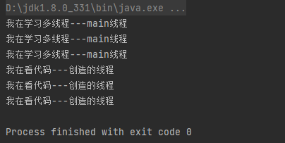

### 练习：使用多线程下载网图

下面使用导入 commons-io 组件实现多线程同时下载图片

1.创建lib目录，将下载好的jar包复制到目录中，选中jar包右键选中 添加lib 选项

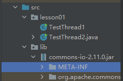

​	2.编写代码

```java
package lesson01;

import org.apache.commons.io.FileUtils;

import java.io.File;
import java.io.IOException;
import java.net.URL;

//练习Thread，实现多线程同步下载图片
public class TestThread2 extends Thread{
    private String url; //网络图片地址
    private String name;//保存的文件名

    public TestThread2(String url,String name){
        this.url=url;
        this.name = name;
    }

    //下载图片线程的执行体
    @Override
    public void run() {
        WebDownloader webDownloader = new WebDownloader();
        webDownloader.downloader(url,name);
        System.out.println("已下载文件："+name);
    }

    public static void main(String[] args) {
        TestThread2 thread1 = new TestThread2("http://img.netbian.com/file/2020/0904/7cab180eca805cce596b6870cb4e1379.jpg","1.jpg");
        TestThread2 thread2 = new TestThread2("http://img.netbian.com/file/2021/0821/a49d58bea940c16ea6e5b2b2e159f687.jpg","2.jpg");
        TestThread2 thread3 = new TestThread2("http://img.netbian.com/file/2020/0904/919e45e8a57d4d7d3a783eeb110a7285.jpg","3.jpg");
        thread1.start();
        thread2.start();
        thread3.start();
    }
}

//下载器
class WebDownloader{
    //下载方法
    public void downloader(String url,String name){
        try {
            FileUtils.copyURLToFile(new URL(url),new File(name));
        } catch (IOException e) {
            e.printStackTrace();
            System.out.println("IO异常，downloader方法出现错误");
        }
    }
}
```


### 实现Runnable接口

相对于继承Thread类而言，实现Runable接口避免了单继承的局限性，方便一个对象被多个线程使用

```java
package lesson01;
//创建线程方式：实现Runable接口，重写run方法，执行线程需要丢入runable接口实现类，调用start方法

public class TestThread3 implements Runnable {
    //run方法线程体
    @Override
    public void run() {
        for (int i = 0; i < 3; i++) {
            System.out.println("我在看代码---");
        }
    }

    public static void main(String[] args) {
        //创建runable接口的实现类对象
        TestThread3 testThread3 = new TestThread3();
        //创建线程对象，通过线程对象来开启我们的线程，代理模式
        new Thread(testThread3).start();

        //main线程
        for (int i = 0; i < 3; i++) {
            System.out.println("我在学习多线程");
        }


    }
}
```

### 初识并发问题

```java
package lesson01;
//多个线程同时操作同一个对象
//买火车票的例子
public class TestThread4 implements Runnable {

    //票数
    private  int ticketNum =10;

    @Override
    public void run() {
        while(true){
            //模拟延时
            try {
                Thread.sleep(300);
            } catch (InterruptedException e) {
                throw new RuntimeException(e);
            }

            if(ticketNum<=0){
                break;
            }
            System.out.println(Thread.currentThread().getName()+"--->拿到了第"+ticketNum-- +"票");

        }
    }

    public static void main(String[] args) {
        TestThread4 ticket = new TestThread4();

        new Thread(ticket,"小明").start();
        new Thread(ticket,"老师").start();
        new Thread(ticket,"黄牛党").start();
    }


}
```

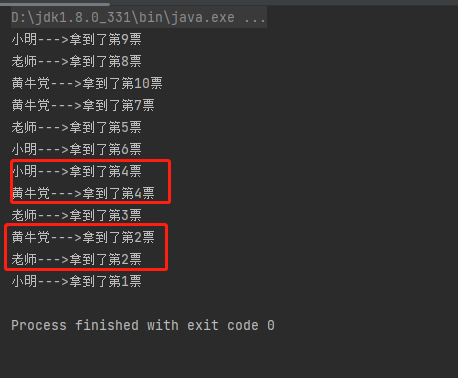

出现这种现象的原因是：通过延时使三个线程都停在同一个时刻，让这三个线程同时争抢资源ticket，ticket-- 并不是原子操作，争抢的过程中，会使 ticket--的原子操作序列紊乱，从而导致如上图的情况。避免这种现象的一种方法是，将线程修改ticket的操作改成类原子操作，即保证同一时刻只有一个线程操作ticket

### 练习：龟兔赛跑

```java
package lesson01;
//模拟龟兔赛跑
public class Race implements Runnable {
    
    //胜利者
    private static String winner;

    @Override
    public void run() {
        for (int i = 1; i <= 10; i++) {
            boolean flag = gameOver(i);
            if(flag){
                break;
            }
            System.out.println(Thread.currentThread().getName()+"-->跑了"+i+"步");
            if(Thread.currentThread().getName().equals("兔子")&&(i==5)){
                try {
                    Thread.sleep(1);
                } catch (InterruptedException e) {
                    throw new RuntimeException(e);
                }

            }
        }
    }
    
    //判断是否完成比赛
    private boolean gameOver(int steps){
        //判断是否有胜利者
        if(winner!=null) {
            return true;    
        } else if (steps >= 10 ) {
            winner = Thread.currentThread().getName();
            System.out.println("winner is "+winner);
            return true;
        }
        return false;


    }

    public static void main(String[] args) {
        Race race = new Race();
        new Thread(race,"兔子" ).start();
        new Thread(race,"乌龟" ).start();
    }
    
}
```

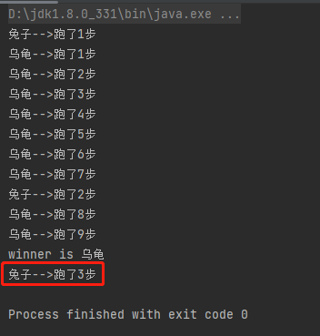

出现红框圈住的现象是，因为兔子和乌龟两个线程以winner作为同步的信号（有winner后，两个线程都应该跳出循环，结束线程），乌龟跑完第9步后和兔子跑完第3步后，同时间，两个线程进行了（winner！=null）的验证，乌龟胜利后，兔子线程可能已经经过flag验证了。

### 实现Callable接口

```java
package lesson02;

import lesson01.TestThread2;
import org.apache.commons.io.FileUtils;

import java.io.File;
import java.io.IOException;
import java.net.URL;
import java.util.concurrent.*;

//线程创建方式三，实现Callable接口
/*
1.可以定义返回值
2.可以抛出异常
 */
public class TestCallable implements Callable<Boolean> {

    private String url; //网络图片地址
    private String name;//保存的文件名

    public TestCallable(String url,String name){
        this.url=url;
        this.name = name;
    }
    //下载图片线程的执行体,call方法
    @Override
    public Boolean call() {
        WebDownloader webDownloader = new WebDownloader();
        webDownloader.downloader(url,name);
        System.out.println("已下载文件："+name);
        return  true;
    }

    public static void main(String[] args) throws ExecutionException, InterruptedException {
        TestCallable t1 = new TestCallable("http://img.netbian.com/file/2020/0904/7cab180eca805cce596b6870cb4e1379.jpg","1.jpg");
        TestCallable t2 = new TestCallable("http://img.netbian.com/file/2021/0821/a49d58bea940c16ea6e5b2b2e159f687.jpg","2.jpg");
        TestCallable t3 = new TestCallable("http://img.netbian.com/file/2020/0904/919e45e8a57d4d7d3a783eeb110a7285.jpg","3.jpg");

        //创建执行服务
        ExecutorService ser = Executors.newFixedThreadPool(3);

        //提交执行
        Future<Boolean> r1 = ser.submit(t1);
        Future<Boolean> r2 = ser.submit(t2);
        Future<Boolean> r3 = ser.submit(t3);

        //获取结果
        Boolean rs1 = r1.get();
        Boolean rs2 = r2.get();
        Boolean rs3 = r3.get();

        //关闭服务
        ser.shutdownNow();


    }
}

//下载器
class WebDownloader{
    //下载方法
    public void downloader(String url,String name){
        try {
            FileUtils.copyURLToFile(new URL(url),new File(name));
        } catch (IOException e) {
            e.printStackTrace();
            System.out.println("IO异常，downloader方法出现错误");
        }
    }
}

```

## 静态代理模式

通过这个设计模式了解Thread类，Thread类实际上是Runable这个接口的实现类的代理

下面以结婚为例，来体会下静态代理思想

```java
package lesson02;
//静态代理模式总结
//真实对象和代理对象都要实现同一个接口
//代理对象要代理真实角色

//好处：
    //代理对象可以做许多真实对象做不了的事情
    //真实对象专注做自己的事情
public class StaticProxy {
    public static void main(String[] args) {
        //抽象类和接口的子类也可以向上转型的，例如下面的You (You为接口的实现类)
        WeddingCompany weddingCompany = new WeddingCompany(new You());
        weddingCompany.HappyMarry();
    }

}

interface Marry{
    void HappyMarry();
}

//真实角色，你去结婚
class You implements  Marry{
    @Override
    public void HappyMarry() {
        System.out.println("秦老师要结婚了，超开心");
    }
}

//代理角色，帮助你结婚
class WeddingCompany implements Marry{
    private  Marry target;

    public WeddingCompany(Marry target) {
        this.target = target;
    }

    @Override
    public void HappyMarry() {
        before();
        this.target.HappyMarry();
        after();
    }
    private void before(){
        System.out.println("结婚前，布置现场");
    }

    private void after(){
        System.out.println("结婚后，收尾款");
    }
}
```

## Lambda表达式

可以快速实现函数式接口（只有一个抽象方法的接口）的一种方式

```java
package lambda;
/*
推导lambda表达式
 */
public class TestLambda1 {

    //3.静态内部类
    static class Like2 implements  ILike{
        @Override
        public void lambda() {
            System.out.println("I like lambda2");
        }
    }

    public static void main(String[] args) {

        Like like = new Like();
        like.lambda();

        Like2 like2 = new Like2();
        like2.lambda();

        //4.局部内部类
        class Like3 implements  ILike{
            @Override
            public void lambda() {
                System.out.println("I like lambda3");
            }
        }
        Like3 like3 = new Like3();
        like3.lambda();

        //5.匿名内部类
        ILike like4 = new ILike() {
            @Override
            public void lambda() {
                System.out.println("I like lambda4");
            }
        };
        like4.lambda();

        //6.lambda简化
        ILike like5 =()-> {
            System.out.println("I like lambda4");
        };
        like5.lambda();


    }
}

//1.定义一个函数式接口
interface ILike{
    void lambda();
}

//2.实现类
class Like implements ILike{
    @Override
    public void lambda() {
        System.out.println("I like lambda");
    }
}
```

```java
package lambda;

public class TestLambda2 {
    static void love(int a,int b,int c){
        System.out.println(a+b+c);
    }

    public static void main(String[] args) {

        //lambda表达式的参数也可以不写
        //一个参数可以去括号()
        ILove1 l1 = a -> {
            System.out.println(a);
        };
        l1.love(1);

        //如果函数式接口要实现的函数中只有一行语句，则可以直接写出来
        ILove2 l2 =(a,b)->System.out.println(a+b);
        l2.love(1,1);

        //lambda表达式可以应用其他地方的方法
        ILove3 l3 = TestLambda2::love;
        l3.love(1,1,1);


    }
}

interface ILove1{
    void love(int a);
}

interface ILove2{
    void love(int a,int b);
}

interface ILove3{
    void love(int a,int b,int c);
}
```

## 操作线程的方法

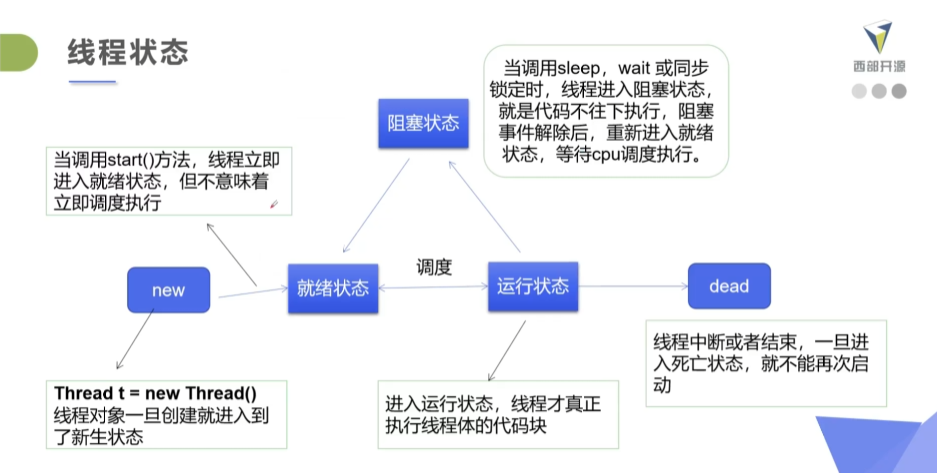

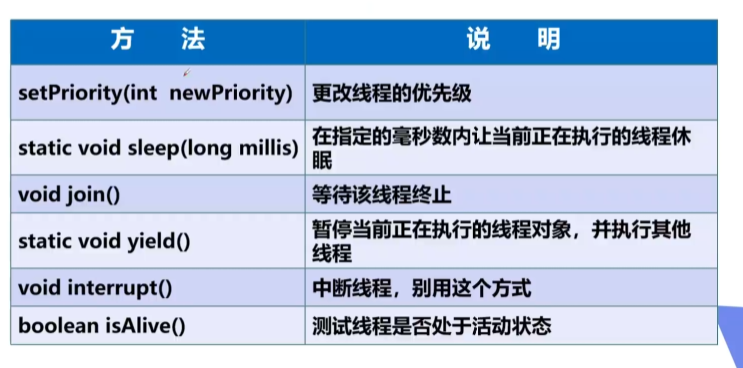

### 线程的停止

- 不推荐使用JDK提供的stop()、destroy() 方法

- 推荐线程自己停止下来

- 建议使用一个标志位进行终止变量当flag=false，则终止线程运行

  ```java
  package state;
  
  //测试stop
  //建议使用标志位让线程正常停止
  public class TestStop implements Runnable{
  
      //1.设置一个标志位
      private  boolean flag =true;
  
      @Override
      public void run() {
          int i=0;
          while(flag){
              System.out.println("run....Thread "+ i++);
          }
      }
  
      //2.设置一个公开的方法停止线程，转换标志位
  
      public void stop(){
          this.flag = false;
      }
  
      public static void main(String[] args) {
          TestStop testStop = new TestStop();
          new Thread(testStop).start();
  
          for (int i = 0; i < 10; i++) {
              System.out.println("main "+i);
              if(i==9){
                  //调用stop方法切换标志位，让线程停止
                  testStop.stop();
                  System.out.println("线程该停止了");
  
              }
          }
      }
  
  }
  ```

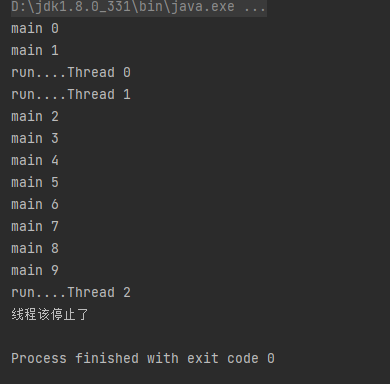

### 线程休眠

- sleep(整数)指定当前线程阻塞的毫秒数

- sleep存在异常InterruptedException

- sleep时间到达后线程进入就绪状态

- sleep可以模拟延时，倒计时等

- 每一个对象都有一个锁，sleep不会释放锁

  ```java
  package state;
  
  import java.text.SimpleDateFormat;
  import java.util.Date;
  
  //模拟时钟
  public class TestSleep {
  
  
      public static void main(String[] args) {
  
          Date date = new Date(System.currentTimeMillis());
          while(true){
              try {
                  Thread.sleep(1000);
                  System.out.println(new SimpleDateFormat("HH:mm:ss").format(date));
                  date = new Date(System.currentTimeMillis());
              } catch (InterruptedException e) {
                  throw new RuntimeException(e);
              }
          }
      }
  }
  ```

### 线程礼让

- 让线程从运行态转为就绪态

- 使线程重新参与线程调度

  ```java
  package state;
  //测试礼让线程
  //礼让不一定成功，礼让只是让运行态的线程转为就绪态重新参与竞争
  class MyYield implements Runnable{
      @Override
      public void run() {
          System.out.println(Thread.currentThread().getName()+"线程开始执行");
          Thread.yield();
          System.out.println(Thread.currentThread().getName()+"线程停止执行");
      }
  }
  
  public class TestYield {
      public static void main(String[] args) {
          MyYield myYield = new MyYield();
          new Thread(myYield,"A").start();
          new Thread(myYield,"B").start();
      }
  }
  ```

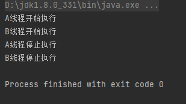

### 线程强制执行 

- 其他线程都必须等待这个线程执行完毕

  ```java
  package state;
  
  
  class MyJoin implements Runnable{
      @Override
      public void run() {
          for (int i = 1; i <= 5; i++) {
              System.out.println("线程vip "+i);
          }
      }
  }
  
  
  public class TestJoin {
      public static void main(String[] args) {
          //启动vip线程
          Thread thread = new Thread(new MyJoin());
          thread.start();
  
          //主线程
          for (int i = 1; i <= 10; i++) {
              if(i==5){
                  try {
                      thread.join();
                  } catch (InterruptedException e) {
                      throw new RuntimeException(e);
                  }
              }
              System.out.println("main "+i);
          }
  
  
      }
  }
  ```

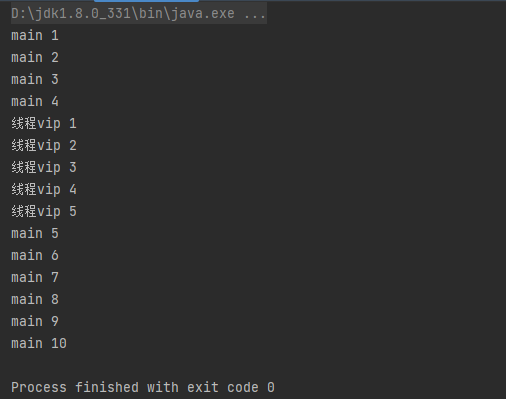

### 观测线程状态

```java
package state;


public class TestState {
    public static void main(String[] args) {
        Thread thread = new Thread(()->{
            System.out.println("thread start");
            for (int i = 0; i < 5; i++) {
                try {
                    Thread.sleep(1000);
                    System.out.println("thread...."+i);
                } catch (InterruptedException e) {
                    throw new RuntimeException(e);
                }
            }
            System.out.println("thread end");
        });

        //观察状态
        Thread.State state =thread.getState();
        System.out.println(state);

        //观察启动后
        thread.start(); //启动线程
        state = thread.getState();
        System.out.println(state);

        while(state!= Thread.State.TERMINATED){//只要线程不终止，就一直输出状态
            try {
                Thread.sleep(200);//每隔200ms,监听一次
            } catch (InterruptedException e) {
                throw new RuntimeException(e);
            }
            state = thread.getState();//更新线程状态
            System.out.println(state);//输出状态
        }


    }
}
```

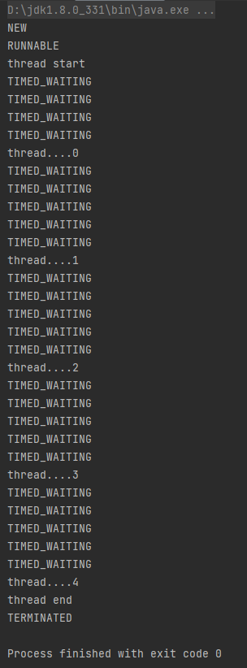

### 线程的优先级

- Java提供一个线程调度器来监控程序中启动后进入就绪状态的所有线程，线程调度器按照**参考**优先级决定应该调度那个线程来执行,优先级并不一定会决定线程执行的顺序

- 线程的优先级用数字表示，范围从1~10

- 使用以下方式改变或获取优先级

  getPriority()     、 setPriority(int xx)

```java
package state;

public class TestPriority {
    public static void main(String[] args) {
        Runnable runnable = () -> System.out.println(Thread.currentThread().getName() + " ---> "+Thread.currentThread().getPriority());
        Thread t1 = new Thread(runnable,"t1");
        Thread t2 = new Thread(runnable,"t2");
        Thread t3 = new Thread(runnable,"t3");
        Thread t4 = new Thread(runnable,"t4");
        Thread t5 = new Thread(runnable,"t5");

        t1.setPriority(2);
        t2.setPriority(1);
        t3.setPriority(10);
        t4.setPriority(5);
        t5.setPriority(3);

        t1.start();
        t2.start();
        t3.start();
        t4.start();
        t5.start();


    }
}
```

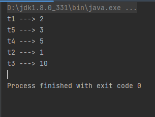

### 守护线程

- 线程分为用户线程和守护线程 
- 虚拟机必须确保用户线程执行完毕
- 虚拟机不用等待守护线程执行完毕
- 守护线程，负责后台记录操作日志，监控内存，垃圾回收等待..

```java
package state;


//测试守护线程
//上帝守护你
public class TestDaemon {

    public static void main(String[] args) {
        //上帝
        Runnable You = ()->{
            while(true){
                System.out.println("上帝保佑着你");
            }
        };
        //你
        Runnable God = ()->{
            for (int i = 0; i < 5; i++) {
                System.out.println("你一生都快乐的活着");
            }
            System.out.println("goodbye world!");

            System.out.println("打上Debug断点，以便看到goodbye");

        };
        //创建上帝守护线程
        Thread thread = new Thread(God);
        thread.setDaemon(true);//设为守护线程
        thread.start();//启动上帝守护线程

        new Thread(You).start();//启动用户线程 “你”

    }


}
```


## 线程同步

- 线程同步：即当有一个线程在对内存进行操作时，其他线程都不可以对这个内存地址进行操作，直到该线程完成操作， 其他线程才能对该内存地址进行操作，而其他线程又处于等待状态，实现线程同步的方法有很多，临界区对象就是其中一种。

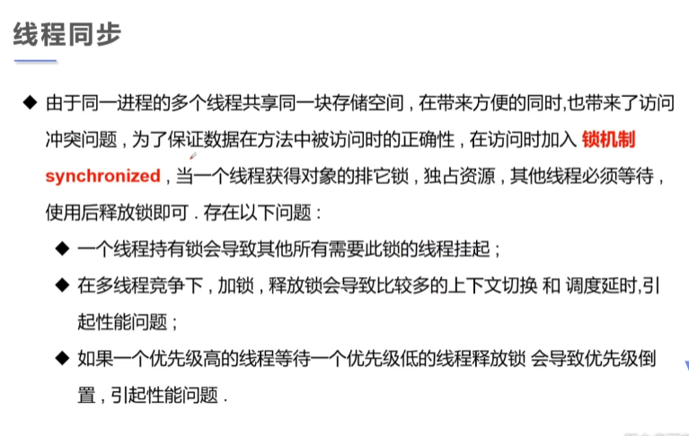

### 线程不安全三大案例

- 不安全的买票

  ```java
  package sync;
  
  class BuyTicket implements Runnable{
  
      //票
      private int ticket =10;
      boolean flag = true;//停止买票标识
  
      @Override
      public void run() {
          while(flag){
              try {
                  Thread.sleep(1000);     //使用线程延时，便于观察线程不安全的现象
              } catch (InterruptedException e) {
                  throw new RuntimeException(e);
              }
              buy();
          }
      }
      private void buy(){
          if(ticket<=0){
              flag=false;
              return ;
          }
          System.out.println(Thread.currentThread().getName()+"买了第"+ticket--+"张票");
      }
  }
  
  //不安全的买票
  public class UnsafeBuyTicket {
      public static void main(String[] args) {
          Runnable tickets = new BuyTicket();
          new Thread(tickets,"苦逼的我").start();
          new Thread(tickets,"牛逼的你们").start();
          new Thread(tickets,"可恶的黄牛党").start();
      }
  
  }
  
  ```

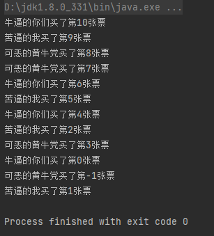

- 不安全的取钱

```java
package sync;


//账户
class Account{
    int money;//余额
    String name; //款项名称

    public Account(int money, String name) {
        this.money = money;
        this.name = name;
    }
}

//银行：模拟取款
class Drawing extends Thread{
    Account account;//账户

    int drawingMoney;//要取多少钱

    int nowMoney=0;//现在这个人手里有多少钱（从银行取出的钱）

    public Drawing (Account account,int drawingMoney,String name){
        super(name);
        this.account=account;
        this.drawingMoney=drawingMoney;

    }

    //取钱
    @Override
    public void run() {
        System.out.println(Thread.currentThread().getName()+"要取"+drawingMoney);
        //判断账户有没有钱
        if(account.money-drawingMoney<0){
            System.out.println("钱不够，取不了");
            return ;
        }
        try {
            Thread.sleep(1000);
        } catch (InterruptedException e) {
            throw new RuntimeException(e);
        }
        account.money-=drawingMoney;
        nowMoney+=drawingMoney;
        System.out.println(account.name+"的余额为："+account.money);
        System.out.println(this.getName()+"的手里的钱："+nowMoney);//这里的getName是继承Thread的方法

    }
}

//不安全的取钱
//两个人去银行取钱
public class UnsafeBank {
    public static void main(String[] args) {
        //账户
        Account account = new Account(100,"结婚基金");

        Drawing you = new Drawing(account,50,"你");
        Drawing girlfriend = new Drawing(account,100,"你朋友");

        you.start();
        girlfriend.start();

    }

}
```

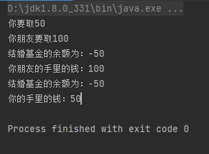

- 不安全的集合

```java
package sync;

import java.util.ArrayList;

//线程不安全的集合
public class UnsafeList {
    public static void main(String[] args) {
        int num=10000;
        //创建集合
        ArrayList<String> list = new ArrayList<>();
        //使用线程向集合中添加数据
        for (int i = 0; i < num; i++) {
            new Thread(()->{
                list.add(Thread.currentThread().getName());
            },""+i).start();
        }
        //制造延时，放大不安全现象
        try {
            Thread.sleep(3000);
        } catch (InterruptedException e) {
            throw new RuntimeException(e);
        }

        System.out.println("创造线程的数量："+num);
        System.out.println("集合的数据数量："+list.size());
    }
}
```

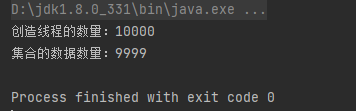

### 同步方法及同步块

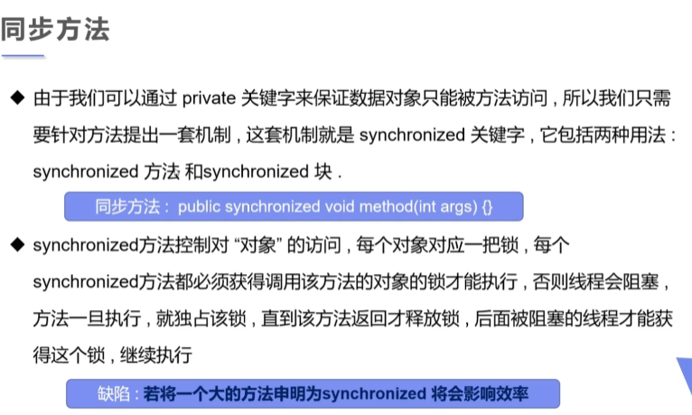

- 方法里面需要修改的内容才需要锁，锁的太多，降低并发并且浪费计算资源（因为加锁和开锁需要进行上下文切换等操作）
- 一般要锁的对象是要线程共享的资源

对于刚才的三大案例只需添加同步锁即可解决

- 安全的买票

  ```java
      private synchronized void buy(){ //修改第20行
         if(ticket<=0){
              flag=false;
              return ;
          }
          System.out.println(Thread.currentThread().getName()+"买了第"+ticket--+"张票");
      }
  ```

- 安全的取钱

  ```java
  public void run() {	//在run方法中加入针对account这个对象的代码块
      synchronized (account){
          System.out.println(Thread.currentThread().getName()+"要取"+drawingMoney);
          //判断账户有没有钱
          if(account.money-drawingMoney<0){
              System.out.println("钱不够，取不了");
              return ;
          }
          try {
              Thread.sleep(1000);
          } catch (InterruptedException e) {
              throw new RuntimeException(e);
          }
          account.money-=drawingMoney;
          nowMoney+=drawingMoney;
          System.out.println(account.name+"的余额为："+account.money);
          System.out.println(this.getName()+"的手里的钱："+nowMoney);//这里的getName是继承Thread的方法
      }
  
  
  }
  ```

- 安全的集合

  ```java
  for (int i = 0; i < num; i++) {
      new Thread(()->{
          //加入针对list的同步块
          synchronized (list){
              list.add(Thread.currentThread().getName());
          }
      },""+i).start();
  }
  ```

### CopyOnWriteArrayList

属于JUC（java.util.concurrent 并发包）下的一个线程安全的集合类

```java
package sync;

import java.util.concurrent.CopyOnWriteArrayList;

public class TestJUC {
    public static void main(String[] args) {
        int num=10000;
        //创建集合
        CopyOnWriteArrayList<String> list = new CopyOnWriteArrayList<String>();
        //使用线程向集合中添加数据
        for (int i = 0; i < num; i++) {
            new Thread(()->{
                    list.add(Thread.currentThread().getName());
            },""+i).start();
        }
        //制造延时，放大不安全现象
        try {
            Thread.sleep(3000);
        } catch (InterruptedException e) {
            throw new RuntimeException(e);
        }

        System.out.println("创造线程的数量："+num);
        System.out.println("集合的数据数量："+list.size());
    }
}
```

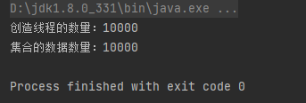

### 死锁


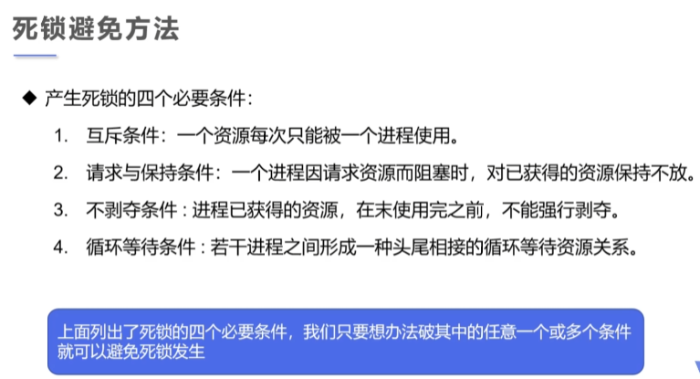

下面用一个化妆的例子来展现死锁现象

```java
package thread;

class Lipstick{} //口红

class Mirror{} //镜子

class Makeup extends Thread{
    //两个类变量充当线程共享的资源
    static Lipstick lipstick = new Lipstick();
    static Mirror mirror = new Mirror();

    int choice;         //选择
    String grilname;    //使用化妆品的人

    Makeup(int choice,String grilname){
        this.choice = choice;
        this.grilname = grilname;
    }

    //线程体执行化妆
    @Override
    public void run() {
        try {
            makeup();
        } catch (Exception e) {
            throw new RuntimeException(e);
        }
    }
    //化妆，互相持有对方的锁，就是需要拿到对方的资源
    private void makeup() throws Exception{
        if(choice==0){

            synchronized (lipstick){
                System.out.println(grilname+"获得口红的锁");
                Thread.sleep(1000);
                synchronized (mirror){
                    System.out.println(grilname+"获得镜子的锁");
                }
                System.out.println(grilname+"释放了镜子的锁");
            }
            System.out.println(grilname+"释放了口红的锁");

        }else{

            synchronized (mirror){
                System.out.println(grilname+"获得镜子的锁");
                Thread.sleep(3000);
                synchronized (lipstick){
                    System.out.println(grilname+"获得口红的锁");
                }
                System.out.println(grilname+"释放了口红的锁");
            }
            System.out.println(grilname+"释放了镜子的锁");

        }
    }
}


//死锁：多个线程互相抱着对方需要的资源，然后形成僵持
public class DeadLock {
    public static void main(String[] args) {
        Makeup m1 = new Makeup(0,"灰姑娘");
        Makeup m2 = new Makeup(1,"白雪公主");
        m1.start();
        m2.start();
    }
}
```

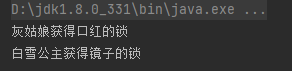

出现死锁的原因，灰姑娘必须得到镜子的锁，才能释放口红的锁，而白雪公主必须得到口红的锁才能释放镜子的锁

### Lock锁

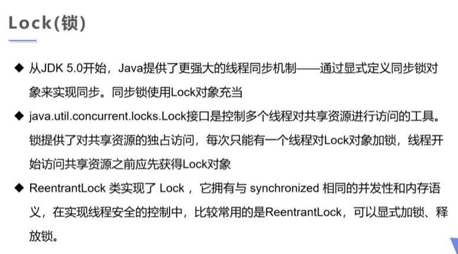

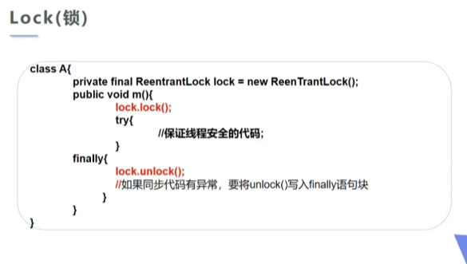

```java
package gaoji;


import java.util.concurrent.locks.ReentrantLock;

class TestLock2 implements Runnable{
    int ticketNum =10;

    //定义lock锁
    private  final ReentrantLock lock=new ReentrantLock();

    @Override
    public void run() {
        while(true){
            lock.lock();//加锁
            try {
                if(ticketNum<=0){
                    break;
                }
                try {
                    Thread.sleep(1000);
                } catch (InterruptedException e) {
                    throw new RuntimeException(e);
                }
                System.out.println(ticketNum--);
            } finally {
                lock.unlock();//解锁
            }
        }
    }
}


//测试Lock锁
public class TestLock {
    public static void main(String[] args) {
        TestLock2 testLock2lock = new TestLock2();

        new Thread(testLock2lock).start();
        new Thread(testLock2lock).start();
        new Thread(testLock2lock).start();
    }
}
```

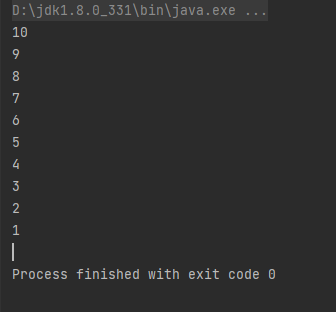

- Lock是显式锁（需要手动开启和关闭锁），synchronized是隐式锁（出了作用域自动释放）

- Lock只有代码块锁，synchronized有代码锁和方法锁

- 使用Lock锁，性能更好并且具有更好的扩展性

- 优先使用顺序

  Lock>同步代码块>同步方法

## 线程协作

### 生产者消费者问题

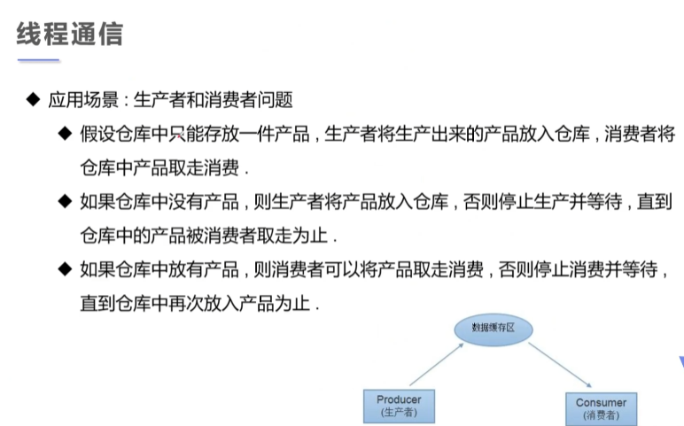

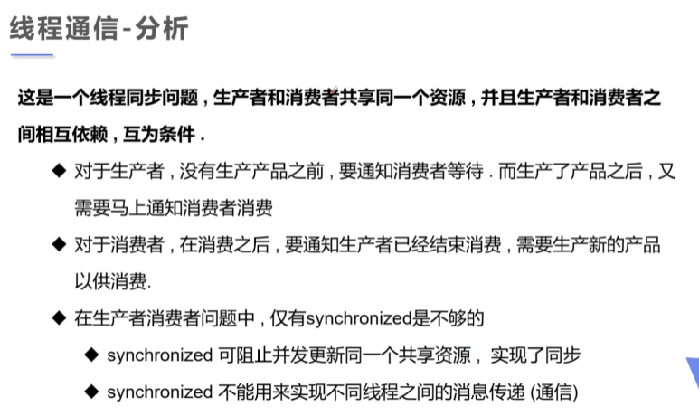

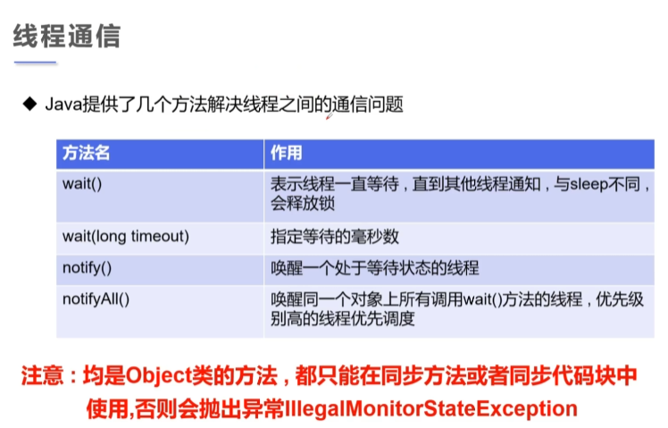

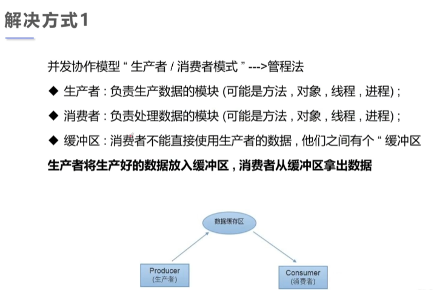


### 管程法

```java
package gaoji;


//测试：生产者消费者模型 -->利用缓冲区解决：管程法
//生产者、消费者、产品、缓冲区

//生产者
class Productor extends  Thread{
        SynContainer container;
        public Productor(SynContainer container,String name){
            super(name);
            this.container = container;
        }

        //生产
        @Override
        public void run() {
            for (int  i = 0;  i < 5; i ++) {
                System.out.println(Thread.currentThread().getName()+"生产了第"+i+"只鸡");
                container.push(new Chicken(i));
            }
        }
}

//消费者
class Consumer extends Thread{

    SynContainer container;
    public Consumer(SynContainer container,String name){
        super(name);
        this.container = container;
    }
    //消费
    @Override
    public void run() {
        for (int i = 0; i < 5; i++) {
            System.out.println(Thread.currentThread().getName()+"消费了-->第"+container.pop().id+"只鸡");
        }
    }
}

//产品
class Chicken{
    int id;//产品编号

    public Chicken(int id) {
        this.id = id;
    }
}

// 缓冲区
class SynContainer{

    //需要一个容器大小
    Chicken[] chickens  =new Chicken[10];
    //容器计数器
    int count = 0;

    //生产者放入产品
    public synchronized void push(Chicken chicken){
        while (count == chickens.length){
            //通知消费者消费，生产者等待
            try {
                this.wait();
            } catch (InterruptedException e) {
                throw new RuntimeException(e);
            }
        }

        //如果没有满，我们就丢入产品
        chickens[count] = chicken;
        count++;

        //可以通知消费者消费了
        this.notify();

    }


    //消费者消费产品
    public synchronized  Chicken pop(){

        // 判断是否能消费
        while (count==0){
            //等待生产者生产，消费者等待
            try {
                this.wait();
            } catch (InterruptedException e) {
                throw new RuntimeException(e);
            }
        }
        //如果可以消费
        count--;
        Chicken chicken = chickens[count];

        //通知生产者生产
        this.notify();
        return chicken;
    }


}


public class TestPC {
    public static void main(String[] args) {
        SynContainer container = new SynContainer();
        new Productor(container,"生产者1号").start();
        new Consumer(container,"消费者1号").start();
    }
}

```

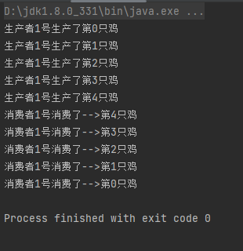

- 代码第61、84行用while而不用if的原因

  

### 信号灯法

```java
package gaoji;

//测试生产者消费者问题2：信号灯法，标志位解决
//这里的演员与观众是1对1的表演关系
//生产者--> 演员
class Player extends Thread{
    TV tv;
    public Player(TV tv){
        this.tv = tv;
    }

    @Override
    public void run() {
        for (int i = 0; i < 5; i++) {
            if(i%2==0){
                this.tv.play("快乐大本营播放中");
            }else {
                this.tv.play("抖音：记录美好生活");
            }
        }
    }
}

//消费者--> 观众
class Watcher extends Thread{
    TV tv;
    public Watcher(TV tv){
        this.tv = tv;
    }

    @Override
    public void run() {
        for (int i = 0; i < 5; i++) {
            tv.watch();
        }
    }
}

//产品-->节目
class TV{
    String voice;//表演的节目
    //演员表演，观众等待 T
    //观众观看，演员等待 F
    boolean flag = true;

    //表演
    public synchronized  void play(String voice){

        if(!flag){
            try {
                this.wait();
            } catch (InterruptedException e) {
                throw new RuntimeException(e);
            }
        }
        System.out.println("演员表演了："+voice);
        //通知观众观看
        this.notifyAll();//通知唤醒

        this.voice = voice;
        this.flag=!this.flag;

    }

    public synchronized void  watch(){
        if(flag){
            try {
                this.wait();
            } catch (InterruptedException e) {
                throw new RuntimeException(e);
            }
        }
        System.out.println("观看了："+voice);
        this.notifyAll();
        this.flag=!this.flag;
    }

}


public class TestPC2 {
    public static void main(String[] args) {
        TV tv = new TV();
        new Player(tv).start();
        new Watcher(tv).start();
    }
}
```

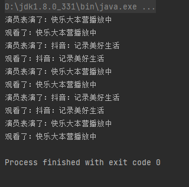

## 线程池

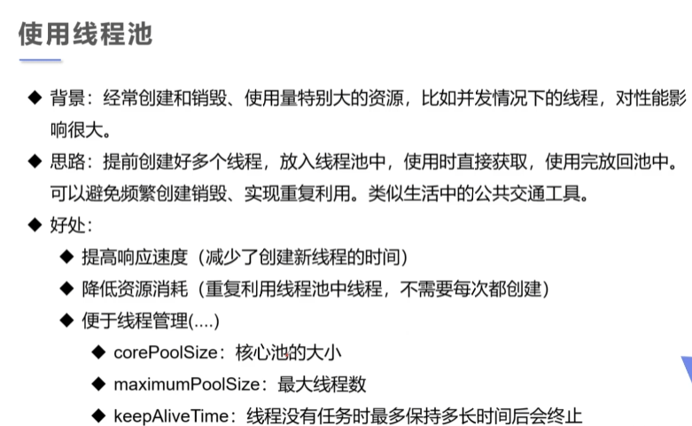

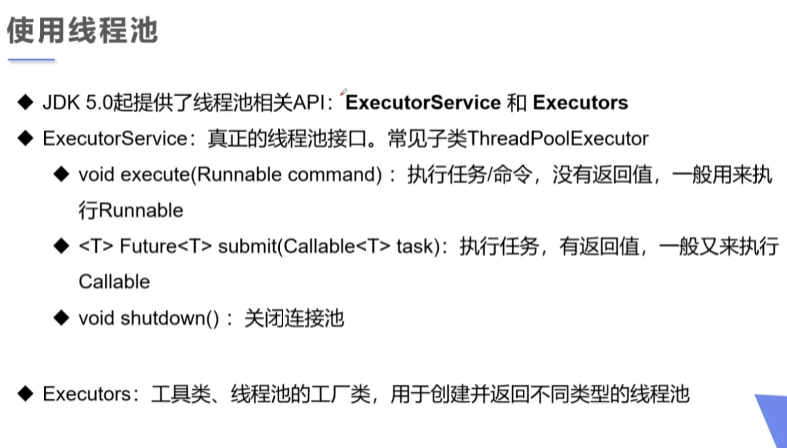

```java
package gaoji;

//测试线程池

import java.util.concurrent.ExecutorService;

import static java.util.concurrent.Executors.newFixedThreadPool;

class MyThread implements Runnable{
    @Override
    public void run() {
        System.out.println(Thread.currentThread().getName());
    }
}

public class TestPool {
    public static void main(String[] args) {
        //1.创建服务，创建线程池
        //newFixedThreadPool 参数为：线程池大小
        ExecutorService service = newFixedThreadPool(10);
        //执行
        service.execute(new MyThread());
        service.execute(new MyThread());
        service.execute(new MyThread());
        service.execute(new MyThread());
        //2.关闭链接
        service.shutdown();
    }
}
```

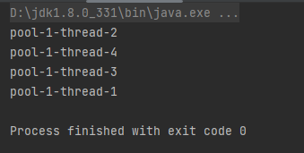