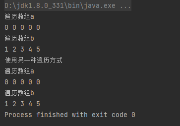

# 数组

## 一维数组

- 创建数组
  - 通过new关键字创建
  - 通过花括号{ }创建
- 遍历数组（for语句的两种使用方式）

```java
public class Test01 {
    public static void main(String[] args) {
        //创建一维数组
        //1.使用new创建数组，整数数组里的元素值为默认值0
        int a[] = new int[5];
        //2.使用{}创建数组，值可以自定义
        int b[] = {1,2,3,4,5};

        //遍历一维数组
        System.out.println("遍历数组a");
        for (int i = 0; i <a.length ; i++) {
            System.out.print(a[i]+" ");
        }
        System.out.println();

        System.out.println("遍历数组b");
        for (int i = 0; i <b.length ; i++) {
            System.out.print(b[i]+" ");
        }
        System.out.println();

        //另一种遍历方式
        System.out.println("使用另一种遍历方式");
        System.out.println("遍历数组a");
        for(int i:a) {
            System.out.print(i + " ");
        }
        System.out.println();
        System.out.println("遍历数组b");
        for(int i:b) {
            System.out.print(i + " ");
        }

    }
}
```



## 二维数组


## 数组的基本操作

## 数组的排序算法

# 字符串