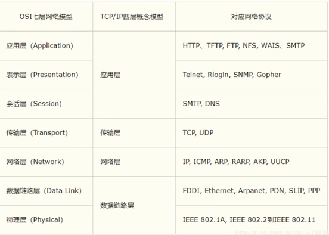
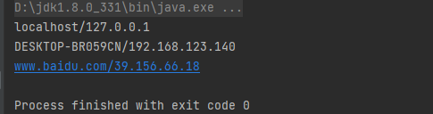
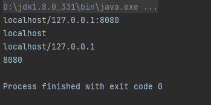
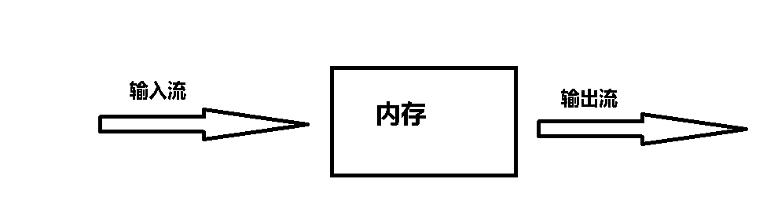
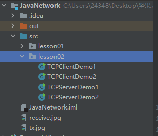
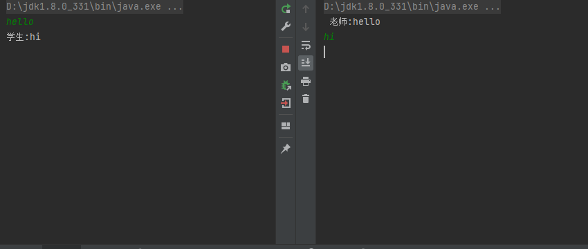

- [Java网络编程](#java网络编程)
  - [前景知识](#前景知识)
  - [IP](#ip)
  - [Port（端口）](#port端口)
  - [通信协议](#通信协议)
  - [TCP通信](#tcp通信)
  - [TCP文件上传](#tcp文件上传)
  - [UDP消息发送](#udp消息发送)
  - [UDP聊天实现](#udp聊天实现)
  - [UDP多线程在线咨询](#udp多线程在线咨询)
  - [URL下载网络资源](#url下载网络资源)
  - [](#)


# Java网络编程

## 前景知识

- 计算机网络


计算机网络按其包括的地理区域大小分为局域网，城域网，广域网等，在计算机网路中最知名的网络是因特网Internet，这个网络基本上将全世界联系起来。我们平时所说的上网也指通过因特网进行信息交流。

-  B/S架构


CS即Client/Server（客户机/服务器）结构，BS即Browser/Server（浏览器/服务器）结构，就是只安装维护一个服务器（Server），而客户端选用浏览器（Browse）运行软件。

-  网络通信的实质


网络通信的实质是两台或多台计算机的进程通过TCP/IP协议（在该协议中通信进程被分配不同的端口号用来标识进程）进行网络通信。

- TCP/IP参考模型




## IP

ip地址：InetAddress

- 唯一定位一台网络上的计算机

- 127.0.0.1：本机localhost

- ipv4/ipv6

  - ipv4,由4个字节，即32个二进制位组成，可以表示因特网的42亿台设备或者网络（NAT技术的支持），例如192.168.123.140
  - ipv6，IPv6的地址长度为128位，是IPv4地址长度的4倍。于是IPv4点分十进制格式不再适用，采用十六进制表示，例如ABCD:EF01:2345:6789:ABCD:EF01:2345:6789（4x4x8=128）

- 公网IP（互联网）/私网IP（局域网）

  - ABCD类地址

  - 子网划分
  
  
  
  ```java
  package lesson01;
  
  import java.net.InetAddress;
  import java.net.UnknownHostException;
  
  public class TestInetAddress {
      public static void main(String[] args) throws UnknownHostException {
          //查询本机地址 I net Address
          InetAddress address = InetAddress.getByName("localhost");
          System.out.println(address);
          InetAddress address1 = InetAddress.getLocalHost();
          System.out.println(address1);
          //查询网站ip地址
          InetAddress address2 = InetAddress.getByName("www.baidu.com");
          System.out.println(address2);
  
      }
  }
  ```



## Port（端口）

端口：标识在网络上进行通信的进程，端口分为UDP端口与TCP端口,每个协议的端口的数量范围都为0~65535

| 常见公认的端口号                                       |
| ------------------------------------------------------ |
| 21/tcp FTP 文件传输协议                                |
| 22/tcp SSH 安全登录、文件传送(SCP)和端口重定向         |
| 23/tcp Telnet 不安全的文本传送                         |
| 25/tcp SMTP Simple Mail Transfer Protocol (E-mail)     |
| 69/udp TFTP Trivial File Transfer Protocol             |
| 79/tcp finger Finger                                   |
| 80/tcp HTTP 超文本传送协议 (WWW)                       |
| 88/tcp Kerberos Authenticating agent                   |
| 110/tcp POP3 Post Office Protocol (E-mail)             |
| 113/tcp ident old identification server system         |
| 119/tcp NNTP used for usenet newsgroups                |
| 220/tcp IMAP3                                          |
| 443/tcp HTTPS used for securely transferring web pages |

端口分类

- 公有端口 0~1023 （系统级）
- 程序注册端口 1024~49151（应用级）
- 动态、私有端口 49152~65535

有关网络的shell命令

```shell
netstat -ano #查看端口
netstat -ano | findstr "port" #查看指定的端口

```

```java
package lesson01;

import java.net.InetSocketAddress;

public class TestInetSocketAddress {
    public static void main(String[] args) {
        InetSocketAddress socketAddress = new InetSocketAddress("localhost",8080);
        //显示socket信息
        System.out.println(socketAddress);
        //显示socket绑定的主机名
        System.out.println(socketAddress.getHostName());
        //显示socket绑定的ip地址
        System.out.println(socketAddress.getAddress());
        //显示socket绑定的端口号
        System.out.println(socketAddress.getPort());

    }
}
```



## 通信协议

- TCP：用户传输协议
- UDP：用户数据报协议

TCP与UDP的对比：

TCP可以理解为打电话

- 连接、稳定

- 三次握手、四次挥手

  ```txt
  三次挥手建立连接的过程实际上是确认双方发送接收机能正常的过程
  A->B    若成功，则向B证明了A有发送能力
  B->A	若成功，则向A证明了B有接受能力和发送能力
  A->B	若成功，则向B证明了A有接受能力
  四次挥手是确认双方都停止发送和接收
  A->B	告知B，A停止发送
  B->A	告知A,B停止接收
  B->A	告知A,B停止发送
  A->B	告知B，A停止接收
  ```

  

- 客户端、服务端

- 传输完成，释放连接，效率低

UDP可以理解为发短信

- 不连接，不稳定
- 客户端、服务端：没有明确界限
- 不管有没有准备好，都可以发给你

## TCP通信

- 客户端

  1. 使用Socket建立与服务端的连接
  2. 发送消息

- 服务端

  1. 建立服务端的端口
  2. 等待用户的连接accept监听
  3. 接收用户的消息

  需要补充的知识，IO流

  输入流、输出流是针对内存而言的

  输入流是将流中的数据写到内存中（相当于代码中的变量中）

  输出流根据流的特性写到指定的地方，例如FileOutputStream（new File("1.txt") ），将流中的数据写到文件1.txt中
  
  
  
  TCP客户端

```java
package lesson02;

import java.io.IOException;
import java.io.OutputStream;
import java.net.InetAddress;
import java.net.Socket;

public class TestTCPClient {
    public static void main(String[] args) {
        Socket socket = null;
        OutputStream os = null;
        try {
            //通过Socket建立与服务端的连接，需要找到服务端的ip与端口号
            InetAddress address = InetAddress.getByName("127.0.0.1");
            int port = 9999;
            socket = new Socket(address, port);
            //发送消息
            os = socket.getOutputStream();
            os.write("Hello,World!,你好世界！".getBytes());
        } catch (Exception e) {
            e.printStackTrace();
        } finally {
            if (socket != null) {
                try {
                    socket.close();
                } catch (IOException e) {
                    e.printStackTrace();
                }
            }
            if (os != null) {
                try {
                    os.close();
                } catch (IOException e) {
                    e.printStackTrace();
                }
            }
        }
    }
}
```

TCP服务端

```java
package lesson02;

import java.io.ByteArrayOutputStream;
import java.io.IOException;
import java.io.InputStream;
import java.net.ServerSocket;
import java.net.Socket;

public class TCPServerDemo1 {
    public static void main(String[] args)  {
        ServerSocket serverSocket=null;
        Socket socket=null;
        InputStream is =null;
        ByteArrayOutputStream baos=null;
        try {
            //建立一个服务器套接字
            serverSocket= new ServerSocket(9999);

            //等待客户端连接过来
            socket = serverSocket.accept();
            is = socket.getInputStream();

            //接受用户数据
            //管道流
            baos = new ByteArrayOutputStream();
            byte[] buffer = new byte[1024];
            int len;
            //read会返回读取数据的字节数，流结束返回-1
            while ((len=is.read(buffer))!=-1){
                //向buffer中从头写入len长的内容
                baos.write(buffer,0,len);
                System.out.println(baos);
            }


        } catch (IOException e) {
            e.printStackTrace();
        }
        finally {
            if(baos!=null){
                try {
                    baos.close();
                } catch (IOException e) {
                    e.printStackTrace();
                }
            }
            if(is!=null){
                try {
                    is.close();
                } catch (IOException e) {
                    e.printStackTrace();
                }
            }
            if(socket!=null){
                try {
                    socket.close();
                } catch (IOException e) {
                    e.printStackTrace();
                }
            }
            if(serverSocket!=null) {
                try {
                    serverSocket.close();
                } catch (IOException e) {
                    e.printStackTrace();
                }
            }
        }

    }
}

```

## TCP文件上传

客户端

```java
package lesson02;

import java.io.File;
import java.io.FileInputStream;
import java.io.OutputStream;
import java.net.InetAddress;
import java.net.Socket;

public class TCPClientDemo2 {
    public static void main(String[] args) throws Exception{
        //1.建立本地socket
        Socket socket = new Socket(InetAddress.getByName("127.0.0.1"),9999);
        //2.创建socket输出流,负责输出数据
        OutputStream os = socket.getOutputStream();
        //3.创建文件输入流，将文件写入缓存区，再把缓存区的内容写入到输出流中
        FileInputStream fis = new FileInputStream(new File("tx.jpg"));
        byte[] buffer = new byte[1024];
        int len=0;
        while((len=fis.read(buffer))!=-1){
            os.write(buffer,0,len);
        }
        //4.关闭流
        os.close();
        fis.close();
        socket.close();
    }
}
```

服务端

```java
package lesson02;

import java.io.FileOutputStream;
import java.io.InputStream;
import java.net.ServerSocket;
import java.net.Socket;

public class TCPServerDemo2 {

    public static void main(String[] args) throws Exception {
        //1.建立服务端socket
        ServerSocket serverSocket = new ServerSocket(9999);
        //2.监听客户端，获取客户端socket（阻塞监听，如果没有监听到客户端，程序将不会继续向下执行）
        Socket socket = serverSocket.accept();
        //3.用缓冲区接收客户端socket传来的数据，将缓存区中的内容写入到文件输出流中输出
        InputStream is = socket.getInputStream();
        FileOutputStream fos = new FileOutputStream("receive.jpg");
        byte[] buffer = new byte[1024];
        int len;
        while((len=is.read(buffer))!=-1){
            fos.write(buffer,0,len);
        }
        //4.关闭流
        fos.close();
        is.close();
        socket.close();
        serverSocket.close();
    }
}
```



## UDP消息发送

发送端

```java
package lesson03;

import java.net.DatagramPacket;
import java.net.DatagramSocket;
import java.net.InetAddress;

public class UDPClientDemo1 {
    public static void main(String[] args) throws Exception{
        //1.建立一个数据包socket
        DatagramSocket socket = new DatagramSocket();
        //2.建立个数据包
        String msg = "你好，世界！";
        DatagramPacket packet = new DatagramPacket(msg.getBytes(), 0, msg.getBytes().length, InetAddress.getByName("127.0.0.1"), 9090);

        //3.发送包
        socket.send(packet);
        //4.关闭socket
        socket.close();
    }
}
```

接收端

```java
package lesson03;

import java.net.DatagramPacket;
import java.net.DatagramSocket;

public class UDPServerDemo1 {
    public static void main(String[] args) throws Exception{
        //1.建立数据包socket,开放端口
        DatagramSocket socket = new DatagramSocket(9090);
        //2.接收数据包
        byte[] buffer = new byte[1024];
        DatagramPacket packet = new DatagramPacket(buffer,0,buffer.length);
        socket.receive(packet);
        //3.显示数据包
        System.out.println(packet.getAddress());
        System.out.println(new String(packet.getData(),0, packet.getLength()));
        //4.关闭socket
        socket.close();
    }
}
```

## UDP聊天实现

如果出现端口已占用的报错，可以换个端口或者使用cmd命令找到进程的名字然后通过任务管理器的详细信息页面找到该进程，结束该进程

```shell
netstat -ano | findstr "端口" #如果存在的话，会显示PID
tasklist  | findstr "PID"    #找到具体的进程名
```

发送端

```java
package chat;

import java.io.BufferedReader;
import java.io.InputStreamReader;
import java.net.DatagramPacket;
import java.net.DatagramSocket;
import java.net.InetAddress;

public class UDPSenderDemo1 {
    public static void main(String[] args) throws Exception {
        //1.建立本地socket
        DatagramSocket socket = new DatagramSocket();
        //2.准备数据，控制台读取System.in
        BufferedReader reader = new BufferedReader(new InputStreamReader(System.in));
        //3.准备循环发送数据包
        while(true){
            String data = reader.readLine();
            DatagramPacket packet = new DatagramPacket(data.getBytes(),0,data.getBytes().length, InetAddress.getByName("localhost"),6666);
            socket.send(packet);
            if(data.equals("bye")){
                break;
            }
        }
        //4.关闭socket
        socket.close();
    }
}
```

接收端

```java
package chat;

import java.net.DatagramPacket;
import java.net.DatagramSocket;

public class UDPReceiveDemo1 {
    public static void main(String[] args) throws  Exception{

        //1.创建本地socket
        DatagramSocket socket = new DatagramSocket(6666);
        //2.循环准备接受数据包
        while(true){

            byte[] data = new byte[1024];
            DatagramPacket packet = new DatagramPacket(data,0,data.length);
            socket.receive(packet);

            String receiveData = new String(packet.getData(),0,packet.getLength());
            System.out.println(receiveData);

            if(receiveData.equals("bye")){
                break;
            }

        }
        //3.关闭数据包
        socket.close();
    }
}
```


## UDP多线程在线咨询

需要多线程的知识

发送方线程

```java
package chat;

import java.io.BufferedReader;
import java.io.IOException;
import java.io.InputStreamReader;
import java.net.DatagramPacket;
import java.net.DatagramSocket;
import java.net.InetSocketAddress;

public class TalkSend implements Runnable {

    DatagramSocket socket = null;
    BufferedReader reader = null;

    private int fromPort ;
    private String toIP ;
    private int toPort ;

    public TalkSend(int fromPort,String toIP,int toPort){
        this.fromPort = fromPort;
        this.toIP = toIP;
        this.toPort = toPort;

        try {
            socket = new DatagramSocket(fromPort);
            reader =new BufferedReader(new InputStreamReader(System.in));
        }catch (Exception e){
            e.printStackTrace();
        }

    }


    @Override
    public void run() {
        while(true){
            try {
                String data = reader.readLine();
                byte[] datas = data.getBytes();
                DatagramPacket packet = new DatagramPacket(datas,0,datas.length,new InetSocketAddress(this.toIP,this.toPort));
                socket.send(packet);
                if(data.equals("bye")){
                    break;
                }
            } catch (IOException e) {
                throw new RuntimeException(e);
            }
        }
        socket.close();
    }
}
```

接收端线程

```java
package chat;

import java.io.IOException;
import java.net.DatagramPacket;
import java.net.DatagramSocket;
import java.net.SocketException;

public class TalkReceive implements Runnable{
    DatagramSocket socket =null;
    private int port;
    private String msgFrom;
    public TalkReceive(int port,String msgFrom){
        this.port = port;
        this.msgFrom =msgFrom;
        try {
            socket = new DatagramSocket(port);
        } catch (SocketException e) {
            throw new RuntimeException(e);
        }

    }

    @Override
    public void run() {

        while(true){
            try {
                byte[] data = new byte[1024];
                DatagramPacket packet = new DatagramPacket(data,0,data.length);
                socket.receive(packet);

                String receiveData = new String(packet.getData(),0,packet.getLength());
                System.out.println(msgFrom+":"+receiveData);

                if(receiveData.equals("bye")){
                    break;
                }
            } catch (IOException e) {
                throw new RuntimeException(e);
            }

        }
        socket.close();
    }
}
```

学生方进程

```java
package chat;

public class TalkStudent {

    public static void main(String[] args) {
        new Thread (new TalkSend(7777,"localhost",9999)).start();
        new Thread(new TalkReceive(8888," 老师")).start();
    }

}
```

老师方进程

```java
package chat;

public class TalkTeacher {
    public static void main(String[] args) {
        new Thread(new TalkSend(5555,"localhost",8888)).start();
        new Thread(new TalkReceive(9999,"学生")).start();
    }
}
```



## URL下载网络资源

```java
package lesson04;

import java.io.FileOutputStream;
import java.io.IOException;
import java.io.InputStream;
import java.net.HttpURLConnection;
import java.net.MalformedURLException;
import java.net.URL;

public class URLDemo {
    public static void main(String[] args) throws IOException {
		//通过网页开发工具抓取网页上的特定资源的url，例如QQ音乐的《樱流》试听片段
        URL url = new URL("https://dl.stream.qqmusic.qq.com/RS02060W4yus39IeNv.mp3?guid=3942257025&vkey=C77E982B21DBBE50FEA312B7E40F56AB1E81EECB5ED81AA9F0CC863CB4187A0AE0CA37CC9C64F25C5C14C457EB57AA598336CE9C83B6B37A&uin=&fromtag=120052");
        // 建立与url的连接
        HttpURLConnection urlConnection = (HttpURLConnection)url.openConnection();
        //得到输入流，将url中的内容输入到缓冲区，再通过缓冲区输出到文件
        InputStream is = urlConnection.getInputStream();
        FileOutputStream fos = new FileOutputStream("RS02060W4yus39IeNv.mp3");
        byte[] buffer = new byte[1024];
        int len;
        while((len=is.read(buffer))!=-1){
            fos.write(buffer,0,len);
        }
        //关闭流与连接
        fos.close();
        is.close();
        urlConnection.disconnect();
    }
}
```

## 