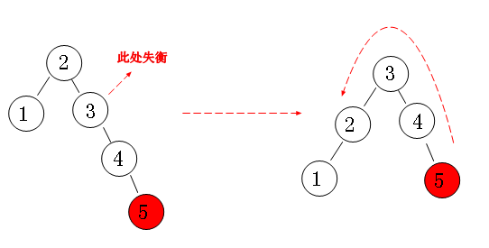

## 枚举

### 初识枚举

```java
package Test;

enum Season{
    Spring,Summer,Autumn,Winter
}
public class Enum {
    public static void main(String[] args) {
        Season[] values = Season.values();
        for(Season s:values){
            System.out.println(s);
        }
    }
}
```


### 枚举的方法


```java
package Test;

public class Enum1 {
    public static void main(String[] args) {
        Season summer = Season.valueOf("Summer");
        Season[] seasons = Season.values();
        for(int i=0;i<seasons.length;i++){
            System.out.println("索引"+seasons[i].ordinal()+"  "+seasons[i]);
        }
        System.out.println(summer.compareTo(seasons[0]));
        System.out.println(summer.compareTo(seasons[1]));
        System.out.println(summer.compareTo(seasons[2]));
        System.out.println(summer.compareTo(seasons[3]));

    }
}
```


### 枚举的构造方法

在枚举类型中，可以添加构造方法，但是规定这个构造方法必须被private修饰符所修饰。

```java
package Test;

enum SeasonEnum{
    Spring("春天来了"),
    Summer("夏天来了"),
    Autumn("秋天来了"),
    Winter("冬天来了");

    private String remarks;
    private SeasonEnum(String remarks){
        this.remarks=this.toString()+":"+remarks;
    }

    public String getRemarks() {
        return remarks;
    }
}

public class Enum2 {
    public static void main(String[] args) {
        SeasonEnum[] seasonEnums = SeasonEnum.values();
        for(SeasonEnum s:seasonEnums){
            System.out.println(s.getRemarks());
        }
    }
}
```


## 泛型

### 走进泛型

为了统计学生成绩，要求设计一个Score对象，包括课程名称、课程号、课程成绩，但是成绩分为两种，一种是以`优秀、良好、合格` 来作为结果，还有一种就是 `60.0、75.5、92.5` 这样的数字分数，那么现在该如何去设计这样的一个Score类呢？现在的问题就是，成绩可能是`String`类型，也可能是`Integer`类型，如何才能很好的去存可能出现的两种类型呢？

```java
public class Score {
    String name;
    String id;
    Object score;  //因为Object是所有类型的父类，因此既可以存放Integer也能存放String

  	public Score(String name, String id, Object score) {
        this.name = name;
        this.id = id;
        this.score = score;
    }
}
```

以上的方法虽然很好地解决了多种类型存储问题，但是Object类型在编译阶段并不具有良好的类型判断能力，很容易出现以下的情况：

```java
public static void main(String[] args) {

    Score score = new Score("数据结构与算法基础", "EP074512", "优秀");  //是String类型的

    //....

    Integer number = (Integer) score.score;  //获取成绩需要进行强制类型转换，虽然并不是一开始的类型，但是编译不会报错
}

//运行时出现异常！
Exception in thread "main" java.lang.ClassCastException: java.lang.String cannot be cast to java.lang.Integer
	at com.test.Main.main(Main.java:14)
```

使用Object类型作为引用，取值只能进行强制类型转换，显然无法在编译期确定类型是否安全，项目中代码量非常之大，进行类型比较又会导致额外的开销和增加代码量，如果不经比较就很容易出现类型转换异常，代码的健壮性有所欠缺！（此方法虽然可行，但并不是最好的方法）

为了解决以上问题，JDK1.5新增了泛型，它能够在编译阶段就检查类型安全，大大提升开发效率。

```java
public class Score<T> {   //将Score转变为泛型类<T>
    String name;
    String id;
    T score;  //T为泛型，根据用户提供的类型自动变成对应类型

    public Score(String name, String id, T score) {   //提供的score类型即为T代表的类型
        this.name = name;
        this.id = id;
        this.score = score;
    }
}
```

```java
public static void main(String[] args) {
    //直接确定Score的类型是字符串类型的成绩
    Score<String> score = new Score<String>("数据结构与算法基础", "EP074512", "优秀");

    Integer i = score.score;  //编译不通过，因为成员变量score类型被定为String！
}
```

泛型将数据类型的确定控制在了编译阶段，在编写代码的时候就能明确泛型的类型！如果类型不符合，将无法通过编译！

### 泛型擦除

泛型本质上也是一个语法糖（并不是JVM所支持的语法，编译后会转成编译器支持的语法，比如之前的foreach就是），在编译后会被擦除，变回上面的Object类型调用，但是类型转换由编译器帮我们完成，而不是我们自己进行转换（安全）

```java
//反编译后的代码
public static void main(String[] args) {
        Score score = new Score("数据结构与算法基础", "EP074512", "优秀");
        String i = (String)score.score;   //其实依然会变为强制类型转换，但是这是由编译器帮我们完成的
    }
```

像这样在编译后泛型的内容消失转变为Object的情况称为**`类型擦除`**（重要，需要完全理解），所以泛型只是为了方便我们在编译阶段确定类型的一种语法而已，并不是JVM所支持的。

综上，泛型其实就是一种类型参数，用于指定类型。

### 泛型类

上一节我们已经提到泛型类的定义，实际上就是普通的类多了一个类型参数，也就是在使用时需要指定具体的泛型类型。泛型的名称一般取单个大写字母，比如T代表Type，也就是`类型`的英文单词首字母，当然也可以添加数字和其他的字符。

```java
public class Score<T> {   //将Score转变为泛型类<T>
    String name;
    String id;
    T score;  //T为泛型，根据用户提供的类型自动变成对应类型

    public Score(String name, String id, T score) {   //提供的score类型即为T代表的类型
        this.name = name;
        this.id = id;
        this.score = score;
    }
}
```

在一个普通类型中定义泛型，泛型T称为`参数化类型`，在定义泛型类的引用时，需要明确指出类型：

```java
 Score<String> score = new Score<String>("数据结构与算法基础", "EP074512", "优秀");
```

此时类中的泛型T已经被替换为String了，在我们获取此对象的泛型属性时，编译器会直接告诉我们类型：

```java
Integer i = score.score;   //编译不通过，因为成员变量score明确为String类型
```

注意，泛型只能用于对象属性，也就是非静态的成员变量才能使用：

```java
static T score;   //错误，不能在静态成员上定义
```

由此可见，泛型是只有在创建对象后编译器才能明确泛型类型，而静态类型是类所具有的属性，不足以使得编译器完成类型推断。

泛型无法使用基本类型，如果需要基本类型，只能使用基本类型的包装类进行替换！

```java
Score<double> score = new Score<double>("数据结构与算法基础", "EP074512", 90.5);  //编译不通过
```

那么为什么泛型无法使用基本类型呢？回想上一节提到的类型擦除，其实就很好理解了。由于JVM没有泛型概念，因此泛型最后还是会被编译器编译为Object，并采用强制类型转换的形式进行类型匹配，而我们的基本数据类型和引用类型之间无法进行类型转换，所以只能使用基本类型的包装类来处理。

**类的泛型方法**

泛型方法的使用也很简单，我们只需要把它当做一个未知的类型来使用即可：

```java
public T getScore() {    //若方法的返回值类型为泛型，那么编译器会自动进行推断
  return score;
}

public void setScore(T score) {   //若方法的形式参数为泛型，那么实参只能是定义时的类型
  this.score = score;
}
```

```java
Score<String> score = new Score<String>("数据结构与算法基础", "EP074512", "优秀");
score.setScore(10);   //编译不通过，因为只接受String类型
```

同样地，静态方法无法直接使用类定义的泛型（注意是无法直接使用，静态方法可以使用泛型）

### 泛型方法

那么如果我想在静态方法中使用泛型呢？首先我们要明确之前为什么无法使用泛型，因为之前我们的泛型定义是在类上的，只有明确具体的类型才能开始使用，也就是创建对象时完成类型确定，但是静态方法不需要依附于对象，那么只能在使用时再来确定了，所以静态方法可以使用泛型，但是需要单独定义：

```java
public static <E> void test(E e){   //在方法定义前声明泛型
  System.out.println(e);
}
```

同理，成员方法也能自行定义泛型，在实际使用时再进行类型确定：

```java
public <E> void test(E e){
  System.out.println(e);
}
```

其实，无论是泛型类还是泛型方法，再使用时一定要能够进行类型推断，明确类型才行。

注意一定要区分类定义的泛型和方法前定义的泛型！

### 泛型引用

可以看到我们在定义一个泛型类的引用时，需要在后面指出此类型：

```java
Score<Integer> score;  //声明泛型为Integer类型
```

如果不希望指定类型，或是希望此引用类型可以引用任意泛型的`Score`类对象，可以使用`?`通配符，来表示自动匹配任意的可用类型：

```java
Score<?> score;   //score可以引用任意的Score类型对象了！
```

那么使用通配符之后，得到的泛型成员变量会是什么类型呢？

```java
Object o = score.getScore();   //只能变为Object
```

因为使用了通配符，编译器就无法进行类型推断，所以只能使用原始类型。

现在有一个新的需求，现在没有String类型的成绩了，但是成绩依然可能是整数，也可能是小数，这时我们不希望用户将泛型指定为除数字类型外的其他类型，我们就需要使用到泛型的上界定义：

```java
public class Score<T extends Number> {   //设定泛型上界，必须是Number的子类
    private final String name;
    private final String id;
    private T score;

    public Score(String name, String id, T score) {
        this.name = name;
        this.id = id;
        this.score = score;
    }

    public T getScore() {
        return score;
    }
}
```

通过`extends`关键字进行上界限定，只有指定类型或指定类型的子类才能作为类型参数。

同样的，泛型通配符也支持泛型的界限：

```java
Score<? extends Number> score;  //限定为匹配Number及其子类的类型
```

同理，既然泛型有上限，那么也有下限：

```java
Score<? super Integer> score;   //限定为匹配Integer及其父类
```

通过`super`关键字进行下界限定，只有指定类型或指定类型的父类才能作为类型参数。

图解如下：


那么限定了上界后，我们再来使用这个对象的泛型成员，会变成什么类型呢？

```java
Score<? extends Number> score = new Score<>("数据结构与算法基础", "EP074512", 10);
Number o = score.getScore();    //得到的结果为上界类型
```

也就是说，一旦我们指定了上界后，编译器就将范围从原始类型`Object`提升到我们指定的上界`Number`，但是依然无法明确具体类型。思考：那如果定义下限呢？

那么既然我们可以给泛型类限定上界，现在我们来看编译后结果呢：

```java
//使用javap -l 进行反编译
public class com.test.Score<T extends java.lang.Number> {
  public com.test.Score(java.lang.String, java.lang.String, T);
    LineNumberTable:
      line 8: 0
      line 9: 4
      line 10: 9
      line 11: 14
      line 12: 19
    LocalVariableTable:
      Start  Length  Slot  Name   Signature
          0      20     0  this   Lcom/test/Score;
          0      20     1  name   Ljava/lang/String;
          0      20     2    id   Ljava/lang/String;
          0      20     3 score   Ljava/lang/Number;   //可以看到score的类型直接被编译为Number类

  public T getScore();
    LineNumberTable:
      line 15: 0
    LocalVariableTable:
      Start  Length  Slot  Name   Signature
          0       5     0  this   Lcom/test/Score;
}

```

因此，一旦确立上限后，编译器会自动将类型提升到上限类型。

### 钻石运算符

我们发现，每次创建泛型对象都需要在前后都标明类型，但是实际上后面的类型声明是可以去掉的，因为我们在传入参数时或定义泛型类的引用时，就已经明确了类型，因此JDK1.7提供了钻石运算符来简化代码：

```java
Score<Integer> score = new Score<Integer>("数据结构与算法基础", "EP074512", 10);  //1.7之前

Score<Integer> score = new Score<>("数据结构与算法基础", "EP074512", 10);  //1.7之后
```

### 泛型与多态

泛型不仅仅可以可以定义在类上，同时也能定义在接口上：

```java
public interface ScoreInterface<T> {
    T getScore();
    void setScore(T t);
}
```

当实现此接口时，我们可以选择在实现类明确泛型类型或是继续使用此泛型，让具体创建的对象来确定类型。

```java
public class Score<T> implements ScoreInterface<T>{   //将Score转变为泛型类<T>
    private final String name;
    private final String id;
    private T score;

    public Score(String name, String id, T score) { 
        this.name = name;
        this.id = id;
        this.score = score;
    }

    public T getScore() {
        return score;
    }

    @Override
    public void setScore(T score) {
        this.score = score;
    }
}
```

```java
public class StringScore implements ScoreInterface<String>{   //在实现时明确类型

    @Override
    public String getScore() {
        return null;
    }

    @Override
    public void setScore(String s) {

    }
}
```

抽象类同理，这里就不多做演示了。

### 多态类型擦除

思考一个问题，既然继承后明确了泛型类型，那么为什么`@Override`不会出现错误呢，重写的条件是需要和父类的返回值类型、形式参数一致，而泛型默认的原始类型是Object类型，子类明确后变为Number类型，这显然不满足重写的条件，但是为什么依然能编译通过呢？

```java
class A<T>{
    private T t;
    public T get(){
        return t;
    }
    public void set(T t){
        this.t=t;
    }
}

class B extends A<Number>{
    private Number n;

    @Override
    public Number get(){   //这并不满足重写的要求，因为只能重写父类同样返回值和参数的方法，但是这样却能够通过编译！
        return t;
    }

    @Override
    public void set(Number t){
        this.t=t;
    }
}
```

通过反编译进行观察，实际上是编译器帮助我们生成了两个桥接方法用于支持重写：

```java
@Override
public Object get(){
  return this.get();//调用返回Number的那个方法
}

@Override
public void set(Object t ){
  this.set((Number)t ); //调用参数是Number的那个方法
}
```

### 技术点

#### 泛型之不变&数组之协变

## 数据结构基础

### 线性表

线性表是最基本的一种数据结构，它是表示一组相同类型数据的有限序列，你可以把它与数组进行参考，但是它并不是数组，线性表是一种表结构，它能够支持数据的插入、删除、更新、查询等，同时数组可以随意存放在数组中任意位置，而线性表只能依次有序排列，不能出现空隙，因此，我们需要进一步的设计。

#### 顺序表

将数据依次存储在连续的整块物理空间中，这种存储结构称为`顺序存储结构`，而以这种方式实现的线性表，我们称为`顺序表`。

同样的，表中的每一个个体都被称为`元素`，元素左边的元素（上一个元素），称为`前驱`，同理，右边的元素（后一个元素）称为`后驱`。

我们设计线性表的目标就是为了去更好地管理我们的数据，也就是说，我们可以基于数组，来进行封装，实现增删改查！既然要存储一组数据，那么很容易联想到我们之前学过的数组，数组就能够容纳一组同类型的数据。

目标：以数组为底层，编写以下抽象类的具体实现

```java
/**
 * 线性表抽象类
 * @param <E> 存储的元素(Element)类型
 */
public abstract class AbstractList<E> {
    /**
     * 获取表的长度
     * @return 顺序表的长度
     */
    public abstract int size();

    /**
     * 添加一个元素
     * @param e 元素
     * @param index 要添加的位置(索引)
     */
    public abstract void add(E e, int index);

    /**
     * 移除指定位置的元素
     * @param index 位置
     * @return 移除的元素
     */
    public abstract E remove(int index);

    /**
     * 获取指定位置的元素
     * @param index 位置
     * @return 元素
     */
    public abstract E get(int index);
}
```

#### 链表


数据分散的存储在物理空间中，通过一根线保存着它们之间的逻辑关系，这种存储结构称为`链式存储结构`

实际上，就是每一个结点存放一个元素和一个指向下一个结点的引用（C语言里面是指针，Java中就是对象的引用，代表下一个结点对象）

利用这种思想，我们再来尝试实现上面的抽象类，从实际的代码中感受！

比较：顺序表和链表的优异？

顺序表优缺点：

* 访问速度快，随机访问性能高
* 插入和删除的效率低下，极端情况下需要变更整个表
* 不易扩充，需要复制并重新创建数组

链表优缺点：

* 插入和删除效率高，只需要改变连接点的指向即可
* 动态扩充容量，无需担心容量问题
* 访问元素需要依次寻找，随机访问元素效率低下

链表只能指向后面，能不能指向前面呢？双向链表！

栈和队列实际上就是对线性表加以约束的一种数据结构，如果前面的线性表的掌握已经ok，那么栈和队列就非常轻松了！

#### 队列

队列同样也是受限制的线性表，不过队列就像我们排队一样，只能从队尾开始排，从队首出。


所以我们要实现以下内容：

```java
/**
 *
 * @param <E>
 */
public abstract class AbstractQueue<E> {

    /**
     * 进队操作
     * @param e 元素
     */
    public abstract void offer(E e);

    /**
     * 出队操作
     * @return 元素
     */
    public abstract E poll();
}

```

#### 栈


栈遵循先入后出原则，只能在线性表的一端添加和删除元素。我们可以把栈看做一个杯子，杯子只有一个口进出，最低处的元素只能等到上面的元素离开杯子后，才能离开。

向栈中插入一个元素时，称为`入栈（压栈）`，移除栈顶元素称为`出栈`，我们需要尝试实现以下抽象类型：

```java
/**
 * 抽象类型栈，待实现
 * @param <E> 元素类型
 */
public abstract class AbstractStack<E> {

    /**
     * 出栈操作
     * @return 栈顶元素
     */
    public abstract E pop();

    /**
     * 入栈操作
     * @param e 元素
     */
    public abstract void push(E e);
}
```

### 哈希表

通过前面的学习，我们发现，顺序表虽然查询效率高，但是插入删除有严重表更新的问题，而链表虽然弥补了更新问题，但是查询效率实在是太低了，能否有一种折中方案？哈希表！

不知大家在之前的学习中是否发现，我们的Object类中，定义了一个叫做`hashcode()`的方法？而这个方法呢，就是为了更好地支持哈希表的实现。`hashcode()`默认得到的是对象的内存地址，也就是说，每个对象的hashCode都不一样。

哈希表，其实本质上就是一个存放链表的数组，那么它是如何去存储数据的呢？我们先来看看长啥样：


数组中每一个元素都是一个头结点，用于保存数据，那我们怎么确定数据应该放在哪一个位置呢？通过hash算法，我们能够瞬间得到元素应该放置的位置。

```java
//假设hash表长度为16，hash算法为：
private int hash(int hashcode){
  return hashcode % 16;
}
```

设想这样一个问题，如果计算出来的hash值和之前已经存在的元素相同了呢？这种情况我们称为`hash碰撞`，这也是为什么要将每一个表元素设置为一个链表的头结点的原因，一旦发现重复，我们可以往后继续添加节点。

当然，以上的hash表结构只是一种设计方案，在面对大额数据时，是不够用的，在JDK1.8中，集合类使用的是数组+二叉树的形式解决的（这里的二叉树是经过加强的二叉树，不是前面讲得简单二叉树，我们下一节就会开始讲）

### 二叉树

#### 初识二叉树


二叉树是一种特殊的树，每个结点最多有两颗子树，所以二叉树中不存在度大于2的结点，位于两边的子结点称为左右子树（注意，左右子树是明确区分的，是左就是左，是右就是右）

数学性质：

* 在二叉树的第i层上最多有2^(i-1) 个节点。
* 二叉树中如果深度为k，那么最多有2^k-1个节点。

设计一个二叉树结点类：

```java
public class TreeNode<E> {
    public E e;   //当前结点数据
    public TreeNode<E> left;   //左子树
    public TreeNode<E> right;   //右子树
}
```

**二叉树的遍历**

顺序表的遍历其实就是依次有序去访问表中每一个元素，而像二叉树这样的复杂结构，我们有四种遍历方式，他们是：前序遍历、中序遍历、后序遍历以及层序遍历，本版块我们主要讨论前三种遍历方式：

* **前序遍历**：从二叉树的根结点出发，到达结点时就直接输出结点数据，按照先向左在向右的方向访问。ABCDEF
* **中序遍历**：从二叉树的根结点出发，优先输出左子树的节点的数据，再输出当前节点本身，最后才是右子树。CBDAEF
* **后序遍历**：从二叉树的根结点出发，优先遍历其左子树，再遍历右子树，最后在输出当前节点本身。CDBFEA

**满二叉树和完全二叉树**

满二叉树和完全二叉树其实就是特殊情况下的二叉树，满二叉树左右的所有叶子节点都在同一层，也就是说，完全把每一个层级都给加满了结点。完全二叉树与满二叉树不同的地方在于，它的最下层叶子节点可以不满，但是最下层的叶子节点必须靠左排布。


其实满二叉树和完全二叉树就是有一定规律的二叉树，很容易理解。

#### 二叉排序树

我们前面学习的二叉树效率是不够的，我们需要的是一种效率更高的二叉树，因此，基于二叉树的改进，提出了二叉查找树，可以看到结构像下面这样：

不难发现，每个节点的左子树，一定小于当前节点的值，每个节点的右子树，一定大于当前节点的值，这样的二叉树称为`二叉排序树`。利用二分搜索的思想，我们就可以快速查找某个节点！

#### 平衡二叉树

在了解了二叉查找树之后，我们发现，如果根节点为10，现在加入到结点的值从9开始，依次减小到1，那么这个表就会很奇怪，就像下面这样：


显然，当所有的结点都排列到一边，这种情况下，查找效率会直接退化为最原始的二叉树！因此我们需要维持二叉树的平衡，才能维持原有的查找效率。

现在我们对二叉排序树加以约束，要求每个结点的左右两个子树的高度差的绝对值不超过1，这样的二叉树称为`平衡二叉树`，同时要求每个结点的左右子树都是平衡二叉树，这样，就不会因为一边的疯狂增加导致失衡。我们来看看以下几种情况：


左左失衡



右右失衡


左右失衡


右左失衡

通过以上四种情况的处理，最终得到维护平衡二叉树的算法。

#### 红黑树

红黑树也是二叉排序树的一种改进，同平衡二叉树一样，红黑树也是一种维护平衡的二叉排序树，但是没有平衡二叉树那样严格（平衡二叉树每次插入新结点时，可能会出现大量的旋转，而红黑树保证不超过三次），红黑树降低了对于旋转的要求，因此效率有一定的提升同时实现起来也更加简单。但是红黑树的效率却高于平衡二叉树，红黑树也是JDK1.8中使用的数据结构！


红黑树的特性:
（1）每个节点或者是黑色，或者是红色。
（2）根节点是黑色。
（3）每个叶子节点的两边也需要表示（虽然没有，但是null也需要表示出来）是黑色。
（4）如果一个节点是红色的，则它的子节点必须是黑色的。
（5）从一个节点到该节点的子孙节点的所有路径上包含相同数目的黑节点。

我们来看看一个节点，是如何插入到红黑树中的：

基本的 插入规则和平衡二叉树一样，但是在插入后：

1. 将新插入的节点标记为红色
2. 如果 X 是根结点(root)，则标记为黑色
3. 如果 X 的 parent 不是黑色，同时 X 也不是 root:

- 3.1 如果 X 的 uncle (叔叔) 是红色

- - 3.1.1 将 parent 和 uncle 标记为黑色
  - 3.1.2 将 grand parent (祖父) 标记为红色
  - 3.1.3 让 X 节点的颜色与 X 祖父的颜色相同，然后重复步骤 2、3

- 3.2 如果 X 的 uncle (叔叔) 是黑色，我们要分四种情况处理

- - 3.2.1 左左 (P 是 G 的左孩子，并且 X 是 P 的左孩子)
  - 3.2.2 左右 (P 是 G 的左孩子，并且 X 是 P 的右孩子)
  - 3.2.3 右右 (P 是 G 的右孩子，并且 X 是 P 的右孩子)
  - 3.2.4 右左 (P 是 G 的右孩子，并且 X 是 P 的左孩子)
  - 其实这种情况下处理就和我们的平衡二叉树一样了

## 集合


### 迭代器

### 技术点

#### CopyOnWriteArrayList

## Arrays

Arrays是一个用于操作数组的工具类，它给我们提供了大量的工具方法，由于操作数组并不像集合那样方便，因此JDK提供了Arrays类来增强对数组操作。

## Stream流处理