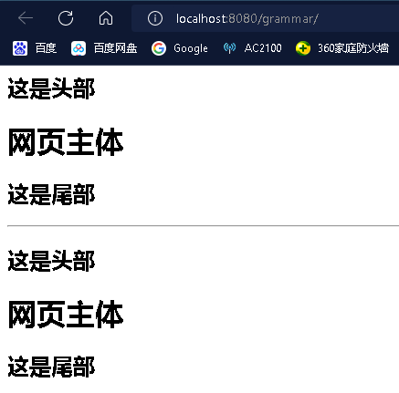

##  初识JavaWeb

### Web及Web服务器

- **万维网**（英语：World Wide Web）亦作**WWW**、**Web**、**全球广域网**，是一个透过[互联网](https://zh.m.wikipedia.org/wiki/互联网)访问的，由许多互相链接的[超文本](https://zh.m.wikipedia.org/wiki/超文本)组成的[信息系统](https://zh.m.wikipedia.org/wiki/信息系统)

- **网页服务器**（英语：Web server）一词有两个意思：

1. 一台负责提供网页的[电脑](https://zh.m.wikipedia.org/wiki/電腦)，主要是各种编程语言构建而成，通过[超文本传输协议](https://zh.m.wikipedia.org/wiki/超文本传输协议)（英语：HTTP）传给客户端（一般是指[网页浏览器](https://zh.m.wikipedia.org/wiki/網頁瀏覽器)）。

2. 一个提供网页的服务器程序。

   每一台网页服务器（第1个意思）会执行最少一个网页服务器程序（第2个意思）。此外，也通称作**Web服务器**。

### HTTP

**超文本传输协议**（英语：**H**yper**T**ext **T**ransfer **P**rotocol，缩写：**HTTP**）是一种用于分布式、协作式和[超媒体](https://zh.m.wikipedia.org/wiki/超媒體)信息系统的[应用层](https://zh.m.wikipedia.org/wiki/应用层)[协议](https://zh.m.wikipedia.org/wiki/网络传输协议)[[1\]](https://zh.m.wikipedia.org/wiki/超文本传输协议#cite_note-ietf2616-1)。HTTP是[万维网](https://zh.m.wikipedia.org/wiki/全球資訊網)的数据通信的基础。

设计HTTP最初的目的是为了提供一种发布和接收[HTML](https://zh.m.wikipedia.org/wiki/HTML)页面的方法。通过HTTP或者[HTTPS](https://zh.m.wikipedia.org/wiki/HTTPS)协议请求的资源由[统一资源标识符](https://zh.m.wikipedia.org/wiki/统一资源标志符)（Uniform Resource Identifiers，URI）来标识。

- **协议概述**

HTTP是一个客户端（用户）和服务端（网站）之间请求和应答的标准，通常使用[TCP协议](https://zh.m.wikipedia.org/wiki/传输控制协议)。通过使用[网页浏览器](https://zh.m.wikipedia.org/wiki/網頁瀏覽器)、[网络爬虫](https://zh.m.wikipedia.org/wiki/网络爬虫)或者其它的工具，客户端发起一个HTTP请求到服务器上指定端口（默认[端口](https://zh.m.wikipedia.org/wiki/通訊埠)为80）。我们称这个客户端为用户代理程序（user agent）。应答的服务器上存储着一些资源，比如HTML文件和图像。我们称这个应答服务器为源服务器（origin server）。在用户代理和源服务器中间可能存在多个“中间层”，比如[代理服务器](https://zh.m.wikipedia.org/wiki/代理伺服器)、[网关](https://zh.m.wikipedia.org/wiki/网关)或者[隧道](https://zh.m.wikipedia.org/wiki/隧道)（tunnel）。

尽管[TCP/IP](https://zh.m.wikipedia.org/wiki/TCP/IP)协议是互联网上最流行的应用，但是在HTTP协议中并没有规定它必须使用或它支持的层。事实上HTTP可以在任何互联网协议或其他网络上实现。HTTP假定其下层协议提供可靠的传输。因此，任何能够提供这种保证的协议都可以被其使用，所以其在TCP/IP协议族使用TCP作为其传输层。

通常，由HTTP客户端发起一个请求，创建一个到服务器指定端口（默认是80端口）的TCP连接。HTTP服务器则在那个端口监听客户端的请求。一旦收到请求，服务器会向客户端返回一个状态，比如"HTTP/1.1 200 OK"，以及返回的内容，如请求的文件、错误消息、或者其它信息。

- **请求方法**

  根据 HTTP 标准，HTTP 请求可以使用多种请求方法。

  HTTP1.0 定义了三种请求方法： GET, POST 和 HEAD 方法。

  HTTP1.1 新增了六种请求方法：OPTIONS、PUT、PATCH、DELETE、TRACE 和 CONNECT 方法。

  | 序号 | 方法    | 描述                                                         |
  | :--- | :------ | :----------------------------------------------------------- |
  | 1    | GET     | 请求指定的页面信息，并返回实体主体。                         |
  | 2    | HEAD    | 类似于 GET 请求，只不过返回的响应中没有具体的内容，用于获取报头 |
  | 3    | POST    | 向指定资源提交数据进行处理请求（例如提交表单或者上传文件）。数据被包含在请求体中。POST 请求可能会导致新的资源的建立和/或已有资源的修改。 |
  | 4    | PUT     | 从客户端向服务器传送的数据取代指定的文档的内容。             |
  | 5    | DELETE  | 请求服务器删除指定的页面。                                   |
  | 6    | CONNECT | HTTP/1.1 协议中预留给能够将连接改为管道方式的代理服务器。    |
  | 7    | OPTIONS | 允许客户端查看服务器的性能。                                 |
  | 8    | TRACE   | 回显服务器收到的请求，主要用于测试或诊断。                   |
  | 9    | PATCH   | 是对 PUT 方法的补充，用来对已知资源进行局部更新 。           |

- **版本**

  

   **HTTP/3**

  ### 最新版本，于2022年6月6日标准化为RFC9114。会抛弃使用TCP，通过UDP上使用QUIC来承载应用层数据。

- **状态码**

  所有HTTP响应的第一行都是**状态行**，依次是当前HTTP版本号，3位数字组成的[状态代码](https://zh.m.wikipedia.org/wiki/HTTP状态码)，以及描述状态的短语，彼此由空格分隔。

  状态代码的第一个数字代表当前响应的类型：

  - [1xx消息](https://zh.m.wikipedia.org/wiki/HTTP状态码#1xx消息)——请求已被服务器接收，继续处理
  - [2xx成功](https://zh.m.wikipedia.org/wiki/HTTP状态码#2xx成功)——请求已成功被服务器接收、理解、并接受
  - [3xx重定向](https://zh.m.wikipedia.org/wiki/HTTP状态码#3xx重定向)——需要后续操作才能完成这一请求
  - [4xx请求错误](https://zh.m.wikipedia.org/wiki/HTTP状态码#4xx请求错误)——请求含有词法错误或者无法被执行
  - [5xx服务器错误](https://zh.m.wikipedia.org/wiki/HTTP状态码#5xx服务器错误)——服务器在处理某个正确请求时发生错误

- **协议例子**

  **Request**

  HTTP的请求包括：请求行(request line)、请求头部(header)、空行 和 请求数据 四个部分组成。

  

  Http请求消息结构

  抓包的`request`结构如下：

  

  ```undefined
  GET /mix/76.html?name=kelvin&password=123456 HTTP/1.1
  Host: www.fishbay.cn
  Upgrade-Insecure-Requests: 1
  User-Agent: Mozilla/5.0 (Macintosh; Intel Mac OS X 10_11_5) AppleWebKit/537.36 (KHTML, like Gecko) Chrome/56.0.2924.87 Safari/537.36
  Accept: text/html,application/xhtml+xml,application/xml;q=0.9,image/webp,*/*;q=0.8
  Accept-Encoding: gzip, deflate, sdch
  Accept-Language: zh-CN,zh;q=0.8,en;q=0.6
  ```

  #### 1.请求行

  `GET`为请求类型，`/mix/76.html?name=kelvin&password=123456`为要访问的资源，`HTTP/1.1`是协议版本

  #### 2.请求头部

  从第二行起为请求头部，`Host`指出请求的目的地（主机域名）；`User-Agent`是客户端的信息，它是检测浏览器类型的重要信息，由浏览器定义，并且在每个请求中自动发送。

  #### 3.空行

  请求头后面必须有一个空行

  #### 4.请求数据

  请求的数据也叫请求体，可以添加任意的其它数据。这个例子的请求体为空。

  ## Response

  一般情况下，服务器收到客户端的请求后，就会有一个`HTTP`的响应消息，HTTP响应也由`4`部分组成，分别是：状态行、响应头、空行 和 响应体。

  

  **编写程序模拟web服务器获取HTTP的请求**

  ```java
  package socket;
  
  import java.io.IOException;
  import java.io.InputStream;
  import java.net.ServerSocket;
  import java.net.Socket;
  
  public class Demo {
      public static void main(String[] args) {
          //模拟web服务器，查看http的请求数据的格式
          try (ServerSocket ss = new ServerSocket(8080)){
              Socket socket = ss.accept();
              InputStream inputStream = socket.getInputStream();
              int i;
              while((i=inputStream.read())!=-1){
                  System.out.print((char)i);
              }
  
          } catch (IOException e) {
              e.printStackTrace();
          }
      }
  }
  ```

  

  **编写程序模拟web服务器响应HTTP的请求**

  ```java
  package socket;
  
  import java.io.IOException;
  import java.io.OutputStreamWriter;
  import java.net.ServerSocket;
  import java.net.Socket;
  
  public class Demo1 {
      public static void main(String[] args) {
          try(ServerSocket ss =new ServerSocket(8080)){
              Socket socket = ss.accept();
              OutputStreamWriter outputStreamWriter = new OutputStreamWriter(socket.getOutputStream());
              outputStreamWriter.write("HTTP/1.1 200 Accepted\r\n");
              outputStreamWriter.write("\r\n");
              outputStreamWriter.write("<h1>lbwnb!</h1>");
              outputStreamWriter.write("模拟Web服务器，响应请求");
              outputStreamWriter.flush();
          } catch (IOException e) {
              e.printStackTrace();
          }
      }
  }
  ```

  

  出现乱码的原因是没有规定字符的编码解码规则，字符的编码解码规则不一致导致的

- **持久连接**

  **HTTP持久连接**（英语：**HTTP persistent connection**，也称作**HTTP keep-alive**或**HTTP connection reuse**）是使用同一个[TCP](https://zh.m.wikipedia.org/wiki/传输控制协议)连接来发送和接收多个HTTP请求/应答，而不是为每一个新的请求/应答打开新的连接的方法。

- **无状态**

  HTTP无状态协议，是指协议对于事务处理没有记忆[能力](https://baike.baidu.com/item/能力/33045?fromModule=lemma_inlink)。缺少状态意味着如果后续处理需要前面的信息，则它必须重传，这样可能导致每次连接传送的数据量增大。另一方面，在服务器不需要先前信息时它的应答就较快。

  客户端与服务器进行动态交互的Web应用程序出现之后，HTTP无状态的特性严重阻碍了这些应用程序的实现，毕竟交互是需要承前启后的，简单的购物车程序也要知道用户到底在之前选择了什么商品。于是，两种用于保持HTTP连接状态的技术就应运而生了，一个是[Cookie](https://baike.baidu.com/item/Cookie?fromModule=lemma_inlink)，而另一个则是[Session](https://baike.baidu.com/item/Session?fromModule=lemma_inlink)。HTTP本身是一个无状态的[连接协议](https://baike.baidu.com/item/连接协议?fromModule=lemma_inlink)，为了支持客户端与服务器之间的交互，我们就需要通过不同的技术为交互存储状态，而这些不同的技术就是Cookie和Session了。

  - **Cookie**

    Cookie是通过客户端保持状态的[解决](https://baike.baidu.com/item/解决/32786?fromModule=lemma_inlink)方案。从定义上来说，Cookie就是由服务器发给客户端的特殊信息，而这些信息以文本文件的方式存放在客户端，然后客户端每次向服务器发送请求的时候都会带上这些特殊的信息。让我们说得更具体一些：当用户使用浏览器访问一个支持[Cookie](https://baike.baidu.com/item/Cookie/1119?fromModule=lemma_inlink)的网站的时候，用户会提供包括用户名在内的个人信息并且提交至服务器；接着，服务器在向客户端回传相应的[超文本](https://baike.baidu.com/item/超文本?fromModule=lemma_inlink)的同时也会发回这些个人信息，当然这些信息并不是存放在HTTP响应体（Response Body）中的，而是存放于HTTP响应头（Response Header）；当客户端浏览器接收到来自服务器的响应之后，浏览器会将这些信息存放在一个统一的位置，对于[Windows操作系统](https://baike.baidu.com/item/Windows操作系统/852149?fromModule=lemma_inlink)而言，我们可以从： [[系统盘](https://baike.baidu.com/item/系统盘?fromModule=lemma_inlink)]:\Documents and Settings\[用户名]\Cookies目录中找到存储的Cookie；自此，客户端再向服务器发送请求的时候，都会把相应的[Cookie](https://baike.baidu.com/item/Cookie/1119?fromModule=lemma_inlink)再次发回至服务器。而这次，Cookie信息则存放在[HTTP请求头](https://baike.baidu.com/item/HTTP请求头/6623287?fromModule=lemma_inlink)（Request Header）了

    有了Cookie这样的技术实现，服务器在接收到来自客户端浏览器的请求之后，就能够通过分析存放于请求头的Cookie得到客户端特有的信息，从而动态生成与该客户端相对应的内容。通常，我们可以从很多网站的登录界面中看到“请记住我”这样的选项，如果你勾选了它之后再登录，那么在下一次访问该网站的时候就不需要进行重复而繁琐的登录动作了，而这个功能就是通过Cookie实现的。

    [Windows 10 中所有主流浏览器的 cookie 存储在哪里？](https://gaopc.cn/130621.html)

  - **Session**

    与Cookie相对的一个解决方案是Session，它是通过服务器来保持状态的。由于[Session](https://baike.baidu.com/item/Session/479100?fromModule=lemma_inlink)这个词汇包含的语义很多，因此需要在这里明确一下 Session的含义。首先，我们通常都会把Session翻译成会话，因此我们可以把客户端浏览器与服务器之间一系列交互的动作称为一个 Session。从这个语义出发，我们会提到Session持续的时间，会提到在Session过程中进行了什么操作等等；其次，Session指的是服务器端为客户端所开辟的存储空间，在其中保存的信息就是用于保持状态。从这个语义出发，我们则会提到往Session中存放什么内容，如何根据键值从 Session中获取匹配的内容等。

    要使用Session，第一步当然是创建Session了。那么Session在何时创建呢？当然还是在服务器端程序运行的过程中创建的，不同语言实现的应用程序有不同创建Session的方法，而在[Java](https://baike.baidu.com/item/Java/85979?fromModule=lemma_inlink)中是通过调用HttpServletRequest的getSession方法（使用true作为参数）创建的。在创建了[Session](https://baike.baidu.com/item/Session/479100?fromModule=lemma_inlink)的同时，服务器会为该Session生成唯一的Session id，而这个Session id在随后的请求中会被用来重新获得已经创建的Session；在Session被创建之后，就可以调用Session相关的方法往Session中增加内容了，而这些内容只会保存在服务器中，发到客户端的只有Session id；当客户端再次发送请求的时候，会将这个Session id带上，服务器接受到请求之后就会依据Session id找到相应的Session，从而再次使用之。正是这样一个过程，用户的状态也就得以保持了。

    综上所述，HTTP本身是一个无状态的[连接协议](https://baike.baidu.com/item/连接协议/7768217?fromModule=lemma_inlink)，为了支持客户端与服务器之间的交互，我们就需要通过不同的技术为交互存储状态，而这些不同的技术就是[Cookie](https://baike.baidu.com/item/Cookie/1119?fromModule=lemma_inlink)和Session了。

- **长连接**

  **HTTP的长连接和短连接本质上是TCP长连接和短连接**。HTTP属于应用层协议，在传输层使用TCP协议，在网络层使用IP协议。IP协议主要解决网络路由和寻址问题，TCP协议主要解决如何在IP层之上可靠的传递数据包，使在网络上的另一端收到发端发出的所有包，并且顺序与发出顺序一致。TCP有可靠，面向连接的特点。

  **在HTTP/1.0中，默认使用的是短连接**。也就是说，浏览器和服务器每进行一次HTTP操作，就建立一次连接，但任务结束就中断连接。如果客户端浏览器访问的某个HTML或其他类型的 Web页中包含有其他的Web资源，如JavaScript文件、图像文件、CSS文件等；当浏览器每遇到这样一个Web资源，就会建立一个HTTP会话。

  但从 **HTTP/1.1起，默认使用长连接**，用以保持连接特性。使用长连接的HTTP协议，会在响应头有加入这行代码：

  ```
  Connection:keep-alive
  ```

  在使用长连接的情况下，当一个网页打开完成后，客户端和服务器之间用于传输HTTP数据的 TCP连接不会关闭，如果客户端再次访问这个服务器上的网页，会继续使用这一条已经建立的连接。Keep-Alive不会永久保持连接，它有一个保持时间，可以在不同的服务器软件（如Apache）中设定这个时间。实现长连接要客户端和服务端都支持长连接。
  短连接的操作步骤是：
  建立连接——数据传输——关闭连接...建立连接——数据传输——关闭连接
  长连接的操作步骤是：
  建立连接——数据传输...（保持连接）...数据传输——关闭连接

 　**长连接**多用于操作频繁，点对点的通讯，而且连接数不能太多情况，。每个TCP连接都需要三步握手，这需要时间，如果每个操作都是先连接，再操作的话那么处理速度会降低很多，所以每个操作完后都不断开，次处理时直接发送数据包就OK了，不用建立TCP连接。例如：数据库的连接用长连接， 如果用短连接频繁的通信会造成socket错误，而且频繁的socket 创建也是对资源的浪费。 

　　而像WEB网站的http服务一般都用**短链接**，因为长连接对于服务端来说会耗费一定的资源，而像WEB网站这么频繁的成千上万甚至上亿客户端的连接用短连接会更省一些资源，如果用长连接，而且同时有成千上万的用户，如果每个用户都占用一个连接的话，那可想而知吧。所以并发量大，每个用户在无需频繁操作情况下需用短连好。

### Tomcat

Tomcat 服务器是一个免费的开放源代码的Web 应用服务器(是一款网页服务器程序，是软件而非硬件)，属于轻量级应用[服务器](https://baike.baidu.com/item/服务器?fromModule=lemma_inlink)，在中小型系统和并发访问用户不是很多的场合下被普遍使用，是开发和调试JSP 程序的首选。对于一个初学者来说，可以这样认为，当在一台机器上配置好Apache 服务器，可利用它响应HTML页面的访问请求。实际上Tomcat是Apache 服务器的扩展，但运行时它是独立运行的，所以当你运行tomcat 时，它实际上作为一个与Apache 独立的进程单独运行的。

诀窍是，当配置正确时，Apache 为HTML页面服务，而Tomcat 实际上运行JSP 页面和Servlet。另外，Tomcat和[IIS](https://baike.baidu.com/item/IIS?fromModule=lemma_inlink)等Web服务器一样，具有处理HTML页面的功能，另外它还是一个Servlet和JSP容器，独立的Servlet容器是Tomcat的默认模式。不过，Tomcat处理静态[HTML](https://baike.baidu.com/item/HTML?fromModule=lemma_inlink)的能力不如Apache服务器。Tomcat最新版本为10.0.14。

### Maven

**Apache Maven**，是一个[软件](https://zh.m.wikipedia.org/wiki/软件)（特别是[Java](https://zh.m.wikipedia.org/wiki/Java_(编程语言))软件）[项目管理](https://zh.m.wikipedia.org/wiki/项目管理)及[自动构建](https://zh.m.wikipedia.org/wiki/自动构建)工具，由[Apache软件基金会](https://zh.m.wikipedia.org/wiki/Apache软件基金会)所提供。

Maven项目使用[项目对象模型](https://zh.m.wikipedia.org/wiki/项目对象模型)（Project Object Model，POM）来配置。

项目对象模型存储在名为 pom.xml 的文件中。

以下是一个简单的示例：

```xml
<project>
  <!-- model version is always 4.0.0 for Maven 2.x POMs -->
  <modelVersion>4.0.0</modelVersion>
  
  <!-- project coordinates, i.e. a group of values which
       uniquely identify this project -->
  
  <groupId>com.mycompany.app</groupId>
  <artifactId>my-app</artifactId>
  <version>1.0</version>

  <!-- library dependencies -->
  
  <dependencies>
    <dependency>
    
      <!-- coordinates of the required library -->
      
      <groupId>junit</groupId>
      <artifactId>junit</artifactId>
      <version>3.8.1</version>
      
      <!-- this dependency is only used for running and compiling tests -->
      
      <scope>test</scope>
      
    </dependency>
  </dependencies>
</project>
```

[maven之pom.xml配置文件详解 ](https://www.jianshu.com/p/0e3a1f9c9ce7)

可以通过向pom.xml添加配置，使maven自动下载pom.xml中的依赖包，配置代码可以在某些网站或者博客中找到


#### 构建流程

[构建流程 - 廖雪峰的官方网站 (liaoxuefeng.com)](https://www.liaoxuefeng.com/wiki/1252599548343744/1309301196980257)

#### 资源导出

maven的规定大于配置，我们以后可能会遇到配置文件无法导出或者生效的问题

解决方案：

```xml
<!--在build中配置resources，来防止我们资源导出失败的问题 -->
<build>
    <resources>
        
        <resource>
            <directory>src/main/resources</directory>
            <includes>
                <include>**/*.properties</include>
                <include>**/*.xml</include>
            </includes>
            <filtering>true</filtering>
        </resource>
        
        <resource>
            <directory>src/main/java</directory>
            <includes>
                <include>**/*.properties</include>
                <include>**/*.xml</include>
            </includes>
            <filtering>true</filtering>
        </resource>
        
    </resources>
</build>
```


### XML

**可扩展标记语言**（英语：E**x**tensible **M**arkup **L**anguage，简称：**XML**）是一种[标记语言](https://zh.m.wikipedia.org/wiki/标记语言)。XML设计是用来传送和携带数据信息，不用于表现和展示数据，[HTML](https://zh.m.wikipedia.org/wiki/HTML)则用来表现数据，所以XML用途的焦点是在于说明数据是什么以及携带数据信息。

- 富文档（Rich Documents）- 自定文件描述并使其更丰富
  - 属于文件为主的XML技术应用
  - 标记是用来定义一份资料应该如何呈现
- 元数据（Metadata）- 描述其它文件或网络资讯
  - 属于资料为主的XML技术应用
  - 标记是用来说明一份资料的意义
- 配置文档（Configuration Files）- 描述软件设置的参数

### JSON

**JSON**（**J**ava**S**cript **O**bject **N**otation）是由道格拉斯·克罗克福特构想和设计的一种轻量级资料交换格式。其内容由属性和值所组成，因此也有易于阅读和处理的优势。JSON是独立于编程语言的资料格式，其不仅是JavaScript的子集，也采用了C语言家族的习惯用法，目前也有许多编程语言都能够将其[解析和字符串化](https://zh.m.wikipedia.org/wiki/语法分析器)，其广泛使用的程度也使其成为通用的资料格式。

JSON最开始被广泛的应用于WEB应用的开发。不过目前JSON使用在[JavaScript](https://zh.m.wikipedia.org/wiki/JavaScript)、[Java](https://zh.m.wikipedia.org/wiki/Java)、[Node.js](https://zh.m.wikipedia.org/wiki/Node.js)、[C#](https://zh.m.wikipedia.org/wiki/C♯)应用的情况比较多，[PHP](https://zh.m.wikipedia.org/wiki/PHP)等开发的WEB应用主要还是使用[XML](https://zh.m.wikipedia.org/wiki/XML)。

JSON与XML最大的不同在于XML是一个完整的[标记语言](https://zh.m.wikipedia.org/wiki/標記語言)，而JSON不是。这使得XML在程序判读上需要比较多的功夫。主要的原因在于XML的设计理念与JSON不同。XML利用标记语言的特性提供了绝佳的延展性（如[XPath](https://zh.m.wikipedia.org/wiki/XPath)），在数据存储，扩展及高级检索方面具备对JSON的优势，而JSON则由于比XML更加小巧，以及浏览器的内建快速解析支持，使得其更适用于网络数据传输领域。

### 环境配置

#### IDEA中配置Maven

可以使用IDEA中默认的maven，也可以下载maven并配置环境变量后在IDEA中配置maven


可以通过在maven配置文件中添加国内镜像源，来优化部分资源的下载速度

#### IDEA中配置Tomcat


修改tomcat中的编码为GBK，并将IDEA的编码设置为UTF-8

[IDEA中使用Tomcat控制台中文乱码](https://www.cnblogs.com/linglongfang/p/12570719.html#:~:text=IDEA中中文控制台乱码现象主要是由于windows默认编码是GBK，idea的默认继承了windows的编码，但是tomcat默认是utf-8的，故而要么修改tomcat为GBK，要么修改IDEA为utf-8 1.,修改IDEA的bin目录下的idea64.exe.vmoptions 2.修改IDEA的项目编码配置：Settings->Editor->File Encodings)

[在配置Tomcat中出现显示不存在artifacts,或者想删除不存在的artifact的情况的解决方法](https://blog.csdn.net/qq_24584471/article/details/109245401)

### 技术点

#### Maven父子工程的理解

构建一个maven项目，这个项目中再建立Maven Moudel（相对于刚才项目的子项目）

父项目中的Java文件，子项目可以直接使用。但是子项目中的Java文件，父项目不能使用，相当于Java中的父子类的关系一样 

```java
son extends father
```

例如：如下为父项目的pom.xml

```xml
<?xml version="1.0" encoding="UTF-8"?>
<project xmlns="http://maven.apache.org/POM/4.0.0"
         xmlns:xsi="http://www.w3.org/2001/XMLSchema-instance"
         xsi:schemaLocation="http://maven.apache.org/POM/4.0.0 http://maven.apache.org/xsd/maven-4.0.0.xsd">
    <modelVersion>4.0.0</modelVersion>

    <groupId>org.example</groupId>
    <artifactId>HelloServlet</artifactId>
    <packaging>pom</packaging>
    <version>1.0-SNAPSHOT</version>
    <modules>
        <module>Servlet-01</module>
    </modules>

    <properties>
        <maven.compiler.source>8</maven.compiler.source>
        <maven.compiler.target>8</maven.compiler.target>
    </properties>

    <dependencies>
        <!-- https://mvnrepository.com/artifact/javax.servlet/javax.servlet-api -->
        <dependency>
            <groupId>javax.servlet</groupId>
            <artifactId>javax.servlet-api</artifactId>
            <version>4.0.1</version>
            <scope>provided</scope>
        </dependency>

    </dependencies>

</project>
```

如下为子项目的pom.xml

```xml
<?xml version="1.0" encoding="UTF-8"?>

<project xmlns="http://maven.apache.org/POM/4.0.0" xmlns:xsi="http://www.w3.org/2001/XMLSchema-instance"
         xsi:schemaLocation="http://maven.apache.org/POM/4.0.0 http://maven.apache.org/xsd/maven-4.0.0.xsd">
    <parent>
        <artifactId>HelloServlet</artifactId>
        <groupId>org.example</groupId>
        <version>1.0-SNAPSHOT</version>
    </parent>
    <modelVersion>4.0.0</modelVersion>

    <artifactId>Servlet-01</artifactId>
    <packaging>war</packaging>

    <name>Servlet-01 Maven Webapp</name>
    <!-- FIXME change it to the project's website -->
    <url>http://www.example.com</url>

    <properties>
        <project.build.sourceEncoding>UTF-8</project.build.sourceEncoding>
        <maven.compiler.source>1.7</maven.compiler.source>
        <maven.compiler.target>1.7</maven.compiler.target>
    </properties>

    <dependencies>

    </dependencies>

   ....
</project>
```

父项目中配置的servlet，可以在子项目中使用

## Servlet

- Servlet就是sun公司开发动态web的一门技术
- Servlet是一个接口

所以如果想开发一个Servlet程序，只需要编写一个类实现Servlet接口并且把开发好的java类部署到web服务器中就可以了

### HelloServlet

1. 构建一个Maven项目

   

   

2. 补充文件夹使maven项目完整

   

3. 配置pom.xml，添加Servlet依赖

   

4. 编写Servlet程序

  - 看源码理解代码

      
  
      ```java
      /*
      	HttpServlet中的service方法的源码，里面对于不同的Http方法（get,head,...）有不同的方法调用，我们到时候只要重写Http方法对应的方法就行
      */
      protected void service(HttpServletRequest req, HttpServletResponse resp) throws ServletException, IOException {
          String method = req.getMethod();
          long lastModified;
          if (method.equals("GET")) {
              lastModified = this.getLastModified(req);
              if (lastModified == -1L) {
                  this.doGet(req, resp);
              } else {
                  long ifModifiedSince = req.getDateHeader("If-Modified-Since");
                  if (ifModifiedSince < lastModified) {
                      this.maybeSetLastModified(resp, lastModified);
                      this.doGet(req, resp);
                  } else {
                      resp.setStatus(304);
                  }
              }
          } else if (method.equals("HEAD")) {
              lastModified = this.getLastModified(req);
              this.maybeSetLastModified(resp, lastModified);
              this.doHead(req, resp);
          } else if (method.equals("POST")) {
              this.doPost(req, resp);
          } else if (method.equals("PUT")) {
              this.doPut(req, resp);
          } else if (method.equals("DELETE")) {
              this.doDelete(req, resp);
          } else if (method.equals("OPTIONS")) {
              this.doOptions(req, resp);
          } else if (method.equals("TRACE")) {
              this.doTrace(req, resp);
          } else {
              String errMsg = lStrings.getString("http.method_not_implemented");
              Object[] errArgs = new Object[]{method};
              errMsg = MessageFormat.format(errMsg, errArgs);
              resp.sendError(501, errMsg);
          }
      
      }
      ```

   - 编写Servlet程序
  
     ```java
     package test;
     
     import javax.servlet.ServletException;
     import javax.servlet.http.HttpServlet;
     import javax.servlet.http.HttpServletRequest;
     import javax.servlet.http.HttpServletResponse;
     import java.io.IOException;
     import java.io.PrintWriter;
     
     public class HelloServlet extends HttpServlet {
         //get和post实际是对两种方式的区分，如果在Http请求方法上不想要区分的话，可以使用同样的业务逻辑处理
         @Override
         protected void doGet(HttpServletRequest req, HttpServletResponse resp) throws ServletException, IOException {
             PrintWriter writer = resp.getWriter();
             writer.println("Hello,Servlet");
         }
     
         @Override
         protected void doPost(HttpServletRequest req, HttpServletResponse resp) throws ServletException, IOException {
             doGet(req, resp);
         }
     }
     ```
  
  
  
   - 编写Servlet映射（在tomcat中注册Servlet）
  
     ```xml
     <!DOCTYPE web-app PUBLIC
      "-//Sun Microsystems, Inc.//DTD Web Application 2.3//EN"
      "http://java.sun.com/dtd/web-app_2_3.dtd" >
     
     <web-app>
       <display-name>Archetype Created Web Application</display-name>
     <!--  注册Servlet-->
       <servlet>
         <servlet-name>hello</servlet-name>
         <servlet-class>test.HelloServlet</servlet-class>
       </servlet>
     <!--  设置Servlet的请求路径-->
       <servlet-mapping>
         <servlet-name>hello</servlet-name>
         <url-pattern>/hello</url-pattern><!--  记得hello前面有'/'-->
       </servlet-mapping>
     </web-app>
     ```

5. 设置Tomcat服务器

   

6. 测试结果

   

### Web.xml配置

#### Mapping映射详解

Mapping有好几种用法如下：

**servlet可以映射一个路径**

```xml
 <servlet-mapping>
     <servlet-name>hello</servlet-name>
     <url-pattern>/hello</url-pattern>
 </servlet-mapping>
```


**servlet可以映射多个路径**

```xml
<servlet-mapping>
    <servlet-name>hello</servlet-name>
    <url-pattern>/hello</url-pattern>
</servlet-mapping>

<servlet-mapping>
    <servlet-name>hello</servlet-name>
    <url-pattern>/zhu</url-pattern>
</servlet-mapping>

<servlet-mapping>
    <servlet-name>hello</servlet-name>
    <url-pattern>/zhang</url-pattern>
</servlet-mapping>
```


**servlet可以映射公共路径**

```xml
<servlet-mapping>
    <servlet-name>hello</servlet-name>
    <url-pattern>/zhu/*</url-pattern>
</servlet-mapping>
```


**servlet可以映射默认路径**

```xml
    <servlet-mapping>
        <servlet-name>hello</servlet-name>
        <url-pattern>/*</url-pattern>
    </servlet-mapping>
```


我们可以通过给所有的路径一个默认映射来实现404页面未找到的效果

```xml
<!--  error-->
    <servlet>
        <servlet-name>error</servlet-name>
        <servlet-class>com.gowork.servlet.Errorservlet</servlet-class>
    </servlet>

    <servlet-mapping>
        <servlet-name>error</servlet-name>
        <url-pattern>/*</url-pattern>
    </servlet-mapping>
```

指定了固定的url的优先级要大于映射默认路径,这也是我们能通过默认映射来实现404页面逻辑的重要原因

**servlet可以映射前缀路径**

```xml
<servlet-mapping>
    <servlet-name>hello</servlet-name>
    <!- 注意，*前面不能加项目映射的路径（例如不能变为 "/*.zhu","/hi/*.zhu"）->
    <url-pattern>*.zhu</url-pattern>
</servlet-mapping>
```


#### 设置上下文参数

```xml
<!DOCTYPE web-app PUBLIC
 "-//Sun Microsystems, Inc.//DTD Web Application 2.3//EN"
 "http://java.sun.com/dtd/web-app_2_3.dtd" >

<web-app>
  <display-name>Archetype Created Web Application</display-name>
  <!-- 设置上下文参数-->
  <context-param>
    <param-name>url</param-name>
    <param-value>www.baidu.com</param-value>
  </context-param>
 ...
</web-app>
```

#### 设置错误页面

```xml
<!DOCTYPE web-app PUBLIC
 "-//Sun Microsystems, Inc.//DTD Web Application 2.3//EN"
 "http://java.sun.com/dtd/web-app_2_3.dtd" >

<web-app>
  <display-name>Archetype Created Web Application</display-name>
  <error-page>
    <error-code>404</error-code>
    <location>/error/404.jsp</location>
  </error-page>
  <error-page>
    <error-code>500</error-code>
    <location>/error/500.jsp</location>
  </error-page>
</web-app>
```

### ServletContext

ServletContext官方叫[servlet](https://so.csdn.net/so/search?q=servlet&spm=1001.2101.3001.7020)上下文。服务器会为每一个工程创建一个对象，这个对象就是ServletContext对象。这个对象全局唯一，而且工程内部的所有servlet都共享这个对象。所以叫全局应用程序共享对象


**ServletContext的应用**

- 共享属性
- 获取上下文参数
- 请求转发
- 读取资源文件

#### 共享属性


**SetContext**

```java
package test;

import javax.servlet.ServletContext;
import javax.servlet.ServletException;
import javax.servlet.http.HttpServlet;
import javax.servlet.http.HttpServletRequest;
import javax.servlet.http.HttpServletResponse;
import java.io.IOException;

public class SetContext extends HttpServlet {
    @Override
    protected void doGet(HttpServletRequest req, HttpServletResponse resp) throws ServletException, IOException {
        ServletContext servletContext = this.getServletContext();
        servletContext.setAttribute("name","FBDCV"); //在ServletContext中设置一个属性
    }

    @Override
    protected void doPost(HttpServletRequest req, HttpServletResponse resp) throws ServletException, IOException {
        doGet(req, resp);
    }
}
```

**GetContext**

```java
package test;

import javax.servlet.ServletContext;
import javax.servlet.ServletException;
import javax.servlet.http.HttpServlet;
import javax.servlet.http.HttpServletRequest;
import javax.servlet.http.HttpServletResponse;
import java.io.IOException;

public class GetContext extends HttpServlet {
    @Override
    protected void doGet(HttpServletRequest req, HttpServletResponse resp) throws ServletException, IOException {
        ServletContext servletContext = this.getServletContext();
        String attribute = (String)servletContext.getAttribute("name"); //获取ServletContext中的一个属性

        resp.setContentType("text/html"); //设置响应文件的类型
        resp.setCharacterEncoding("utf-8");//设置响应文件的编码

        resp.getWriter().println("名字："+attribute);
    }

    @Override
    protected void doPost(HttpServletRequest req, HttpServletResponse resp) throws ServletException, IOException {
        doGet(req, resp);
    }
}
```

**web.xml**

```xml
<!DOCTYPE web-app PUBLIC
 "-//Sun Microsystems, Inc.//DTD Web Application 2.3//EN"
 "http://java.sun.com/dtd/web-app_2_3.dtd" >

<web-app>
  <display-name>Archetype Created Web Application</display-name>
  <servlet>
    <servlet-name>setcontext</servlet-name>
    <servlet-class>test.SetContext</servlet-class>
  </servlet>
  <servlet>
    <servlet-name>getcontext</servlet-name>
    <servlet-class>test.GetContext</servlet-class>
  </servlet>

  <servlet-mapping>
    <servlet-name>getcontext</servlet-name>
    <url-pattern>/getcontext</url-pattern>
  </servlet-mapping>
  <servlet-mapping>
    <servlet-name>setcontext</servlet-name>
    <url-pattern>/setcontext</url-pattern>
  </servlet-mapping>
</web-app>
```


#### 获取上下文参数

```XML
<!DOCTYPE web-app PUBLIC
 "-//Sun Microsystems, Inc.//DTD Web Application 2.3//EN"
 "http://java.sun.com/dtd/web-app_2_3.dtd" >

<web-app>
  <display-name>Archetype Created Web Application</display-name>
  <!-- 设置上下文参数-->
  <context-param>
    <param-name>url</param-name>
    <param-value>www.baidu.com</param-value>
  </context-param>
 ...
  <servlet>
    <servlet-name>url</servlet-name>
    <servlet-class>test.GetURL</servlet-class>
  </servlet>
    
  <servlet-mapping>
    <servlet-name>url</servlet-name>
    <url-pattern>/geturl</url-pattern>
 </servlet-mapping>
</web-app>
```

```java
package test;

import javax.servlet.ServletException;
import javax.servlet.http.HttpServlet;
import javax.servlet.http.HttpServletRequest;
import javax.servlet.http.HttpServletResponse;
import java.io.IOException;

public class GetURL extends HttpServlet {
    @Override
    protected void doGet(HttpServletRequest req, HttpServletResponse resp) throws ServletException, IOException {
        String url = this.getServletContext().getInitParameter("url");
        resp.getWriter().println("URL:"+url);
    }

    @Override
    protected void doPost(HttpServletRequest req, HttpServletResponse resp) throws ServletException, IOException {
        doGet(req, resp);
    }
}

```


#### 请求转发

```java
package test;

import javax.servlet.ServletContext;
import javax.servlet.ServletException;
import javax.servlet.http.HttpServlet;
import javax.servlet.http.HttpServletRequest;
import javax.servlet.http.HttpServletResponse;
import java.io.IOException;

public class RequestDispatcher extends HttpServlet {
    @Override
    protected void doGet(HttpServletRequest req, HttpServletResponse resp) throws ServletException, IOException {
        ServletContext context = this.getServletContext();
        javax.servlet.RequestDispatcher requestDispatcher = context.getRequestDispatcher("/geturl"); //设置请求转发路径
        requestDispatcher.forward(req,resp); //调用forward实现转发
    }
    @Override
    protected void doPost(HttpServletRequest req, HttpServletResponse resp) throws ServletException, IOException {
        doGet(req, resp);
    }


}
```

```xml
<!DOCTYPE web-app PUBLIC
 "-//Sun Microsystems, Inc.//DTD Web Application 2.3//EN"
 "http://java.sun.com/dtd/web-app_2_3.dtd" >

<web-app>
  <display-name>Archetype Created Web Application</display-name>
  <context-param>
    <param-name>url</param-name>
    <param-value>www.baidu.com</param-value>
  </context-param>
 ...
    <servlet-name>url</servlet-name>
    <servlet-class>test.GetURL</servlet-class>
  </servlet>
  <servlet>
    <servlet-name>requestdispatcher</servlet-name>
    <servlet-class>test.RequestDispatcher</servlet-class>
  </servlet>
  
...
    <servlet-name>url</servlet-name>
    <url-pattern>/geturl</url-pattern>
  </servlet-mapping>
  <servlet-mapping>
    <servlet-name>requestdispatcher</servlet-name>
    <url-pattern>/request</url-pattern>
  </servlet-mapping>
</web-app>
```


#### 读取资源文件

```properties
username = admin
pwd = wz123456789
```


如果上述db.properties不存在或者不能被读取，[可看maven资源导出](#资源导出)

```java
package test;

import javax.servlet.ServletContext;
import javax.servlet.ServletException;
import javax.servlet.http.HttpServlet;
import javax.servlet.http.HttpServletRequest;
import javax.servlet.http.HttpServletResponse;
import java.io.IOException;
import java.io.InputStream;
import java.util.Properties;

public class GetData extends HttpServlet {
    @Override
    protected void doGet(HttpServletRequest req, HttpServletResponse resp) throws ServletException, IOException {
        InputStream inputStream = this.getServletContext().getResourceAsStream("/WEB-INF/classes/db.properties");
        Properties properties = new Properties();
        properties.load(inputStream);
        String username = properties.getProperty("username");
        String pwd = properties.getProperty("pwd");
        resp.getWriter().println(username+":"+pwd);
    }

    @Override
    protected void doPost(HttpServletRequest req, HttpServletResponse resp) throws ServletException, IOException {
        doGet(req, resp);
    }
}
```

```xml
<!DOCTYPE web-app PUBLIC
 "-//Sun Microsystems, Inc.//DTD Web Application 2.3//EN"
 "http://java.sun.com/dtd/web-app_2_3.dtd" >

<web-app>
  <display-name>Archetype Created Web Application</display-name>
	...
  <servlet>
    <servlet-name>getdata</servlet-name>
    <servlet-class>test.GetData</servlet-class>
  </servlet>
  	...
  <servlet-mapping>
    <servlet-name>getdata</servlet-name>
    <url-pattern>/getdata</url-pattern>
  </servlet-mapping>
</web-app>
```


### Response

**Response的应用**

#### 下载文件

[Java中获取项目根路径和类加载路径的7种方法 ](https://www.cnblogs.com/zhaosq/p/10907348.html#:~:text=在 web 项目开发过程中，可能会经常遇到要获取项目根路径的情况%2C那接下来我就总结一下，java中获取项目根路径的7种方法%2C主要是通过thisClass和System，线程和request等方法。 (1)%3Athis.getClass,().getResource ("%2F")； (2)%3Afile.getCanonicalPath ()；)

```java
package test;

import javax.servlet.ServletException;
import javax.servlet.ServletOutputStream;
import javax.servlet.http.HttpServlet;
import javax.servlet.http.HttpServletRequest;
import javax.servlet.http.HttpServletResponse;
import java.io.FileInputStream;
import java.io.IOException;

public class Download extends HttpServlet {
    @Override
    protected void doGet(HttpServletRequest req, HttpServletResponse resp) throws ServletException, IOException {
        //1.获取资源的路径
        String url = this.getClass().getResource("/img.png").getPath();
        String filename = url.substring(url.lastIndexOf("/")+1);
        //2.设置下载文件的响应头
        resp.setHeader("Content-Disposition","attachment;filename="+filename);
        //3.通过resp的流，传输文件
        FileInputStream fis = new FileInputStream(url);
        ServletOutputStream os = resp.getOutputStream();
        int len;
        byte[] buffer = new byte[1024];
        while((len=fis.read(buffer))!=-1){
            os.write(buffer,0,len);
        }

        os.flush();

        os.close();
        fis.close();
    }

    @Override
    protected void doPost(HttpServletRequest req, HttpServletResponse resp) throws ServletException, IOException {
        doGet(req, resp);
    }
}
```

```xml
<!DOCTYPE web-app PUBLIC
 "-//Sun Microsystems, Inc.//DTD Web Application 2.3//EN"
 "http://java.sun.com/dtd/web-app_2_3.dtd" >

<web-app>
  <display-name>Archetype Created Web Application</display-name>
  <servlet>
    <servlet-name>download</servlet-name>
    <servlet-class>test.Download</servlet-class>
  </servlet>
  <servlet-mapping>
    <servlet-name>download</servlet-name>
    <url-pattern>/down</url-pattern>
  </servlet-mapping>
</web-app>
```

浏览器访问：localhost:8080/resp/down自动下载图片


#### 验证码实现

```java
package test;

import javax.imageio.ImageIO;
import javax.servlet.ServletException;
import javax.servlet.http.HttpServlet;
import javax.servlet.http.HttpServletRequest;
import javax.servlet.http.HttpServletResponse;
import java.awt.*;
import java.awt.image.BufferedImage;
import java.io.IOException;
import java.text.DecimalFormat;
import java.util.Random;

public class ImageServlet extends HttpServlet {
    @Override
    protected void doGet(HttpServletRequest req, HttpServletResponse resp) throws ServletException, IOException {
        //1.设置定时刷新网页的响应头
            resp.setHeader("refresh","3");

        //2.生成验证码
        Random random = new Random();
        int tmp = random.nextInt(9999999);
        DecimalFormat format = new DecimalFormat("0000000");
        String num = format.format(tmp);

        //3.创建验证码图片
        BufferedImage image = new BufferedImage(80,20,BufferedImage.TYPE_INT_RGB);
        Graphics2D g = (Graphics2D)image.getGraphics();
        g.setBackground(Color.WHITE);
        g.fillRect(0,0,80,20);
        g.setColor(Color.BLUE);
        g.setFont(new Font(null,Font.BOLD,20));
        g.drawString(num,0,20);
        //4.设置响应头，使图片可以刷新显示
        resp.setContentType("image/jpeg");
        resp.setDateHeader("expires",-1);
        resp.setHeader("Cache-Control","no-cache");
        resp.setHeader("Pragma","no-cache");
        //5.将图片传输到客户端上
        ImageIO.write(image,"jpg",resp.getOutputStream());
    }

    @Override
    protected void doPost(HttpServletRequest req, HttpServletResponse resp) throws ServletException, IOException {
        doGet(req, resp);
    }
}
```

通过web.xml配置这个servlet的访问路径为/image,运行程序，打开浏览器访问结果如下


#### 重定向

转发和重定向是Servlet中进行页面跳转的两种方式，下图展示了其工作原理，左图为转发，右图为重定向。


**forward（转发）**：
是服务器请求资源,服务器直接访问目标地址的URL,把那个URL的响应内容读取过来,然后把这些内容再发给浏览器.浏览器根本不知道服务器发送的内容从哪里来的,因为这个跳转过程实在服务器实现的，并不是在客户端实现的所以客户端并不知道这个跳转动作，所以它的地址栏还是原来的地址.

**redirect（重定向）**：
是服务端根据逻辑,发送一个状态码,告诉浏览器重新去请求那个地址.所以地址栏显示的是新的URL.

转发是服务器行为，重定向是客户端行为。

```java
package test;

import javax.servlet.ServletException;
import javax.servlet.http.HttpServlet;
import javax.servlet.http.HttpServletRequest;
import javax.servlet.http.HttpServletResponse;
import java.io.IOException;

public class Redirect extends HttpServlet {
    @Override
    protected void doGet(HttpServletRequest req, HttpServletResponse resp) throws ServletException, IOException {
        resp.sendRedirect("/resp/image");
    }

    @Override
    protected void doPost(HttpServletRequest req, HttpServletResponse resp) throws ServletException, IOException {
       doGet(req, resp);
    }
}

```

该servlet在web.xml中注册路径为/red,运行程序，浏览器发出请求，结果如下


通过开发者工具，我们可以看到浏览器进行了两次请求，对此服务器发出了两个响应，第一个响应让浏览器重定向，第二个请求让浏览器加载图片


### Request

**Request可以获取到提交表单的数据**

**index.js**编写主页

```jsp
<%@page contentType="text/html;charset=UTF-8" language="java" %>
<html>
<head>
    <title>登录</title>
</head>
<body>
<h1>登录</h1>
<div style="text-align: center">
    <%--这里表单表示的意思，以post方式提交表单，提交到我们的login请求    --%>
    <form action="/req/login" method="post">
        用户名：<input type="text" name="username"> <br>
        密码：<input type="password" name="password"> <br>
        爱好：
        <input type="checkbox" name="hobbies" value="代码">代码
        <input type="checkbox" name="hobbies" value="电影">电影
        <input type="checkbox" name="hobbies" value="跑步">跑步
        <br>
        <input type="submit">

    </form>
</div>
</body>
</html>
```

**LoginServlet**处理主页的请求

```java
package test;

import javax.servlet.ServletException;
import javax.servlet.http.HttpServlet;
import javax.servlet.http.HttpServletRequest;
import javax.servlet.http.HttpServletResponse;
import java.io.IOException;
import java.util.Arrays;

public class LoginServlet extends HttpServlet {
    @Override
    protected void doGet(HttpServletRequest req, HttpServletResponse resp) throws ServletException, IOException {
        //设置编码
        req.setCharacterEncoding("utf-8");
        resp.setCharacterEncoding("utf-8");

        String username = req.getParameter("username");
        String password = req.getParameter("password");
        String[] hobbies = req.getParameterValues("hobbies");
        System.out.println("___________________________________________");
        System.out.println(username);
        System.out.println(password);
        System.out.println(Arrays.toString(hobbies));
        System.out.println("___________________________________________");
        req.getRequestDispatcher("/success.jsp").forward(req,resp);
        //请求转发到success.jsp
    }

    @Override
    protected void doPost(HttpServletRequest req, HttpServletResponse resp) throws ServletException, IOException {
        doGet(req, resp);
    }
}
```

注册LoginServlet的路径为**/login**

```xml
<!DOCTYPE web-app PUBLIC
 "-//Sun Microsystems, Inc.//DTD Web Application 2.3//EN"
 "http://java.sun.com/dtd/web-app_2_3.dtd" >

<web-app>
  <display-name>Archetype Created Web Application</display-name>
  <servlet>
    <servlet-name>login</servlet-name>
    <servlet-class>test.LoginServlet</servlet-class>
  </servlet>
  <servlet-mapping>
    <servlet-name>login</servlet-name>
    <url-pattern>/login</url-pattern>
  </servlet-mapping>
</web-app>
```

**success.jsp**

```jsp
<%@ page contentType="text/html; charset=UTF-8" language="java"%>
<html>
<head>
    <title>Title</title>
</head>
<body>
<h1>登录成功</h1>
</body>
</html>
```

运行结果如下：


### Cookie

[详见HTTTP](# HTTP)

```java
package test;

import javax.servlet.ServletException;
import javax.servlet.http.Cookie;
import javax.servlet.http.HttpServlet;
import javax.servlet.http.HttpServletRequest;
import javax.servlet.http.HttpServletResponse;
import java.io.IOException;
import java.io.PrintWriter;
import java.text.SimpleDateFormat;
import java.util.Date;

public class CookieServlet extends HttpServlet {
    @Override
    protected void doGet(HttpServletRequest req, HttpServletResponse resp) throws ServletException, IOException {
        //设置响应头
        resp.setContentType("text/html;charset=utf-8"); //设置响应文件为html格式
        //设置编码
        req.setCharacterEncoding("utf-8");
        resp.setCharacterEncoding("utf-8");
        //查看cookie中的内容
        PrintWriter out = resp.getWriter();

        //显示当前时间
        SimpleDateFormat df = new SimpleDateFormat("yyyy年MM月dd日 EEEE HH时mm分ss秒");
        String date = df.format(new Date(System.currentTimeMillis()));
        out.println("当前时间："+date);
        out.println("<br>");
        out.println("Cookies<br>");
        for (Cookie cookie : req.getCookies()) {
            //显示我们设置的cookie
            if(cookie.getName().equals("name")){
                out.println("name:"+cookie.getValue());
                out.println("<br>");        //换行
            }else {
                //显示系统默认添加的cookie
                out.println(cookie.getName()+":"+cookie.getValue());
                out.println("<br>");
            }
        }

        //设置cookie
        Cookie name = new Cookie("name", "fbdcv");
        name.setMaxAge(5); //可以设置cookie的有效期，参数的单位是秒
        resp.addCookie(name);

    }

    @Override
    protected void doPost(HttpServletRequest req, HttpServletResponse resp) throws ServletException, IOException {
        doGet(req, resp);
    }
}

```

设置该servlet的路径为/cookie,访问浏览器结果如下：


由于name这个cookie设置了有效时间，导致下次请求可能会无法获得这个cookie


### Session

[详见HTTTP](# HTTP)

```java
package test;

import javax.servlet.ServletException;
import javax.servlet.http.HttpServlet;
import javax.servlet.http.HttpServletRequest;
import javax.servlet.http.HttpServletResponse;
import javax.servlet.http.HttpSession;
import java.io.IOException;
import java.io.PrintWriter;

public class SessionServlet extends HttpServlet {
    @Override
    protected void doGet(HttpServletRequest req, HttpServletResponse resp) throws ServletException, IOException {
        // 设置编码
        req.setCharacterEncoding("utf-8");
        resp.setCharacterEncoding("utf-8");
        resp.setContentType("text/html;charset=utf-8");

        //获取session中的一个属性
        PrintWriter out = resp.getWriter();
        HttpSession session = req.getSession();
        out.println("SessionId:"+session.getId()+"<br>");
        out.println("Session内容："+session.getAttribute("msg")+"<br>");
        //设置一个session
        session.setAttribute("msg",new pojo.Person("admin","password"));
    }

    @Override
    protected void doPost(HttpServletRequest req, HttpServletResponse resp) throws ServletException, IOException {
        doGet(req, resp);
    }
}
```

实体类Person

```java
package pojo;

public class Person {
    private String username;
    private String password;

    public Person() {
    }

    public Person(String username, String password) {
        this.username = username;
        this.password = password;
    }

    public String getUsername() {
        return username;
    }

    public void setUsername(String username) {
        this.username = username;
    }

    public String getPassword() {
        return password;
    }

    public void setPassword(String password) {
        this.password = password;
    }

    @Override
    public String toString() {
        return "Person{" +
                "username='" + username + '\'' +
                ", password='" + password + '\'' +
                '}';
    }
}
```


web.xml配置文件

```xml
<!DOCTYPE web-app PUBLIC
 "-//Sun Microsystems, Inc.//DTD Web Application 2.3//EN"
 "http://java.sun.com/dtd/web-app_2_3.dtd" >

<web-app>
  <display-name>Archetype Created Web Application</display-name>
  <servlet>
    <servlet-name>session</servlet-name>
    <servlet-class>test.SessionServlet</servlet-class>
  </servlet>
  
  <servlet-mapping>
    <servlet-name>session</servlet-name>
    <url-pattern>/session</url-pattern>
  </servlet-mapping>

  <session-config>
  <!--设置session的过期时间，单位为分钟    -->
    <session-timeout>5</session-timeout>
  </session-config>
</web-app>
```


session可以设置过期时间，过期后形成一个新的session，当然也可以直接使其无效，然后生成一个新的session

```java
session.invalidate();
```

可以使用session来实现用户保存登录状态的效果

[Cookie、Session、Token究竟区别在哪？如何进行身份认证，保持用户登录状态？](https://www.bilibili.com/video/BV1ob4y1Y7Ep)

## JSP

**JSP**（全称**J**akarta **S**erver **P**ages，曾称为**J**ava**S**erver **P**ages）是由[Sun Microsystems](https://zh.m.wikipedia.org/wiki/Sun_Microsystems)公司主导建立的一种动态网页技术标准。

### JSP原理

JSP将Java代码和特定变动内容嵌入到静态的页面中，实现以静态页面为模板，动态生成其中的部分内容。

另外，可以创建JSP标签库，然后像使用标准HTML或XML标签一样使用它们。标签库能增强功能和服务器性能，而且不受[跨平台](https://zh.m.wikipedia.org/wiki/跨平台)问题的限制。JSP文件在运行时会被其编译器转换成更原始的[Servlet](https://zh.m.wikipedia.org/wiki/Servlet)代码。JSP编译器可以把JSP文件编译成用Java代码写的Servlet，然后再由Java编译器来编译成能快速执行的二进制[机器码](https://zh.m.wikipedia.org/wiki/機器碼)，也可以直接编译成二进制码。

```jsp
<html>
<body>
<h2>Hello World!</h2>
</body>
</html>
```


这个类是上面JSP代码的中间产物，代码打开如下，从引入的包也可以看出JSP是基于Servlet的

```java
/*
 * Generated by the Jasper component of Apache Tomcat
 * Version: Apache Tomcat/9.0.63
 * Generated at: 2022-09-29 08:52:28 UTC
 * Note: The last modified time of this file was set to
 *       the last modified time of the source file after
 *       generation to assist with modification tracking.
 */
package org.apache.jsp;

import javax.servlet.*;
import javax.servlet.http.*;
import javax.servlet.jsp.*;

public final class index_jsp extends org.apache.jasper.runtime.HttpJspBase
    implements org.apache.jasper.runtime.JspSourceDependent,
                 org.apache.jasper.runtime.JspSourceImports {

  private static final javax.servlet.jsp.JspFactory _jspxFactory =
          javax.servlet.jsp.JspFactory.getDefaultFactory();

  private static java.util.Map<java.lang.String,java.lang.Long> _jspx_dependants;

  private static final java.util.Set<java.lang.String> _jspx_imports_packages;

  private static final java.util.Set<java.lang.String> _jspx_imports_classes;

  static {
    _jspx_imports_packages = new java.util.HashSet<>();
    _jspx_imports_packages.add("javax.servlet");
    _jspx_imports_packages.add("javax.servlet.http");
    _jspx_imports_packages.add("javax.servlet.jsp");
    _jspx_imports_classes = null;
  }

  private volatile javax.el.ExpressionFactory _el_expressionfactory;
  private volatile org.apache.tomcat.InstanceManager _jsp_instancemanager;

  public java.util.Map<java.lang.String,java.lang.Long> getDependants() {
    return _jspx_dependants;
  }

  public java.util.Set<java.lang.String> getPackageImports() {
    return _jspx_imports_packages;
  }

  public java.util.Set<java.lang.String> getClassImports() {
    return _jspx_imports_classes;
  }

  public javax.el.ExpressionFactory _jsp_getExpressionFactory() {
    if (_el_expressionfactory == null) {
      synchronized (this) {
        if (_el_expressionfactory == null) {
          _el_expressionfactory = _jspxFactory.getJspApplicationContext(getServletConfig().getServletContext()).getExpressionFactory();
        }
      }
    }
    return _el_expressionfactory;
  }

  public org.apache.tomcat.InstanceManager _jsp_getInstanceManager() {
    if (_jsp_instancemanager == null) {
      synchronized (this) {
        if (_jsp_instancemanager == null) {
          _jsp_instancemanager = org.apache.jasper.runtime.InstanceManagerFactory.getInstanceManager(getServletConfig());
        }
      }
    }
    return _jsp_instancemanager;
  }

  public void _jspInit() {
  }

  public void _jspDestroy() {
  }
//判断客户端请求采用的方法（get，head，post，....）
  public void _jspService(final javax.servlet.http.HttpServletRequest request, final javax.servlet.http.HttpServletResponse response)
      throws java.io.IOException, javax.servlet.ServletException {

    if (!javax.servlet.DispatcherType.ERROR.equals(request.getDispatcherType())) {
      final java.lang.String _jspx_method = request.getMethod();
      if ("OPTIONS".equals(_jspx_method)) {
        response.setHeader("Allow","GET, HEAD, POST, OPTIONS");
        return;
      }
      if (!"GET".equals(_jspx_method) && !"POST".equals(_jspx_method) && !"HEAD".equals(_jspx_method)) {
        response.setHeader("Allow","GET, HEAD, POST, OPTIONS");
        response.sendError(HttpServletResponse.SC_METHOD_NOT_ALLOWED, "JSP 只允许 GET、POST 或 HEAD。Jasper 还允许 OPTIONS");
        return;
      }
    }
    //内置了一些对象
    final javax.servlet.jsp.PageContext pageContext;   //页面上下文
    javax.servlet.http.HttpSession session = null;     //session
    final javax.servlet.ServletContext application;    //application
    final javax.servlet.ServletConfig config;          //config
    javax.servlet.jsp.JspWriter out = null;            //out
    final java.lang.Object page = this;                //page当前页
    javax.servlet.jsp.JspWriter _jspx_out = null;
    javax.servlet.jsp.PageContext _jspx_page_context = null;


    try {
      response.setContentType("text/html");//设置响应类型
      pageContext = _jspxFactory.getPageContext(this, request, response,
      			null, true, 8192, true);
      _jspx_page_context = pageContext;
      application = pageContext.getServletContext();
      config = pageContext.getServletConfig();
      session = pageContext.getSession();
      out = pageContext.getOut();
      _jspx_out = out;
	//以上对象可以在jsp页面中直接使用
      out.write("<html>\n");
      out.write("<body>\n");
      out.write("<h2>Hello World!</h2>\n");
      out.write("</body>\n");
      out.write("</html>\n");
    } catch (java.lang.Throwable t) {
      if (!(t instanceof javax.servlet.jsp.SkipPageException)){
        out = _jspx_out;
        if (out != null && out.getBufferSize() != 0)
          try {
            if (response.isCommitted()) {
              out.flush();
            } else {
              out.clearBuffer();
            }
          } catch (java.io.IOException e) {}
        if (_jspx_page_context != null) _jspx_page_context.handlePageException(t);
        else throw new ServletException(t);
      }
    } finally {
      _jspxFactory.releasePageContext(_jspx_page_context);
    }
  }
}

```


### JSP基础语法

JSP作为Java技术的一种应用，它拥有一些自己扩充的语法，但是Java所有语法都支持！

**JSP页面指令**


通过页面指令可以设置许多东西，例如响应类型，自动刷新的时间，是否缓存，引入其他java文件...

**JSP合成页面**

header.jsp

```jsp
<%@page contentType="text/html; charset=UTF-8" language="java" %>
<html>
<body>
    <h2>这是头部</h2>
</body>
</html>
```

footer.jsp

```jsp
<%@page contentType="text/html; charset=UTF-8" language="java" %>
<html>
<body>
    <h2>这是尾部</h2>
</body>
</html>
```

index.jsp

```jsp
<%--设置响应类型和编码规则--%>
<%@page contentType="text/html; charset=UTF-8" language="java" %>
<html>
<body>
    <%--将三个页面合为一个页面    --%>
    <%@include file="common/header.jsp" %>
    <h1>网页主体</h1>
    <%@include file="common/footer.jsp" %>

    <hr>
    <%--拼接页面，实际上还是一个页面--%>
    <jsp:include page="/common/header.jsp"/>
    <h1>网页主体</h1>
    <jsp:include page="/common/footer.jsp"/>

</body>
</html>
```



相关源码如下：

```java
  out.write("\n");
  out.write("\n");
  out.write("<html>\n");
  out.write("<body>\n");
  out.write("\n");
  out.write("    ");
  out.write("\r\n");
  out.write("<html>\r\n");
  out.write("<body>\r\n");
  out.write("    <h2>这是头部</h2>\r\n");
  out.write("</body>\r\n");
  out.write("</html>");
  out.write("\n");
  out.write("    <h1>网页主体</h1>\n");
  out.write("    ");
  out.write("\r\n");
  out.write("<html>\r\n");
  out.write("<body>\r\n");
  out.write("    <h2>这是尾部</h2>\r\n");
  out.write("</body>\r\n");
  out.write("</html>");
  out.write("\n");
  out.write("\n");
  out.write("    <hr>\n");//这里是分割符
  out.write("\n");
  out.write("    ");
  org.apache.jasper.runtime.JspRuntimeLibrary.include(request, response, "/common/header.jsp", out, false);
  out.write("\n");
  out.write("    <h1>网页主体</h1>\n");
  out.write("    ");
  org.apache.jasper.runtime.JspRuntimeLibrary.include(request, response, "/common/footer.jsp", out, false);
  out.write("\n");
  out.write("\n");
  out.write("</body>\n");
  out.write("</html>\n");
```

**JSP表达式**

```jsp
<%--引入Date的类的包--%>
<%@ page import="java.util.Date" %>
<%--设置响应类型和编码规则--%>
<%@page contentType="text/html; charset=UTF-8" language="java" %>
<html>
<body>
<h2>Hello World!</h2>
<%--JSP表达式--%>
<%--
<%=变量或者表达式%>  输出变量或者表达式的值
--%>
<%= new Date()%>
</body>
</html>
```


**JSP脚本片段**

```jsp
<%--设置响应类型和编码规则--%>
<%@page contentType="text/html; charset=UTF-8" language="java" %>
<html>
<body>
<h2>Hello World!</h2>
<%--
<%脚本片段%>
--%>
<%
    int sum=0;
    for(int i=0;i<=100;i++){
        sum+=i;
    }
%>
<%=sum%>

</body>
</html>
```


```jsp
<%--设置响应类型和编码规则--%>
<%@page contentType="text/html; charset=UTF-8" language="java" %>
<html>
<body>
<%--脚本片段还可以与html标签配合使用--%>
<h2>Hello World!</h2>
<%for(int i=0;i<5;i++)%>

</body>
</html>
```


对应源码片段：

```java
//...
      out.write("\n");
      out.write("\n");
      out.write("<html>\n");
      out.write("<body>\n");
      out.write("<h2>Hello World!</h2>\n");
for(int i=0;i<5;i++){
      out.write("\n");
      out.write("        <h3>fbdcv </h3>\n");
}
      out.write("\n");
      out.write("\n");
      out.write("</body>\n");
      out.write("</html>\n");
//...
```


**JSP声明**

通过JSP声明可以将代码段放在JSP映射的那个Servlet的类中，而非类中的_jspService方法中，相当于提高了作用域

```jsp
<%--设置响应类型和编码规则--%>
<%@page contentType="text/html; charset=UTF-8" language="java" %>
<html>
<body>

<%!
        static {
                System.out.println("Loading Servlet!");
        }
        private int glbalvar = 0;
        public void test(){
                System.out.println("测试");
        }
%>


</body>
</html>
```

对应源码片段：

```java
/*
 * Generated by the Jasper component of Apache Tomcat
 * Version: Apache Tomcat/9.0.63
 * Generated at: 2022-09-30 08:29:55 UTC
 * Note: The last modified time of this file was set to
 *       the last modified time of the source file after
 *       generation to assist with modification tracking.
 */
package org.apache.jsp;

import javax.servlet.*;
import javax.servlet.http.*;
import javax.servlet.jsp.*;

public final class index_jsp extends org.apache.jasper.runtime.HttpJspBase
    implements org.apache.jasper.runtime.JspSourceDependent,
                 org.apache.jasper.runtime.JspSourceImports {


        static {
                System.out.println("Loading Servlet!");
        }
        private int glbalvar = 0;
        public void test(){
                System.out.println("测试");
        }
         //...           
}      
```

**EL表达式**

简单的来说，${} 相当于 <%= %>

[ JSP的EL表达式的使用详解](https://blog.csdn.net/qq_48033003/article/details/117508888)

### JSP内置对象

JSP 中定义了 9 个内置对象，它们分别是：request、response、session、application、out、pagecontext、config、page 和 exception，这些对象在客户端和服务器端交互的过程中分别完成不同的功能。
在 JSP 九大内置对象中，包含四个**域对象**，它们分别是：pageContext（page 域对象）、request（request 域对象）、session（session 域对象）、以及 application（application 域对象）。

JSP 中的 4 个域对象都能通过以下 3 个方法，对属性进行保存、获取和移除操作。

| 返回值类型 | 方法                                | 作用                 |
| ---------- | ----------------------------------- | -------------------- |
| void       | setAttribute(String name, Object o) | 将属性保存到域对象中 |
| Object     | getAttribute(String name)           | 获取域对象中的属性值 |
| void       | removeAttribute(String name)        | 将属性从域对象中移除 |

JSP 中的 4 个域对象的作用域各不相同，如下表。

| 作用域                        | 描述                                                         | 作用范围                                                     |
| ----------------------------- | ------------------------------------------------------------ | ------------------------------------------------------------ |
| page                          | 如果把属性保存到 pageContext 中，则它的作用域是 page。       | 该作用域中的属性只在当前 JSP 页面有效，跳转页面后失效。      |
| request                       | 如果把属性保存到 request 中，则它的作用域是 request。        | 该作用域中的属性只在当前请求范围内有效。服务器跳转页面后有效，例如<jsp:forward>；客户端跳转页面后无效，例如超链接。 |
| session                       | 如果把属性保存到 session 中，则它的作用域是 session。        | 该作用域中的属性只在当前会话范围内有效，网页关闭后失效。     |
| application（ServletContext） | 如果把属性保存到 application 中，则它的作用域是 application。 | 该作用域中的属性在整个应用范围内有效，服务器重启后失效。     |

**jsp1.jsp**

```jsp
<%@ page contentType="text/html;charset=UTF-8" language="java" %>
<%--启用EL表达式--%>
<%@ page isELIgnored="false" %>
<html>
<head>
    <title>Title</title>
</head>
<body>
    <%
        pageContext.setAttribute("name1","FBDCV1");
        request.setAttribute("name2","FBDCV2");
        session.setAttribute("name3","FBDCV3");
        application.setAttribute("name4","FBDCV4");

        String name1 = (String) pageContext.findAttribute("name1");
        String name2 = (String) pageContext.findAttribute("name2");
        String name3 = (String) pageContext.findAttribute("name3");
        String name4 = (String) pageContext.findAttribute("name4");
        String name5 = (String) pageContext.findAttribute("name5");    //属性name5是不存在的
    %>

    <h1>${name1}</h1>
    <h1>${name2}</h1>
    <h1>${name3}</h1>
    <h1>${name4}</h1>
    <h1>${name5}</h1>


</body>
</html>
```

**jsp2.jsp**

```jsp
<%@ page contentType="text/html;charset=UTF-8" language="java" %>
<%--启用EL表达式--%>
<%@ page isELIgnored="false" %>
<html>
<head>
    <title>Title</title>
</head>
<body>

<h1>${name1}</h1>
<h1>${name2}</h1>
<h1>${name3}</h1>
<h1>${name4}</h1>
<h1>${name5}</h1>

</body>
</html>
```


pageContext设置其他作用域的属性

```java
pageContext.setAttribute("name1","FBDCV1",PageContext.SESSION_SCOPE); //相当于设置了session
```

pageContext请求转发

```java
pageContext.forward("/jsp2.jsp"); //简化了之前用ServletContext请求转发的操作
```


### JSP、JSTL标签

### JavaBean

##  Ajax

## MVC

## JDBC

详见[MySQL](/MySQL/mysql.md)