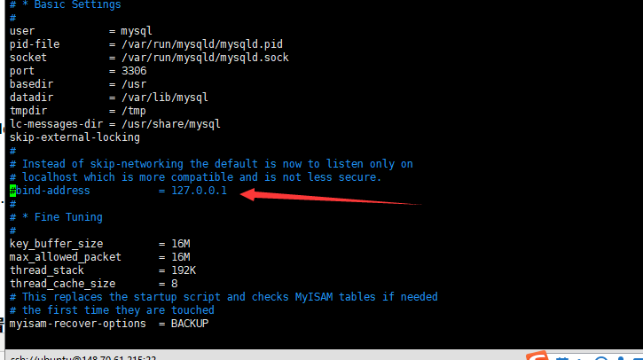

# 在Ubuntu20.04下配置MySQL5.7的环境

## 换镜像源

ubuntu 20.04系统自带源直接安装是MySQL 8.0，我要安装MySQL 5.7的版本的所以先进行换源

- 备份原来的sorce文件

  ```shell
  sudo cp /etc/apt/sources.list /etc/apt/sources.list.old
  ```

- 修改sources.list文件,替换里面的内容

  ```shell
  sudo vim /etc/apt/sources.list 
  ```

  ```txt
  # 清华镜像源
  deb https://mirrors.tuna.tsinghua.edu.cn/ubuntu/ xenial main restricted universe multiverse
  deb-src https://mirrors.tuna.tsinghua.edu.cn/ubuntu/ xenial main restricted universe multiverse
  deb https://mirrors.tuna.tsinghua.edu.cn/ubuntu/ xenial-updates main restricted universe multiverse
  deb-src https://mirrors.tuna.tsinghua.edu.cn/ubuntu/ xenial-updates main restricted universe multiverse
  deb https://mirrors.tuna.tsinghua.edu.cn/ubuntu/ xenial-backports main restricted universe multiverse
  deb-src https://mirrors.tuna.tsinghua.edu.cn/ubuntu/ xenial-backports main restricted universe multiverse
  deb https://mirrors.tuna.tsinghua.edu.cn/ubuntu/ xenial-security main restricted universe multiverse
  deb-src https://mirrors.tuna.tsinghua.edu.cn/ubuntu/ xenial-security main restricted universe multiverse
  ```

## 更新镜像源和软件

```shell
# 更新镜像源
sudo apt-get update
# 更新软件
sudo apt-get upgrade     
```


## 使用apt安装MySQL5.7

```shell
# 执行下面安装命令

# 安装mysql5.7服务端
sudo apt-get install mysql-server-5.7

# 安装mysql5.7客户端
sudo apt-get install mysql-client-5.7

# 使用c/c++等语言操作mysql的动态链接库，如果不需要可不安装
sudo apt install libmysqlclient-dev


```


## 开放3306端口

## 设置远程登录

### 修改MySQL配置文件

**打开配置文件 vi /etc/mysql/mysql.conf.d/mysqld.cnf （要有权限才能更改）**

[](https://img2018.cnblogs.com/blog/1373275/201901/1373275-20190131161945227-236579317.png)

注释掉只允许本地访问的这一行 address = 127.0.0.1 或者将改成允许地址改成 0.0.0.0

### 添加远程登录权限

打开数据库：

```sql
use mysql
```

添加所有IP都可以访问的用户：

```sql
grant all on *.* to '用户名'@'%' identified by '密码';
```

或者也可以给root用户设置为所有ip都可访问：

```sql
update user set host='%' where user='root' and host='localhost';
```

刷新权限：

```sql
flush privileges;
```

查看用户权限：select host,user from user; 

 [](https://img2018.cnblogs.com/blog/1373275/201901/1373275-20190131162103006-1520930028.png)

### 重启MySQL

```shell
# 重启
sudo /etc/init.d/mysql restart
sudo service mysql restart
# 开启
sudo /etc/init.d/mysql start
sudo /etc/init.d/mysql start
# 关闭
sudo /etc/init.d/mysql stop
sudo service mysql stop
```

## 彻底删除MySQL

```shell
sudo apt purge mysql-*
sudo rm -rf /etc/mysql/ /var/lib/mysql
sudo apt autoremove
sudo apt autoclean
```

apt-get purge 与 apt-get remove是不同的，简单来说：

- **purge**可以将包以及软件的配置文件全部删除
- **remove**仅可以删除包，但不会删除配置文件