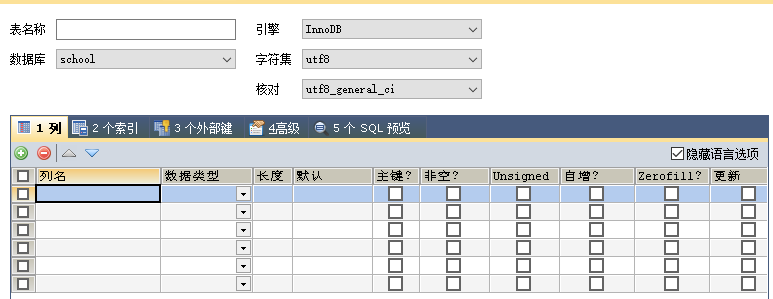

# MySQL

##  初始MySQL

### 背景知识

SQL (Structured Query Language 结构化查询语言) 是具有数据操纵和数据定义等多种功能的数据库语言，这种语言具有交互性特点，能为用户提供极大的便利，数据库管理系统应充分利用SQL语言提高计算机应用系统的工作质量与效率。SQL语言不仅能独立应用于终端，还可以作为子语言为其他程序设计提供有效助力，该程序应用中，SQL可与其他程序语言一起优化程序功能，进而为用户提供更多更全面的信息。

SQL Server和MySQL都支持SQL 它是关系数据库的标准编程语言，但每个都使用自己的扩展。确定关系数据库管理系统的另一个重要考虑因素是标准合规性。自1986年引入SQL-86标准并且SQL标准不断发展以来，SQL标准就已经存在。

MySQL支持当前的SQL标准，此外，MySQL以各种SQL模式运行，例如ANSI，STRICT TRANS TABLES，TRADITIONAL。值得注意的是，MySQL使用了几个扩展来增强SQL Server标准。因此，将MySQL应用程序移植到Microsoft SQL Server或竞争的SQL数据库引擎需要相当大的努力。

MySQL原本是一个[开放源码](https://zh.m.wikipedia.org/wiki/開放源碼)的[关联式资料库管理系统](https://zh.m.wikipedia.org/wiki/關聯式資料庫管理系統)，原开发者为[瑞典](https://zh.m.wikipedia.org/wiki/瑞典)的[MySQL AB](https://zh.m.wikipedia.org/wiki/MySQL_AB)公司，该公司于2008年被[昇阳微系统](https://zh.m.wikipedia.org/wiki/昇陽微系統)（Sun Microsystems）收购。2009年，[甲骨文公司](https://zh.m.wikipedia.org/wiki/甲骨文公司)（Oracle）收购昇阳微系统公司，MySQL成为Oracle旗下产品。

MySQL在过去由于性能高、成本低、可靠性好，已经成为最流行的开源数据库，因此被广泛地应用在[Internet](https://zh.m.wikipedia.org/wiki/Internet)上的中小型[网站](https://zh.m.wikipedia.org/wiki/網站)中。随着MySQL的不断成熟，它也逐渐用于更多大规模[网站](https://zh.m.wikipedia.org/wiki/网站)和应用，比如[维基百科](https://zh.m.wikipedia.org/wiki/维基百科)、[Google](https://zh.m.wikipedia.org/wiki/Google)和[Facebook](https://zh.m.wikipedia.org/wiki/Facebook)等网站。非常流行的开源软件组合[LAMP](https://zh.m.wikipedia.org/wiki/LAMP)中的“M”指的就是MySQL。

### 数据库分类

- 关系型数据库(SQL)：
  - MySQL、Oracle、SQL server、SQLlite
  - 通过表和表之间，行和列之间的关系进行数据的存储
- 非关系型数据库(NoSQL Not Only SQL)：
  - Redis、MongDB
  - 非关系型数据库、对象存储、通过对象的自身的属性来决定

### DBMS(数据库管理系统)

- 数据库的管理软件，科学有效的管理我们的数据库。维护和获取数据；
- MySQL，本质上是数据库管理系统

### 常用版本

- 5.7、8.0

- 推荐使用5.7版本

### MySQL下载

- 尽量下载压缩包而非exe安装程序


### 安装MySQL

1. 将压缩包解压到指定的位置

2. 将解压后的bin文件夹添加进环境变量

3. 在解压目录里面新建一个my.ini文件，并编辑该文件（注意里面的路径替换成自己的路径）

   ```ini
   [mysqld]
   # 设置mysql的安装目录
   basedir=D:\\environment\\mysql-5.7.34-winx64
   # 设置mysql数据库的数据的存放目录
   datadir=D:\\environment\\mysql-5.7.34-winx64\\data
   # 设置3306端口
   port=3306
   # 跳过验证
   skip-grant-tables
   ```

4. 启动管理员模式下的cmd，切换到mysql解压目录的bin目录，安装mysql服务

   ```shell
   mysqld -install
   ```

   这里报错的话，可以安装运行库，清空服务再安装下服务试试

   [Download Visual C++ Redistributable Packages for Visual Studio 2013 from Official Microsoft Download Center](https://www.microsoft.com/zh-CN/download/details.aspx?id=40784)

   ```shell
   sc delete mysql #清空mysql服务
   ```

5. 初始化数据库文件

   ```shell
   mysql --initialize-insecure --user=mysql
   ```

   此时解压目录会多出一个data目录

6. 启动mysql服务，并进入mysql这个程序

   ```shell
   #启动mysql服务
   net start mysql
   #进入mysql程序
   mysql -uroot -p
   ```

7. 进入界面，执行mysql语句

   ```mysql
   #修改密码
   update mysql.user set authentication_string=password('123456') where user='root' and host='localhost';
   #刷新权限
   flush privileges;
   ```

   

8. 注释mysql.ini中的跳过密码配置，重启mysql服务

   ```ini
   # 注释跳过验证
   #skip-grant-tables
   ```

   ```shell
   net stop mysql
   net start mysql
   ```

9. 使用密码登录mysql

   ```shell
   mysql -uroot -p123456
   ```

### sqlyog软件安装和使用

[参考博客 sqlyog的下载、安装、破解、配置](https://www.cnblogs.com/pengpengdeyuan/p/14364777.html)

### 基本命令行操作

```mysql
-- 所有语句都使用;结尾，MySQL支持换行
show database;   -- 查看所有的数据库
use school;		-- 切换到school这个数据库
show tables 	-- 查看数据库中的所有表
describe student;	-- 显示数据库中所有表的信息
create database west; -- 创建一个数据库west
exit;	-- 退出MySQL

-- 单行注释（SQL不来的注释）

/* (sql的多行注释)
sdgfasasdfas
asdfa
dasf
*/
-- sql里面的关键字不区分大小写
```

CRUD （增加(Create)、检索(Retrieve)、更新(Update)和删除(Delete)）增删改查

- DDL 	数据库 定义 语言 	
- DML    数据库 操作 语言
- DQL    数据库 查询 语言
- DCL    数据库 控制 语言

## 操作数据库

### 基本数据库操作

```mysql
CREATE DATABASE school

CREATE DATABASE IF NOT EXISTS west  -- 创建数据库

DROP DATABASE IF EXISTS west        -- 删除数据库

-- 如果表名或者字段名里有特殊字符或者关键字，就需要带`反引号

USE `school` 			    -- 切换数据库

SHOW DATABASES 			   -- 查看所有的数据库
```

### 数据类型


- 数值

  | 数据类型                     | 占用字节数 |
  | ---------------------------- | ---------- |
  | tinyint                      | 1          |
  | smallint                     | 2          |
  | mediumint                    | 3          |
  | int                          | 4          |
  | bigint                       | 8          |
  | float                        | 4          |
  | double                       | 8          |
  | decimal (字符串形式的浮点数) |            |

  在声明列时，后面也可以跟上 n ，例如 int(n) 。实际上这里的 n 非常鸡肋，**几乎没有任何使用场景**。它的含义是“**显示位宽**”，这个 n 无论填任何数，**不影响存储环节，仅影响在检索时的输出格式**，而且在非常严格的情况下才成立

  例如 int（5）的意思是存储最大占4个字节的数值，括号里面5的意思类似于 c语言里的格式字符 %05d ，当存储123这个数值时，检索数据时输出00123，当存储12345时，检索数据时输出12345

  要使用到该特性，必须加上 zerofill （填充0）属性

- 字符串

  | 数值类型              | 范围          |
  | --------------------- | ------------- |
  | char                  | 0~255个字符   |
  | varchar（可变字符串） | 0~65535个字符 |
  | tinytext ( 微型文本)  | 2^8-1个字符   |
  | text （文本串）       | 2^16-1个字符  |

  CHAR(n) 和 VARCHAR(n) 两者中的 n 含义均为该字段最大可容纳的**字符**数

  char(n)始终会占用n的字符，而varchar(n),会根据具体字符串的字符数调整实际保存的字符数，这也是**可变字符串**的意义,例如

  - 对于char（4）

  'a啊b' —— 字符数为3，少1个用空格补齐，因此实际存入 'a啊b ' ，字符数：4，字节数：1+3+1+1=6

  - 对于varchar（4）

  'a啊b' —— 字符数为3，不补空，实际存入为 'a啊b' ，字符数为3，字节数为 1+3+1=5

  tinytext和text定义的时候不用后面加括号限定，他们会先开辟最大空间，而后当数据存放完毕后会调整到合适的空间大小

- 时间日期

  | 类型      | 格式                | 用途                             |
  | --------- | ------------------- | -------------------------------- |
  | DATE      | YYYY-MM-DD          | 日期                             |
  | TIME      | HH:MM:SS            | 时间                             |
  | YEAR      | YYYY                | 年                               |
  | DATETIME  | YYYY-MM-DD HH:MM:SS | 日期时间                         |
  | TIMESTAMP |                     | 时间戳（1970.1.1到现在的毫秒数） |

- null

  ==注意，不要使用null进行运算，因为运算结果为null==

  [2021.07.13 B站是这样崩的_哔哩哔哩_bilibili](https://www.bilibili.com/video/BV18U4y1B7nA/?spm_id_from=333.788.recommend_more_video.1&vd_source=bfb00a87e263d9f19c059316c798b2e1)

参考资料：

[一文搞懂MySQL的数据类型中长度的含义 - 知乎 (zhihu.com)](https://zhuanlan.zhihu.com/p/111028232?from_voters_page=true)

[MySQL性能优化之char、varchar、text的区别_brycegao321的博客-CSDN博客_mysql text和varchar区别](https://blog.csdn.net/brycegao321/article/details/78038272)

### 字段属性



- Unsigned

  - 无符号整数
  - 声明了该列不能声明为负数

- Zerofill

  - 0填充
  - int（5）填入123，检索结果为00123

- 自增

  - 自动在上一条记录的基础上+1（默认）
  - 通常用来设计唯一的主键 index ，必须是整数类型
  - 可以自定义设置主键自增的起始值和步长

- 非空 not NULL

  - 设置为非空，如果不给它赋值，就会报错
  - 空字符串“”与null不一样
  - 不勾选则NULL，不填写值，默认就是null
  - 主键肯定非空

- 默认

  - 设置默认值


根据阿里巴巴规范每个表应该有以下字段！未来做项目要用

  - id 主键
  - `version`  乐观锁
  - is_delete  伪删除
  - gmt_create 创建时间
  - gmt_update 修改时间

### 创建数据库表

```mysql
 -- 目标：创建一个school数据库
 -- 创建学生表（列，字段） 使用sql创建
 -- 学号 int 登录密码varchar(20) 姓名，性别varcher(2),出生日期(datatime),家庭住址，email
 -- 字段名和表名尽量使用``括起来
 -- auto_increment 自增
 -- 字符串使用单引号或者双引号（一般使用引号）
CREATE DATABASE `school`
 
USE `school` 
 
CREATE TABLE IF NOT EXISTS `student`(
	
	`id` INT(4) NOT NULL AUTO_INCREMENT COMMENT '学号',
	`name` VARCHAR(30) NOT NULL DEFAULT'匿名'COMMENT '姓名',
	`pwd` VARCHAR(20) NOT NULL DEFAULT '12345' COMMENT '密码',
	`sex` VARCHAR(2) NOT NULL DEFAULT '女' COMMENT '性别',
	`birthday` DATETIME DEFAULT NULL COMMENT '出生日期',
	`address` VARCHAR(10) DEFAULT NULL COMMENT '地址',
	`email` VARCHAR(50) DEFAULT NULL COMMENT '邮箱',
	PRIMARY KEY(`id`)
	
)ENGINE= INNODB DEFAULT CHARSET = utf8

DROP DATABASE `school`


```

格式

```mysql
-- []表示是非必填的可选项
create table [if not exists] '表名'(
	'字段名' 列类型 [属性] [索引] [注释],
    '字段名' 列类型 [属性] [索引] [注释],
    '字段名' 列类型 [属性] [索引] [注释],
    .....
    '字段名' 列类型 [属性] [索引] [注释]
)[表类型][字符集设置][注释]
```

查看数据库和表的创建语句

```mysql
-- 可以通过show 观察建表和建数据库的sql语句方便学习
SHOW CREATE DATABASE `school`
/*
Database	Create Database
school	CREATE DATABASE `school` /*!40100 DEFAULT CHARACTER SET latin1 */
*/
SHOW CREATE TABLE `student`
/*
Table	Create Table
student	CREATE TABLE `student` (
  `id` int(4) NOT NULL AUTO_INCREMENT COMMENT '学号',
  `name` varchar(30) NOT NULL DEFAULT '匿名' COMMENT '姓名',
  `pwd` varchar(20) NOT NULL DEFAULT '12345' COMMENT '密码',
  `sex` varchar(2) NOT NULL DEFAULT '女' COMMENT '性别',
  `birthday` datetime DEFAULT NULL COMMENT '出生日期',
  `address` varchar(10) DEFAULT NULL COMMENT '地址',
  `email` varchar(50) DEFAULT NULL COMMENT '邮箱',
  PRIMARY KEY (`id`)
) ENGINE=InnoDB DEFAULT CHARSET=utf8
*/

-- 显示表的结构
desc student
```

### 数据库引擎

```mysql
-- 关于数据库引擎
/*
INNODB 默认使用~
MYISAM 早些年使用
*/
```

|              | MYISAM | INNODB                   |
| ------------ | ------ | ------------------------ |
| 事务支持     | 不支持 | 支持                     |
| 数据行锁定   | 不支持 | 支持                     |
| 外键约束     | 不支持 | 支持                     |
| 全文索引     | 支持   | 不支持                   |
| 表空间的大小 | 较小   | 较大（约为MYISAM的两倍） |

- MYISAM 节约空间 速度较快
- INNODB 安全性高，事务的处理，多表多用户操作

MySQL引擎在物理文件上的区别

​	所有数据库文件都存储在data目录下，一个文件夹就对应一个数据库

​	本质上还是文件存储！

- InnoDB在数据库里面只有一个*.frm文件，以及上级目录下的ibdata1文件
- MYISAM对应文件
  - *.frm 	表结构定义文件
  - *.MYD  数据文件（data）
  - *.MYI    索引文件（index）

设置字符集编码

```mysql
charset = utf8
```

不设置的话，会是mysql默认的字符集编码（不支持中文）

当然也可以在MySQL的配置文件里面my.ini里面添加配置

```ini
charset-set-server = utf8
```

为了兼容性，最好不要在my.ini里面配置编码，最好在建表的时候声明编码

### 修改和删除数据库表字段

> 更改表名

```sql
-- alter table 旧表名 rename as 新表名
ALTER TABLE teacher RENAME AS teacher1
```


> 增加表的字段


