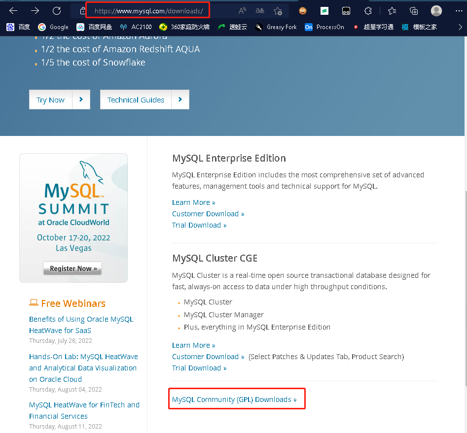
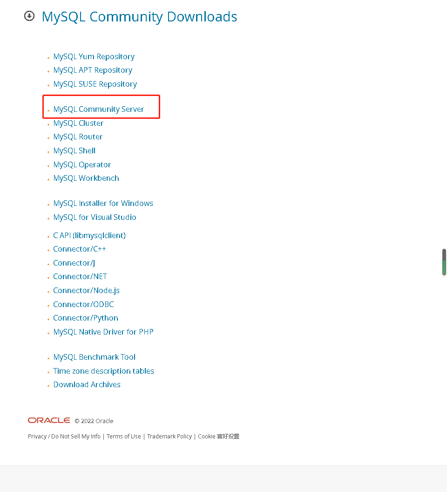

# MySQL

##  初始MySQL

### 背景知识

MySQL原本是一个[开放源码](https://zh.m.wikipedia.org/wiki/開放源碼)的[关联式资料库管理系统](https://zh.m.wikipedia.org/wiki/關聯式資料庫管理系統)，原开发者为[瑞典](https://zh.m.wikipedia.org/wiki/瑞典)的[MySQL AB](https://zh.m.wikipedia.org/wiki/MySQL_AB)公司，该公司于2008年被[昇阳微系统](https://zh.m.wikipedia.org/wiki/昇陽微系統)（Sun Microsystems）收购。2009年，[甲骨文公司](https://zh.m.wikipedia.org/wiki/甲骨文公司)（Oracle）收购昇阳微系统公司，MySQL成为Oracle旗下产品。

MySQL在过去由于性能高、成本低、可靠性好，已经成为最流行的开源数据库，因此被广泛地应用在[Internet](https://zh.m.wikipedia.org/wiki/Internet)上的中小型[网站](https://zh.m.wikipedia.org/wiki/網站)中。随着MySQL的不断成熟，它也逐渐用于更多大规模[网站](https://zh.m.wikipedia.org/wiki/网站)和应用，比如[维基百科](https://zh.m.wikipedia.org/wiki/维基百科)、[Google](https://zh.m.wikipedia.org/wiki/Google)和[Facebook](https://zh.m.wikipedia.org/wiki/Facebook)等网站。非常流行的开源软件组合[LAMP](https://zh.m.wikipedia.org/wiki/LAMP)中的“M”指的就是MySQL。

### 数据库分类

- 关系型数据库(SQL)：
  - MySQL、Oracle、SQL server、SQLlite
  - 通过表和表之间，行和列之间的关系进行数据的存储
- 非关系型数据库(NoSQL Not Only SQL)：
  - Redis、MongDB
  - 非关系型数据库、对象存储、通过对象的自身的属性来决定

### DBMS(数据库管理系统)

- 数据库的管理软件，科学有效的管理我们的数据库。维护和获取数据；
- MySQL，本质上是数据库管理系统

### 常用版本

- 5.7、8.0

- 推荐使用5.7版本

### MySQL下载

- 尽量下载压缩包而非exe安装程序





### 安装MySQL

1. 将压缩包解压到指定的位置

2. 将解压后的bin文件夹添加进环境变量

3. 在解压目录里面新建一个my.ini文件，并编辑该文件（注意里面的路径替换成自己的路径）

   ```ini
   [mysqld]
   # 设置mysql的安装目录
   basedir=D:\\environment\\mysql-5.7.34-winx64
   # 设置mysql数据库的数据的存放目录
   datadir=D:\\environment\\mysql-5.7.34-winx64\\data
   # 设置3306端口
   port=3306
   # 跳过验证
   skip-grant-tables
   ```

4. 启动管理员模式下的cmd，切换到mysql解压目录的bin目录，安装mysql服务

   ```shell
   mysqld -install
   ```

   这里报错的话，可以安装运行库，清空服务再安装下服务试试

   [Download Visual C++ Redistributable Packages for Visual Studio 2013 from Official Microsoft Download Center](https://www.microsoft.com/zh-CN/download/details.aspx?id=40784)

   ```shell
   sc delete mysql #清空mysql服务
   ```

5. 初始化数据库文件

   ```shell
   mysql --initialize-insecure --user=mysql
   ```

   此时解压目录会多出一个data目录

6. 启动mysql服务，并进入mysql这个程序

   ```shell
   #启动mysql服务
   net start mysql
   #进入mysql程序
   mysql -uroot -p
   ```

7. 进入界面，执行mysql语句

   ```mysql
   #修改密码
   update mysql.user set authentication_string=password('123456') where user='root' and host='localhost';
   #刷新权限
   flush privileges;
   ```

   

8. 注释mysql.ini中的跳过密码配置，重启mysql服务

   ```ini
   # 注释跳过验证
   #skip-grant-tables
   ```

   ```shell
   net stop mysql
   net start mysql
   ```

9. 使用密码登录mysql

   ```shell
   mysql -uroot -p123456
   ```

### sqlyog软件安装和使用

[参考博客 sqlyog的下载、安装、破解、配置](https://www.cnblogs.com/pengpengdeyuan/p/14364777.html)

