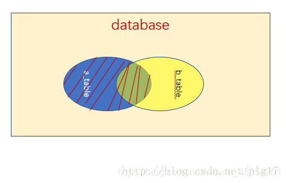

# MySQL

[思维导图](/MySQL/MySQL.svg)

##  初始MySQL

### 背景知识

SQL (Structured Query Language 结构化查询语言) 是具有数据操纵和数据定义等多种功能的数据库语言，这种语言具有交互性特点，能为用户提供极大的便利，数据库管理系统应充分利用SQL语言提高计算机应用系统的工作质量与效率。SQL语言不仅能独立应用于终端，还可以作为子语言为其他程序设计提供有效助力，该程序应用中，SQL可与其他程序语言一起优化程序功能，进而为用户提供更多更全面的信息。

SQL Server和MySQL都支持SQL 它是关系数据库的标准编程语言，但每个都使用自己的扩展。确定关系数据库管理系统的另一个重要考虑因素是标准合规性。自1986年引入SQL-86标准并且SQL标准不断发展以来，SQL标准就已经存在。

MySQL支持当前的SQL标准，此外，MySQL以各种SQL模式运行，例如ANSI，STRICT TRANS TABLES，TRADITIONAL。值得注意的是，MySQL使用了几个扩展来增强SQL Server标准。因此，将MySQL应用程序移植到Microsoft SQL Server或竞争的SQL数据库引擎需要相当大的努力。

MySQL原本是一个[开放源码](https://zh.m.wikipedia.org/wiki/開放源碼)的[关联式资料库管理系统](https://zh.m.wikipedia.org/wiki/關聯式資料庫管理系統)，原开发者为[瑞典](https://zh.m.wikipedia.org/wiki/瑞典)的[MySQL AB](https://zh.m.wikipedia.org/wiki/MySQL_AB)公司，该公司于2008年被[昇阳微系统](https://zh.m.wikipedia.org/wiki/昇陽微系統)（Sun Microsystems）收购。2009年，[甲骨文公司](https://zh.m.wikipedia.org/wiki/甲骨文公司)（Oracle）收购昇阳微系统公司，MySQL成为Oracle旗下产品。

MySQL在过去由于性能高、成本低、可靠性好，已经成为最流行的开源数据库，因此被广泛地应用在[Internet](https://zh.m.wikipedia.org/wiki/Internet)上的中小型[网站](https://zh.m.wikipedia.org/wiki/網站)中。随着MySQL的不断成熟，它也逐渐用于更多大规模[网站](https://zh.m.wikipedia.org/wiki/网站)和应用，比如[维基百科](https://zh.m.wikipedia.org/wiki/维基百科)、[Google](https://zh.m.wikipedia.org/wiki/Google)和[Facebook](https://zh.m.wikipedia.org/wiki/Facebook)等网站。非常流行的开源软件组合[LAMP](https://zh.m.wikipedia.org/wiki/LAMP)中的“M”指的就是MySQL。

### 数据库分类

- 关系型数据库(SQL)：
  - MySQL、Oracle、SQL server、SQLlite
  - 通过表和表之间，行和列之间的关系进行数据的存储
- 非关系型数据库(NoSQL Not Only SQL)：
  - Redis、MongDB
  - 非关系型数据库、对象存储、通过对象的自身的属性来决定

### DBMS(数据库管理系统)

- 数据库的管理软件，科学有效的管理我们的数据库。维护和获取数据；
- MySQL，本质上是数据库管理系统

### 常用版本

- 5.7、8.0

- 推荐使用5.7版本

### MySQL下载

- 尽量下载压缩包而非exe安装程序


### 安装MySQL

1. 将压缩包解压到指定的位置

2. 将解压后的bin文件夹添加进环境变量

3. 在解压目录里面新建一个my.ini文件，并编辑该文件（注意里面的路径替换成自己的路径）

   ```ini
   [mysqld]
   # 设置mysql的安装目录
   basedir=D:\\environment\\mysql-5.7.34-winx64
   # 设置mysql数据库的数据的存放目录
   datadir=D:\\environment\\mysql-5.7.34-winx64\\data
   # 设置3306端口
   port=3306
   # 跳过验证
   skip-grant-tables
   ```

4. 启动管理员模式下的cmd，切换到mysql解压目录的bin目录，安装mysql服务

   ```shell
   mysqld -install
   ```

   这里报错的话，可以安装运行库，清空服务再安装下服务试试

   [Download Visual C++ Redistributable Packages for Visual Studio 2013 from Official Microsoft Download Center](https://www.microsoft.com/zh-CN/download/details.aspx?id=40784)

   ```shell
   sc delete mysql #清空mysql服务
   ```

5. 初始化数据库文件

   ```shell
   mysql --initialize-insecure --user=mysql
   ```

   此时解压目录会多出一个data目录

6. 启动mysql服务，并进入mysql这个程序

   ```shell
   #启动mysql服务
   net start mysql
   #进入mysql程序
   mysql -uroot -p
   ```

7. 进入界面，执行mysql语句

   ```mysql
   #修改密码
   update mysql.user set authentication_string=password('123456') where user='root' and host='localhost';
   #刷新权限
   flush privileges;
   ```

   

8. 注释mysql.ini中的跳过密码配置，重启mysql服务

   ```ini
   # 注释跳过验证
   #skip-grant-tables
   ```

   ```shell
   net stop mysql
   net start mysql
   ```

9. 使用密码登录mysql

   ```shell
   mysql -uroot -p123456
   ```

### sqlyog软件安装和使用

[参考博客 sqlyog的下载、安装、破解、配置](https://www.cnblogs.com/pengpengdeyuan/p/14364777.html)

### 基本命令行操作

```mysql
-- 所有语句都使用;结尾，MySQL支持换行
show database;   -- 查看所有的数据库
use school;		-- 切换到school这个数据库
show tables 	-- 查看数据库中的所有表
describe student;	-- 显示数据库中所有表的信息
create database west; -- 创建一个数据库west
exit;	-- 退出MySQL

-- 单行注释（SQL不来的注释）

/* (sql的多行注释)
sdgfasasdfas
asdfa
dasf
*/
-- sql里面的关键字不区分大小写
```

CRUD （增加(Create)、检索(Retrieve)、更新(Update)和删除(Delete)）增删改查

- DDL 	数据库 定义 语言 	
- DML    数据库 操作 语言
- DQL    数据库 查询 语言
- DCL    数据库 控制 语言

## 定义数据库

### 基本数据库操作

```mysql
CREATE DATABASE school

CREATE DATABASE IF NOT EXISTS west  -- 创建数据库

DROP DATABASE IF EXISTS west        -- 删除数据库

-- 如果表名或者字段名里有特殊字符或者关键字，就需要带`反引号

USE `school` 			    -- 切换数据库

SHOW DATABASES 			   -- 查看所有的数据库
```

### 数据类型


- 数值

  | 数据类型                     | 占用字节数 |
  | ---------------------------- | ---------- |
  | tinyint                      | 1          |
  | smallint                     | 2          |
  | mediumint                    | 3          |
  | int                          | 4          |
  | bigint                       | 8          |
  | float                        | 4          |
  | double                       | 8          |
  | decimal (字符串形式的浮点数) |            |

  在声明列时，后面也可以跟上 n ，例如 int(n) 。实际上这里的 n 非常鸡肋，**几乎没有任何使用场景**。它的含义是“**显示位宽**”，这个 n 无论填任何数，**不影响存储环节，仅影响在检索时的输出格式**，而且在非常严格的情况下才成立

  例如 int（5）的意思是存储最大占4个字节的数值，括号里面5的意思类似于 c语言里的格式字符 %05d ，当存储123这个数值时，检索数据时输出00123，当存储12345时，检索数据时输出12345

  要使用到该特性，必须加上 zerofill （填充0）属性

- 字符串

  | 数值类型              | 范围          |
  | --------------------- | ------------- |
  | char                  | 0~255个字符   |
  | varchar（可变字符串） | 0~65535个字符 |
  | tinytext ( 微型文本)  | 2^8-1个字符   |
  | text （文本串）       | 2^16-1个字符  |

  CHAR(n) 和 VARCHAR(n) 两者中的 n 含义均为该字段最大可容纳的**字符**数

  char(n)始终会占用n的字符，而varchar(n),会根据具体字符串的字符数调整实际保存的字符数，这也是**可变字符串**的意义,例如

  - 对于char（4）

  'a啊b' —— 字符数为3，少1个用空格补齐，因此实际存入 'a啊b ' ，字符数：4，字节数：1+3+1+1=6

  - 对于varchar（4）

  'a啊b' —— 字符数为3，不补空，实际存入为 'a啊b' ，字符数为3，字节数为 1+3+1=5

  tinytext和text定义的时候不用后面加括号限定，他们会先开辟最大空间，而后当数据存放完毕后会调整到合适的空间大小

- 时间日期

  | 类型      | 格式                | 用途                             |
  | --------- | ------------------- | -------------------------------- |
  | DATE      | YYYY-MM-DD          | 日期                             |
  | TIME      | HH:MM:SS            | 时间                             |
  | YEAR      | YYYY                | 年                               |
  | DATETIME  | YYYY-MM-DD HH:MM:SS | 日期时间                         |
  | TIMESTAMP |                     | 时间戳（1970.1.1到现在的毫秒数） |

- null

  ==注意，不要使用null进行运算，因为运算结果为null==

  [2021.07.13 B站是这样崩的_哔哩哔哩_bilibili](https://www.bilibili.com/video/BV18U4y1B7nA/?spm_id_from=333.788.recommend_more_video.1&vd_source=bfb00a87e263d9f19c059316c798b2e1)

参考资料：

[一文搞懂MySQL的数据类型中长度的含义 - 知乎 (zhihu.com)](https://zhuanlan.zhihu.com/p/111028232?from_voters_page=true)

[MySQL性能优化之char、varchar、text的区别_brycegao321的博客-CSDN博客_mysql text和varchar区别](https://blog.csdn.net/brycegao321/article/details/78038272)

### 字段属性


- Unsigned

  - 无符号整数
  - 声明了该列不能声明为负数

- Zerofill

  - 0填充
  - int（5）填入123，检索结果为00123

- 自增

  - 自动在上一条记录的基础上+1（默认）
  - 通常用来设计唯一的主键 index ，必须是整数类型
  - 可以自定义设置主键自增的起始值和步长

- 非空 not NULL

  - 设置为非空，如果不给它赋值，就会报错
  - 空字符串“”与null不一样
  - 不勾选则NULL，不填写值，默认就是null
  - 主键肯定非空

- 默认

  - 设置默认值


根据阿里巴巴规范每个表应该有以下字段！未来做项目要用

  - id 主键
  - `version`  乐观锁
  - is_delete  伪删除
  - gmt_create 创建时间
  - gmt_update 修改时间

### 创建数据库表

```mysql
 -- 目标：创建一个school数据库
 -- 创建学生表（列，字段） 使用sql创建
 -- 学号 int 登录密码varchar(20) 姓名，性别varcher(2),出生日期(datatime),家庭住址，email
 -- 字段名和表名尽量使用``括起来
 -- auto_increment 自增
 -- 字符串使用单引号或者双引号（一般使用引号）
CREATE DATABASE `school`
 
USE `school` 
 
CREATE TABLE IF NOT EXISTS `student`(
	
	`id` INT(4) NOT NULL AUTO_INCREMENT COMMENT '学号',
	`name` VARCHAR(30) NOT NULL DEFAULT'匿名'COMMENT '姓名',
	`pwd` VARCHAR(20) NOT NULL DEFAULT '12345' COMMENT '密码',
	`sex` VARCHAR(2) NOT NULL DEFAULT '女' COMMENT '性别',
	`birthday` DATETIME DEFAULT NULL COMMENT '出生日期',
	`address` VARCHAR(10) DEFAULT NULL COMMENT '地址',
	`email` VARCHAR(50) DEFAULT NULL COMMENT '邮箱',
	PRIMARY KEY(`id`)
	
)ENGINE= INNODB DEFAULT CHARSET = utf8

DROP DATABASE `school`


```

格式

```mysql
-- []表示是非必填的可选项
create table [if not exists] '表名'(
	'字段名' 列类型 [属性] [索引] [注释],
    '字段名' 列类型 [属性] [索引] [注释],
    '字段名' 列类型 [属性] [索引] [注释],
    .....
    '字段名' 列类型 [属性] [索引] [注释]
)[表类型][字符集设置][注释]
```

查看数据库和表的创建语句

```mysql
-- 可以通过show 观察建表和建数据库的sql语句方便学习
SHOW CREATE DATABASE `school`
/*
Database	Create Database
school	CREATE DATABASE `school` /*!40100 DEFAULT CHARACTER SET latin1 */
*/
SHOW CREATE TABLE `student`
/*
Table	Create Table
student	CREATE TABLE `student` (
  `id` int(4) NOT NULL AUTO_INCREMENT COMMENT '学号',
  `name` varchar(30) NOT NULL DEFAULT '匿名' COMMENT '姓名',
  `pwd` varchar(20) NOT NULL DEFAULT '12345' COMMENT '密码',
  `sex` varchar(2) NOT NULL DEFAULT '女' COMMENT '性别',
  `birthday` datetime DEFAULT NULL COMMENT '出生日期',
  `address` varchar(10) DEFAULT NULL COMMENT '地址',
  `email` varchar(50) DEFAULT NULL COMMENT '邮箱',
  PRIMARY KEY (`id`)
) ENGINE=InnoDB DEFAULT CHARSET=utf8
*/

-- 显示表的结构
desc student
```

### 数据库引擎

```mysql
-- 关于数据库引擎
/*
INNODB 默认使用~
MYISAM 早些年使用
*/
```

|              | MYISAM | INNODB                   |
| ------------ | ------ | ------------------------ |
| 事务支持     | 不支持 | 支持                     |
| 数据行锁定   | 不支持 | 支持                     |
| 外键约束     | 不支持 | 支持                     |
| 全文索引     | 支持   | 不支持                   |
| 表空间的大小 | 较小   | 较大（约为MYISAM的两倍） |

- MYISAM 节约空间 速度较快
- INNODB 安全性高，事务的处理，多表多用户操作

MySQL引擎在物理文件上的区别

​	所有数据库文件都存储在data目录下，一个文件夹就对应一个数据库

​	本质上还是文件存储！

- InnoDB在数据库里面只有一个*.frm文件，以及上级目录下的ibdata1文件
- MYISAM对应文件
  - *.frm 	表结构定义文件
  - *.MYD  数据文件（data）
  - *.MYI    索引文件（index）

设置字符集编码

```mysql
charset = utf8
```

不设置的话，会是mysql默认的字符集编码（不支持中文）

当然也可以在MySQL的配置文件里面my.ini里面添加配置

```ini
charset-set-server = utf8
```

为了兼容性，最好不要在my.ini里面配置编码，最好在建表的时候声明编码

### 修改和删除数据库表字段

> 更改表名

```sql
-- alter table 旧表名 rename as 新表名
ALTER TABLE teacher RENAME AS teacher1
```

如果我们想修改表结构，我们可以通过`alter table`来进行修改：

```sql
ALTER TABLE 表名[ADD 新列名 数据类型[列级约束条件]]
							 [DROP COLUMN 列名[restrict|cascade]]
							 [ALTER COLUMN 列名 新数据类型]
```

我们可以通过ADD来添加一个新的列，通过DROP来删除一个列，不过我们可以添加restrict或cascade，默认是restrict，表示如果此列作为其他表的约束或视图引用到此列时，将无法删除，而cascade会强制连带引用此列的约束、视图一起删除。还可以通过ALTER来修改此列的属性。

## 操作数据

### 插入数据

通过使用`insert into`语句来向数据库中插入一条数据（一条记录）：

```sql
INSERT INTO 表名 VALUES(值1, 值2, 值3)
```

如果插入的数据与列一一对应，那么可以省略列名，但是如果希望向指定列上插入数据，就需要给出列名：

```sql
INSERT INTO 表名(列名1, 列名2) VALUES(值1, 值2)
```

我们也可以一次性向数据库中插入多条数据：

```sql
INSERT INTO 表名(列名1, 列名2) VALUES(值1, 值2), (值1, 值2), (值1, 值2)
```

我们来试试看向我们刚刚创建的表中添加三条数据。

### 修改数据

我们可以通过`update`语句来更新表中的数据：

```sql
UPDATE 表名 SET 列名=值,... WHERE 条件
```

注意，SQL语句中的等于判断是`=`

**警告：**如果忘记添加`WHERE`字句来限定条件，将使得整个表中此列的所有数据都被修改！

### 删除数据

我们可以通过使用`delete`来删除表中的数据：

```sql
DELETE FROM 表名
```

通过这种方式，将删除表中全部数据，我们也可以使用`where`来添加条件，只删除指定的数据：

```sql
DELETE FROM 表名 WHERE 条件
```

## 查询数据

数据库的查询是我们整个数据库学习中的重点内容，面对数据库中庞大的数据，该如何去寻找我们想要的数据，就是我们主要讨论的问题。

### 单表查询

单表查询是最简单的一种查询，我们只需要在一张表中去查找数据即可，通过使用`select`语句来进行单表查询：

```sql
-- 指定查询某一列数据
SELECT 列名[,列名] FROM 表名
-- 会以别名显示此列
SELECT 列名 别名 FROM 表名
-- 查询所有的列数据
SELECT * FROM 表名
-- 只查询不重复的值
SELECT DISTINCT 列名 FROM 表名
```

我们也可以添加`where`字句来限定查询目标：

```sql
SELECT * FROM 表名 WHERE 条件
```

### 常用查询条件

* 一般的比较运算符，包括=、>、<、>=、<=、!=等。
* 是否在集合中：in、not in
* 字符模糊匹配：like，not like
* 多重条件连接查询：and、or、not

我们来尝试使用一下上面这几种条件。

### 排序查询

我们可以通过`order by`来将查询结果进行排序：

```sql
SELECT * FROM 表名 WHERE 条件 ORDER BY 列名 ASC|DESC
```

使用ASC表示升序排序，使用DESC表示降序排序，默认为升序。

我们也可以可以同时添加多个排序：

```sql
SELECT * FROM 表名 WHERE 条件 ORDER BY 列名1 ASC|DESC, 列名2 ASC|DESC
```

这样会先按照列名1进行排序，每组列名1相同的数据再按照列名2排序。

### 聚集函数

聚集函数一般用作统计，包括：

* `count([distinct]*)`统计所有的行数（distinct表示去重再统计，下同）
* `count([distinct]列名)`统计某列的值总和
* `sum([distinct]列名)`求一列的和（注意必须是数字类型的）
* `avg([distinct]列名)`求一列的平均值（注意必须是数字类型）
* `max([distinct]列名)`求一列的最大值
* `min([distinct]列名)`求一列的最小值

一般聚集函数是这样使用的：

```sql
SELECT count(distinct 列名) FROM 表名 WHERE 条件 
```

### 分组和分页查询

通过使用`group by`来对查询结果进行分组，它需要结合聚合函数一起使用：

```sql
SELECT sum(*) FROM 表名 WHERE 条件 GROUP BY 列名
```

我们还可以添加`having`来限制分组条件：

```sql
SELECT sum(*) FROM 表名 WHERE 条件 GROUP BY 列名 HAVING 约束条件
```

我们可以通过`limit`来限制查询的数量，只取前n个结果：

```sql
SELECT * FROM 表名 LIMIT 数量
```

我们也可以进行分页：

```sql
SELECT * FROM 表名 LIMIT 起始位置,数量
```

### 多表查询

多表查询是同时查询的两个或两个以上的表，多表查询会提通过连接转换为单表查询。

```sql
SELECT * FROM 表1, 表2
```

直接这样查询会得到两张表的笛卡尔积，也就是每一项数据和另一张表的每一项数据都结合一次，会产生庞大的数据。

```sql
SELECT * FROM 表1, 表2 WHERE 条件
```

这样，只会从笛卡尔积的结果中得到满足条件的数据。

**注意：**如果两个表中都带有此属性吗，需要添加表名前缀来指明是哪一个表的数据。

### 自身连接查询

自身连接，就是将表本身和表进行笛卡尔积计算，得到结果，但是由于表名相同，因此要先起一个别名：

```sql
SELECT * FROM 表名 别名1, 表名 别名2
```

其实自身连接查询和前面的是一样的，只是连接对象变成自己和自己了。

### 外连接查询


外连接就是专门用于联合查询情景的，比如现在有一个存储所有用户的表，还有一张用户详细信息的表，我希望将这两张表结合到一起来查看完整的数据，我们就可以通过使用外连接来进行查询，外连接有三种方式：

* 通过使用`inner join`进行内连接，只会返回两个表满足条件的交集部分：


* 通过使用`left join`进行左连接，不仅会返回两个表满足条件的交集部分，也会返回左边表中的全部数据，而在右表中缺失的数据会使用`null`来代替（右连接`right join`同理，只是反过来而已，这里就不再介绍了）：



### 嵌套查询

我们可以将查询的结果作为另一个查询的条件，比如：

```sql
SELECT * FROM 表名 WHERE 列名 = (SELECT 列名 FROM 表名 WHERE 条件)
```

我们来再次尝试编写一下在最开始我们查找某教师所有学生的SQL语句。

## 事务

事务具有以下特性：

- **原子性：**一个事务（transaction）中的所有操作，要么全部完成，要么全部不完成，不会结束在中间某个环节。事务在执行过程中发生错误，会被回滚（Rollback）到事务开始前的状态，就像这个事务从来没有执行过一样。
- **一致性：**在事务开始之前和事务结束以后，数据库的完整性没有被破坏。这表示写入的资料必须完全符合所有的预设规则，这包含资料的精确度、串联性以及后续数据库可以自发性地完成预定的工作。
- **隔离性：**数据库允许多个并发事务同时对其数据进行读写和修改的能力，隔离性可以防止多个事务并发执行时由于交叉执行而导致数据的不一致。事务隔离分为不同级别，包括读未提交（Read uncommitted）、读提交（read committed）、可重复读（repeatable read）和串行化（Serializable）。
- **持久性：**事务处理结束后，对数据的修改就是永久的，即便系统故障也不会丢失。

我们通过以下例子来探究以下事务：

```sql
begin;   #开始事务
...
rollback;  #回滚事务
savepoint 回滚点;  #添加回滚点
rollback to 回滚点; #回滚到指定回滚点
...
commit; #提交事务
-- 一旦提交，就无法再进行回滚了！
```

## 索引

在数据量变得非常庞大时，通过创建索引，能够大大提高我们的查询效率，就像Hash表一样，它能够快速地定位元素存放的位置，我们可以通过下面的命令创建索引：

```sql
-- 创建索引
CREATE INDEX 索引名称 ON 表名 (列名)
-- 查看表中的索引
show INDEX FROM student
```

我们也可以通过下面的命令删除一个索引：

```sql
drop index 索引名称 on 表名
```

虽然添加索引后会使得查询效率更高，但是我们不能过度使用索引，索引为我们带来高速查询效率的同时，也会在数据更新时产生额外建立索引的开销，同时也会占用磁盘资源。

## 用户权限

庞大的数据库不可能由一个人来管理，我们需要更多的用户来一起管理整个数据库。

### 创建用户

我们可以通过`create user`来创建用户：

```sql
CREATE USER 用户名 identified by 密码;
```

也可以不带密码：

```sql
CREATE USER 用户名;
```

我们可以通过@来限制用户登录的登录IP地址，`%`表示匹配所有的IP地址，默认使用的就是任意IP地址。

### 登陆用户

首先需要添加一个环境变量，然后我们通过cmd去登陆mysql：

```sql
login -u 用户名 -p
```

输入密码后即可登陆此用户，我们输入以下命令来看看能否访问所有数据库：

```sql
show databases;
```

我们发现，虽然此用户能够成功登录，但是并不能查看完整的数据库列表，这是因为此用户还没有权限！

### 用户授权

我们可以通过使用`grant`来为一个数据库用户进行授权：

```sql
grant all|权限1,权限2...(列1,...) on 数据库.表 to 用户 [with grant option]
```

其中all代表授予所有权限，当数据库和表为`*`，代表为所有的数据库和表都授权。如果在最后添加了`with grant option`，那么被授权的用户还能将已获得的授权继续授权给其他用户。

我们可以使用`revoke`来收回一个权限：

```sql
revoke all|权限1,权限2...(列1,...) on 数据库.表 from 用户
```

## 触发器

触发器就像其名字一样，在某种条件下会自动触发，在`select`/`update`/`delete`时，会自动执行我们预先设定的内容，触发器通常用于检查内容的安全性，相比直接添加约束，触发器显得更加灵活。

触发器所依附的表称为基本表，当触发器表上发生`select`/`update`/`delete`等操作时，会自动生成两个临时的表（new表和old表，只能由触发器使用）

比如在`insert`操作时，新的内容会被插入到new表中；在`delete`操作时，旧的内容会被移到old表中，我们仍可在old表中拿到被删除的数据；在`update`操作时，旧的内容会被移到old表中，新的内容会出现在new表中。

```sql
CREATE TRIGGER 触发器名称 [BEFORE|AFTER] [INSERT|UPDATE|DELETE] ON 表名/视图名 FOR EACH ROW DELETE FROM student WHERE student.sno = new.sno
```

 FOR EACH ROW表示针对每一行都会生效，无论哪行进行指定操作都会执行触发器！

通过下面的命令来查看触发器：

```sql
SHOW TRIGGERS
```

如果不需要，我们就可以删除此触发器：

```sql
DROP TRIGGER 触发器名称
```

## JDBC

### JDBC简介

[JDBC简介](https://www.liaoxuefeng.com/wiki/1252599548343744/1305152088703009)

什么是JDBC？JDBC是Java DataBase Connectivity的缩写，它是Java程序访问数据库的标准接口。

使用Java程序访问数据库时，Java代码并不是直接通过TCP连接去访问数据库，而是通过JDBC接口来访问，而JDBC接口则通过JDBC驱动来实现真正对数据库的访问。

例如，我们在Java代码中如果要访问MySQL，那么必须编写代码操作JDBC接口。注意到JDBC接口是Java标准库自带的，所以可以直接编译。而具体的JDBC驱动是由数据库厂商提供的，例如，MySQL的JDBC驱动由Oracle提供。因此，访问某个具体的数据库，我们只需要引入该厂商提供的JDBC驱动，就可以通过JDBC接口来访问，这样保证了Java程序编写的是一套数据库访问代码，却可以访问各种不同的数据库，因为他们都提供了标准的JDBC驱动：

```ascii
┌ ─ ─ ─ ─ ─ ─ ─ ─ ─ ─ ┐

│  ┌───────────────┐  │
   │   Java App    │
│  └───────────────┘  │
           │
│          ▼          │
   ┌───────────────┐
│  │JDBC Interface │<─┼─── JDK
   └───────────────┘
│          │          │
           ▼
│  ┌───────────────┐  │
   │  JDBC Driver  │<───── Vendor
│  └───────────────┘  │
           │
└ ─ ─ ─ ─ ─│─ ─ ─ ─ ─ ┘
           ▼
   ┌───────────────┐
   │   Database    │
   └───────────────┘
```

从代码来看，Java标准库自带的JDBC接口其实就是定义了一组接口，而某个具体的JDBC驱动其实就是实现了这些接口的类：

```ascii
┌ ─ ─ ─ ─ ─ ─ ─ ─ ─ ─ ┐

│  ┌───────────────┐  │
   │   Java App    │
│  └───────────────┘  │
           │
│          ▼          │
   ┌───────────────┐
│  │JDBC Interface │<─┼─── JDK
   └───────────────┘
│          │          │
           ▼
│  ┌───────────────┐  │
   │ MySQL Driver  │<───── Oracle
│  └───────────────┘  │
           │
└ ─ ─ ─ ─ ─│─ ─ ─ ─ ─ ┘
           ▼
   ┌───────────────┐
   │     MySQL     │
   └───────────────┘
```

实际上，一个MySQL的JDBC的驱动就是一个jar包，它本身也是纯Java编写的。我们自己编写的代码只需要引用Java标准库提供的java.sql包下面的相关接口，由此再间接地通过MySQL驱动的jar包通过网络访问MySQL服务器，所有复杂的网络通讯都被封装到JDBC驱动中，因此，Java程序本身只需要引入一个MySQL驱动的jar包就可以正常访问MySQL服务器：

```ascii
┌ ─ ─ ─ ─ ─ ─ ─ ─ ─ ─ ┐
   ┌───────────────┐
│  │   App.class   │  │
   └───────────────┘
│          │          │
           ▼
│  ┌───────────────┐  │
   │  java.sql.*   │
│  └───────────────┘  │
           │
│          ▼          │
   ┌───────────────┐     TCP    ┌───────────────┐
│  │ mysql-xxx.jar │──┼────────>│     MySQL     │
   └───────────────┘            └───────────────┘
└ ─ ─ ─ ─ ─ ─ ─ ─ ─ ─ ┘
          JVM
```

使用JDBC的好处是：

- 各数据库厂商使用相同的接口，Java代码不需要针对不同数据库分别开发；
- Java程序编译期仅依赖java.sql包，不依赖具体数据库的jar包；
- 可随时替换底层数据库，访问数据库的Java代码基本不变。

### 第一个JDBC程序

- 创建测试数据库

  ```sql
  CREATE DATABASE jdbcstudy CHARACTER SET utf8 COLLATE utf8_general_ci;
  
  USER jdbcstudy;
  
  CREATE TABLE users(
    `id` INT PRIMARY KEY,
    `name` VARCHAR(40),
    `password` VARCHAR(40),
    `email` VARCHAR(60),
    `birthday` DATE
  );
  
  INSERT INTO users(`id`,`name`,`password`,`email`,`birthday`)
  VALUES(1,'张三','123456','zs@sina.com','1980-12-04'),
  (2,'李四','123456','lisi@sina.com','1981-12-04'),
  (3,'王五','123456','wangwu@sina.com','1982-12-04');
  ```

- 导入MySQL驱动

  - 下载驱动

  

  - 在项目目录下创建lib目录，解压下载的驱动，复制jar包到lib目录

    

  - 添加依赖

    

    

- 编写代码 

```java
package lesson01;

import java.sql.*;

//我的第一个jdbc程序
public class JdbcFirstDemo {
    public static void main(String[] args) throws ClassNotFoundException, SQLException {
        //1.加载驱动
        Class.forName("com.mysql.jdbc.Driver");
        //2.用户信息和url
        String url = "jdbc:mysql://localhost:3306/jdbcstudy?useUnicode=true&characterEncoding=utf8&useSSL=false";
        String username = "root";
        String password = "wz123456789";
        //3.连接数据库
        Connection connection = DriverManager.getConnection(url, username, password);

        //4.创建SQL对象
        Statement statement = connection.createStatement();
        //5.执行语句
        String sql  ="select * from users";
        ResultSet resultSet = statement.executeQuery(sql);
        while (resultSet.next()){
            System.out.println("id:"+resultSet.getObject("id"));
            System.out.println("name:"+resultSet.getObject("name"));
            System.out.println("pwd:"+resultSet.getObject("password"));
            System.out.println("email:"+resultSet.getObject("email"));
            System.out.println("birthday:"+resultSet.getObject("birthday"));
        }
        //6.关闭连接
        resultSet.close();
        statement.close();
        connection.close();
    }
}

```


代码解析

```java
 Class.forName("com.mysql.jdbc.Driver");
 //使用注解，会初始化静态变量和静态代码块，而驱动的核心代码就写在静态代码块中，所以可以直接使用注解加载驱动
```


```java
String url = "jdbc:mysql://localhost:3306/jdbcstudy?useUnicode=true&characterEncoding=utf8&useSSL=false";
/*url分析
jdbc:mysql:        可以看成协议例如http:

localhoset:3306    服务器的ip和服务的端口号

/jdbcstudy		   数据库

?useUnicode=true&characterEncoding=utf8&useSSL=false    使用unicode编码，选择utf-8编码，不使用ssl    ?参数1&参数2&参数3& ...

*/

```


```java
Connection connection = DriverManager.getConnection(url, username, password);
//connection相当于获得了数据库的对象,意味着可以通过代码直接操作数据库，例如 事务提交 事务回滚 设置自动提交
connection.commit();
connection.rollback();
connection.setAutoCommit(true);
```


```java
Statement statement = connection.createStatement();
String sql  ="select * from users";
ResultSet resultSet = statement.executeQuery(sql);
/*
	statement.execute();		可以执行任意sql
	statement.executeQuery();	查询操作返回ResultSet
	statement.executeUpdate();	返回受影响的行数

*/
```


```java
String sql  ="select * from users";
ResultSet resultSet = statement.executeQuery(sql);
while (resultSet.next()){
            System.out.println("id:"+resultSet.getObject("id"));
            System.out.println("name:"+resultSet.getObject("name"));
            System.out.println("pwd:"+resultSet.getObject("password"));
            System.out.println("email:"+resultSet.getObject("email"));
            System.out.println("birthday:"+resultSet.getObject("birthday"));
        }
/*
ResultSet
迭代器 （获得行）
resultSet.beforeFirst()
resultSet.afterLast()
resultSet.next()
resultSet.previous()
resultSet.absolute()
得到指定类型（获得指定行的列值）
resultSet.getObject()	//在不知道列类型的情况下使用
resultSet.getString()
resultSet.getInt()
resultSet.getDate();
....
*/
```


```java
        resultSet.close();
        statement.close();
        connection.close();
//不关闭将相当浪费资源
```


### 编写JDBC工具类

- 编写db.properties配置文件

```properties
driver = com.mysql.jdbc.Driver
url = jdbc:mysql://localhost:3306/jdbcstudy?useUnicode=true&characterEncoding=utf8&useSSL=false
username =root
password=wz123456789
```

- 编写工具类

  

```java
package lesson02;

import java.io.IOException;
import java.io.InputStream;
import java.sql.*;
import java.util.Properties;

public class JdbcUtils {
    private static String dirver =null;
    private static String url =null;
    private static String username =null;
    private static String password =null;

    static {

        try {
            //读取配置数据
            InputStream in = JdbcUtils.class.getClassLoader().getResourceAsStream("db.properties");
            Properties properties = new Properties();
            properties.load(in);

            dirver=properties.getProperty("driver");
            url=properties.getProperty("url");
            username=properties.getProperty("username");
            password=properties.getProperty("password");
            //加载驱动
            Class.forName(dirver);
        } catch (IOException | ClassNotFoundException e) {
            throw new RuntimeException(e);
        }

    }

    //获取连接
    public static Connection getConnection() throws SQLException{
        return DriverManager.getConnection(url,username,password);
    }

    //释放连接资源
    public static void release(Connection conn,Statement st,ResultSet rs) {
        try {
            if(rs!=null){
                rs.close();
            }
        } catch (SQLException e) {
            e.printStackTrace();
        }
        try {
            if(st!=null) {
                st.close();
            }
        } catch (SQLException e) {
            e.printStackTrace();
        }
        try {
            if(conn!=null){
                conn.close();
            }
        } catch (SQLException e) {
            e.printStackTrace();
        }
    }


}
```

- 测试增删改查

  - 增删改的sql语句载入用executeUpdate，查的sql语句载入用executeQuery

  ```java
  package lesson02;
  
  import java.sql.Connection;
  import java.sql.ResultSet;
  import java.sql.SQLException;
  import java.sql.Statement;
  
  public class TestInsert {
      public static void main(String[] args) {
          Connection conn = null;
          Statement st= null;
          ResultSet rs = null;
  
          try {
              conn = JdbcUtils.getConnection();
              st = conn.createStatement();
              String sql ="insert into users(id,`NAME`,`PASSWORD`,`email`,`birthday`)"+
                      "values (4,'kuangshen','wz123456789','2434897168@qq.com','2022-08-06')";
              int i = st.executeUpdate(sql);
              if(i>0){
                  System.out.println("插入成功！");
              }
          } catch (SQLException e) {
              e.printStackTrace();
          }finally {
              JdbcUtils.release(conn,st,rs);
          }
      }
  
  }
  ```

```java
package lesson02;

import java.sql.Connection;
import java.sql.ResultSet;
import java.sql.SQLException;
import java.sql.Statement;

public class TestDelete {
    public static void main(String[] args) {
        Connection conn = null;
        Statement st= null;
        ResultSet rs = null;

        try {
            conn = JdbcUtils.getConnection();
            st = conn.createStatement();
            String sql ="delete from users where id =4";
            int i = st.executeUpdate(sql);
            if(i>0){
                System.out.println("删除成功！");
            }
        } catch (SQLException e) {
            e.printStackTrace();
        }finally {
            JdbcUtils.release(conn,st,rs);
        }
    }
}
```


```java
package lesson02;

import java.sql.Connection;
import java.sql.ResultSet;
import java.sql.SQLException;
import java.sql.Statement;

public class TestUpdate {
    public static void main(String[] args) {
        Connection conn = null;
        Statement st= null;
        ResultSet rs = null;

        try {
            conn = JdbcUtils.getConnection();
            st = conn.createStatement();
            String sql ="update users set `NAME`='kuangshen',email='24736743@qq.com' where  id = 1";
            int i = st.executeUpdate(sql);
            if(i>0){
                System.out.println("更新成功！");
            }
        } catch (SQLException e) {
            e.printStackTrace();
        }finally {
            JdbcUtils.release(conn,st,rs);
        }
    }
}
```


```java
package lesson02;

import java.sql.Connection;
import java.sql.ResultSet;
import java.sql.SQLException;
import java.sql.Statement;

public class TestSelect {
    public static void main(String[] args) {
        Connection conn = null;
        Statement st= null;
        ResultSet rs = null;

        try {
            conn = JdbcUtils.getConnection();
            st = conn.createStatement();
            String sql ="select * from  users where id =1";
            rs = st.executeQuery(sql);
            while (rs.next()){
                System.out.println(rs.getString("NAME"));
            }
        } catch (SQLException e) {
            e.printStackTrace();
        }finally {
            JdbcUtils.release(conn,st,rs);
        }
    }
}
```

### SQL注入问题

### PreparedStatement对象

```java
import java.sql.*;

public class Test {
    public static void main(String[] args) {

        Connection conn = null;
        PreparedStatement st = null;
        ResultSet rs = null;

        try{
            conn = JDBCUtils.getConnection();
            String sql ="select * from  users where id =?";//?表示占位符
            st= conn.prepareStatement(sql);//sql预编译
			st.setInt(1,1);//将第一个占位符替换为1，补全sql语句
             rs = st.executeQuery();//执行sql语句
            while (rs.next()){
                System.out.println(rs.getString("NAME"));
            }
        }catch (SQLException e){
            e.printStackTrace();
        }finally {
            JDBCUtils.release(conn,st,rs);
        }

    }
}
```

使用PreparedStatement对象的好处

- 采用预编译，提高了编写、执行相似SQL语句的效率
- 数据库引擎会把占位符‘？’当作数据类型而非特定语句来处理，可以有效防止SQL注入

### 使用IDEA连接数据库

### JDBC操作事务

### DBCP 和C3P0连接池

