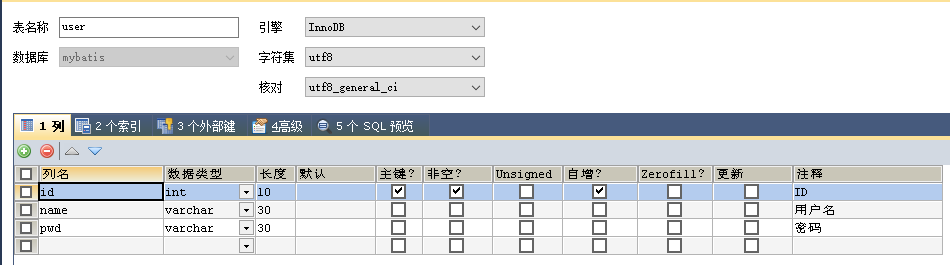
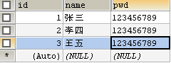
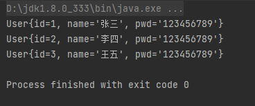
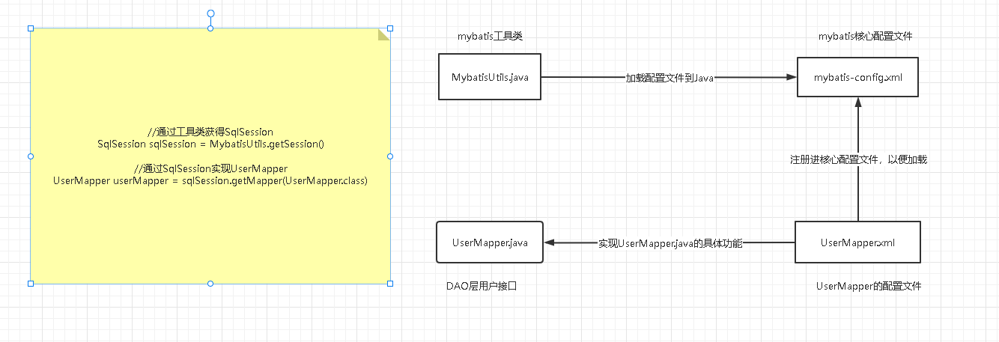

## 初识Mybatis

MyBatis 是一款优秀的持久层框架，它支持自定义 SQL、存储过程以及高级映射。MyBatis 免除了几乎所有的 JDBC 代码以及设置参数和获取结果集的工作。MyBatis 可以通过简单的 XML 或注解来配置和映射原始类型、接口和 Java POJO（Plain Old Java Objects，普通老式 Java 对象）为数据库中的记录。

###  Hello,Mybatis

创建数据库mybatis，在数据库中建表user，再在user中存入一些数据以便测试





通过maven引入Mybatis

```xml
<!--在build中配置resources，来防止我们资源导出失败的问题 -->
<build>
    <resources>

        <resource>
            <directory>src/main/resources</directory>
            <includes>
                <include>**/*.properties</include>
                <include>**/*.xml</include>
            </includes>
            <filtering>true</filtering>
        </resource>

        <resource>
            <directory>src/main/java</directory>
            <includes>
                <include>**/*.properties</include>
                <include>**/*.xml</include>
            </includes>
            <filtering>true</filtering>
        </resource>

    </resources>
</build>
<!--添加依赖，包括junit,mysql，mybatis-->
<dependencies>
        <!-- https://mvnrepository.com/artifact/org.mybatis/mybatis -->
        <dependency>
            <groupId>org.mybatis</groupId>
            <artifactId>mybatis</artifactId>
            <version>3.5.9</version>
        </dependency>

        <dependency>
            <groupId>junit</groupId>
            <artifactId>junit</artifactId>
            <version>4.13.1</version>
            <scope>test</scope>
        </dependency>

        <dependency>
            <groupId>mysql</groupId>
            <artifactId>mysql-connector-java</artifactId>
            <version>8.0.29</version>
        </dependency>
</dependencies>

```

编写**mybatis-config.xml**

 mybatis的核心配置文件

```xml
<?xml version="1.0" encoding="UTF-8" ?>
<!DOCTYPE configuration
        PUBLIC "-//mybatis.org//DTD Config 3.0//EN"
        "http://mybatis.org/dtd/mybatis-3-config.dtd">
<configuration>
    <environments default="development">
        <environment id="development">
            <transactionManager type="JDBC"/>
            <dataSource type="POOLED">
                <!--绑定数据库数据-->
                <property name="driver" value="com.mysql.cj.jdbc.Driver"/>
                <property name="url" value="jdbc:mysql://localhost:3306/mybatis?useSSL=false&amp;useUnicode=true&amp;characterEncoding=UTF-8"/>
                <property name="username" value="root"/>
                <property name="password" value="wz123456789"/>
            </dataSource>
        </environment>
    </environments>
    <mappers>
        <!--注册mapper-->
        <mapper resource="top/fbdcv/dao/UserMapper.xml"/>
    </mappers>
</configuration>
```

编写**MybaitsUtils**工具类

```java
package top.fbdcv.utils;

import org.apache.ibatis.io.Resources;
import org.apache.ibatis.session.SqlSession;
import org.apache.ibatis.session.SqlSessionFactory;
import org.apache.ibatis.session.SqlSessionFactoryBuilder;
import java.io.IOException;
import java.io.InputStream;

public class MybatisUtils {

    private static SqlSessionFactory sqlSessionFactory;

    static {
        try {
            String resource = "mybatis-config.xml";
            InputStream inputStream = Resources.getResourceAsStream(resource);
            sqlSessionFactory = new SqlSessionFactoryBuilder().build(inputStream);
        } catch (IOException e) {
            e.printStackTrace();
        }
    }

    public  static SqlSession getSession(){
        return sqlSessionFactory.openSession();
    }
    
}
```

**UserMapper.java**

```java
package top.fbdcv.dao;

import top.fbdcv.pojo.User;

import java.util.List;

public interface UserMapper {
     List<User> getUserList();
}
```

**UserMapper.xml**

```xml
<?xml version="1.0" encoding="UTF-8" ?>
<!DOCTYPE mapper
        PUBLIC "-//mybatis.org//DTD Mapper 3.0//EN"
        "http://mybatis.org/dtd/mybatis-3-mapper.dtd">
<!--namespace绑定UserMapper类-->
<mapper namespace="top.fbdcv.dao.UserMapper">
    <!--resultType绑定实体类-->
    <select id="getUserList" resultType="top.fbdcv.pojo.User">
        select * from mybatis.user
    </select>
</mapper>
```

**UserMapperTest.java**

```java
package top.fbdcv.dao;

import org.apache.ibatis.session.SqlSession;
import org.junit.Test;
import top.fbdcv.pojo.User;
import top.fbdcv.utils.MybatisUtils;

import java.util.List;

public class UserMapperTest {
    @Test
    public void test (){
        try (SqlSession sqlSession = MybatisUtils.getSession()){
            UserMapper userMapper = sqlSession.getMapper(UserMapper.class);
            List<User> userList = userMapper.getUserList();
            for(User user:userList){
                System.out.println(user);
            }
        }
    }
}
```





### 作用域与生命周期

- **SqlSessionFactoryBuilder**

  这个类可以被实例化、使用和丢弃，一旦创建了 SqlSessionFactory，就不再需要它了。 SqlSessionFactoryBuilder 实例的最佳作用域是方法作用域（也就是局部方法变量）

- **SqlSessionFactory**

  SqlSessionFactory 一旦被创建就应该在应用的运行期间一直存在，没有任何理由丢弃它或重新创建另一个实例。  SqlSessionFactory 的最佳作用域是应用作用域。

- **SqlSession**

  每个线程都应该有它自己的 SqlSession 实例。SqlSession 的实例不是线程安全的，因此是不能被共享的

  所以它的最佳的作用域是请求或方法作用域。

   绝对不能将 SqlSession 实例的引用放在一个类的静态域，甚至一个类的实例变量也不行

## CRUD

我们可以在UserMapper.java 中添加新的抽象方法并在UserMapper.xml中注册，从而实现增删改查。**增删改的时候需要提交事务**。

UserMapper.java

```java
package top.fbdcv.dao;

import top.fbdcv.pojo.User;

import java.util.List;

public interface UserMapper {
     List<User> getUserList();

     User getUserById(int id);

     int addUser(User user);

     int updateUser(User user);

     int deleteUser(int id);


}
```

**UserMapper.xml**

```xml
<?xml version="1.0" encoding="UTF-8" ?>
<!DOCTYPE mapper
        PUBLIC "-//mybatis.org//DTD Mapper 3.0//EN"
        "http://mybatis.org/dtd/mybatis-3-mapper.dtd">
<!--namespace绑定UserMapper类-->
<mapper namespace="top.fbdcv.dao.UserMapper">
     <!--resultType绑定返回值类型     -->
    <select id="getUserList" resultType="top.fbdcv.pojo.User">
        select * from mybatis.user
    </select>
    <!--resultType绑定返回值类型,parameterType绑定参数类型    -->
    <select id="getUserById" resultType="top.fbdcv.pojo.User" parameterType="int">
        <!-- #{}可以防止sql注入，id是参数的形参名             -->
        select * from mybatis.user where id = #{id}
    </select>

    <insert id="addUser" parameterType="top.fbdcv.pojo.User">
        <!-- 如果参数是类的话，参数为类中的属性名                -->
        insert into mybatis.user(id,name,pwd) values (#{id},#{name},#{pwd})
    </insert>
    
    <update id="updateUser" parameterType="top.fbdcv.pojo.User">
        update mybatis.user set name=#{name},pwd=#{pwd} where id =#{id}
    </update>

    <delete id="deleteUser" parameterType="int">
        delete from mybatis.user where id =#{id}
    </delete>
</mapper>
```

**UserMapperTest.java**

```java
package top.fbdcv.dao;

import org.apache.ibatis.session.SqlSession;
import org.junit.Test;
import top.fbdcv.pojo.User;
import top.fbdcv.utils.MybatisUtils;

import java.util.List;

public class UserMapperTest {
    @Test
    public void getUserList() {
        try (SqlSession sqlSession = MybatisUtils.getSession()) {
            UserMapper userMapper = sqlSession.getMapper(UserMapper.class);
            List<User> userList = userMapper.getUserList();
            for (User user : userList) {
                System.out.println(user);
            }
        }
    }

    @Test
    public void getUserById() {
        try (SqlSession sqlSession = MybatisUtils.getSession()) {
            UserMapper userMapper = sqlSession.getMapper(UserMapper.class);
            User user = userMapper.getUserById(1);
            System.out.println(user);
        }
    }

    @Test
    public void addUser() {
        try (SqlSession sqlSession = MybatisUtils.getSession()) {
            UserMapper userMapper = sqlSession.getMapper(UserMapper.class);
            int res = userMapper.addUser(new User(5, "李华", "78946"));
            sqlSession.commit();  //增删改操作都需要开启事务
            System.out.println(res);
        }
    }


    @Test
    public void updateUser() {
        try (SqlSession sqlSession = MybatisUtils.getSession()) {
            UserMapper userMapper = sqlSession.getMapper(UserMapper.class);
            int res = userMapper.updateUser(new User(1,"superman","sb"));
            sqlSession.commit();
            System.out.println(res);
        }
    }

    @Test
    public void deleteUser() {
        try (SqlSession sqlSession = MybatisUtils.getSession()) {
            UserMapper userMapper = sqlSession.getMapper(UserMapper.class);
            int res = userMapper.deleteUser(5);
            sqlSession.commit();
            System.out.println(res);
        }
    }


}
```

### Map替代对象

```xml
<insert id="addUser" parameterType="map">
    <!-- 如果参数是类的话，参数为类中的属性名                -->
    insert into mybatis.user(id,name,pwd) values (#{id},#{name},#{pwd})
</insert>
```

```java
@Test
public void addUser() {
    try (SqlSession sqlSession = MybatisUtils.getSession()) {
        UserMapper userMapper = sqlSession.getMapper(UserMapper.class);
        Map<String,Object> map=new HashMap<String,Object>();
        map.put("id",5);
        map.put("name","李华");
        map.put("pwd","78946");
        int res = userMapper.addUser(map);
        sqlSession.commit();  //开启事务
        System.out.println(res);
    }
}
```

## 配置

MyBatis 的配置文件包含了会深深影响 MyBatis 行为的设置和属性信息。

 配置文档的顶层结构如下：

- configuration（配置）

  - properties（属性）
  - settings（设置）
  - typeAliases（类型别名）
  - typeHandlers（类型处理器）
  - objectFactory（对象工厂）
  - plugins（插件）
  - environments（环境配置）
    - environment（环境变量）
      - transactionManager（事务管理器）
      - dataSource（数据源）
  - databaseIdProvider （数据库厂商标识）
  - mappers（映射器）

  下面是我们之前编写的核心配置，我们可以在其中找到这些属性
  
  ```xml
   <?xml version="1.0" encoding="UTF-8" ?>
  
  <!DOCTYPE configuration
          PUBLIC "-//mybatis.org//DTD Config 3.0//EN"
          "http://mybatis.org/dtd/mybatis-3-config.dtd">
  <configuration>
      <environments default="development">
          <environment id="development">
              <transactionManager type="JDBC"/>
              <dataSource type="POOLED">
                  <!--绑定数据库数据-->
                  <property name="driver" value="com.mysql.cj.jdbc.Driver"/>
                  <property name="url" value="jdbc:mysql://localhost:3306/mybatis?useSSL=false&amp;useUnicode=true&amp;characterEncoding=UTF-8"/>
                  <property name="username" value="root"/>
                  <property name="password" value="wz123456789"/>
              </dataSource>
          </environment>
      </environments>
      <mappers>
          <!--注册mapper-->
          <mapper resource="top/fbdcv/dao/UserMapper.xml"/>
      </mappers>
  </configuration>
  ```

###   属性

我们可以使用properties属性来实现引用配置文件

**db.properties**

```properties
driver=com.mysql.cj.jdbc.Driver
url=jdbc:mysql://localhost:3306/mybatis?useSSL=false&useUnicode=true&characterEncoding=UTF-8
username=root
password=wz123456789
```

**mybatis-config.xml**

```xml
<?xml version="1.0" encoding="UTF-8" ?>
<!DOCTYPE configuration
        PUBLIC "-//mybatis.org//DTD Config 3.0//EN"
        "http://mybatis.org/dtd/mybatis-3-config.dtd">
<configuration>
    <!--这里引入配置文件 -->
    <properties resource="db.properties"/>
    
    <!--这里选用第二个环境test -->
    <environments default="test">
        <environment id="development">
            <transactionManager type="JDBC"/>
            <dataSource type="POOLED">
                <property name="driver" value="com.mysql.cj.jdbc.Driver"/>
                <property name="url" value="jdbc:mysql://localhost:3306/mybatis?useSSL=false&amp;useUnicode=true&amp;characterEncoding=UTF-8"/>
                <property name="username" value="root"/>
                <property name="password" value="wz123456789"/>
            </dataSource>
        </environment>
        <environment id="test">
            <transactionManager type="JDBC"/>
            <dataSource type="POOLED">
                <property name="driver" value="${driver}"/>
                <property name="url" value="${url}"/>
                <property name="username" value="${username}"/>
                <property name="password" value="${password}"/>
            </dataSource>
        </environment>
    </environments>
    <mappers>
        <mapper resource="top/fbdcv/dao/UserMapper.xml"/>
    </mappers>
</configuration>
```

当然我们也可以通过properties属性，添加配置项

例如

```xml
<properties resource="org/mybatis/example/config.properties">
  <property name="username" value="dev_user"/>
  <property name="password" value="F2Fa3!33TYyg"/>
</properties>
```

- 可以通过properties属性引入properties文件
- 也可以在properties属性其中增加一些属性配置
- 如果通过properties属性引入properties文件后，还在该属性下添加配置项，若配置重复，则优先使用properties文件中的配置项

###   别名

类型别名可为 Java 类型设置一个缩写名字。 它仅用于 XML 配置，意在降低冗余的全限定类名书写。例如：

```xml
<typeAliases>
  <typeAlias alias="User" type="top.fbdcv.pojo.User"/>
</typeAliases>
```

当这样配置时，`User` 可以用在任何使用 `top.fbdcv.pojo.User` 的地方。

也可以指定一个包名，MyBatis 会在包名下面搜索需要的 Java Bean，比如：

```xml
<typeAliases>
  <package name="top.fbdcv.pojo"/>
</typeAliases>
```

每一个在包 `top.fbdcv.pojo` 中的 Java Bean，在没有注解的情况下，会使用 Bean 的首字母小写的非限定类名来作为它的别名。 比如 `top.fbdcv.pojo.User` 的别名为 `user`；若有注解，则别名为其注解值。见下面的例子：

```java
@Alias("User")
public class User {
    ...
}
```

下面是一些为常见的 Java 类型内建的类型别名。它们都是不区分大小写的，注意，为了应对原始类型的命名重复，采取了特殊的命名风格。

| 别名                      | 映射的类型   |
| :------------------------ | :----------- |
| _byte                     | byte         |
| _char (since 3.5.10)      | char         |
| _character (since 3.5.10) | char         |
| _long                     | long         |
| _short                    | short        |
| _int                      | int          |
| _integer                  | int          |
| _double                   | double       |
| _float                    | float        |
| _boolean                  | boolean      |
| string                    | String       |
| byte                      | Byte         |
| char (since 3.5.10)       | Character    |
| character (since 3.5.10)  | Character    |
| long                      | Long         |
| short                     | Short        |
| int                       | Integer      |
| integer                   | Integer      |
| double                    | Double       |
| float                     | Float        |
| boolean                   | Boolean      |
| date                      | Date         |
| decimal                   | BigDecimal   |
| bigdecimal                | BigDecimal   |
| biginteger                | BigInteger   |
| object                    | Object       |
| date[]                    | Date[]       |
| decimal[]                 | BigDecimal[] |
| bigdecimal[]              | BigDecimal[] |
| biginteger[]              | BigInteger[] |
| object[]                  | Object[]     |
| map                       | Map          |
| hashmap                   | HashMap      |
| list                      | List         |
| arraylist                 | ArrayList    |
| collection                | Collection   |
| iterator                  | Iterator     |

### 设置

[mybatis – MyBatis 3 | 配置](https://mybatis.org/mybatis-3/zh/configuration.html#设置（settings）)

###   插件

- mybatis-plus
- mybatis-generator
- ...

###   映射器

方式一:使用url

```xml
<mappers>
    <mapper resource="top/fbdcv/dao/UserMapper.xml"/>
</mappers>
```

方式二:使用类名(接口和mapper配置文件必须同名，接口和mapper配置文件必须在同一包下)

```xml
<mappers>
    <mapper class="top.fbdcv.dao.UserMapper"/>
</mappers>
```

方式三:使用包，将包内的接口全部注册(接口和mapper配置文件必须同名，接口和mapper配置文件必须在同一包下)

```xml
<mappers>
    <package name="top.fbdcv.dao"/>
</mappers>
```

## 日志

## 分页

## 注解

## Lombok

## 一对多，多对一

## 动态SQL

## 缓存
