## 初识Mybatis

MyBatis 是一款优秀的持久层框架，它支持自定义 SQL、存储过程以及高级映射。MyBatis 免除了几乎所有的 JDBC 代码以及设置参数和获取结果集的工作。MyBatis 可以通过简单的 XML 或注解来配置和映射原始类型、接口和 Java POJO（Plain Old Java Objects，普通老式 Java 对象）为数据库中的记录。

###  Hello,Mybatis

创建数据库mybatis，在数据库中建表user，再在user中存入一些数据以便测试


通过maven引入Mybatis

```xml
<!--在build中配置resources，来防止我们资源导出失败的问题 -->
<build>
    <resources>

        <resource>
            <directory>src/main/resources</directory>
            <includes>
                <include>**/*.properties</include>
                <include>**/*.xml</include>
            </includes>
            <filtering>true</filtering>
        </resource>

        <resource>
            <directory>src/main/java</directory>
            <includes>
                <include>**/*.properties</include>
                <include>**/*.xml</include>
            </includes>
            <filtering>true</filtering>
        </resource>

    </resources>
</build>
<!--添加依赖，包括junit,mysql，mybatis-->
<dependencies>
        <!-- https://mvnrepository.com/artifact/org.mybatis/mybatis -->
        <dependency>
            <groupId>org.mybatis</groupId>
            <artifactId>mybatis</artifactId>
            <version>3.5.9</version>
        </dependency>

        <dependency>
            <groupId>junit</groupId>
            <artifactId>junit</artifactId>
            <version>4.13.1</version>
            <scope>test</scope>
        </dependency>

        <dependency>
            <groupId>mysql</groupId>
            <artifactId>mysql-connector-java</artifactId>
            <version>8.0.29</version>
        </dependency>
</dependencies>

```

编写**mybatis-config.xml**

 mybatis的核心配置文件

```xml
<?xml version="1.0" encoding="UTF-8" ?>
<!DOCTYPE configuration
        PUBLIC "-//mybatis.org//DTD Config 3.0//EN"
        "http://mybatis.org/dtd/mybatis-3-config.dtd">
<configuration>
    <environments default="development">
        <environment id="development">
            <transactionManager type="JDBC"/>
            <dataSource type="POOLED">
                <!--绑定数据库数据-->
                <property name="driver" value="com.mysql.cj.jdbc.Driver"/>
                <property name="url" value="jdbc:mysql://localhost:3306/mybatis?useSSL=false&amp;useUnicode=true&amp;characterEncoding=UTF-8"/>
                <property name="username" value="root"/>
                <property name="password" value="wz123456789"/>
            </dataSource>
        </environment>
    </environments>
    <mappers>
        <!--注册mapper-->
        <mapper resource="top/fbdcv/dao/UserMapper.xml"/>
    </mappers>
</configuration>
```

编写**MybaitsUtils**工具类

```java
package top.fbdcv.utils;

import org.apache.ibatis.io.Resources;
import org.apache.ibatis.session.SqlSession;
import org.apache.ibatis.session.SqlSessionFactory;
import org.apache.ibatis.session.SqlSessionFactoryBuilder;
import java.io.IOException;
import java.io.InputStream;

public class MybatisUtils {

    private static SqlSessionFactory sqlSessionFactory;

    static {
        try {
            String resource = "mybatis-config.xml";
            InputStream inputStream = Resources.getResourceAsStream(resource);
            sqlSessionFactory = new SqlSessionFactoryBuilder().build(inputStream);
        } catch (IOException e) {
            e.printStackTrace();
        }
    }

    public  static SqlSession getSession(){
        return sqlSessionFactory.openSession();
        //openSession参数若设为true，则开启事务，支持数据库的增删改
    }
    
}
```

**UserMapper.java**

```java
package top.fbdcv.dao;

import top.fbdcv.pojo.User;

import java.util.List;

public interface UserMapper {
     List<User> getUserList();
}
```

**UserMapper.xml**

```xml
<?xml version="1.0" encoding="UTF-8" ?>
<!DOCTYPE mapper
        PUBLIC "-//mybatis.org//DTD Mapper 3.0//EN"
        "http://mybatis.org/dtd/mybatis-3-mapper.dtd">
<!--namespace绑定UserMapper类-->
<mapper namespace="top.fbdcv.dao.UserMapper">
    <!--resultType绑定实体类-->
    <select id="getUserList" resultType="top.fbdcv.pojo.User">
        select * from mybatis.user
    </select>
</mapper>
```

**UserMapperTest.java**

```java
package top.fbdcv.dao;

import org.apache.ibatis.session.SqlSession;
import org.junit.Test;
import top.fbdcv.pojo.User;
import top.fbdcv.utils.MybatisUtils;

import java.util.List;

public class UserMapperTest {
    @Test
    public void test (){
        try (SqlSession sqlSession = MybatisUtils.getSession()){
            UserMapper userMapper = sqlSession.getMapper(UserMapper.class);
            List<User> userList = userMapper.getUserList();
            for(User user:userList){
                System.out.println(user);
            }
        }
    }
}
```


### 作用域与生命周期

- **SqlSessionFactoryBuilder**

  这个类可以被实例化、使用和丢弃，一旦创建了 SqlSessionFactory，就不再需要它了。 SqlSessionFactoryBuilder 实例的最佳作用域是方法作用域（也就是局部方法变量）

- **SqlSessionFactory**

  SqlSessionFactory 一旦被创建就应该在应用的运行期间一直存在，没有任何理由丢弃它或重新创建另一个实例。  SqlSessionFactory 的最佳作用域是应用作用域。

- **SqlSession**

  每个线程都应该有它自己的 SqlSession 实例。SqlSession 的实例不是线程安全的，因此是不能被共享的

  所以它的最佳的作用域是请求或方法作用域。

   绝对不能将 SqlSession 实例的引用放在一个类的静态域，甚至一个类的实例变量也不行

## CRUD

我们可以在UserMapper.java 中添加新的抽象方法并在UserMapper.xml中注册，从而实现增删改查。**增删改的时候需要提交事务**。

UserMapper.java

```java
package top.fbdcv.dao;

import top.fbdcv.pojo.User;

import java.util.List;

public interface UserMapper {
     List<User> getUserList();

     User getUserById(int id);

     int addUser(User user);

     int updateUser(User user);

     int deleteUser(int id);


}
```

**UserMapper.xml**

```xml
<?xml version="1.0" encoding="UTF-8" ?>
<!DOCTYPE mapper
        PUBLIC "-//mybatis.org//DTD Mapper 3.0//EN"
        "http://mybatis.org/dtd/mybatis-3-mapper.dtd">
<!--namespace绑定UserMapper类-->
<mapper namespace="top.fbdcv.dao.UserMapper">
     <!--resultType绑定返回值类型     -->
    <select id="getUserList" resultType="top.fbdcv.pojo.User">
        select * from mybatis.user
    </select>
    <!--resultType绑定返回值类型,parameterType绑定参数类型    -->
    <select id="getUserById" resultType="top.fbdcv.pojo.User" parameterType="int">
        <!-- #{}可以防止sql注入，id是参数的形参名             -->
        select * from mybatis.user where id = #{id}
    </select>

    <insert id="addUser" parameterType="top.fbdcv.pojo.User">
        <!-- 如果参数是类的话，参数为类中的属性名                -->
        insert into mybatis.user(id,name,pwd) values (#{id},#{name},#{pwd})
    </insert>
    
    <update id="updateUser" parameterType="top.fbdcv.pojo.User">
        update mybatis.user set name=#{name},pwd=#{pwd} where id =#{id}
    </update>

    <delete id="deleteUser" parameterType="int">
        delete from mybatis.user where id =#{id}
    </delete>
</mapper>
```

**UserMapperTest.java**

```java
package top.fbdcv.dao;

import org.apache.ibatis.session.SqlSession;
import org.junit.Test;
import top.fbdcv.pojo.User;
import top.fbdcv.utils.MybatisUtils;

import java.util.List;

public class UserMapperTest {
    @Test
    public void getUserList() {
        try (SqlSession sqlSession = MybatisUtils.getSession()) {
            UserMapper userMapper = sqlSession.getMapper(UserMapper.class);
            List<User> userList = userMapper.getUserList();
            for (User user : userList) {
                System.out.println(user);
            }
        }
    }

    @Test
    public void getUserById() {
        try (SqlSession sqlSession = MybatisUtils.getSession()) {
            UserMapper userMapper = sqlSession.getMapper(UserMapper.class);
            User user = userMapper.getUserById(1);
            System.out.println(user);
        }
    }

    @Test
    public void addUser() {
        try (SqlSession sqlSession = MybatisUtils.getSession()) {
            UserMapper userMapper = sqlSession.getMapper(UserMapper.class);
            int res = userMapper.addUser(new User(5, "李华", "78946"));
            sqlSession.commit();  //增删改操作都需要开启事务
            System.out.println(res);
        }
    }


    @Test
    public void updateUser() {
        try (SqlSession sqlSession = MybatisUtils.getSession()) {
            UserMapper userMapper = sqlSession.getMapper(UserMapper.class);
            int res = userMapper.updateUser(new User(1,"superman","sb"));
            sqlSession.commit();
            System.out.println(res);
        }
    }

    @Test
    public void deleteUser() {
        try (SqlSession sqlSession = MybatisUtils.getSession()) {
            UserMapper userMapper = sqlSession.getMapper(UserMapper.class);
            int res = userMapper.deleteUser(5);
            sqlSession.commit();
            System.out.println(res);
        }
    }


}
```

### Map替代对象

```xml
<insert id="addUser" parameterType="map">
    <!-- 如果参数是类的话，参数为类中的属性名                -->
    insert into mybatis.user(id,name,pwd) values (#{id},#{name},#{pwd})
</insert>
```

```java
@Test
public void addUser() {
    try (SqlSession sqlSession = MybatisUtils.getSession()) {
        UserMapper userMapper = sqlSession.getMapper(UserMapper.class);
        Map<String,Object> map=new HashMap<String,Object>();
        map.put("id",5);
        map.put("name","李华");
        map.put("pwd","78946");
        int res = userMapper.addUser(map);
        sqlSession.commit();  //开启事务
        System.out.println(res);
    }
}
```

### 解决属性名和字段名不一致的问题

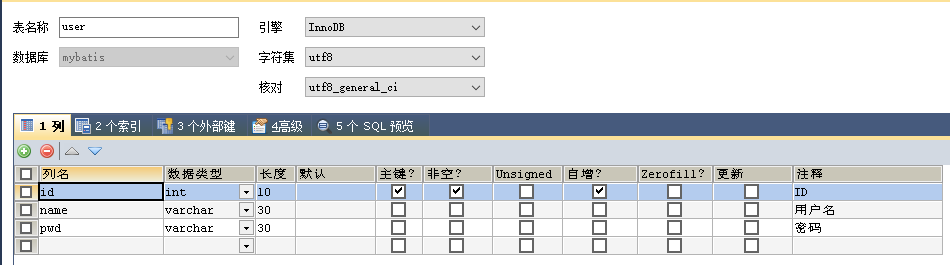

**User.java**

```java
public class User {
    private Integer id;
    private String name;
    private String password;
  ...
}
```

方法一：起别名

```xml
<?xml version="1.0" encoding="UTF-8" ?>
<!DOCTYPE mapper
        PUBLIC "-//mybatis.org//DTD Mapper 3.0//EN"
        "http://mybatis.org/dtd/mybatis-3-mapper.dtd">
<mapper namespace="top.fbdcv.dao.UserMapper">
    <select id="getUserList" resultType="top.fbdcv.pojo.User">
        select id,name,pwd as password from mybatis.user
    </select>
</mapper>
```

方法二：结果集映射

```xml
<?xml version="1.0" encoding="UTF-8" ?>
<!DOCTYPE mapper
        PUBLIC "-//mybatis.org//DTD Mapper 3.0//EN"
        "http://mybatis.org/dtd/mybatis-3-mapper.dtd">
<mapper namespace="top.fbdcv.dao.UserMapper">
    <resultMap id="UserMap" type="User">
    	<result column="id" property="id"/>
        <result column="name" property="name"/>
        <result column="pwd" property="password"/>
    </resultMap>
    
    
    <select id="getUserList" resultMap="UserMap">
        select id,name,pwd as password from mybatis.user
    </select>
</mapper>
```


## 配置

MyBatis 的配置文件包含了会深深影响 MyBatis 行为的设置和属性信息。

 配置文档的顶层结构如下：

- configuration（配置）

  - properties（属性）
  - settings（设置）
  - typeAliases（类型别名）
  - typeHandlers（类型处理器）
  - objectFactory（对象工厂）
  - plugins（插件）
  - environments（环境配置）
    - environment（环境变量）
      - transactionManager（事务管理器）
      - dataSource（数据源）
  - databaseIdProvider （数据库厂商标识）
  - mappers（映射器）

  下面是我们之前编写的核心配置，我们可以在其中找到这些属性
  
  ```xml
   <?xml version="1.0" encoding="UTF-8" ?>
  
  <!DOCTYPE configuration
          PUBLIC "-//mybatis.org//DTD Config 3.0//EN"
          "http://mybatis.org/dtd/mybatis-3-config.dtd">
  <configuration>
      <environments default="development">
          <environment id="development">
              <transactionManager type="JDBC"/>
              <dataSource type="POOLED">
                  <!--绑定数据库数据-->
                  <property name="driver" value="com.mysql.cj.jdbc.Driver"/>
                  <property name="url" value="jdbc:mysql://localhost:3306/mybatis?useSSL=false&amp;useUnicode=true&amp;characterEncoding=UTF-8"/>
                  <property name="username" value="root"/>
                  <property name="password" value="wz123456789"/>
              </dataSource>
          </environment>
      </environments>
      <mappers>
          <!--注册mapper-->
          <mapper resource="top/fbdcv/dao/UserMapper.xml"/>
      </mappers>
  </configuration>
  ```

###   属性

我们可以使用properties属性来实现引用配置文件

**db.properties**

```properties
driver=com.mysql.cj.jdbc.Driver
url=jdbc:mysql://localhost:3306/mybatis?useSSL=false&useUnicode=true&characterEncoding=UTF-8
username=root
password=wz123456789
```

**mybatis-config.xml**

```xml
<?xml version="1.0" encoding="UTF-8" ?>
<!DOCTYPE configuration
        PUBLIC "-//mybatis.org//DTD Config 3.0//EN"
        "http://mybatis.org/dtd/mybatis-3-config.dtd">
<configuration>
    <!--这里引入配置文件 -->
    <properties resource="db.properties"/>
    
    <!--这里选用第二个环境test -->
    <environments default="test">
        <environment id="development">
            <transactionManager type="JDBC"/>
            <dataSource type="POOLED">
                <property name="driver" value="com.mysql.cj.jdbc.Driver"/>
                <property name="url" value="jdbc:mysql://localhost:3306/mybatis?useSSL=false&amp;useUnicode=true&amp;characterEncoding=UTF-8"/>
                <property name="username" value="root"/>
                <property name="password" value="wz123456789"/>
            </dataSource>
        </environment>
        <environment id="test">
            <transactionManager type="JDBC"/>
            <dataSource type="POOLED">
                <property name="driver" value="${driver}"/>
                <property name="url" value="${url}"/>
                <property name="username" value="${username}"/>
                <property name="password" value="${password}"/>
            </dataSource>
        </environment>
    </environments>
    <mappers>
        <mapper resource="top/fbdcv/dao/UserMapper.xml"/>
    </mappers>
</configuration>
```

当然我们也可以通过properties属性，添加配置项

例如

```xml
<properties resource="org/mybatis/example/config.properties">
  <property name="username" value="dev_user"/>
  <property name="password" value="F2Fa3!33TYyg"/>
</properties>
```

- 可以通过properties属性引入properties文件
- 也可以在properties属性其中增加一些属性配置
- 如果通过properties属性引入properties文件后，还在该属性下添加配置项，若配置重复，则优先使用properties文件中的配置项

###   别名

类型别名可为 Java 类型设置一个缩写名字。 它仅用于 XML 配置，意在降低冗余的全限定类名书写。例如：

```xml
<typeAliases>
  <typeAlias alias="User" type="top.fbdcv.pojo.User"/>
</typeAliases>
```

当这样配置时，`User` 可以用在任何使用 `top.fbdcv.pojo.User` 的地方。

也可以指定一个包名，MyBatis 会在包名下面搜索需要的 Java Bean，比如：

```xml
<typeAliases>
  <package name="top.fbdcv.pojo"/>
</typeAliases>
```

每一个在包 `top.fbdcv.pojo` 中的 Java Bean，在没有注解的情况下，会使用 Bean 的首字母小写的非限定类名来作为它的别名。 比如 `top.fbdcv.pojo.User` 的别名为 `user`；若有注解，则别名为其注解值。见下面的例子：

```java
@Alias("User")
public class User {
    ...
}
```

下面是一些为常见的 Java 类型内建的类型别名。它们都是不区分大小写的，注意，为了应对原始类型的命名重复，采取了特殊的命名风格。

| 别名                      | 映射的类型   |
| :------------------------ | :----------- |
| _byte                     | byte         |
| _char (since 3.5.10)      | char         |
| _character (since 3.5.10) | char         |
| _long                     | long         |
| _short                    | short        |
| _int                      | int          |
| _integer                  | int          |
| _double                   | double       |
| _float                    | float        |
| _boolean                  | boolean      |
| string                    | String       |
| byte                      | Byte         |
| char (since 3.5.10)       | Character    |
| character (since 3.5.10)  | Character    |
| long                      | Long         |
| short                     | Short        |
| int                       | Integer      |
| integer                   | Integer      |
| double                    | Double       |
| float                     | Float        |
| boolean                   | Boolean      |
| date                      | Date         |
| decimal                   | BigDecimal   |
| bigdecimal                | BigDecimal   |
| biginteger                | BigInteger   |
| object                    | Object       |
| date[]                    | Date[]       |
| decimal[]                 | BigDecimal[] |
| bigdecimal[]              | BigDecimal[] |
| biginteger[]              | BigInteger[] |
| object[]                  | Object[]     |
| map                       | Map          |
| hashmap                   | HashMap      |
| list                      | List         |
| arraylist                 | ArrayList    |
| collection                | Collection   |
| iterator                  | Iterator     |

### 设置

[mybatis – MyBatis 3 | 配置](https://mybatis.org/mybatis-3/zh/configuration.html#设置（settings）)

###   插件

- mybatis-plus
- mybatis-generator
- ...

###   映射器

方式一:使用url

```xml
<mappers>
    <mapper resource="top/fbdcv/dao/UserMapper.xml"/>
</mappers>
```

方式二:使用类名(接口和mapper配置文件必须同名，接口和mapper配置文件必须在同一包下)

```xml
<mappers>
    <mapper class="top.fbdcv.dao.UserMapper"/>
</mappers>
```

方式三:使用包，将包内的接口全部注册(接口和mapper配置文件必须同名，接口和mapper配置文件必须在同一包下)

```xml
<mappers>
    <package name="top.fbdcv.dao"/>
</mappers>
```

## 日志

在mybatis核心配置文件中的设置中设置如下属性，指定mybatis的日志实现

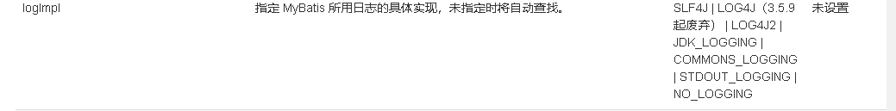

```xml
<?xml version="1.0" encoding="UTF-8" ?>
<!DOCTYPE configuration
        PUBLIC "-//mybatis.org//DTD Config 3.0//EN"
        "http://mybatis.org/dtd/mybatis-3-config.dtd">
<configuration>
    <properties resource="db.properties"/>
    <settings>
        <setting name="logImpl" value="STDOUT_LOGGING"/>
    </settings>
    ...
</configuration 
```

测试getUserList方法

- 之前的运行结果

  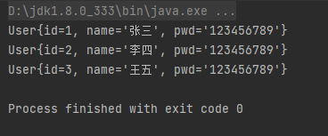

- 设置STDOUT_LOGGING日志的运行结果

  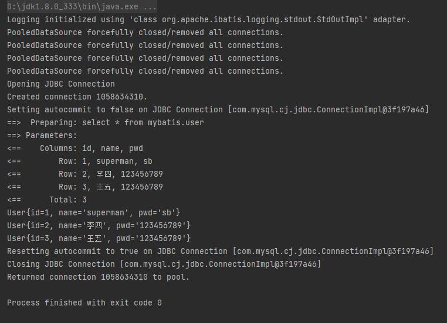

## 分页

### limit实现分页

```xml
<?xml version="1.0" encoding="UTF-8" ?>
<!DOCTYPE mapper
        PUBLIC "-//mybatis.org//DTD Mapper 3.0//EN"
        "http://mybatis.org/dtd/mybatis-3-mapper.dtd">
<mapper namespace="top.fbdcv.dao.UserMapper">
    <select id="getUserList" parameterType="map" resultType="top.fbdcv.pojo.User">
        select * from mybatis.user limit #{start} ,#{size}  
        <!-- 第一个参数表示起始位置，第二个参数表示页面大小-->
    </select>
</mapper>
```

```java
public class UserMapperTest {
    @Test
    public void getUserList() {
        try (SqlSession sqlSession = MybatisUtils.getSession()) {
            UserMapper userMapper = sqlSession.getMapper(UserMapper.class);
            HashMap<String,Integer> map = new HashMap<String,Integer>();
            map.put("start",0);
            map.put("size",2);
            List<User> userList = mapper.getUserByList(map);
            for(User user:userList){
                System.out.println(user);
            }
        }
    }
```

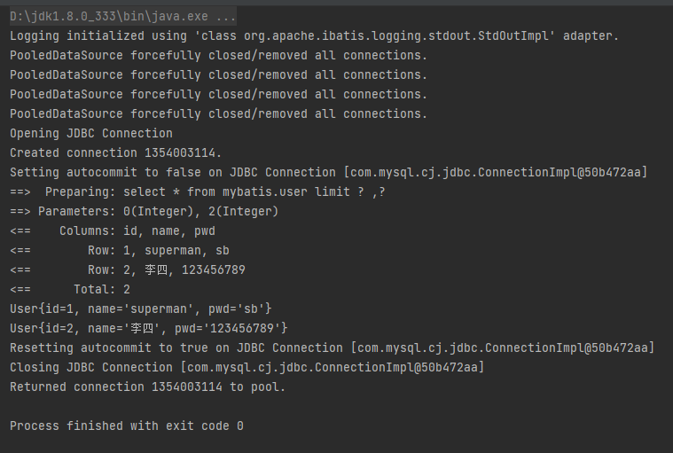

### RowBounds实现分页

```xml
<?xml version="1.0" encoding="UTF-8" ?>
<!DOCTYPE mapper
        PUBLIC "-//mybatis.org//DTD Mapper 3.0//EN"
        "http://mybatis.org/dtd/mybatis-3-mapper.dtd">
<mapper namespace="top.fbdcv.dao.UserMapper">
    <select id="getUserList"  resultType="top.fbdcv.pojo.User">
        select * from mybatis.user limit 
    </select>
</mapper>
```

```java
@Test
public void getUserList() {
    try (SqlSession sqlSession = MybatisUtils.getSession()) {

        RowBounds rowBounds = new RowBounds(0, 2);
        List<User> userList = sqlSession.selectList("top.fbdcv.dao.UserMapper.getUserList", null, rowBounds);
        for (User user : userList) {
            System.out.println(user);
        }
    }
}
```

## 注解

UserMapper.java

```java
public interface UserMapper {
     @Select("select * from mybatis.user")
     List<User> getUserList2();
    
    //当有多个参数时，必须用@Param注解进行标识
    @Select("select * from mybatis.user where id =#{id}")
    User getUserByID2(@Param("id")int id,@Param("name") String name);
    
    //参数为引用类型时，不需要加@Param注解
    @Insert("insert into user(id,name,pwd) values (#{id},#{name},#{pwd})")
    int addUser(User user);
    
    @Update("update user set name=#{name},pwd=#{pwd} where id =#{id}")
    int updateUser(User user);
    
    @Delete("delect from user where id =#{id}")
    int deleteUser(@Param("id") int id);
    
}
```

mybatis核心配置文件绑定接口

```xml
<mappers>
    <mapper class="top.fbdcv.dao.UserMapper"/>
</mappers>
```

UserMapperTest.java 进行测试

```java
@Test
public void getUserList2() {
    try (SqlSession sqlSession = MybatisUtils.getSession()) {
        UserMapper mapper = sqlSession.getMapper(UserMapper.class);
        List<User> userList = mapper.getUserList2();
        for (User user : userList) {
            System.out.println(user);
        }
    }
}
```

可以正常输出结果

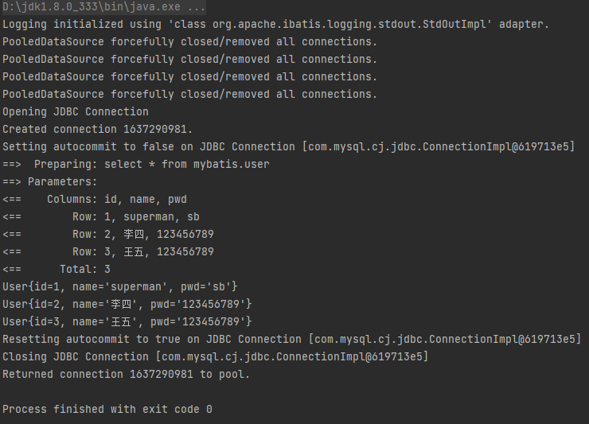

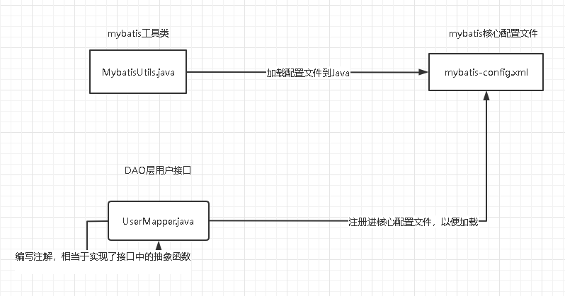

## Lombok

idea安装Lombok插件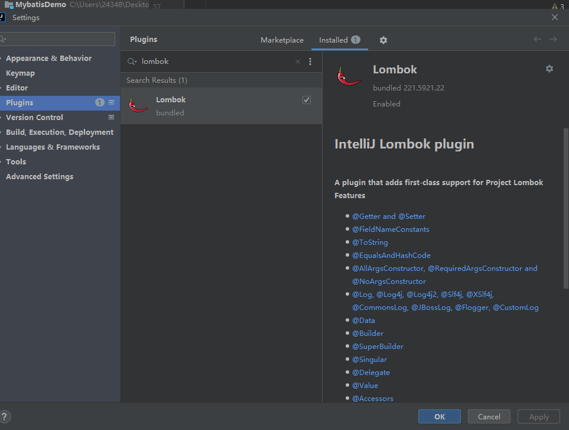

通过maven导入jar包

```xml
<!-- https://mvnrepository.com/artifact/org.projectlombok/lombok -->
<dependency>
    <groupId>org.projectlombok</groupId>
    <artifactId>lombok</artifactId>
    <version>1.18.24</version>
    <scope>provided</scope>
</dependency>
```

```
@Data :无参构造，get，set，tostring，hashcode，equals
@ALLArgsConstructor ：有参构造
@NoArgsConstructor ：无参构造
@ToString 
@EqualsAndHashCode

```

平常使用只需要@ALLArgsConstructor，@NoArgsConstructor和@Data即可快速构建pojo

```java
@Data
@ALLArgsConstructor
@NoArgsConstructor
public class User {
    private Integer id;
    private String name;
    private String pwd;
}
```

## 一对多，多对一

### 环境搭建

创建两个表，student和teacher表

```sql
CREATE TABLE `teacher` (
  `id` INT(10) NOT NULL,
  `name` VARCHAR(30) DEFAULT NULL,
  PRIMARY KEY (`id`)
) ENGINE=INNODB DEFAULT CHARSET=utf8

INSERT INTO teacher(`id`, `name`) VALUES (1, '秦老师'); 

CREATE TABLE `student` (
  `id` INT(10) NOT NULL,
  `name` VARCHAR(30) DEFAULT NULL,
  `tid` INT(10) DEFAULT NULL,
  PRIMARY KEY (`id`),
  KEY `fktid` (`tid`),
  CONSTRAINT `fktid` FOREIGN KEY (`tid`) REFERENCES `teacher` (`id`)
) ENGINE=INNODB DEFAULT CHARSET=utf8
INSERT INTO `student` (`id`, `name`, `tid`) VALUES ('1', '小明', '1'); 
INSERT INTO `student` (`id`, `name`, `tid`) VALUES ('2', '小红', '1'); 
INSERT INTO `student` (`id`, `name`, `tid`) VALUES ('3', '小张', '1'); 
INSERT INTO `student` (`id`, `name`, `tid`) VALUES ('4', '小李', '1'); 
INSERT INTO `student` (`id`, `name`, `tid`) VALUES ('5', '小王', '1');
```

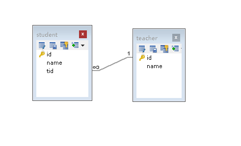

新建实体类Teacher，Student

**Teacher.java**

```java
package top.fbdcv.pojo;

import lombok.AllArgsConstructor;
import lombok.Data;
import lombok.NoArgsConstructor;

@Data
@AllArgsConstructor
@NoArgsConstructor
public class Teacher {

    private Integer id;
    private String name;
}
```

**Student.java**

```java
package top.fbdcv.pojo;

import lombok.AllArgsConstructor;
import lombok.Data;
import lombok.NoArgsConstructor;

@Data
@AllArgsConstructor
@NoArgsConstructor
public class Student {
    private Integer id;
    private String name;
    private Teacher teacher;
}
```

新建实体类对应的mapper接口和xml文件

**StudentMapper.java**

```java
package top.fbdcv.dao;

public interface StudentMapper {
}
```

**StudentMapper.xml**

```xml
<?xml version="1.0" encoding="UTF-8" ?>
<!DOCTYPE mapper
        PUBLIC "-//mybatis.org//DTD Mapper 3.0//EN"
        "http://mybatis.org/dtd/mybatis-3-mapper.dtd">
<mapper namespace="top.fbdcv.dao.StudentMapper">

</mapper>
```

**TeacherMapper.java**

```java
package top.fbdcv.dao;

public interface TeacherMapper {
}
```

**TeacherMapper.xml**

```xml
<?xml version="1.0" encoding="UTF-8" ?>
<!DOCTYPE mapper
        PUBLIC "-//mybatis.org//DTD Mapper 3.0//EN"
        "http://mybatis.org/dtd/mybatis-3-mapper.dtd">
<mapper namespace="top.fbdcv.dao.TeacherMapper">

</mapper>
```

向mybatis核心配置文件中注册mapper

```xml
    <mappers>
        <mapper class="top.fbdcv.dao.TeacherMapper"/>
        <mapper class="top.fbdcv.dao.StudentMapper"/>
    </mappers>
```

### 多对一

通过mybatis查询学生的id，姓名，以及老师的信息（通过mybatis实现多表查询）

**子查询**

思路：

1. 查询所有的学生信息
2. 根据查询出来的学生的tid，寻找对应的老师

StudentMapper.java

```java
public interface StudentMapper {
    List<Student> getStudentList();
}
```

StudentMapper.xml  片段

```xml
<!--子查询 先查询所有学生信息，再通过查询出来学生的tid查询对应的老师-->
<select id="getStudentList" resultMap="StudentTeacher">
    select * from mybatis.student
</select>
<resultMap id="StudentTeacher" type="top.fbdcv.pojo.Student">
    <result property="id" column="id"/>
    <result property="name" column="name"/>
    <association property="teacher" column="tid" javaType="top.fbdcv.pojo.Teacher" select="getTeacher"/>
</resultMap>
<select id="getTeacher" resultType="top.fbdcv.pojo.Teacher">
    select * from mybatis.teacher where id =#{tid}
</select>
```

其中还遇到一个头疼的bug，找了半天 [xml文件中如果有中文注释然后报错的解决方式](https://blog.csdn.net/qq_26558047/article/details/113149471)

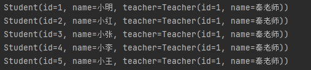

  **结果查询**

```java
public interface StudentMapper {

    List<Student> getStudentList();
    List<Student> getStudentList2();

}
```

```xml
<!--通过结果查询 写出完整的sql语句，再努力的完成sql语句的映射    -->
<select id="getStudentList2" resultMap="StudentTeacher2">
    select s.id sid,s.name sname,t.name tname
    from student s,teacher t
    where s.tid = t.id
</select>
<resultMap id="StudentTeacher2" type="top.fbdcv.pojo.Student">
    <result property="id" column="sid" />
    <result property="name" column="sname" />
    <association property="teacher" javaType="top.fbdcv.pojo.Teacher">
        <result property="name" column="tname"/>
    </association>
</resultMap>
```

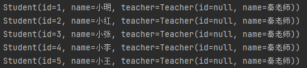

### 一对多

修改pojo，创造一对多的环境

**Teacher.java**

```java
package top.fbdcv.pojo;

import lombok.AllArgsConstructor;
import lombok.Data;
import lombok.NoArgsConstructor;

@Data
@AllArgsConstructor
@NoArgsConstructor
public class Teacher {

    private Integer id;
    private String name;
    private List<Student> students;
}
```

**Student.java**

```java
package top.fbdcv.pojo;

import lombok.AllArgsConstructor;
import lombok.Data;
import lombok.NoArgsConstructor;

@Data
@AllArgsConstructor
@NoArgsConstructor
public class Student {
    private Integer id;
    private String name;
    private Integer tid;
}
```

同样还是获取 老师及其下学生的信息

这次我们只用结果查询的方法实现

**TeacherMapper.java**

```java
public interface TeacherMapper {

    Teacher getTeacher(int id);
}
```

**TeacherMapper.xml**

```xml
<?xml version="1.0" encoding="utf8" ?>
<!DOCTYPE mapper
        PUBLIC "-//mybatis.org//DTD Mapper 3.0//EN"
        "http://mybatis.org/dtd/mybatis-3-mapper.dtd">
<mapper namespace="top.fbdcv.dao.TeacherMapper">

    <select id="getTeacher" resultMap="TeacherStudent" parameterType="int">
        select t.id tid , t.name tname ,s.id sid ,s.name sname
        from mybatis.teacher t,mybatis.student s
        where s.tid=t.id and t.id =#{id}
    </select>

    <resultMap id="TeacherStudent" type="top.fbdcv.pojo.Teacher">
        <result property="id" column="tid"/>
        <result property="name" column="tname"/>
<!--
    映射对象使用association 使用javaType指定实体类
    映射集合使用collection  使用ofType指定实体类
-->
        <collection property="students" ofType="top.fbdcv.pojo.Student">
            <result property="id" column="sid"/>
            <result property="name" column="sname"/>
            <result property="tid" column="tid"/>
        </collection>
    </resultMap>

</mapper>
```

**结果测试**

```java
public class TeacherMapperTest {
    @Test
    public void getTeacher(){
        try (SqlSession sqlSession=MybatisUtils.getSession()){
            TeacherMapper teacherMapper = sqlSession.getMapper(TeacherMapper.class);
            Teacher teacher = teacherMapper.getTeacher(1);
            System.out.println(teacher);
        }
    }
}
```

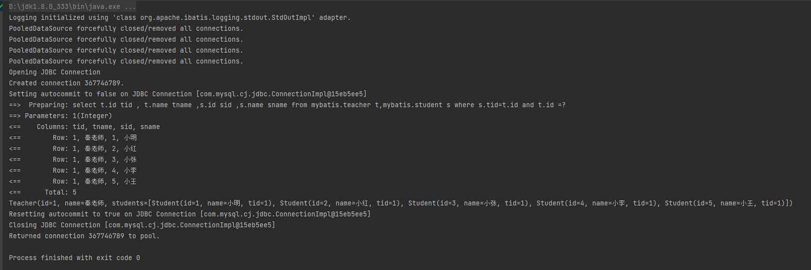

## 动态SQL

==动态sql可以使我们更方便地拼接sql语句==

### 搭建环境

```sql
CREATE TABLE `blog`(
`id` VARCHAR(50) NOT NULL COMMENT '博客id',
`title` VARCHAR(100) NOT NULL COMMENT '博客标题',
`author` VARCHAR(30) NOT NULL COMMENT '博客作者',
`create_time` DATETIME NOT NULL COMMENT '创建时间',
`views` INT(30) NOT NULL COMMENT '浏览量'
)ENGINE=INNODB DEFAULT CHARSET=utf8;
```

创建实体类Blog.java

```java
package top.fbdcv.pojo;

import lombok.AllArgsConstructor;
import lombok.Data;
import lombok.NoArgsConstructor;

import java.util.Date;

@Data
@AllArgsConstructor
@NoArgsConstructor
public class Blog {
    private String id;
    private String title;
    private String author;
    private Date createTime; //属性名和字段名不一致 字段名为create_time
    private Integer views;
}
```

创建BlogMapper.java和BlogMapper.xml

```java
package top.fbdcv.dao;

import top.fbdcv.pojo.Blog;

public interface BlogMapper {
    void addBlog(Blog blog);
}
```

```xml
<?xml version="1.0" encoding="utf8" ?>
<!DOCTYPE mapper
        PUBLIC "-//mybatis.org//DTD Mapper 3.0//EN"
        "http://mybatis.org/dtd/mybatis-3-mapper.dtd">
<mapper namespace="top.fbdcv.dao.BlogMapper">
    <insert id="addBlog" parameterType="top.fbdcv.pojo.Blog">
        insert into mybatis.blog (id,title,author,create_time,views)
        value(#{id},#{title},#{author},#{createTime},#{views});
    </insert>

</mapper>
```

通过Java插入数据

```java
package top.fbdcv.dao;

import org.apache.ibatis.session.SqlSession;
import org.junit.Test;
import top.fbdcv.pojo.Blog;
import top.fbdcv.utils.IDUtils;
import top.fbdcv.utils.MybatisUtils;

import java.util.Date;

public class BlogMapperTest {

    @Test
    public void addBlogTest(){
        try(SqlSession sqlSession=MybatisUtils.getSession()){
            BlogMapper mapper = sqlSession.getMapper(BlogMapper.class);
            Blog blog = new Blog();
            blog.setId(IDUtils.getID());
            blog.setTitle("Mybatis");
            blog.setAuthor("狂神说");
            blog.setCreateTime(new Date());
            blog.setViews(9999);
			//这里没有写开启事务的代码是因为之前在MybatisUtils工具类中
            //将getSession方法中的openSession参数设为了true，默认开启了事务
            mapper.addBlog(blog);

            blog.setId(IDUtils.getID());
            blog.setTitle("Java");
            mapper.addBlog(blog);

            blog.setId(IDUtils.getID());
            blog.setTitle("Spring");
            mapper.addBlog(blog);

            blog.setId(IDUtils.getID());
            blog.setTitle("微服务");
            mapper.addBlog(blog);

        }
    }

}
```

通过IDEA集成的数据库创建查看数据是否生成

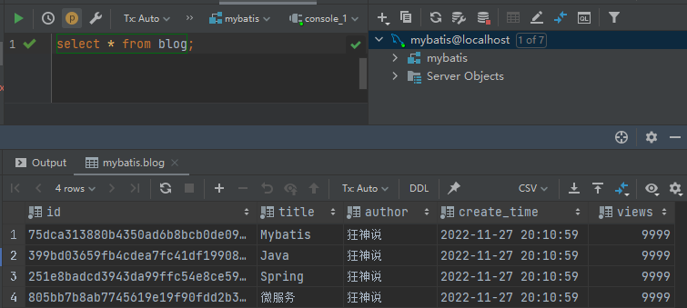

### IF标签

编写queryBlogIF()方法，实现查询特定数据的功能

BlogMapper.java BlogMapper.xml相关代码

```java
List<Blog> queryBlogIF(Map map);
```

```xml
<select id="queryBlogIF" parameterType="map" resultType="top.fbdcv.pojo.Blog">
    select * from mybatis.blog
    where 1=1
    <if test="title!=null">
        and title=#{title}
    </if>
    <if test="author!=null">
        and author=#{author}
    </if>
    <if test="createTime!=null">
        and create_time=#{createTime}
    </if>
    <if test="views!=null">
        and views =#{views}
    </if>
</select>
```

测试

```java
@Test
public void queryBlogIFTest(){
    try(SqlSession sqlSession=MybatisUtils.getSession()){
        BlogMapper blogMapper = sqlSession.getMapper(BlogMapper.class);
        HashMap<String,Object> map = new HashMap<>() ;
        map.put("title","Java");
        List<Blog> blogs = blogMapper.queryBlogIF(map);
        for (Blog blog : blogs) {
            System.out.println(blog);
        }
    }
}
```

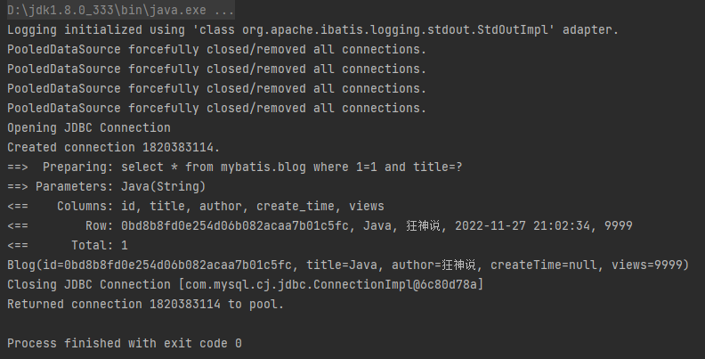

### sql片段

有时候，我们会将一部分常用的代码抽取出来方便复用，这个时候就可以使用sql片段来实现这个功能

例如之前的代码可以改写为如下代码

```xml
<!-- 使用sql标签将复用的代码摘出来-->
<sql id="if-">
    <if test="title!=null">
        and title=#{title}
    </if>
    <if test="author!=null">
        and author=#{author}
    </if>
    <if test="createTime!=null">
        and create_time=#{createTime}
    </if>
    <if test="views!=null">
        and views =#{views}
    </if>
</sql>

<select id="queryBlogIF" parameterType="map" resultType="top.fbdcv.pojo.Blog">
    select * from mybatis.blog
    <where>
        <!--使用include标签再引入之前的sql标签 -->
        <include refid="if-"></include>
    </where>
</select>
```

### 其他标签

[mybatis – MyBatis 3 | 动态 SQL](https://mybatis.org/mybatis-3/zh/dynamic-sql.html)

## 缓存

1. 上面是缓存

   存储在内存中的临时数据

   将用户经常查询的数据放在内存中，用户去查询的时候就可以不用从磁盘上查询，而是从缓存上查询，从而提高查询效率，解决高并发系统的性能问题

2. 为什么使用缓存

   减少和数据库交互的次数，减少系统开销，提高系统效率

3. 什么样的数据能使用缓存

   经常查询并且不经常改变的数据

**Mybatis缓存**

Mybatis包含一个非常强大的查询缓存特性，它可以非常方便地定制和配置缓存

Mybatis系统中默认定义了两级缓存：**一级缓存**和**二级缓存**

- 默认情况下，只有一级缓存开启（sqlSession级别的缓存，也称为本地缓存）

- 二级缓存需要手动开启和配置（基于namespace级别的缓存，也称为全局缓存）
- 为了提高扩展性，Mybatis定义了缓存接口Cache。我们可以通过实现Cache接口来自定义二级缓存


### 一级缓存

```java
@Test
public void getUserByIdTest(){
    try (SqlSession sqlSession=MybatisUtils.getSession()){
        UserMapper userMapper = sqlSession.getMapper(UserMapper.class);
        User user = userMapper.getUserById(1);
        System.out.println(user);

        User user2 = userMapper.getUserById(1);
        System.out.println(user2);
        System.out.println("user是否被缓存:"+(user==user2));

    }
}
```

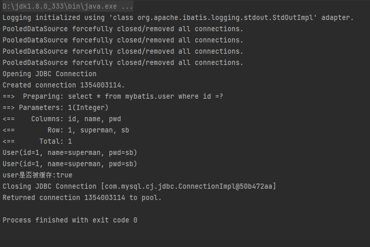

增删改操作，可能会改变原来的数据，所以必定会刷新缓存

```java
@Test
public void getUserByIdTest(){
    try (SqlSession sqlSession=MybatisUtils.getSession()){
        UserMapper userMapper = sqlSession.getMapper(UserMapper.class);
        User user = userMapper.getUserById(1);
        System.out.println(user);
        //这里我们更新一个数据，观察是否刷新缓存
        userMapper.updateUser(new User(2,"张三","123456789"));
        User user2 = userMapper.getUserById(1);
        System.out.println(user2);
        System.out.println("user是否被缓存:"+(user==user2));

    }
}
```

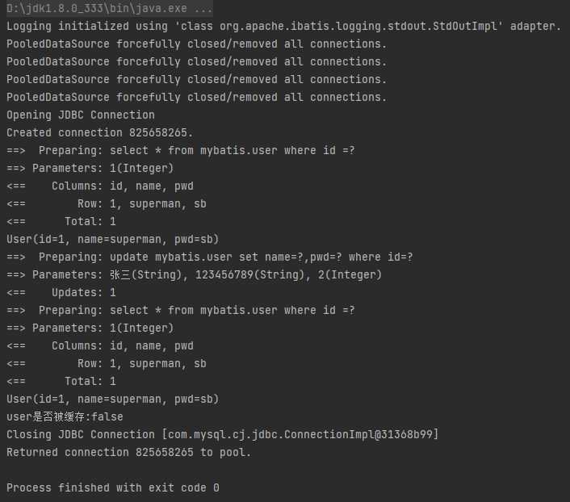

一级缓存默认开启且无法关闭，但是我们可以设置清除缓存

```java
@Test
public void getUserByIdTest(){
    try (SqlSession sqlSession=MybatisUtils.getSession()){
        UserMapper userMapper = sqlSession.getMapper(UserMapper.class);
        User user = userMapper.getUserById(1);
        System.out.println(user);
        //设置清除缓存
        sqlSession.clearCache();
        User user2 = userMapper.getUserById(1);
        System.out.println(user2);
        System.out.println("user是否被缓存:"+(user==user2));

    }
}
```

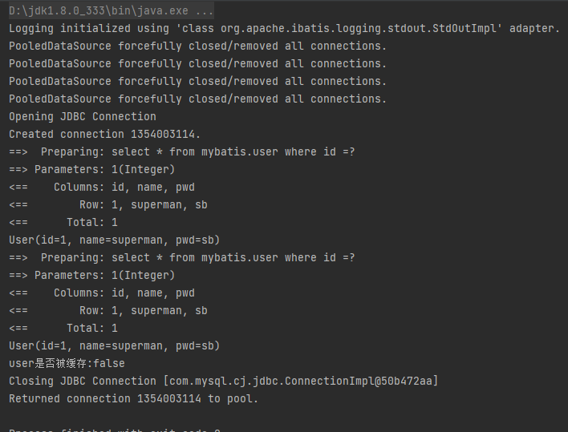

刷新一级缓存的几个场景：

- 增删改操作，可能会改变原来的数据，所以必定会刷新缓存
- 使用代码手动清除了缓存
- ...

### 二级缓存

[mybatis – MyBatis 3 |全局缓存](https://mybatis.org/mybatis-3/zh/sqlmap-xml.html#cache)

二级缓存的开启需要

1. 在mybatis核心配置文件中显式声明开启全局缓存
2. 在映射配置文件中通过cache标签配置缓存
3. 若cache标签中readOnly属性为“false”则需要开启实体类序列化，否则会报错


```xml
<?xml version="1.0" encoding="utf8" ?>
<!DOCTYPE configuration
        PUBLIC "-//mybatis.org//DTD Config 3.0//EN"
        "http://mybatis.org/dtd/mybatis-3-config.dtd">
<configuration>
    <properties resource="db.properties"/>
    <settings>
        <!--设置日志-->
        <setting name="logImpl" value="STDOUT_LOGGING"/>
        <!--显式开启全局缓存-->
        <setting name="cacheEnabled" value="true"/>
    </settings>
    <environments default="test">
        <environment id="test">
            <transactionManager type="JDBC"/>
            <dataSource type="POOLED">
                <property name="driver" value="${driver}"/>
                <property name="url" value="${url}"/>
                <property name="username" value="${username}"/>
                <property name="password" value="${password}"/>
            </dataSource>
        </environment>
    </environments>
    <mappers>
        <mapper class="top.fbdcv.dao.UserMapper"/>
    </mappers>
</configuration>
```

```xml
<?xml version="1.0" encoding="utf8" ?>
<!DOCTYPE mapper
        PUBLIC "-//mybatis.org//DTD Mapper 3.0//EN"
        "http://mybatis.org/dtd/mybatis-3-mapper.dtd">
<mapper namespace="top.fbdcv.dao.UserMapper">
<!--配置全局缓存-->
  <cache/>
  <select id="getUserById" resultType="top.fbdcv.pojo.User">
      select * from mybatis.user where id =#{id}
  </select>

    <update id="updateUser" parameterType="top.fbdcv.pojo.User">
        update mybatis.user set name=#{name},pwd=#{pwd} where id=#{id}
    </update>

</mapper>
```

```java
package top.fbdcv.pojo;

import lombok.AllArgsConstructor;
import lombok.Data;
import lombok.NoArgsConstructor;

import java.io.Serializable;

@Data
@AllArgsConstructor
@NoArgsConstructor
//User实体类开启序列化
public class User implements Serializable {
    private Integer id;
    private String name;
    private String pwd;
}
```

通过日志，我们看出sql语句只执行了一次，说明数据经过了全局缓存

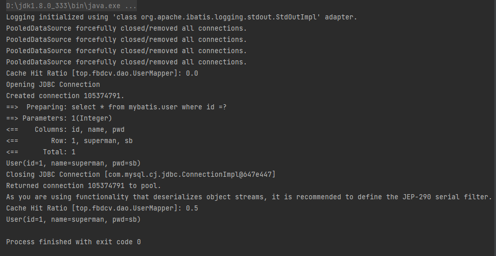

### 缓存原理

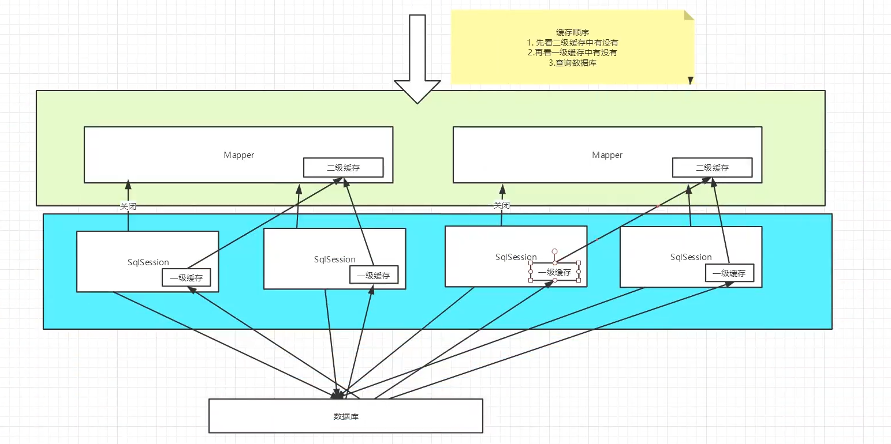

### 自定义二级缓存

实现Mybatis的二级缓存很简单，只需要新建一个类实现org.apache.ibatis.cache.Cache接口即可。

我们可以自己写一个缓存或者使用知名的第三方缓存如ehcache和redis等


