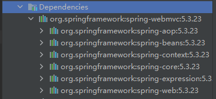
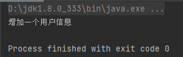
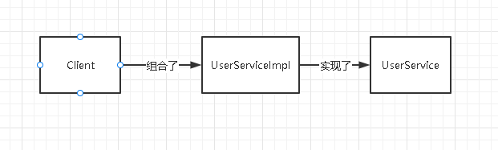
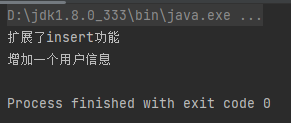
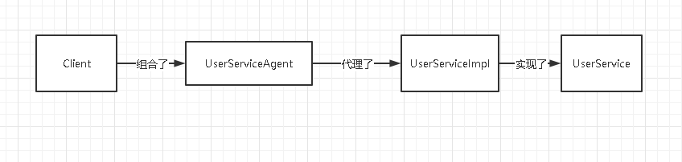
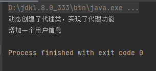
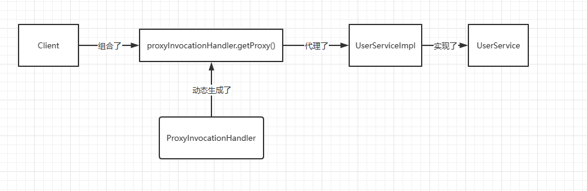
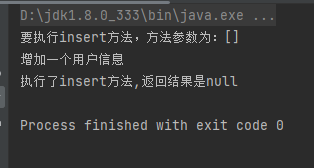
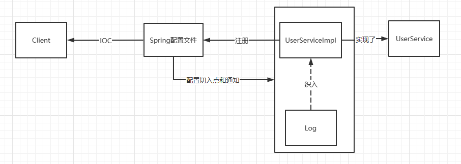
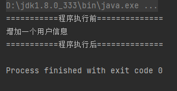

# 初识Spring

## Spring 历史

时间回到2002年，当时正是 Java EE 和 EJB 大行其道的时候，很多知名公司都是采用此技术方案进行项目开发。这时候有一个美国的小伙子认为 EJB 太过臃肿，并不是所有的项目都需要使用 EJB 这种大型[框架](https://so.csdn.net/so/search?q=框架&spm=1001.2101.3001.7020)，应该会有一种更好的方案来解决这个问题。

为了证明他的想法是正确的，于2002年10月甚至写了一本书《 Expert One-on-One J2EE 》，介绍了当时 Java 企业应用程序开发的情况，并指出了 Java EE 和 EJB 组件框架中存在的一些主要缺陷。在这本书中，他提出了一个基于普通 Java 类和依赖注入的更简单的解决方案。

在书中，他展示了如何在不使用 EJB 的情况下构建高质量，可扩展的在线座位预留系统。为了构建应用程序，他编写了超过 30,000 行的基础结构代码，项目中的根包命名为 com.interface21，所以人们最初称这套开源框架为 **interface21**，也就是 Spring 的前身。

他是谁呢，他就是大名鼎鼎的 **Rod Johnson** （下图）, Rod Johnson 在悉尼大学不仅获得了计算机学位，同时还获得了音乐学位，更令人吃惊的是在回到软件开发领域之前，他还获得了音乐学的博士学位。现在 Rod Johnson 已经离开了 Spring ，成为了一个天使投资人，同时也是多个公司的董事，早已走上人生巅峰。


在这本书发布后，一对一的 J2EE 设计和开发一炮而红。这本书免费提供的大部分基础架构代码都是高度可重用的。 2003 年 Rod Johnson 和同伴在此框架的基础上开发了一个全新的框架命名为 Spring ,据 Rod Johnson 介绍 Spring 是传统 J2EE 新的开始。随后 Spring 发展进入快车道。

2004 年 03 月，1.0 版发布。

2006 年 10 月，2.0 版发布。

2007 年 11 月更名为 SpringSource，同时发布了 Spring 2.5。

2009 年 12 月，Spring 3.0 发布。

2013 年 12 月，Pivotal 宣布发布 Spring 框架 4.0。

2017 年 09 月，Spring 5.0 发布。

## Spring模块

**Spring框架**是 [Java](https://zh.wikipedia.org/wiki/Java) 平台的一个[开源](https://zh.wikipedia.org/wiki/开放源代码)的全栈（[full-stack](https://zh.wikipedia.org/wiki/全栈)）[应用程序框架](https://zh.wikipedia.org/wiki/软件框架)和[控制反转](https://zh.wikipedia.org/wiki/控制反转)容器实现，一般被直接称为 Spring。

**总结一句话：Spring就是一个轻量级的控制反转（IOC）和面向切面编程（AOP）的框架**

该框架的一些核心功能理论上可用于任何 Java 应用，但 Spring 还为基于[Java企业版](https://zh.wikipedia.org/wiki/Jakarta_EE)平台构建的 Web 应用提供了大量的拓展支持


## Spring全家桶

随着使用 Spring 进行开发的个人和企业越来越多，Spring 也慢慢从一个单一简洁的小框架变成一个大而全的开源软件，Spring 的边界不断的进行扩充，到了后来 Spring 几乎可以做任何事情了，市面上主流的开源软件、中间件都有 Spring 对应组件支持，人们在享用 Spring 的这种便利之后，也遇到了一些问题。

Spring 每集成一个开源软件，就需要增加一些基础配置，慢慢的随着人们开发的项目越来越庞大，往往需要集成很多开源软件，因此后期使用 Spirng 开发大型项目需要引入很多配置文件，太多的配置非常难以理解，并容易配置出错，到了后来人们甚至称 Spring 为**配置地狱**。

Spring 似乎也意识到了这些问题，急需有这么一套软件可以解决这些问题，这个时候微服务的概念也慢慢兴起，快速开发微小独立的应用变得更为急迫，Spring 刚好处在这么一个交叉点上，于 2013 年初开始的 Spring Boot 项目的研发，2014年4月，Spring Boot 1.0.0 发布。


Spring 最初最核心的两大核心功能 Spring Ioc 和 Spring Aop 成就了 Spring，Spring 在这两大核心的功能上不断的发展，才有了 Spring 事务、Spirng Mvc 等一系列伟大的产品，最终成就了 Spring 帝国，到了后期 Spring 几乎可以解决企业开发中的所有问题。

Spring Boot 是在强大的 Spring 帝国生态基础上面发展而来，发明 Spring Boot 不是为了取代 Spring ,是为了让人们更容易的使用 Spring 。所以说没有 Spring 强大的功能和生态，就不会有后期的 Spring Boot 火热, Spring Boot 使用约定优于配置的理念，重新重构了 Spring 的使用，让 Spring 后续的发展更有生命力。

Spring Cloud 是一系列框架的有序集合。它利用 Spring Boot 的开发便利性巧妙地简化了分布式系统基础设施的开发，如服务发现注册、配置中心、消息总线、负载均衡、断路器、数据监控等，都可以用 Spring Boot 的开发风格做到一键启动和部署。

Spring 并没有重复制造轮子，它只是将目前各家公司开发的比较成熟、经得起实际考验的服务框架组合起来，通过 Spring Boot 风格进行再封装屏蔽掉了复杂的配置和实现原理，最终给开发者留出了一套简单易懂、易部署和易维护的分布式系统开发工具包。

根据上面的说明我们可以看出来，Spring Cloud 是为了解决微服务架构中服务治理而提供的一系列功能的开发框架，并且 Spring Cloud 是完全基于 Spring Boot 而开发，Spring Cloud 利用 Spring Boot 特性整合了开源行业中优秀的组件，整体对外提供了一套在微服务架构中服务治理的解决方案。

综上我们可以这样来理解，正是由于 Spring Ioc 和 Spring Aop 两个强大的功能才有了 Spring ，Spring 生态不断的发展才有了 Spring Boot ，使用 Spring Boot 让 Spring 更易用更有生命力，Spring Cloud 是基于 Spring Boot 开发的一套微服务架构下的服务治理方案。

用一组不太合理的包含关系来表达它们之间的关系。

```
 Spring ioc/aop > Spring > Spring Boot > Spring Cloud 
```


# IOC控制反转

**控制反转**（Inversion of Control，缩写为**IoC**），是[面向对象编程](https://baike.baidu.com/item/面向对象编程/254878?fromModule=lemma_inlink)中的一种设计原则，可以用来减低计算机[代码](https://baike.baidu.com/item/代码/86048?fromModule=lemma_inlink)之间的[耦合度](https://baike.baidu.com/item/耦合度/2603938?fromModule=lemma_inlink)。

其中最常见的方式叫做**[依赖注入](https://baike.baidu.com/item/依赖注入/5177233?fromModule=lemma_inlink)**（Dependency Injection，简称**DI**），还有一种方式叫**依赖查找**（Dependency Lookup）。

通过控制反转，对象在被创建的时候，由一个调控系统内所有对象的外界实体将其所依赖的对象的引用传递给它。也可以说，依赖被注入到对象中。

## IOC本质

IoC可以认为是一种全新的**设计模式**，但是理论和时间成熟相对较晚，并没有包含在[GoF](https://baike.baidu.com/item/GoF?fromModule=lemma_inlink)中。

Interface Driven Design接口驱动，接口驱动有很多好处，可以提供不同灵活的子类实现，增加代码稳定和健壮性等等，但是接口一定是需要实现的，也就是如下语句迟早要执行：AInterface a = new AInterfaceImp(); 这样一来，耦合关系就产生了，如：

```java
classA
{
    AInterface a;
 
    A(){}
     
    AMethod()//一个方法
    {
        a = new AInterfaceImp();
    }
}
```

Class A与AInterfaceImp就是依赖关系，如果想使用AInterface的另外一个实现就需要更改代码了。当然我们可以建立一个Factory来根据条件生成想要的AInterface的具体实现，即：

```java
InterfaceImplFactory
{
   AInterface create(Object condition)
   {
      if(condition == condA)
      {
          return new AInterfaceImpA();
      }
      else if(condition == condB)
      {
          return new AInterfaceImpB();
      }
      else
      {
          return new AInterfaceImp();
      }
    }
}
```

表面上是在一定程度上缓解了以上问题，但实质上这种代码耦合并没有改变。通过IoC模式可以彻底解决这种耦合，它把耦合从代码中移出去，放到统一的XML 文件中，通过一个容器在需要的时候把这个依赖关系形成，即把需要的接口实现注入到需要它的类中，这可能就是“依赖注入”说法的来源了。

IoC模式，系统中通过引入实现了IoC模式的IoC容器，即可由IoC容器来管理对象的生命周期、依赖关系等，从而使得应用程序的配置和依赖性规范与实际的应用程序代码分离。其中一个特点就是通过文本的配置文件进行应用程序组件间相互关系的配置，而不用重新修改并编译具体的代码。

可以把IoC模式看作工厂模式的升华，把IoC容器看作是一个大工厂，只不过这个大工厂里要生成的对象都是在XML文件中给出定义的。利用Java 的“反射”编程，根据XML中给出的类定义生成相应的对象。从实现来看，以前在工厂模式里写死了的对象，IoC模式改为配置XML文件，这就把工厂和要生成的对象两者隔离，极大提高了灵活性和可维护性。

IoC中最基本的Java技术就是“反射”编程。通俗的说，反射就是根据给出的类名（字符串）来生成对象。这种编程方式可以让应用在运行时才动态决定生成哪一种对象。反射的应用是很广泛的，像Hibernate、Spring中都是用“反射”做为最基本的技术手段。

在过去，反射编程方式相对于正常的对象生成方式要慢10几倍，这也许也是当时为什么[反射技术](https://baike.baidu.com/item/反射技术?fromModule=lemma_inlink)没有普遍应用开来的原因。但经SUN改良优化后，反射方式生成对象和通常对象生成方式，速度已经相差不大了（但依然有一倍以上的差距）。


## Hello,Spring

**Demo1**

通过maven导入spring的依赖包

```xml
<!-- https://mvnrepository.com/artifact/org.springframework/spring-webmvc -->
<dependency>
    <groupId>org.springframework</groupId>
    <artifactId>spring-webmvc</artifactId>
    <version>5.3.23</version>
</dependency>

```

创建实体类Hello.java

```java
package top.fbdcv.pojo;

public class Hello {
    private String str;

    public String getStr() {
        return str;
    }
	//必须要有set方法，以便注入
    public void setStr(String str) {
        this.str = str;
    }

    @Override
    public String toString() {
        return "Hello{" +
                "str='" + str + '\'' +
                '}';
    }
}
```

配置元数据

```xml
<?xml version="1.0" encoding="UTF-8"?>
<beans xmlns="http://www.springframework.org/schema/beans"
       xmlns:xsi="http://www.w3.org/2001/XMLSchema-instance"
       xsi:schemaLocation="http://www.springframework.org/schema/beans
        http://www.springframework.org/schema/beans/spring-beans.xsd">

<!--使用spring来创建对象，在spring中对象都称为bean-->
<!--hello为变量名，class为类名，下面的属性为变量的属性    -->
    <bean id="hello" class="top.fbdcv.pojo.Hello">
        <property name="str" value="Spring"/>
    </bean>
</beans>
```

实例化容器

```java
@Test
public void HelloTest(){
    //获取spring的上下文对象
    //ApplicationContext是ClassPathXmlApplicationContext的父级接口
    ApplicationContext context = new ClassPathXmlApplicationContext("beans.xml");

    Hello hello = (Hello) context.getBean("hello");
    System.out.println(hello);
}
```


**Demo2**


**UserDao.java**

```java
package top.fbdcv.dao;

public interface UserDao {
    void getUser();
}
```

**UserDaoImpl.java**

```java
package top.fbdcv.dao;

public class UserDaoImpl implements UserDao{
    @Override
    public void getUser() {
        System.out.println("默认获取用户数据");
    }
}
```

**UserDaoMysqlImpl.java**

```java
package top.fbdcv.dao;

public class UserDaoMysqlImpl implements UserDao{
    @Override
    public void getUser() {
        System.out.println("mysql获取用户数据");
    }
}
```

**UserDaoOracleImpl.java**

```java
package top.fbdcv.dao;

public class UserDaoOracleImpl implements UserDao{
    @Override
    public void getUser() {
        System.out.println("Oracle获取用户数据");
    }
}
```

**UserService.java**

```java
package top.fbdcv.service;

public interface UserService {
    void getUser();
}
```

**UserServiceImpl.java**

```java
package top.fbdcv.service;

import top.fbdcv.dao.UserDao;
import top.fbdcv.dao.UserDaoImpl;

public class UserServiceImpl implements UserService{
    private UserDao userDao = new UserDaoImpl();

    public void setUserDao(UserDao userDao) {
        this.userDao = userDao;
    }

    @Override
    public void getUser() {
        userDao.getUser();
    }
}
```

**beans.xml**

```xml
<?xml version="1.0" encoding="UTF-8"?>
<beans xmlns="http://www.springframework.org/schema/beans"
       xmlns:xsi="http://www.w3.org/2001/XMLSchema-instance"
       xsi:schemaLocation="http://www.springframework.org/schema/beans
        http://www.springframework.org/schema/beans/spring-beans.xsd">

    <bean id="Impl" class="top.fbdcv.dao.UserDaoImpl"/>
    <bean id="mysqlImpl" class="top.fbdcv.dao.UserDaoMysqlImpl"/>
    <bean id="oracleImpl" class="top.fbdcv.dao.UserDaoOracleImpl"/>
    <bean id="userServiceImpl" class="top.fbdcv.service.UserServiceImpl">
        <!--
                ref：引用Spring容器中创建好的对象
                value：基本数据类型的值
        -->
        <property name="userDao" ref="mysqlImpl"/>
     </bean>

</beans>
```

进行测试

```java
@Test
public void UserServiceTest(){
    ApplicationContext context = new ClassPathXmlApplicationContext("beans.xml");
    UserServiceImpl userServiceImpl = (UserServiceImpl)context.getBean("userServiceImpl");
    userServiceImpl.getUser();
}
```


如果我们想更换dao层的操作，我们只需要修改spring的元数据文件即可

例如，dao层实现从mysql改为orcale

```xml
<bean id="userServiceImpl" class="top.fbdcv.service.UserServiceImpl">
    <property name="userDao" ref="oracleImpl"/>
 </bean>
```


让我们再理解一下控制反转和依赖注入

控制：控制对象的创建，传统应用程序的对象是由程序本身控制创建的，使用Spring后，对象是由Spring来创建的

反转：程序本身不创建对象，而是变成被动的接收对象

所谓的IOC，就是对象由Spring来创建，管理，装配

**依赖注入**是一种消除类之间依赖关系的设计模式。例如，A类要依赖B类，A类不再直接创建B类，而是把这种依赖关系配置在外部xml文件（或java config文件）中，然后由Spring容器根据配置信息创建、管理bean类。


## Spring IOC创建对象的方式

当通过元数据文件实例化容器的时候，元数据文件中配置的Bean就**已经生成了**且**只生成了一个**

```java
package top.fbdcv.pojo;

public class User {
    private String name;

    public User() {
        System.out.println("User被实例化");
    }

    public void setName(String name) {
        this.name = name;
    }

    @Override
    public String toString() {
        return "User{" +
                "name='" + name + '\'' +
                '}';
    }
}
```

```xml
<?xml version="1.0" encoding="UTF-8"?>
<beans xmlns="http://www.springframework.org/schema/beans"
       xmlns:xsi="http://www.w3.org/2001/XMLSchema-instance"
       xsi:schemaLocation="http://www.springframework.org/schema/beans
        http://www.springframework.org/schema/beans/spring-beans.xsd">

<!--使用spring来创建对象，在spring中对象都称为bean-->
<!--hello为变量名，class为类名，下面的属性为变量的属性    -->
    <bean id="user" class="top.fbdcv.pojo.User">
        <property name="name" value="Spring"/>
    </bean>
    <bean id="user2" class="top.fbdcv.pojo.User">
        <property name="name" value="Spring"/>
    </bean>
</beans>
```

```java
@Test
public void HelloTest(){
    ApplicationContext context = new ClassPathXmlApplicationContext("beans.xml");
    System.out.println("--getBean之前");
    System.out.println("------------------");
    System.out.println("--getBean之后");


    User user_1 = (User)context.getBean("user");
    User user_2 = (User)context.getBean("user");

    System.out.println("user_1与user_2是否为同一个实例："+(user_1==user_2));
}
```


Spring IOC 创建对象的方法，有两种

- 无参构造

  通过无参构造创建对象并通过set方法给属性赋值，这也是我们最常用的方法

- 有参构造

  通过有参构造创建对象并给**指定**属性赋值

  这里根据给**指定属性**赋值的操作又可以分成三种方式

  1. 通过属性的位置
  2. 通过属性的类型
  3. 通过属性的属性名


```java
package top.fbdcv.pojo;

public class User {
    private String name;

    public User(String name) {
        this.name = name;
    }
    
    @Override
    public String toString() {
        return "User{" +
                "name='" + name + '\'' +
                '}';
    }
}
```

```xml
<bean id="user" class="top.fbdcv.pojo.User">
    <!--通过指定属性位置 -->
    <constructor-arg index="0" value="Spring"/>
</bean>
```

```java
@Test
public void Test(){
    ApplicationContext context = new ClassPathXmlApplicationContext("beans.xml");
    User user = (User) context.getBean("user");
    System.out.println(user);

}
```


```xml
<bean id="user" class="top.fbdcv.pojo.User">
    <!--通过指定属性的类型 -->
    <constructor-arg type="java.lang.String" value="Spring"/>
</bean>
```


```xml
<bean id="user" class="top.fbdcv.pojo.User">
    <!--通过指定属性的属性名-->
    <constructor-arg name="name" value="Spring"/>
</bean>
```


## Spring配置说明


- 别名

  ```xml
  <bean id="user" class="top.fbdcv.pojo.User">
      <constructor-arg name="name" value="Spring"/>
  </bean>
  
  <!--别名，指给bean起别名，如果添加了别名，我们也可以使用别名获取到这个对象-->
  <alias name="user" alias="userrr"/>
  ```

  ```java
  @Test
  public void Test(){
      ApplicationContext context = new ClassPathXmlApplicationContext("beans.xml");
      User user = (User) context.getBean("userrr");
      System.out.println(user);
  }
  ```

  

- Bean的配置

  ```xml
  <!--我们也可以通过bean的name项，设置别名甚至可以设置多个别名，别名间的分隔符 可以为 ","、 " "、 ";"    -->
  <bean id="user" class="top.fbdcv.pojo.User" name="u us,use;userr">
      <constructor-arg name="name" value="Spring"/>
  </bean>
  ```

- import

  一般用于团队开发使用，可以将多个配置文件，导入合并为一个

    

## DI

[**构造器注入**（特指有参构造）](#Spring IOC创建对象的方式)

**Set注入**

**Addres.java**

```java
package top.fbdcv.pojo;

public class Address {
    private String address;

    public String getAddress() {
        return address;
    }

    public void setAddress(String address) {
        this.address = address;
    }

    @Override
    public String toString() {
        return "Address{" +
                "address='" + address + '\'' +
                '}';
    }
}
```

**Student.java**

```java
package top.fbdcv.pojo;

import java.util.*;

public class Student {
    private String name;
    private Address address;
    private String[] books;
    private List<String> hobbies;
    private Map<String,String> card;
    private Set<String> games;
    private String wife;
    private Properties info;

    public void setName(String name) {
        this.name = name;
    }

    public void setAddress(Address address) {
        this.address = address;
    }

    public void setBooks(String[] books) {
        this.books = books;
    }

    public void setHobbies(List<String> hobbies) {
        this.hobbies = hobbies;
    }

    public void setCard(Map<String, String> card) {
        this.card = card;
    }

    public void setGames(Set<String> games) {
        this.games = games;
    }

    public void setWife(String wife) {
        this.wife = wife;
    }

    public void setInfo(Properties info) {
        this.info = info;
    }

    @Override
    public String toString() {
        return "Student{" +
                "name='" + name + '\'' +
                ", address=" + address +"\n"+
                ", books=" + Arrays.toString(books) +
                ", hobbies=" + hobbies +"\n"+
                ", card=" + card +
                ", games=" + games +"\n"+
                ", wife='" + wife + '\'' +
                ", info=" + info +
                '}';
    }
}
```

**beans.xml**

```xml
<?xml version="1.0" encoding="UTF-8"?>
<beans xmlns="http://www.springframework.org/schema/beans"
       xmlns:xsi="http://www.w3.org/2001/XMLSchema-instance"
       xsi:schemaLocation="http://www.springframework.org/schema/beans
        http://www.springframework.org/schema/beans/spring-beans.xsd">

    <bean id="address" class="top.fbdcv.pojo.Address"/>

    <bean id="student" class="top.fbdcv.pojo.Student">
        <!--普通类型        -->
        <property name="name" value="fbdcv"/>

        <!--普通类型,但值为null的情况        -->
        <property name="wife">
            <null/>
        </property>

        <!--应用类型        -->
        <property name="address" ref="address"/>

        <!--数组类型        -->
        <property name="books">
            <array>
                <value>三国演义</value>
                <value>水浒传</value>
                <value>红楼梦</value>
            </array>
        </property>

        <!--List类型        -->
        <property name="hobbies">
            <list>
                <value>看电影</value>
                <value>敲代码</value>
            </list>
        </property>

        <!--Map类型        -->
        <property name="card">
            <map>
                <entry key="num" value="7801"/>
                <entry key="date" value="2015.5.26"/>
                <entry key="CVV" value="775"/>
            </map>
        </property>

        <!--Set类型        -->
        <property name="games">
            <set>
                <value>LOL</value>
                <value>WOW</value>
                <value>BOB</value>
                <value>COC</value>
            </set>
        </property>

        <!--Properties类型        -->
        <property name="info">
            <props>
                <prop key="id">123456789</prop>
                <prop key="sex">man</prop>
            </props>
        </property>

    </bean>
</beans>
```

**测试**

```java
@Test
public void Test(){
    ApplicationContext context = new ClassPathXmlApplicationContext("beans.xml");
    Student student = context.getBean("student", Student.class);
    System.out.println(student);
}
```


**c命名和p命名空间注入**

若要使用p命名空间和c命名空间注入的方式需要向Spring的配置文件头中插入以下数据

```xml
    xmlns:p="http://www.springframework.org/schema/p"
	xmlns:c="http://www.springframework.org/schema/c"
```

如下：使用p命名空间进行注入

```xml
<beans xmlns="http://www.springframework.org/schema/beans"
    xmlns:xsi="http://www.w3.org/2001/XMLSchema-instance"
    xmlns:p="http://www.springframework.org/schema/p"
    xsi:schemaLocation="http://www.springframework.org/schema/beans
    http://www.springframework.org/schema/beans/spring-beans.xsd">

    <bean id="myDataSource" class="org.apache.commons.dbcp.BasicDataSource"destroy-method="close"
        p:driverClassName="com.mysql.jdbc.Driver"
        p:url="jdbc:mysql://localhost:3306/mydb"
        p:username="root"
        p:password="masterkaoli"/>

</beans>

```

使用c命名空间同理，但除此之外还需要配置对象所在类的有参构造方法

## Bean

### Bean的作用域

下表描述了受支持的作用域：

| Scope                                                        | 说明                                                         |
| ------------------------------------------------------------ | ------------------------------------------------------------ |
| [singleton](https://docs.gitcode.net/spring/guide/spring-framework/core.html#beans-factory-scopes-singleton) | （缺省）将单个 Bean 定义作用于每个 Spring IOC 容器的单个对象实例。 |
| [prototype](https://docs.gitcode.net/spring/guide/spring-framework/core.html#beans-factory-scopes-prototype) | Bean 将单个定义作用于任意数量的对象实例。                    |
| [request](https://docs.gitcode.net/spring/guide/spring-framework/core.html#beans-factory-scopes-request) | Bean 将单个定义作用于单个 HTTP 请求的生命周期。即， 每个 HTTP 请求都有其自己的实例，一个 Bean 创建于单个 Bean 定义的后面。 Spring `ApplicationContext`仅在可感知 Web 的上下文中有效。 |
| [session](https://docs.gitcode.net/spring/guide/spring-framework/core.html#beans-factory-scopes-session) | 将一个 Bean 定义的范围应用于 HTTP`Session`的生命周期。 Spring `ApplicationContext`仅在网络感知的上下文中有效。 |
| [application](https://docs.gitcode.net/spring/guide/spring-framework/core.html#beans-factory-scopes-application) | 将一个 Bean 定义的范围应用于`ServletContext`的生命周期。 Spring `ApplicationContext`仅在网络感知的上下文中有效。 |
| [websocket](https://docs.gitcode.net/spring/guide/spring-framework/web.html#websocket-stomp-websocket-scope) | 将单个 Bean 定义作用于`WebSocket`的生命周期。 Spring `ApplicationContext`仅在网络感知的上下文中有效。 |

我们主要看前两种，单例模式和原型模式

[单例模式我们之前已经测试过了](#Spring IOC创建对象的方式)，我们在这个例子的基础上稍加改动测试下原型模式的作用域

```java
package top.fbdcv.pojo;

public class User {
    private String name;

    public User(String name) {
        this.name = name;
    }

    @Override
    public String toString() {
        return "User{" +
                "name='" + name + '\'' +
                '}';
    }
}
```

```xml
<bean id="user" class="top.fbdcv.pojo.User" scope="prototype">
    <constructor-arg name="name" value="Spring"/>
</bean>
```

```java
@Test
public void Test(){
    ApplicationContext context = new ClassPathXmlApplicationContext("beans.xml");
    User user1 = (User) context.getBean("user");
    User user2 = (User) context.getBean("user");
    System.out.println(user1==user2);
}
```


### Bean的自动装配

**搭建环境**

**Cat.java**

```java
package top.fbdcv.pojo;

public class Cat {
    public void shout(){
        System.out.println("Miao Miao~");
    }
}
```

**Dog.java**

```java
package top.fbdcv.pojo;

public class Dog {
    public void shout(){
        System.out.println("Wow Wow~");
    }
}
```

**People.java**

```java
package top.fbdcv.pojo;

import lombok.Data;

@Data
public class People {
    private Cat cat;
    private Dog dog;
    private String name;
    
}
```

**beans.xml**

```xml
<?xml version="1.0" encoding="UTF-8"?>
<beans xmlns="http://www.springframework.org/schema/beans"
       xmlns:xsi="http://www.w3.org/2001/XMLSchema-instance"
       xsi:schemaLocation="http://www.springframework.org/schema/beans
        http://www.springframework.org/schema/beans/spring-beans.xsd">

    <bean id="cat" class="top.fbdcv.pojo.Cat"/>
    <bean id="dog" class="top.fbdcv.pojo.Dog"/>

    <bean id="people" class="top.fbdcv.pojo.People">
        <property name="name" value="fbdcv"/>
        <property name="cat" ref="cat"/>
        <property name="dog" ref="dog"/>
    </bean>

</beans>
```

**测试**

```java
@Test
public void Test(){
    ApplicationContext context = new ClassPathXmlApplicationContext("beans.xml");
    People people = context.getBean("people", People.class);
    people.getCat().shout();
    people.getDog().shout();
}
```


**ByName自动装配**

会自动在容器上下文查找，和自己对象set方法后面的值对应的Bean的id

```xml
<?xml version="1.0" encoding="UTF-8"?>
<beans xmlns="http://www.springframework.org/schema/beans"
       xmlns:xsi="http://www.w3.org/2001/XMLSchema-instance"
       xsi:schemaLocation="http://www.springframework.org/schema/beans
        http://www.springframework.org/schema/beans/spring-beans.xsd">

    <bean id="cat" class="top.fbdcv.pojo.Cat"/>
    <bean id="dog" class="top.fbdcv.pojo.Dog"/>

    <bean id="people" class="top.fbdcv.pojo.People" autowire="byName">
        <property name="name" value="fbdcv"/>
    </bean>

</beans>
```

**ByType自动装配**

会自动在容器上下文查找，和自己对象属性类型相同的Bean

```xml
<?xml version="1.0" encoding="UTF-8"?>
<beans xmlns="http://www.springframework.org/schema/beans"
       xmlns:xsi="http://www.w3.org/2001/XMLSchema-instance"
       xsi:schemaLocation="http://www.springframework.org/schema/beans
        http://www.springframework.org/schema/beans/spring-beans.xsd">

    <bean id="cat" class="top.fbdcv.pojo.Cat"/>
    <bean id="dog" class="top.fbdcv.pojo.Dog"/>

    <bean id="people" class="top.fbdcv.pojo.People" autowire="byType">
        <property name="name" value="fbdcv"/>
    </bean>

</beans>
```

**使用注解自动装配**

要使用注解需：

1. 导入约束
2. 配置注解支持

```xml
<?xml version="1.0" encoding="UTF-8"?>
<beans xmlns="http://www.springframework.org/schema/beans"
       xmlns:xsi="http://www.w3.org/2001/XMLSchema-instance"
       xmlns:context="http://www.springframework.org/schema/context"
       xsi:schemaLocation="
        http://www.springframework.org/schema/beans
        http://www.springframework.org/schema/beans/spring-beans.xsd
        http://www.springframework.org/schema/context
        http://www.springframework.org/schema/context/spring-context.xsd">

    <!--导入注解约束
       xmlns:context="http://www.springframework.org/schema/context"
       以及
        http://www.springframework.org/schema/context
        http://www.springframework.org/schema/context/spring-context.xsd
         -->
    <!--开启注解支持    -->
    <context:annotation-config/>

    <bean id="cat222" class="top.fbdcv.pojo.Cat"/>
    <bean id="dog" class="top.fbdcv.pojo.Dog"/>

    <bean id="people" class="top.fbdcv.pojo.People">
        <property name="name" value="fbdcv"/>
    </bean>

</beans>
```

**@Autowrited注解**

```java
package top.fbdcv.pojo;

import lombok.Data;
import org.springframework.beans.factory.annotation.Autowired;

@Data
public class People {
    @Autowired
    private Cat cat;
    @Autowired
    private Dog dog;
    private String name;

}
```

```java
@Test
public void Test(){
    ApplicationContext context = new ClassPathXmlApplicationContext("beans.xml");
    People people = context.getBean("people", People.class);
    people.getCat().shout();
    people.getDog().shout();
}
```


@Autowrited注解是根据类型进行自动装配的类似ByType自动装配（上面例子中的Spring IOC容器中注册的Cat类型的变量名为cat222而非cat，可见是根据类型进行自动装配的）

**@Qualifier注解**

@Qualifier注解与上面的@Autowrited配合使用，可以自动装配与Bean id相匹配的Bean，例如下面的cat222

```xml
    <bean id="cat222" class="top.fbdcv.pojo.Cat"/>
    <bean id="cat" class="top.fbdcv.pojo.Cat"/>
    <bean id="dog" class="top.fbdcv.pojo.Dog"/>

    <bean id="people" class="top.fbdcv.pojo.People" >
        <property name="name" value="fbdcv"/>
    </bean>
```

```java
@Data
public class People {
    @Autowired
    @Qualifier(value = "cat222")
    private Cat cat;
    @Autowired
    private Dog dog;
    private String name;

}
```

**@Resource注解**

@Resource注解是java原生的，非Spring中的注解，该注解的效果是先进行Bean id 的匹配，如果匹配不成功再根据bean类型进行匹配，如果有多个同类型的bean还可以通过name值进行指定

```java
@Data
public class People {
    @Autowired
    @Qualifier(value = "cat222")
    private Cat cat;
    @Resource( name = "dog222")
    private Dog dog;
    private String name;

}
```

```xml
<bean id="cat222" class="top.fbdcv.pojo.Cat"/>
<bean id="cat" class="top.fbdcv.pojo.Cat"/>
<bean id="dog" class="top.fbdcv.pojo.Dog"/>
<bean id="dog222" class="top.fbdcv.pojo.Dog"/>

<bean id="people" class="top.fbdcv.pojo.People" >
    <property name="name" value="fbdcv"/>
</bean>
```

## 注解开发

在Spring4之后要进行注解开发，必须要包装aop的包导入了



我们通过maven配置Spring-webmvc的包中就已经包括aop的包了

其次使用注解要导入context约束，增加注解的支持！

```xml
<?xml version="1.0" encoding="UTF-8"?>
<beans xmlns="http://www.springframework.org/schema/beans"
       xmlns:xsi="http://www.w3.org/2001/XMLSchema-instance"
       xmlns:context="http://www.springframework.org/schema/context"
       xsi:schemaLocation="
        http://www.springframework.org/schema/beans
        http://www.springframework.org/schema/beans/spring-beans.xsd
        http://www.springframework.org/schema/context
        http://www.springframework.org/schema/context/spring-context.xsd">

    <!--导入注解约束
       xmlns:context="http://www.springframework.org/schema/context"
       以及
        http://www.springframework.org/schema/context
        http://www.springframework.org/schema/context/spring-context.xsd
         -->
    <!--开启注解支持    -->
    <context:annotation-config/>
    <!--指定要扫描的包，这个包下的Spring注解就会生效 -->
    <context:component-scan base-package="top.fbdcv"/>
```


1. Bean

   @Component注解 ，放在User类上等价于<bean id="user" class="top.fbdcv.User"/>

2. 属性

   @Value注解，放在User类的属性上，@Value("属性的值")相当于给Bean中的属性设置值

3. 衍生注解

   @Component有几个衍生注解，我们在web开发中会按照mvc三层架构分层

   - dao层 【@Repository】
   - service层 【@Service】
   - controller 【@Controller】

   这四个注解功能都一样，都是代表将某个类注册到Spring中

4. 自动装配

   [之前我们已经提到过了](#Bean的自动装配)

5. 作用域

   @Scope注解，注解在类上标识Bean的作用域，例如@Scope("prototype")表示单例模式

注解开发与xml开发的区别：

- xml开发更加万能适应性强，维护方便
- 注解开发比较方便，但是维护困难

## JavaConfig配置

我们可以创建一个类来替代applicatContext.xml的功能[基于-Java-的容器配置](https://docs.gitcode.net/spring/guide/spring-framework/core.html#_1-12-基于-爪哇-的容器配置)

# AOP

在学习AOP之前，我们需要学习一下23种设计模式之一的代理模式，因为代理模式是SpringAOP的底层

## 静态代理

代理模式的定义：由于某些原因需要给某对象提供一个代理以控制对该对象的访问。这时，访问对象不适合或者不能直接引用目标对象，代理对象作为访问对象和目标对象之间的中介。

代理模式的主要优点有：

- 代理模式在客户端与目标对象之间起到一个中介作用和保护目标对象的作用；
- 代理对象可以**扩展目标对象的功能**；
- 代理模式能将客户端与目标对象分离，在一定程度上**降低了系统的耦合度**；

下面以一个例子来理解一下代理模式

**UserService.java**

```java
package top.fbdcv.service;

public interface UserService {
    public void insert();
    public void delete();
    public void update();
    public void select();
}
```

**UserServiceImpl.java**

```java
package top.fbdcv.service;

public class UserServiceImpl implements UserService{
    
    @Override
    public void insert() {
        System.out.println("增加一个用户信息");
    }

    @Override
    public void delete() {
        System.out.println("删除一个用户信息");

    }

    @Override
    public void update() {
        System.out.println("更新一个用户信息");
    }

    @Override
    public void select() {
        System.out.println("查询一个用户信息");
    }
}
```

**Client.java**

```java
package top.fbdcv.client;

import top.fbdcv.service.UserService;
import top.fbdcv.service.UserServiceImpl;

public class Client {

    public static void main(String[] args) {
        UserService userService = new UserServiceImpl();
        userService.insert();
    }
}
```






现在，我们想扩展UserService功能，该如何实现？最简单的方式就是在UserServiceImpl中扩展功能，但是缺点是随着功能的扩展UserServiceImpl将越来越复杂，不利于后期的维护和功能扩展，接下来让我们看看代理模式是怎么解决这个问题的

**UserServiceAgent.java**

```java
package top.fbdcv.service;

public class UserServiceAgent {
    private UserService userService = new UserServiceImpl();

    public void setUserService(UserService userService) {
        this.userService = userService;
    }
    public void insert(){
        System.out.println("扩展了insert功能");
        userService.insert();
    }
    public void delete(){
        System.out.println("扩展了delete功能");
        userService.delete();
    }
    public void update(){
        System.out.println("扩展了update功能");
        userService.update();
    }
    public void select(){
        System.out.println("扩展了select功能");
        userService.select();
    }
}
```

**Client.java**

```java
package top.fbdcv.client;
import top.fbdcv.service.UserService;
import top.fbdcv.service.UserServiceAgent;
import top.fbdcv.service.UserServiceImpl;

public class Client {

    public static void main(String[] args) {
        UserService userService = new UserServiceImpl();
        
        UserServiceAgent userServiceAgent = new UserServiceAgent();
        userServiceAgent.setUserService(userService);
        
        userServiceAgent.insert();
    }
}
```






我们在Client与UserServiceImpl之间加上了一个代理类UserServiceAgent方便我们扩展UserServiceImpl，同时降低系统的耦合性，当我们想继续扩展功能的时候，可以继续在Client与UserServiceAgent之间插入新的代理类，用于扩展新功能

## 动态代理

动态代理就是通过反射来实现自动创建代理类实现代理模式的过程

动态代理的实现方式有两种

- JDK原生的动态代理（缺点是，该方式是基于接口的，不能对没有实现接口的类进行动态代理）
- cglib，cglib是对JDK方法的一种补充或者说是一种强化，它对于没有实现接口的类也可以生成代理类，实现方式和JDK的实现方式差不多。

### JDK的动态代理

使用java反射包中的类和接口实现动态代理的功能。
反射包 java.lang.reflect , 里面有三个类 ： InvocationHandler , Method, Proxy.

- InvocationHandler 接口（调用处理器）：就一个方法invoke（）

```java
public Object invoke(Object proxy, Method method, Object[] args){}
```

invoke（）:表示代理对象要执行的功能代码。你的代理类要完成的功能就写在invoke()方法中。

-  Method类：表示方法的， 确切的说就是目标类中的方法。

通过Method可以执行某个目标类的方法，Method.invoke();
method.invoke(目标对象，方法的参数)

-  Proxy类：核心的对象，创建代理对象。之前创建对象都是 new 类的构造方法()
  现在我们是使用Proxy类的方法，代替new的使用

```java
public static Object newProxyInstance(ClassLoader loader,Class<?>[] interfaces,InvocationHandler h)
```

   **ClassLoader loader**： 类加载器，负责向内存中加载对象的。 使用反射获取对象的ClassLoader
类a , a.getCalss().getClassLoader(), 目标对象的类加载器
   **Class<?>[] interfaces**： 接口， 目标对象实现的接口，也是反射获取的。
   **InvocationHandler h** ： 我们自己写的，代理类要完成的功能。


**ProxyInvocationHandler.java**

```java
package top.fbdcv.handler;

import top.fbdcv.service.UserService;

import java.lang.reflect.InvocationHandler;
import java.lang.reflect.Method;
import java.lang.reflect.Proxy;

public class ProxyInvocationHandler implements InvocationHandler {
    //要代理的对象    
    private UserService userServiceImpl; 
    
    public void setUserServiceImpl(UserService userServiceImpl) {
        this.userServiceImpl = userServiceImpl;
    }
    
    //创建代理类
    public UserService getProxy(){
        return (UserService) Proxy.newProxyInstance(UserService.class.getClassLoader(),
                userServiceImpl.getClass().getInterfaces(), this);
    }

    //实现代理功能
    @Override
    public Object invoke(Object proxy, Method method, Object[] args) throws Throwable {
        System.out.println("动态创建了代理类，实现了代理功能");
        return method.invoke(userServiceImpl,args);
    }

}
```

**Client.java**

```java
package top.fbdcv.client;
import top.fbdcv.handler.ProxyInvocationHandler;
import top.fbdcv.service.UserService;
import top.fbdcv.service.UserServiceAgent;
import top.fbdcv.service.UserServiceImpl;

public class Client {

    public static void main(String[] args) {
        UserService userService = new UserServiceImpl();
        ProxyInvocationHandler proxyInvocationHandler = new ProxyInvocationHandler();
        proxyInvocationHandler.setUserServiceImpl(userService);
        UserService proxy = proxyInvocationHandler.getProxy();
        proxy.insert();
    }
}
```





## AOP实现方式

**AOP**为Aspect Oriented Programming的缩写，意为：[面向切面编程](https://baike.baidu.com/item/面向切面编程/6016335?fromModule=lemma_inlink)，通过[预编译](https://baike.baidu.com/item/预编译/3191547?fromModule=lemma_inlink)方式和运行期间动态代理实现程序功能的统一维护的一种技术,旨在将[横切关注点](https://zh.wikipedia.org/wiki/横切关注点)与业务主体进行进一步分离，以提高程序代码的[模块化](https://zh.wikipedia.org/wiki/模块化编程)程度。通过在现有代码基础上增加额外的通知（Advice）机制，能够对被声明为“切点（Pointcut）”的代码块进行统一管理与装饰.

**AOP的基本概念**

- 连接点（JoinPoint）：需要在程序中插入横切关注点的点，连接点可能是在类初始化、方法调用、字段调用或处理异常等等。Spring中只支持方法执行连接点。

- 切入点（Pointcut）：切入点是指通知（Advice）所要织入（Weaving）的具体位置。

  简单可以理解为，每个出口都是**连接点**，但是我们使用的那个出口才是**切入点**。每个应用有多个位置适合织入通知，这些位置都是**连接点**。但是只有我们选择的那个具体的位置才是**切入点**。

- 通知（Advice）：在连接点上执行的行为，增强提供了在AOP中需要在切入点所选择的连接点处进行扩展现有行为的手段。包括前置增强（before advice）、后置增强 (after advice)、环绕增强 （around advice）。

- 切面（Aspect）：通知和切入点的结合。

- 织入（Weaving）：织入是一个过程，是将切面应用到目标对象从而创建出AOP代理对象的过程。

- 代理（Proxy）：通过代理方式来对目标对象应用切面。AOP代理可以用JDK动态代理或CGLIB代理实现。

- 目标对象（Target）：需要被织入关注点的对象。即被代理的对象。


SpringAOP包含五种通知


### 使用原生的Spring API

导入依赖

```xml
<!-- https://mvnrepository.com/artifact/org.aspectj/aspectjweaver -->
<dependency>
    <groupId>org.aspectj</groupId>
    <artifactId>aspectjweaver</artifactId>
    <version>1.9.9.1</version>
    <scope>runtime</scope>
</dependency>
```

**Log.java**

```java
package top.fbdcv.log;

import org.springframework.aop.AfterReturningAdvice;
import org.springframework.aop.MethodBeforeAdvice;

import java.lang.reflect.Method;
import java.util.Arrays;

public class Log implements MethodBeforeAdvice , AfterReturningAdvice {

    @Override
    public void before(Method method, Object[] args, Object target) throws Throwable {
        System.out.println("要执行"+method.getName()+"方法，方法参数为："+ Arrays.toString(args));
    }

    @Override
    public void afterReturning(Object returnValue, Method method, Object[] args, Object target) throws Throwable {
        System.out.println("执行了"+method.getName()+"方法,返回结果是"+returnValue);
    }

}
```

Spring核心配置

```xml
<?xml version="1.0" encoding="UTF-8" ?>
<beans xmlns="http://www.springframework.org/schema/beans"
       xmlns:xsi="http://www.w3.org/2001/XMLSchema-instance"
       xmlns:aop="http://www.springframework.org/schema/aop"
       xsi:schemaLocation="http://www.springframework.org/schema/beans
       http://www.springframework.org/schema/beans/spring-beans.xsd
       http://www.springframework.org/schema/aop
       http://www.springframework.org/schema/aop/spring-aop.xsd">

    <bean id="userService" class="top.fbdcv.service.UserServiceImpl"/>
    <bean id="log" class="top.fbdcv.log.Log"/>

    <aop:config>
        <!--新增切入点-->
          <!--execution(修饰符  返回值  包名.类名/接口名.方法名(参数列表))
(..)可以代表所有参数,(*)代表一个参数,(*,String)代表第一个参数为任何值,第二个参数为String类型.-->
        <aop:pointcut id="pointcut" expression="execution(* top.fbdcv.service.UserServiceImpl.*(..))"/>
        
      <!--新增通知-->
        <aop:advisor advice-ref="log" pointcut-ref="pointcut"/>
    </aop:config>

</beans>
```

**Client.java**

```java
package top.fbdcv.client;

import org.springframework.context.ApplicationContext;
import org.springframework.context.support.ClassPathXmlApplicationContext;
import top.fbdcv.service.UserService;

public class Client {
    public static void main(String[] args) {
        ApplicationContext context = new ClassPathXmlApplicationContext("ApplicationContext.xml");
        UserService userService = (UserService) context.getBean("userService");
        userService.insert();
    }

}
```





### 自定义类（切面）实现AOP

切面  **Aspect.java**

```java
package top.fbdcv.aspects;

public class Aspect {

    public  void Before(){
        System.out.println("===========程序执行前==============");
    }
    public  void After(){
        System.out.println("===========程序执行后==============");
    }
}
```

Spring配置

```xml
<?xml version="1.0" encoding="UTF-8" ?>
<beans xmlns="http://www.springframework.org/schema/beans"
       xmlns:xsi="http://www.w3.org/2001/XMLSchema-instance"
       xmlns:aop="http://www.springframework.org/schema/aop"
       xsi:schemaLocation="http://www.springframework.org/schema/beans
       http://www.springframework.org/schema/beans/spring-beans.xsd
       http://www.springframework.org/schema/aop
       http://www.springframework.org/schema/aop/spring-aop.xsd">

    <bean id="userService" class="top.fbdcv.service.UserServiceImpl"/>
    <bean id="aspect" class="top.fbdcv.aspects.Aspect"/>

    <aop:config>
    <!--新增切面-->
        <aop:aspect ref="aspect">
            <!--定义切入点-->
            <aop:pointcut id="pointcut" expression="execution(* top.fbdcv.service.UserServiceImpl.*(..))"/>
            <!--增加两个通知-->
            <aop:before method="Before" pointcut-ref="pointcut"/>
            <aop:after method="After" pointcut-ref="pointcut"/>
        </aop:aspect>
    </aop:config>

</beans>
```



该方法相对于第一种方法，把通知的类型定义在配置文件中，且无法通过反射得到切入点的信息，没有第一种方法全能

但是由于引入了切面更方便理解和管理

### 注解实现AOP

**Aspect.java**

```java
package top.fbdcv.aspect;

import org.aspectj.lang.annotation.After;
import org.aspectj.lang.annotation.Before;

@org.aspectj.lang.annotation.Aspect
public class Aspect {

    @Before("execution(* top.fbdcv.service.UserServiceImpl.*(..))")
    public  void Before(){
        System.out.println("===========程序执行前==============");
    }
    @After("execution(* top.fbdcv.service.UserServiceImpl.*(..))")
    public  void After(){
        System.out.println("===========程序执行后==============");
    }
}
```

Spring配置

```xml
<?xml version="1.0" encoding="UTF-8" ?>
<beans xmlns="http://www.springframework.org/schema/beans"
       xmlns:xsi="http://www.w3.org/2001/XMLSchema-instance"
       xmlns:aop="http://www.springframework.org/schema/aop"
       xsi:schemaLocation="http://www.springframework.org/schema/beans
       http://www.springframework.org/schema/beans/spring-beans.xsd
       http://www.springframework.org/schema/aop
       http://www.springframework.org/schema/aop/spring-aop.xsd">

    <bean id="userService" class="top.fbdcv.service.UserServiceImpl"/>
    <!-- 开启AOP注解   -->
    <aop:aspectj-autoproxy/>
    <!--使用IOC，实例化切面对象    -->
    <bean id="aspect" class="top.fbdcv.aspect.Aspect"/>
    
</beans>
```


使用注解，可以简化我们 [自定义类实现AOP](#自定义类（切面）实现AOP)这种方式的操作

# 整合Mybatis

**准备工作**


### 方式一

### 方式二


# Spring事务

