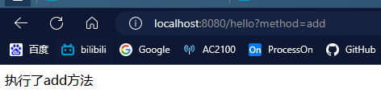
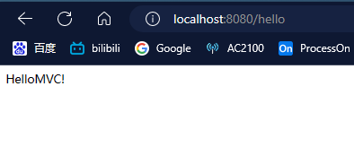
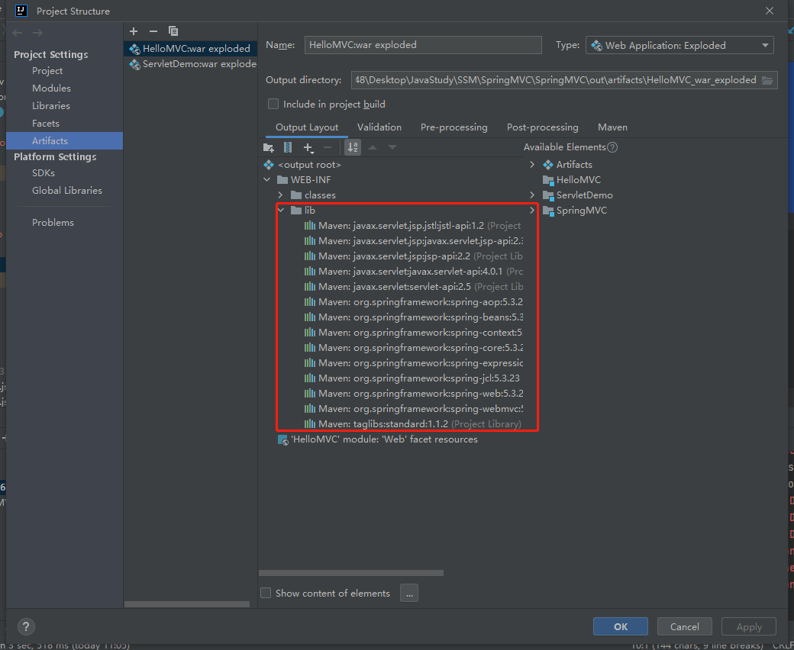
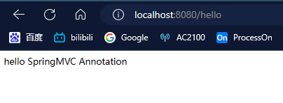
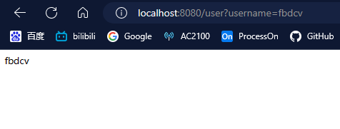
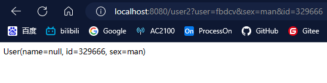

# 回顾Servlet

**导入依赖**

```xml
<dependencies>
    <!--Servlet 依赖-->
    <dependency>
        <groupId>javax.servlet</groupId>
        <artifactId>javax.servlet-api</artifactId>
        <version>4.0.1</version>
    </dependency>

    <!--jsp 依赖-->
    <!-- https://mvnrepository.com/artifact/javax.servlet.jsp/javax.servlet.jsp-api -->
    <dependency>
        <groupId>javax.servlet.jsp</groupId>
        <artifactId>javax.servlet.jsp-api</artifactId>
        <version>2.3.3</version>
    </dependency>
    <dependency>
        <groupId>javax.servlet.jsp</groupId>
        <artifactId>jsp-api</artifactId>
        <version>2.2</version>
    </dependency>

    <!--JSTL 表达式依赖-->
    <!-- https://mvnrepository. com/artifact/javax. servlet. jsp.jstl/jstl-api -->
    <dependency>
        <groupId>javax.servlet.jsp.jstl</groupId>
        <artifactId>jstl-api</artifactId>
        <version>1.2</version>
    </dependency>
    <!--standard 标签库 依赖-->
    <!-- https://mvnrepository. com/artifact/taglibs/standard -->
    <dependency>
        <groupId>taglibs</groupId>
        <artifactId>standard</artifactId>
        <version>1.1.2</version>
    </dependency>

</dependencies>
```

（**编写Servlet**） **HelloServlet.java**

```java
package top.fbdcv.servlet;

import javax.servlet.ServletException;
import javax.servlet.http.HttpServlet;
import javax.servlet.http.HttpServletRequest;
import javax.servlet.http.HttpServletResponse;
import java.io.IOException;

public class HelloServlet extends HttpServlet {
    @Override
    protected void doGet(HttpServletRequest req, HttpServletResponse resp) throws ServletException, IOException {
        String method = req.getParameter("method");
        if(method.equals("add")){
            req.setAttribute("msg","执行了add方法");
        } else if (method.equals("delete")) {
            req.setAttribute("msg","执行了delete方法");
        }
        req.getRequestDispatcher("index.jsp").forward(req,resp);

    }

    @Override
    protected void doPost(HttpServletRequest req, HttpServletResponse resp) throws ServletException, IOException {
        doGet(req, resp);
    }
}
```

（**注册Servlet**）   **web.xml**

```xml
<?xml version="1.0" encoding="UTF-8"?>
<web-app xmlns="http://xmlns.jcp.org/xml/ns/javaee"
         xmlns:xsi="http://www.w3.org/2001/XMLSchema-instance"
         xsi:schemaLocation="http://xmlns.jcp.org/xml/ns/javaee http://xmlns.jcp.org/xml/ns/javaee/web-app_4_0.xsd"
         version="4.0">
    <servlet>
        <servlet-name>hello</servlet-name>
        <servlet-class>top.fbdcv.servlet.HelloServlet</servlet-class>
    </servlet>
    <servlet-mapping>
        <servlet-name>hello</servlet-name>
        <url-pattern>/hello</url-pattern>
    </servlet-mapping>
</web-app>
```

(**编写主页 **)   **index.jsp**

```jsp
<%@ page contentType="text/html;charset=UTF-8" language="java" %>
<html>
  <head>
    <title>$Title$</title>
  </head>
  <body>
  ${msg}
  </body>
</html>
```

**运行并观察结果**




# 初识SpringMVC

**导入依赖**

```xml
<dependencies>
    <dependency>
        <groupId>org.springframework</groupId>
        <artifactId>spring-webmvc</artifactId>
        <version>5.3.23</version>
    </dependency>
    <!--Servlet 依赖-->
    <dependency>
        <groupId>javax.servlet</groupId>
        <artifactId>javax.servlet-api</artifactId>
        <version>4.0.1</version>
    </dependency>

    <!--jsp 依赖-->
    <!-- https://mvnrepository.com/artifact/javax.servlet.jsp/javax.servlet.jsp-api -->
    <dependency>
        <groupId>javax.servlet.jsp</groupId>
        <artifactId>javax.servlet.jsp-api</artifactId>
        <version>2.3.3</version>
    </dependency>
    <dependency>
        <groupId>javax.servlet.jsp</groupId>
        <artifactId>jsp-api</artifactId>
        <version>2.2</version>
    </dependency>

    <!--JSTL 表达式依赖-->
    <!-- https://mvnrepository. com/artifact/javax. servlet. jsp.jstl/jstl-api -->
    <dependency>
        <groupId>javax.servlet.jsp.jstl</groupId>
        <artifactId>jstl-api</artifactId>
        <version>1.2</version>
    </dependency>
    <!--standard 标签库 依赖-->
    <!-- https://mvnrepository. com/artifact/taglibs/standard -->
    <dependency>
        <groupId>taglibs</groupId>
        <artifactId>standard</artifactId>
        <version>1.1.2</version>
    </dependency>

</dependencies>
```

**注册Servlet (web.xml)**

```xml
<?xml version="1.0" encoding="UTF-8"?>
<web-app xmlns="http://xmlns.jcp.org/xml/ns/javaee"
         xmlns:xsi="http://www.w3.org/2001/XMLSchema-instance"
         xsi:schemaLocation="http://xmlns.jcp.org/xml/ns/javaee http://xmlns.jcp.org/xml/ns/javaee/web-app_4_0.xsd"
         version="4.0">
    <!--注册DispatcherServlet    -->
    <servlet>
        <servlet-name>SpringMVC</servlet-name>
        <servlet-class>org.springframework.web.servlet.DispatcherServlet</servlet-class>
        <!--关联一个SpringMVC的配置文件：Springconfig.xml        -->
        <init-param>
            <param-name>contextConfigLocation</param-name>
            <param-value>classpath:Springconfig.xml</param-value>
        </init-param>
        <!--设置启动级别-1        -->
        <load-on-startup>1</load-on-startup>
    </servlet>
    <!--/  匹配所有的请求：（不包括.jsp）    -->
    <!--/* 匹配所有的请求：（包括.jsp）    -->
    <!--这里设置视图解析器匹配所有请求    -->
    <servlet-mapping>
        <servlet-name>SpringMVC</servlet-name>
        <url-pattern>/</url-pattern>
    </servlet-mapping>
</web-app>
```

**配置Spring (Springconfig.xml)**

```xml
<?xml version="1.0" encoding="UTF-8" ?>
<beans xmlns="http://www.springframework.org/schema/beans"
       xmlns:xsi="http://www.w3.org/2001/XMLSchema-instance"
       xsi:schemaLocation="http://www.springframework.org/schema/beans
        http://www.springframework.org/schema/beans/spring-beans.xsd">
    <!--添加处理器映射器    -->
    <bean class="org.springframework.web.servlet.handler.BeanNameUrlHandlerMapping"/>
    <!--添加处理器适配器-->
    <bean class="org.springframework.web.servlet.mvc.SimpleControllerHandlerAdapter"/>
    <!--添加 视图解析器    -->
    <bean class="org.springframework.web.servlet.view.InternalResourceViewResolver" id="internalResourceViewResolver">
        <!--前缀        -->
        <property name="prefix" value="/WEB-INF/jsp/"/>
        <!--后缀        -->
        <property name="suffix" value=".jsp"/>
    </bean>
    <bean id="/hello" class="top.fbdcv.controller.HelloController"/>
</beans>
```

**编写Controller (HelloController.java)**

```java
package top.fbdcv.controller;

import org.springframework.web.servlet.ModelAndView;
import org.springframework.web.servlet.mvc.Controller;

import javax.servlet.http.HttpServletRequest;
import javax.servlet.http.HttpServletResponse;

public class HelloController implements Controller {
    @Override
    public ModelAndView handleRequest(HttpServletRequest request, HttpServletResponse response) throws Exception {
        //创建模型和视图
        ModelAndView mv = new ModelAndView();

        //封装对象，放在ModelAndView中
        mv.addObject("msg","HelloMVC!");

        //封装要跳转的视图，放在ModelAndView中
        mv.setViewName("hello"); //使用视图解析器 解析为/WEB-INF/jsp/hello.jsp
        return mv;
    }
}
```

**视图页面 (hello.jsp)**

```jsp
<%@ page contentType="text/html;charset=UTF-8" language="java" %>
<html>
<head>
    <title>Title</title>
</head>
<body>
 ${msg}
</body>
</html>
```

**最后运行服务器，显示结果**



如果运行没有出现预期结果，可以看看是否向tomcat中配置的了jar包，如果没有的话，可以在项目目录里面新建一个文件夹将依赖的jar包导入tomcat



# SpringMVC执行原理


大多数的工作，Spring已经完成了，我们基本上只需要做以下几步就可以了

1.配置视图解析器

2.编写处理器Controller

3.注册处理器到Spring配置文件

4.编写视图页面

# 注解开发

**导入依赖 （同初识SpringMVC 导入依赖）**

**配置前端控制器 （同初识SpringMVC servlet配置）**

**配置Spring (Springconfig.xml)**

```xml
<?xml version="1.0" encoding="UTF-8" ?>
<beans xmlns="http://www.springframework.org/schema/beans"
       xmlns:xsi="http://www.w3.org/2001/XMLSchema-instance"
       xmlns:context="http://www.springframework.org/schema/context"
       xmlns:mvc="http://www.springframework.org/schema/mvc"
       xsi:schemaLocation="http://www.springframework.org/schema/beans
        http://www.springframework.org/schema/beans/spring-beans.xsd http://www.springframework.org/schema/context https://www.springframework.org/schema/context/spring-context.xsd http://www.springframework.org/schema/mvc https://www.springframework.org/schema/mvc/spring-mvc.xsd">

    <!--开启扫描包，让指定包下的注解生效，由IOC容器同一管理    -->
    <context:component-scan base-package="top.fbdcv.controller"/>

<!--这个Spring MVC xml文件的属性，主要是处理web项目的静态文件问题。
每次请求过来，先经过 DefaultServletHttpRequestHandler 判断是否是静态文件，
如果是静态文件，则使用默认的Servlet进行处理，不是则放行交由 DispatcherServlet 控制器处理
  假如我们编写好主页index.jsp
如果不配置，我们访问localhost:8080/index.jsp就会请求处理器而不会直接转到主页从而出现错误 -->
    <mvc:default-servlet-handler/>

    <!--自动配置处理器映射器和处理器适配器    -->
    <mvc:annotation-driven/>

    <!--添加 视图解析器    -->
    <bean class="org.springframework.web.servlet.view.InternalResourceViewResolver" id="internalResourceViewResolver">
        <!--前缀        -->
        <property name="prefix" value="/WEB-INF/jsp/"/>
        <!--后缀        -->
        <property name="suffix" value=".jsp"/>
    </bean>

</beans>
```


**编写Controller**

```java
package top.fbdcv.controller;

import org.springframework.stereotype.Controller;
import org.springframework.ui.Model;
import org.springframework.web.bind.annotation.RequestMapping;

@Controller
//使用注解，自动注册bean
public class HelloController {

    @RequestMapping("/hello")
    /*@RequestMapping，这个注解也可以写在类上，使路由加一层，例如在类上标注@RequestMapping("/h")，如果要访问这个处理则可以访问 localhost：8080/h/hello*/
    //使用注解自动注册处理器的访问路径
    public String method(Model model){

        model.addAttribute("msg","hello SpringMVC Annotation");
        return "hello"; //被视图解析器处理 
    }
}
```

**视图页面 (同初识SpringMVC hello.jsp)**

**运行结果，如下**



# 重定向和转发

使用视图解析器处理默认跳转网页的方式是转发

```java
public String method(Model model){

    model.addAttribute("msg","hello SpringMVC Annotation");
    return "hello"; //被视图解析器处理 
}
```

当在Spring配置文件中注释掉视图解析器后，可以手动设置转发或者重定向

```java
public String method(Model model){

    model.addAttribute("msg","hello SpringMVC Annotation");
    return "redirect:/WEB-INF/jsp/hello.jsp"; //转发
        // return "/WEB-INF/jsp/hello.jsp"; 不显式标注默认也是转发
}
```

```java
public String method(Model model){

    model.addAttribute("msg","hello SpringMVC Annotation");
    return "redirect:/WEB-INF/jsp/hello.jsp"; //重定向
}
```


# 接收请求参数和数据回显

接收普通参数

```java
@GetMapping ("/user")
public String method2(Model model, @RequestParam("username") String name){ //接收前端传入的username参数

    model.addAttribute("msg",name);
    return "hello";
}
```



接收实体类对应的参数

实体类User

```java
package top.fbdcv.pojo;

import lombok.AllArgsConstructor;
import lombok.Data;
import lombok.NoArgsConstructor;

@Data
@NoArgsConstructor
@AllArgsConstructor
public class User {
    private String name;
    private String id;
    private String sex;
}
```

```java
@GetMapping("/user2")
public String method3(Model model, User user) { //接收前端传入的User类中属性名对应的参数
    model.addAttribute("msg",user.toString());
    return "hello";
}
```



数据回显可以使用Model或者ModelAndView
