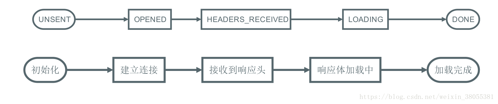

# AJAX

## 初识AJAX

### 什么是AJAX

​	Ajax即**A**synchronous **J**avascript **A**nd **X**ML（异步JavaScript和[XML](https://baike.baidu.com/item/XML/86251?fromModule=lemma_inlink)），使用Ajax技术网页应用能够快速地将增量更新呈现在[用户界面](https://baike.baidu.com/item/用户界面/6582461?fromModule=lemma_inlink)上，而不需要重载（刷新）整个页面，这使得程序能够更快地回应用户的操作

Ajax 不是一种新的编程语言，而是一种用于创建更好更快以及交互性更强的Web应用程序的技术。

使用 JavaScript 向服务器提出请求并处理响应而不阻塞用户核心对象[XMLHttpRequest](https://baike.baidu.com/item/XMLHttpRequest?fromModule=lemma_inlink)。通过这个对象，您的 JavaScript 可在不重载页面的情况与 Web 服务器交换数据，即在不需要刷新页面的情况下，就可以产生局部刷新的效果。

Ajax 在浏览器与 Web 服务器之间使用异步数据传输（HTTP 请求），这样就可使网页从服务器请求少量的信息，而不是整个页面。

### AJAX发送请求的流程





### press.js

1.通过node.js 引入press.js模块 ，充当web服务器

```shell
npm init --yes
npm install express --save
```

进行express模块的测试

**AjaxServer.js**

```js
//1.引入express服务
const express =require("express");
//2.创建应用服务
const app =express();
//3.创建路由规则
app.get("/",(req,resp)=>{
    resp.send("hello,express")
});
//4.监听端口启动服务
app.listen(8000,()=>{
    console.log("服务已经启动，8000端口监听中")
})
```


## Hello,AJAX

### Hello,AJAX

**AjaxClient.html**

```html
<!DOCTYPE html>
<html lang="en">
<head>
    <meta charset="UTF-8">
    <meta http-equiv="X-UA-Compatible" content="IE=edge">
    <meta name="viewport" content="width=device-width, initial-scale=1.0">
    <title>Ajax客户端</title>
</head>
<body>
    <div id="div" style="height: 200px; width: 200px; border: 1px solid black;"></div>
    <button id="btn">发送ajax请求</button>
    <script>
        var btn = document.getElementById("btn")
        var div = document.getElementById("div")
        btn.onclick = function (){
            //创建xhr
            const xhr = new XMLHttpRequest();
            //设置请求方法和url
            xhr.open("GET","http://127.0.0.1:8000/server")
            //发送
            xhr.send()
            //事件绑定 处理服务器返回的结果
            xhr.onreadystatechange = function(){
                //判断readystate
                if(xhr.readyState === 4){
                    //判断响应状态码
                    if(xhr.status>=200&&xhr.status<300){
                        //响应行
                        console.log(xhr.status)
                        console.log(xhr.statusText)
                        //响应头
                        console.log(xhr.getAllResponseHeaders())
                        //响应体
                        console.log(xhr.response)
                        div.innerHTML = xhr.response
                    }
                }
            }

        }
    </script>
</body>
</html>
```


**AjaxServer.js**

```js
//1.引入express服务
const express =require("express");
//2.创建应用服务
const app =express();
//3.创建路由规则
app.get("/server",(req,resp)=>{
    //设置跨域
    resp.setHeader("Access-Control-Allow-Origin","*")
    resp.send("Hello,AJAX")
});
//4.监听端口启动服务
app.listen(8000,()=>{
    console.log("服务已经启动，8000端口监听中")
})
```


### AJAX设置请求体类型

```js
xhr.setRequestHeader("Content-Type","application/x-www-form-urlencoded")
```


### AJAX设置请求参数

在url中添加参数,如下设置了两个参数a，b

```js
xhr.open("GET","http://127.0.0.1:8000/server?a=100&b=200")
```


### AJAX发送POST请求

```js
xhr.open("POST","http://127.0.0.1:8000/server")
xhr.send("a=100&b=200")  //设置请求参数
```


### 客户端接收json数据

```js
//解析json
let data = JSON.parse(xhr.response);
result.innerHTML=data.name;
```


### AJAX  IE缓存问题

```js
xhr.open("GET","http://127.0.0.1:8000/ie?t="+Date.now());
//通过添加时间戳参数，标识每一次请求，从而避免缓存问题
```


### AJAX响应超时和网络异常处理

```js
xhr.timeout=2000;//超时设置 2s 2s后未获得响应，取消请求
xhr.ontimeout = function(){
    alert("网络异常，请稍后重试")
}

//网络异常处理
xhr.onerror = function(){
    alert("你的网络似乎出现了一点问题")
}

```


### AJAX取消请求

```js
xhr.abort(); //一般绑定控件动作，动作触发执行方法取消请求
```


### AJAX重复发送问题

解决方法：当发送ajax请求的时候，判断该请求是否正在发送，如果请求正在发送，取消发送，发送新请求。

```js
let xhr =null;
let isSending = false;	//设置标志变量用于标识该请求是否正在发送
action(){	//发送动作触发函数
    if(isSending)
        xhr.abort();
    xhr= new XMLHttpRequest();
    isSending = true;		//正在发送期间标志变量设为true
    xhr.open();
    xhr.send();
    xhr.onreadystatechange = function(){
        if(xhr.readyState ===4){
            isSending = false;	//发送完毕标志变量设为false
        }
        ...
    }
        
}
```


## AJAX跨域