# Electron

## 初识Electron

### Electron是什么

一款跨平台的桌面应用，兼容Windows、Mac、Linux系统 可以理解为一个包了浏览器的壳，提供了浏览器+Node.js+框架API的运行环境，可以打开多个静态html脚本（或vue项目）

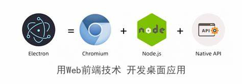

## 安装Electron

### 安装node.js

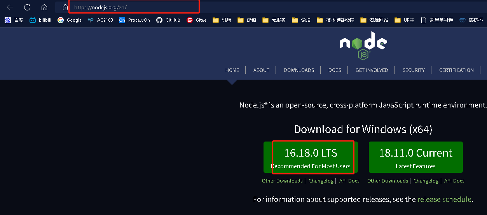

### 通过npm下载electron

下载到项目目录，并向项目的package.json中添加依赖

```shell
npm init  #在文件夹中生成package.json文件                        
npm install electron --save-dev #将模块安装到项目目录下，并在 package.json 文件的 devDependencies 节点写入依赖
```

全局下载

```shell
npm install electron -g
```

 npm 的仓库切换到国内淘宝仓库并注册 cnpm,并用cnpm全局下载

```shell
npm install -g cnpm --registry=https://registry.npm.taobao.org
cnpm install electron -g
```

### 验证下载成功

```shell
npx electron -v # 显示electron的版本号
.\node_modules\.bin\electronn -v # 显示electron的版本号
.\node_modules\.bin\electron  #显示electron
```

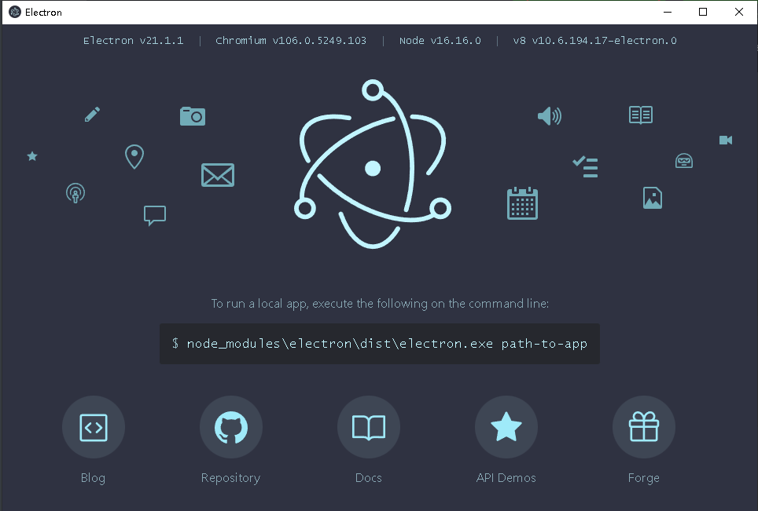

## HelloWorld

```shell
npm install electron -g #全局安装electron 
```

**index.html**

```html
<!DOCTYPE html>
<html lang="en">
<head>
    <meta charset="UTF-8">
    <meta http-equiv="X-UA-Compatible" content="IE=edge">
    <meta name="viewport" content="width=device-width, initial-scale=1.0">
    <title>HelloWorld</title>
</head>
<body>
    <h1>HelloWorld</h1>
</body>
</html>
```

**main.js**

```js
var electron = require("electron")  //引入electron
var app = electron.app               //引入变量app
var BrowserWindow = electron.BrowserWindow
var mainWindow = null

app.on("ready", () => {
    mainWindow = new BrowserWindow({width:1280,height:720})
    mainWindow.loadFile("index.html")
    mainWindow.on("closed", () => {
        mainWindow = null
    })
})

```

**package.json**

```shell
npm init --yes #生成package.json
```

```json
{
  "name": "electrondemo",
  "version": "1.0.0",
  "description": "",
  "main": "main.js",
  "scripts": {
    "test": "echo \"Error: no test specified\" && exit 1"
  },
  "keywords": [],
  "author": "",
  "license": "ISC"
}

```

**运行结果**

```shell
electron . #执行这个node.js项目
```

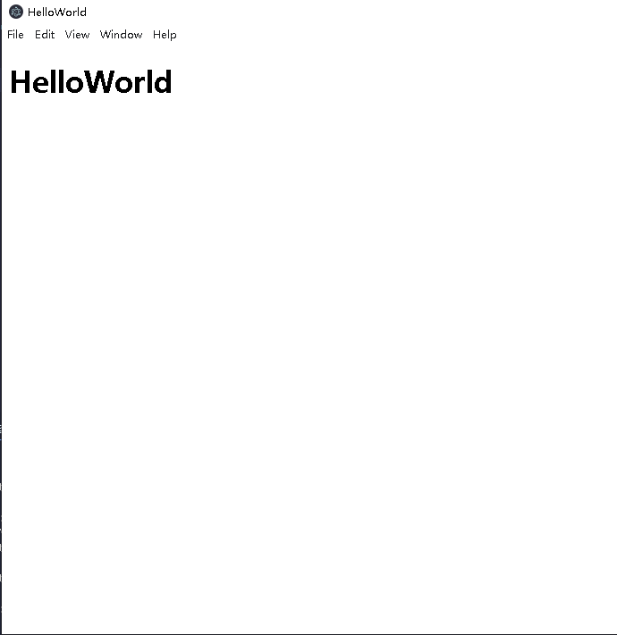

## 主进程和渲染进程

在HelloWorld这个例子中，我们使用命令 `electron .` 启动这个程序后，系统会查找package.json找到程序入口启动主进程，主进程在通过方法启动渲染进程（例如main.js中的`mainWindow.loadFile("index.html")`）

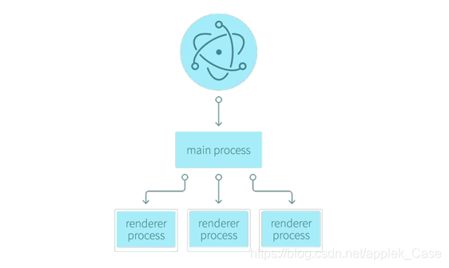

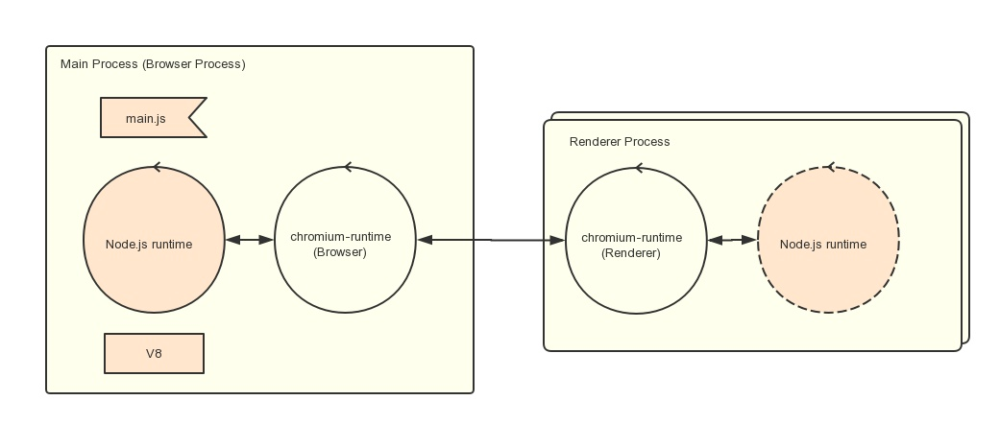

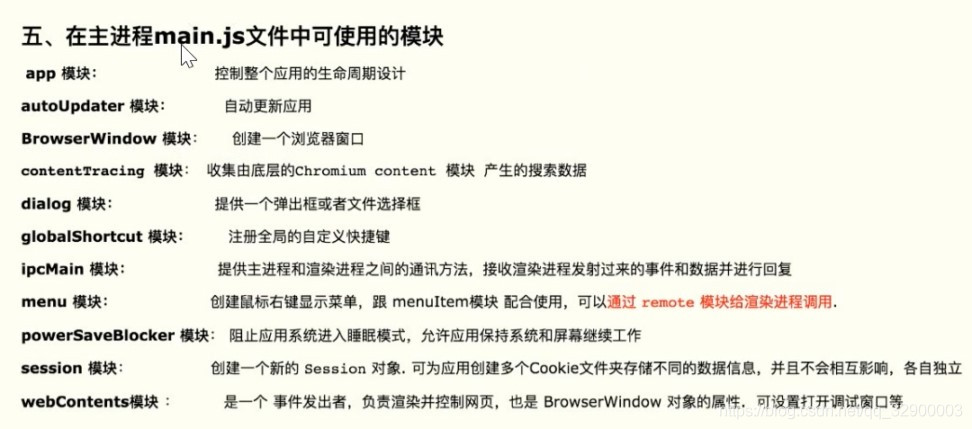

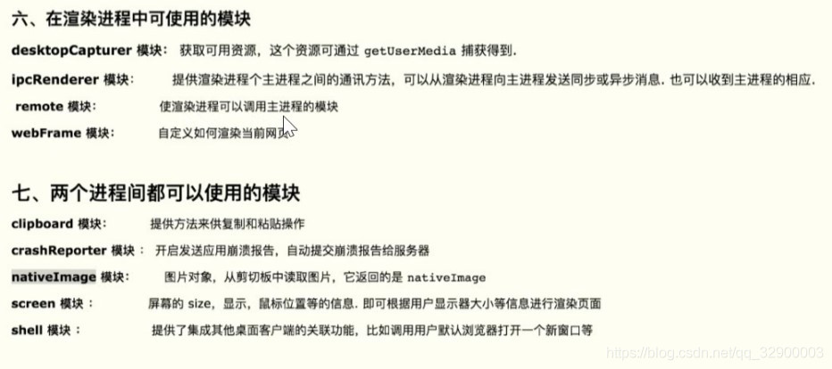

下面以一个例子来简单地理解一下

```
├─ render

│  └─ index.js
├─ index.html

├─ main.js

├─ package.json

└─ xiaojiejie.txt
```

**xiaojiejie.txt**

```txt
1.麻里梨夏
2.星野娜美
3.高桥圣子
```

**main.js**

```js
var electron = require("electron")  //引入electron
var app = electron.app               //引入变量app
var BrowserWindow = electron.BrowserWindow
var mainWindow = null

app.on("ready", () => {
    mainWindow = new BrowserWindow({
        width:1280,
        height:720,
        webPreferences:{nodeIntegration:true,contextIsolation:false} //让node环境下的包可以在渲染进程中使用 
    })
    mainWindow.loadFile("index.html")
    mainWindow.on("closed", () => {
        mainWindow = null
    })
})


```

**index.html**

```html
<!DOCTYPE html>
<html lang="en">
<head>
    <meta charset="UTF-8">
    <meta http-equiv="X-UA-Compatible" content="IE=edge">
    <meta name="viewport" content="width=device-width, initial-scale=1.0">
    <title>HelloWorld</title>
</head>
<body>
    <button id="btn">小姐姐请进来 </button>
    <div id ="mybaby"></div>
    <script src="render/index.js"></script>
</body>
</html>
```

**render_index.js**

```js
var fs = require("fs")
window.onload = function(){
    var btn = this.document.querySelector("#btn") 
    var mybaby = this.document.querySelector("#mybaby")
    btn.onclick = function(){
        fs.readFile("xiaojiejie.txt",(err,data)=>{
            mybaby.innerHTML = data
        })
    }
}
```

**运行结果**

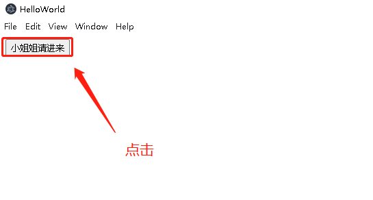

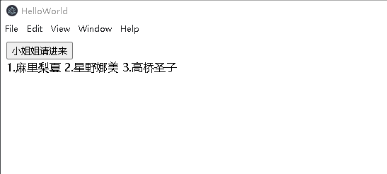

## remote模块

electron有主进程和渲染进程之分，主进程可以简单理解为mian.js也就是主程序运行后的窗体,而渲染进程则是mian.js中所创建的窗体通过loadFile()加载的HTML页面的进程，在渲染进程中可以通过按钮单击创建新的窗体，但是无法直接使用BrowserWindow，而是需要使用remote。

**安装remote模块(全局安装无效)**

```shell
npm install --save @electron/remote 
```

**在主程序中引入和初始化**

安装好remote之后，我们需要在主进程和渲染进程中进行相应的设置才能使用。
首先是在主程序中引入和初始化remote。

```js
require("@electron/remote/main").initialize()
require("@electron/remote/main").enable(mainWindow.webContents)
```

**在渲染进程中require**

```js
const {BrowserWindow} = require("@electron/remote")
```

**index.html**

```html
<!DOCTYPE html>
<html lang="en">
<head>
    <meta charset="UTF-8">
    <meta http-equiv="X-UA-Compatible" content="IE=edge">
    <meta name="viewport" content="width=device-width, initial-scale=1.0">
    <title>第一个网页</title>
</head>
<body>
    <button id="btn">打开新网页 </button>
    <script src="render/index.js"></script>
</body>
</html>
```

**main.js**

```js
const {app,BrowserWindow} = require("electron")

app.on("ready", () => {

    var mainWindow = new BrowserWindow({
        width: 1280,
        height: 720,
        webPreferences: { 
            //开启node
            nodeIntegration: true, 
            contextIsolation: false,
            //开启remote
            // enableRemoteModule:true 
        }
    })
    //初始化remote模块
    require("@electron/remote/main").initialize()
    require("@electron/remote/main").enable(mainWindow.webContents)
    
    mainWindow.loadFile("index.html")
    mainWindow.on("closed", () => {
        mainWindow = null
    })
})


```

**web2.html**

```html
<!DOCTYPE html>
<html lang="en">
<head>
    <meta charset="UTF-8">
    <meta http-equiv="X-UA-Compatible" content="IE=edge">
    <meta name="viewport" content="width=device-width, initial-scale=1.0">
    <title>第二个网页</title>
</head>
<body>
    <h1>这是新页面</h1>
</body>
</html>
```

**render_index.js**

```js
const  {BrowserWindow}= require("@electron/remote")
window.onload = function(){
    var btn = this.document.querySelector("#btn") 
    btn.onclick = ()=>{
        var win = new  BrowserWindow({
            width:1280,
            height:720
        })
        win.loadFile("web2.html")
        win.on("closed",()=>{
            win = null;
        })

    }
}
```

**运行结果**

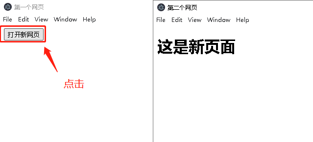

## preload预加载

## 渲染窗口显示子窗口

## 进程通信

### 子进程和主进程通信

### 子进程之间通信
