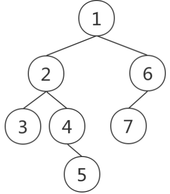

#### 打印二叉树

**题目描述**

*在某个存储介质以如下形式保存一棵二叉树*

*1(2(3,4(,5)),6(7,))*

*上述序列表示的二叉树如下*

**

*观察后可以发现，每个节点的格式为*

*X，X可以为空*

*或者*

*X(Y, Z)，其中X不为空*

*请编写程序将以上述格式输入的二叉树输出为中序遍历顺序*

**输入**

*上述格式表示的二叉树字符串，用字符1~9表示每个二叉树的每个节点，字符可以重复使用*

样例输入：1(2(3,4(,5)),6(7,))

**输出**

*二叉树的中序遍历结果*

样例输出：3245176

**源代码**

```java
import java.io.*;
import java.util.*;
import java.text.*;
import java.math.*;
import java.util.regex.*;

public class Main {


/*请完成下面这个函数，实现题目要求的功能
当然，你也可以不按照下面这个模板来作答，完全按照自己的想法来 ^-^ 
******************************开始写代码******************************/
    static String solution(String input) {
      
      

    }
/******************************结束写代码******************************/


    public static void main(String[] args){
        Scanner in = new Scanner(System.in);
        String res;
            
        String _input;
        try {
            _input = in.nextLine();
        } catch (Exception e) {
            _input = null;
        }
  
        res = solution(_input);
        System.out.println(res);
    }
}
```


